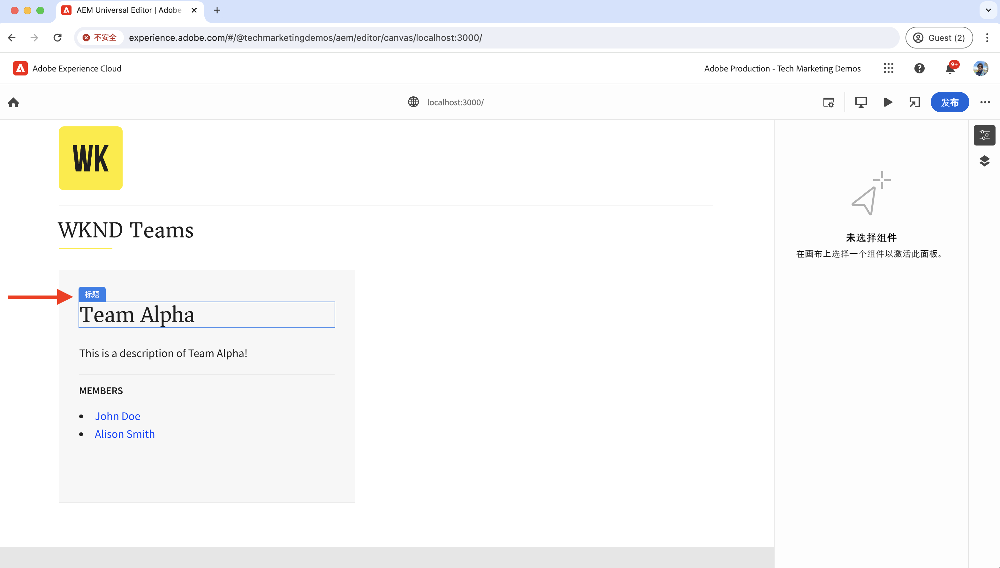
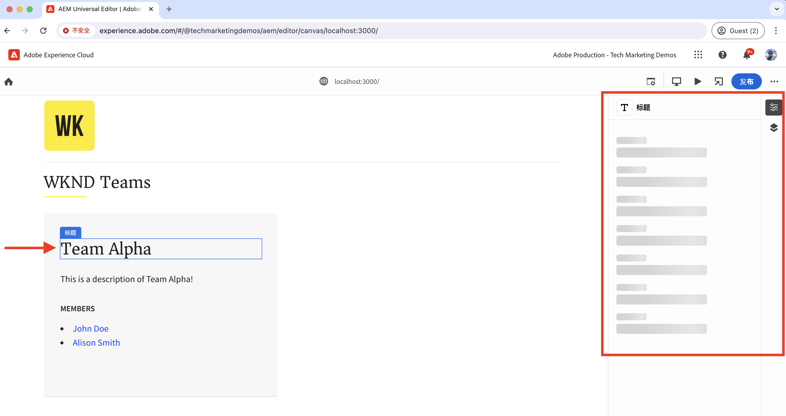
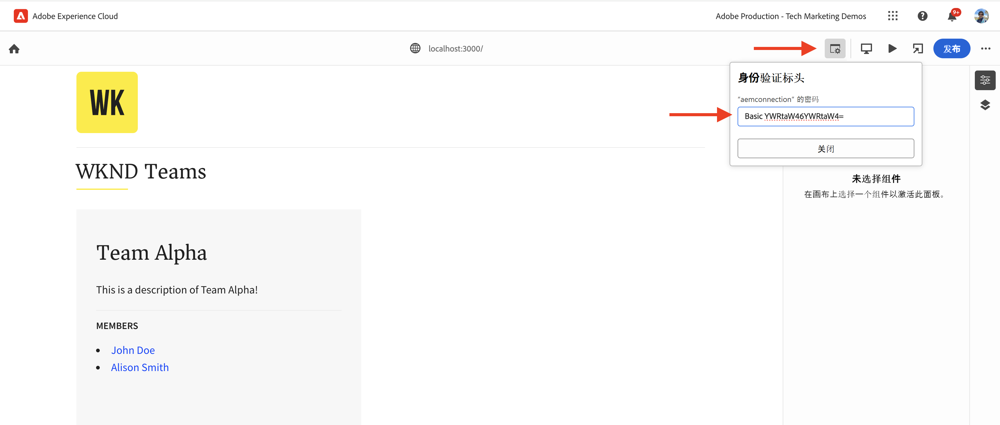
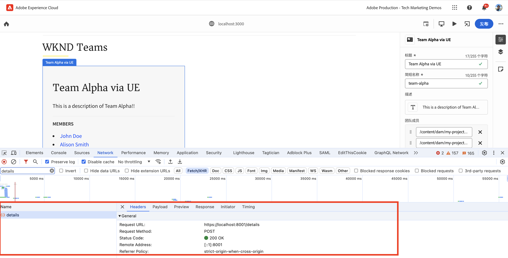
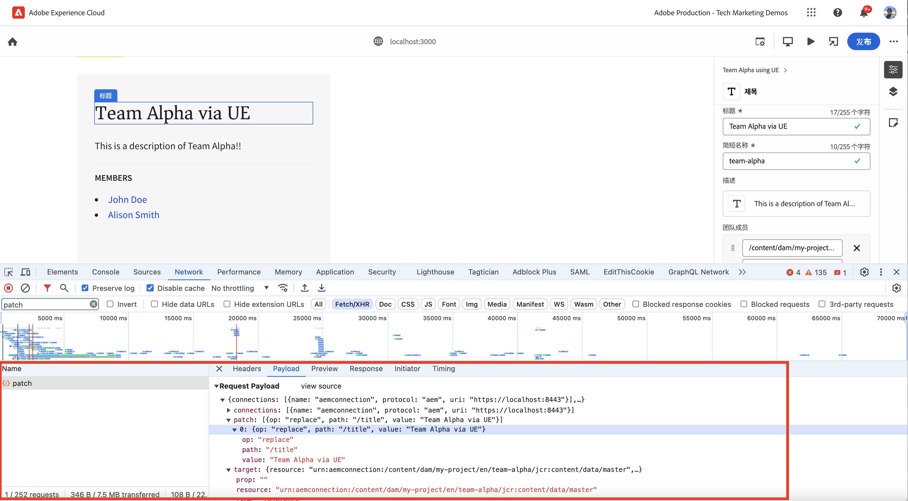
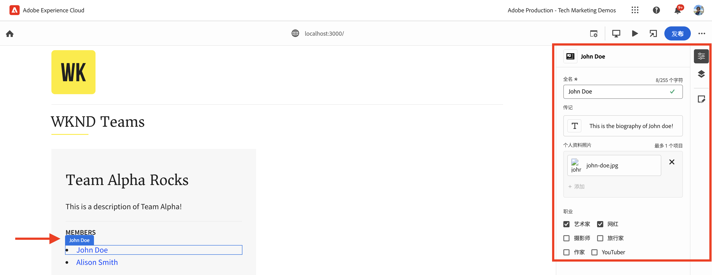
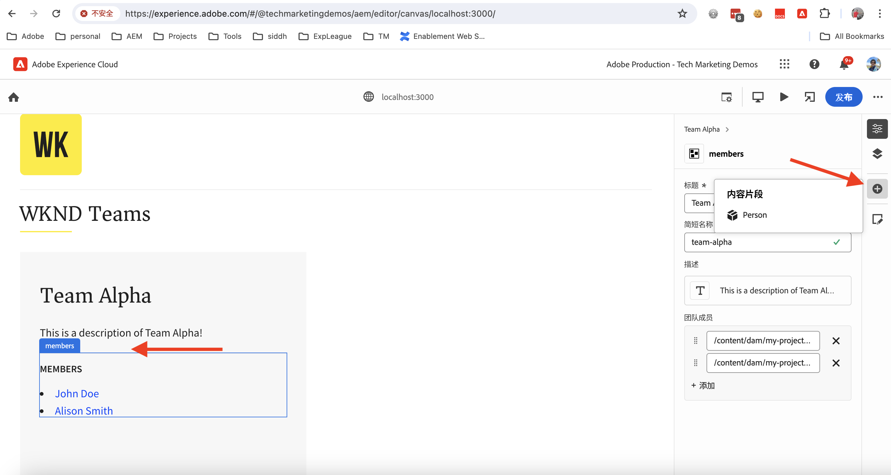
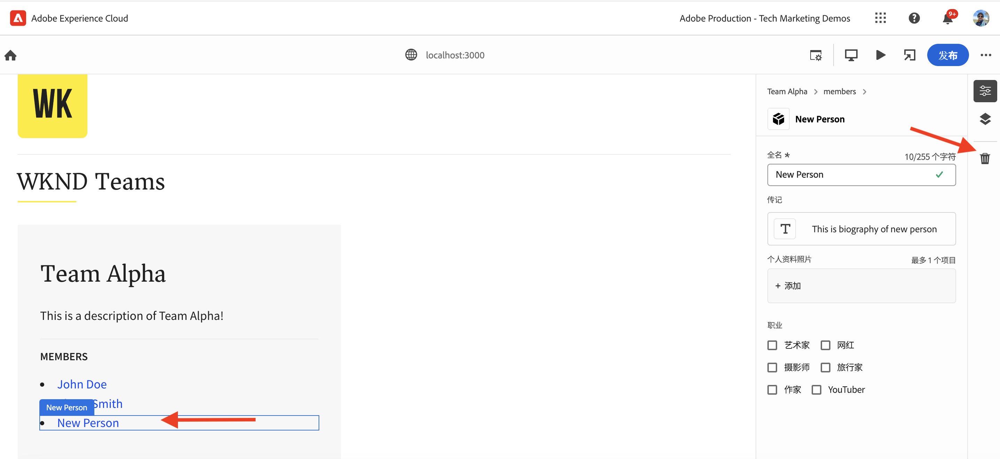

# 为 React 应用程序进行适配，以使用通用编辑器编辑内容

了解如何为 React 应用程序进行适配，以使用通用编辑器编辑内容。

## 先决条件

您已按照上一个步骤[本地开发设置](./local-development-setup.md)中的说明设置了本地开发环境。

## 包含通用编辑器核心库

现在，我们首先要在 WKND Teams React 应用程序中包含通用编辑器核心库。它是一个 JavaScript 库，在被编辑的应用程序与通用编辑器之间提供通信层。

有两种方法可以将通用编辑器核心库包含在 React 应用程序中：

1. npm 注册表中的节点模块依赖项，请参阅 [@adobe/universal-editor-cors](https://www.npmjs.com/package/@adobe/universal-editor-cors)。
1. HTML 文件中的脚本标记 (`<script>`)。

在此教程中，我们使用脚本标记方法。

1. 安装 `react-helmet-async` 包来管理 React 应用程序中的 `<script>` 标记。

   ```bash
   $ npm install react-helmet-async
   ```

1. 更新 WKND Teams React 应用程序的 `src/App.js` 文件，以包含通用编辑器核心库。

   ```javascript
   ...
   import { Helmet, HelmetProvider } from "react-helmet-async";
   
   function App() {
   return (
       <HelmetProvider>
           <div className="App">
               <Helmet>
                   {/* AEM Universal Editor :: CORE Library
                     Loads the LATEST Universal Editor library
                   */}
                   <script
                       src="https://universal-editor-service.adobe.io/cors.js"
                       async
                   />
               </Helmet>
               <Router>
                   <header>
                       <Link to={"/"}>
                       
                       </Link>
                       <hr />
                   </header>
                   <Routes>
                       <Route path="/" element={<Home />} />
                       <Route path="/person/:fullName" element={<Person />} />
                   </Routes>
               </Router>
           </div>
       </HelmetProvider>
   );
   }
   
   export default App;
   ```

## 添加元数据 - 内容源

要将 WKND Teams React 应用程序&#x200B;_与内容源_&#x200B;连接起来进行编辑，您需要提供连接元数据。通用编辑器服务需要使用这个元数据与内容源建立连接。

连接元数据作为 `<meta>` 标记存储在 HTML 文件中。连接元数据的语法如下：

```html
<meta name="urn:adobe:aue:<category>:<referenceName>" content="<protocol>:<url>">
```

现在，我们将连接元数据添加到 `<Helmet>` 组件中的 WKND Teams React 应用程序。通过以下 `src/App.js` 标记更新 `<meta>` 文件。在本例中，内容源是在 `https://localhost:8443` 上运行的一个本地 AEM 实例。

```javascript
...
function App() {
return (
    <HelmetProvider>
        <div className="App">
            <Helmet>
                {/* AEM Universal Editor :: CORE Library
                    Loads the LATEST Universal Editor library
                */}
                <script
                    src="https://universal-editor-service.adobe.io/cors.js"
                    async
                />
                {/* AEM Universal Editor :: Connection metadata 
                    Connects to local AEM instance
                */}
                <meta
                    name="urn:adobe:aue:system:aemconnection"
                    content={`aem:https://localhost:8443`}
                />
            </Helmet>
            ...
    </HelmetProvider>
);
}

export default App;
```

`aemconnection` 提供了内容源的短名称。接下来的适配会使用这个短名称引用此内容源。

## 添加元数据 - 本地通用编辑器服务配置

本地开发不使用 Adobe 托管的通用编辑器服务，而是使用通用编辑器服务的一个本地副本。本地服务将通用编辑器和 AEM SDK 绑定，现在我们将本地通用编辑器服务元数据添加到 WKND Teams React 应用程序中。

这些配置设置也同样作为 `<meta>` 标记存储在 HTML 文件中。本地通用编辑器服务元数据的语法如下：

```html
<meta name="urn:adobe:aue:config:service" content="<url>">
```

现在，我们将连接元数据添加到 `<Helmet>` 组件中的 WKND Teams React 应用程序。通过以下 `src/App.js` 标记更新 `<meta>` 文件。在本例中，本地通用编辑器服务在 `https://localhost:8001` 上运行。

```javascript
...

function App() {
  return (
    <HelmetProvider>
      <div className="App">
        <Helmet>
          {/* AEM Universal Editor :: CORE Library
              Loads the LATEST Universal Editor library
          */}
          <script
            src="https://universal-editor-service.adobe.io/cors.js"
            async
          />
          {/* AEM Universal Editor :: Connection metadata 
              Connects to local AEM instance
          */}
          <meta
            name="urn:adobe:aue:system:aemconnection"
            content={`aem:https://localhost:8443`}
          />
          {/* AEM Universal Editor :: Configuration for Service
              Using locally running Universal Editor service
          */}
          <meta
            name="urn:adobe:aue:config:service"
            content={`https://localhost:8001`}
          />
        </Helmet>
        ...
    </HelmetProvider>
);
}
export default App;
```

## 适配 React 组件

要编辑 WKND Teams React 应用程序的内容，例如&#x200B;_团队标题和团队描述_，您需要适配 React 组件。适配是指将相关数据属性（`data-aue-*`）添加到您想要使用通用编辑器进行编辑的 HTML 元素上。有关数据属性的更多信息，请参阅[属性和类型](https://experienceleague.adobe.com/zh-hans/docs/experience-manager-cloud-service/content/implementing/developing/universal-editor/attributes-types)。

### 定义可编辑元素

我们现在先来定义您想要使用通用编辑器进行编辑的元素。在 WKND Teams React 应用程序中，团队标题和描述存储在 AEM 中的团队内容片段中，因此它是进行编辑的最佳候选项。

现在我们来适配 `Teams` React 组件，使“团队标题和描述”成为可编辑元素。

1. 打开 WKND Teams React 应用程序的 `src/components/Teams.js` 文件。
1. 将 `data-aue-prop`、`data-aue-type` 和 `data-aue-label` 属性添加给“团队标题和描述”元素。

   ```javascript
   ...
   function Teams() {
       const { teams, error } = useAllTeams();
       ...
   
       return (
           <div className="team">
               // AEM Universal Editor :: Instrumentation using data-aue-* attributes
               <h2 className="team__title" data-aue-prop="title" data-aue-type="text" data-aue-label="title">{title}</h2>
               <p className="team__description" data-aue-prop="description" data-aue-type="richtext" data-aue-label="description">{description.plaintext}</p>
               ...
           </div>
       );
   }
   
   export default Teams;
   ```

1. 在加载 WKND Teams React 应用程序的浏览器中刷新通用编辑器页面。现在您可以看到“团队标题和描述”成为可编辑元素。

   

1. 如果您尝试使用内联编辑或属性边栏来编辑团队标题或描述，就会显示一个加载指示器，但不允许您编辑内容。因为通用编辑器没有用于加载和保存内容的 AEM 资源详细信息。

   

概括而言，上述更改操作将“团队标题和描述”元素标记为在通用编辑器中可编辑。但是，**您还无法（通过内联或属性边栏）编辑和保存更改**，为此您需要使用 `data-aue-resource` 属性添加 AEM 资源详细信息。我们将在下一步完成这一点。

### 定义 AEM 资源详细信息

要将已编辑的内容保存回 AEM 并将内容加载到属性边栏中，您需要为通用编辑器提供 AEM 资源详细信息。

在本例中，AEM 资源是团队内容片段路径，我们现在将资源详细信息添加到顶层 `<div>` 元素中的 `Teams` React 组件中。

1. 更新 `src/components/Teams.js` 文件，将 `data-aue-resource`、`data-aue-type` 和 `data-aue-label` 属性添加到顶层 `<div>` 元素。

   ```javascript
   ...
   function Teams() {
       const { teams, error } = useAllTeams();
       ...
   
       // Render single Team
       function Team({ _path, title, shortName, description, teamMembers }) {
           // Must have title, shortName and at least 1 team member
           if (!_path || !title || !shortName || !teamMembers) {
               return null;
           }
   
         return (
           // AEM Universal Editor :: Instrumentation using data-aue-* attributes
           <div className="team" data-aue-resource={`urn:aemconnection:${_path}/jcr:content/data/master`} data-aue-type="reference" data-aue-label={title}>
           ...
           </div>
       );
       }
   }
   export default Teams;
   ```

   `data-aue-resource` 属性的值是团队内容片段的 AEM 资源路径。`urn:aemconnection:` 前缀使用连接元数据中定义的内容源的短名称。

1. 在加载 WKND Teams React 应用程序的浏览器中刷新通用编辑器页面。现在您可以看到顶层 Team 元素是可编辑的，但属性边栏仍然没有加载内容。在浏览器的网络选项卡中，您可以看到加载内容的 `details` 请求出现 401 未授权错误。这是在尝试使用 IMS 令牌进行身份验证，但本地 AEM SDK 不支持 IMS 身份验证。

   

1. 要修复 401 未授权错误，您需要使用通用编辑器中的&#x200B;**身份验证标头**&#x200B;选项，为通用编辑器提供本地 AEM SDK 身份验证详细信息。作为其本地 AEM SDK，为 `admin:admin` 凭据将值设置为 `Basic YWRtaW46YWRtaW4=`。

   

1. 在加载 WKND Teams React 应用程序的浏览器中刷新通用编辑器页面。您现在可以看到属性边栏在加载内容，您可以通过内联或属性边栏编辑团队标题和描述。

   

#### 深入了解

属性边栏使用本地通用编辑器服务从 AEM 资源加载内容。使用浏览器的网络选项卡，您可以看到对本地通用编辑器服务发出的加载内容的 POST 请求（`https://localhost:8001/details`）。

当您使用内联编辑或属性边栏编辑内容时，本地通用编辑器服务会将更改保存回 AEM 资源。使用浏览器的网络选项卡，您可以看到对本地通用编辑器服务发出的保存内容的 POST 请求（`https://localhost:8001/update` 或 `https://localhost:8001/patch`）。



请求负载 JSON 对象中包含必要的详细信息，例如内容服务器（`connections`）、资源路径（`target`），以及更新后的内容（`patch`）。



### 扩展可编辑内容

现在，我们来扩展可编辑内容，并对&#x200B;**团队成员**&#x200B;进行适配，以便您可以使用属性边栏编辑团队成员。

像上面一样，我们将相关的 `data-aue-*` 属性添加到 `Teams` React 组件中的团队成员。

1. 更新 `src/components/Teams.js` 文件，将数据属性添加到 `<li key={index} className="team__member">` 元素。

   ```javascript
   ...
   function Teams() {
       const { teams, error } = useAllTeams();
       ...
   
       <div>
           <h4 className="team__members-title">Members</h4>
           <ul className="team__members">
               {/* Render the referenced Person models associated with the team */}
               {teamMembers.map((teamMember, index) => {
                   return (
                       // AEM Universal Editor :: Instrumentation using data-aue-* attributes
                       <li key={index} className="team__member" data-aue-resource={`urn:aemconnection:${teamMember?._path}/jcr:content/data/master`} data-aue-type="component" data-aue-label={teamMember.fullName}>
                       <Link to={`/person/${teamMember.fullName}`}>
                           {teamMember.fullName}
                       </Link>
                       </li>
                   );
               })}
           </ul>
       </div>
       ...
   }
   export default Teams;
   ```

   `data-aue-type` 属性的值是 `component`，因为团队成员被存储为 AEM 中的 `Person` 内容片段，帮助表明内容的可移动/可删除部分。

1. 在加载 WKND Teams React 应用程序的浏览器中刷新通用编辑器页面。现在您可以看到，团队成员可以通过属性边栏进行编辑。

   

#### 深入了解

与上面一样，内容检索和保存通过本地通用编辑器服务完成。要加载和保存内容时会向本地通用编辑器服务发出 `/details`、`/update` 或 `/patch` 请求。

### 定义添加和删除内容

到目前为止，您已经了解如何使现有内容可编辑，但如果您想添加新内容该怎么做呢？现在，我们来学习如何使用通用编辑器添加或删除 WKND team 团队成员。这样，内容作者就不需要前往 AEM 添加或删除团队成员。

不过先来简单回顾一下，WKND 团队成员被存储为 AEM 中的 `Person` 内容片段，并通过 `teamMembers` 属性与团队内容片段相关联。要查看 AEM 中的模型定义，请访问 [my-project](http://localhost:4502/libs/dam/cfm/models/console/content/models.html/conf/my-project)。

1. 首先，创建组件定义文件 `/public/static/component-definition.json`。此文件包含 `Person` 内容片段的组件定义。使用 `aem/cf` 插件允许基于一个提供待应用默认值的模型和模板来插入内容片段。

   ```json
   {
       "groups": [
           {
           "title": "Content Fragments",
           "id": "content-fragments",
           "components": [
               {
               "title": "Person",
               "id": "person",
               "plugins": {
                   "aem": {
                       "cf": {
                           "name": "person",
                           "cfModel": "/conf/my-project/settings/dam/cfm/models/person",
                           "cfFolder": "/content/dam/my-project/en",
                           "title": "person",
                           "template": {
                               "fullName": "New Person",
                               "biographyText": "This is biography of new person"
                               }
                           }
                       }
                   }
               }
           ]
           }
       ]
   }
   ```

1. 然后，在 WKND Team React 应用程序的 `index.html` 中引用上述组件定义文件。更新 `public/index.html` 文件的 `<head>` 部分，以包含组件定义文件。

   ```html
   ...
   <script
       type="application/vnd.adobe.aue.component+json"
       src="/static/component-definition.json"
   ></script>
   <title>WKND App - Basic GraphQL Tutorial</title>
   </head>
   ...
   ```

1. 最后，更新 `src/components/Teams.js` 文件，添加数据属性。**成员**&#x200B;分区用作团队成员的容器，我们将 `data-aue-prop`、`data-aue-type` 和 `data-aue-label` 属性添加到 `<div>` 元素。

   ```javascript
   ...
   function Teams() {
       const { teams, error } = useAllTeams();
       ...
   
       {/* AEM Universal Editor :: Team Members as container */}
       <div data-aue-prop="teamMembers" data-aue-type="container" data-aue-label="members">
           <h4 className="team__members-title">Members</h4>
           <ul className="team__members">
           {/* Render the referenced Person models associated with the team */}
           {teamMembers.map((teamMember, index) => {
               return (
               // AEM Universal Editor :: Instrumentation using data-aue-* attributes
               <li key={index} className="team__member" data-aue-resource={`urn:aemconnection:${teamMember?._path}/jcr:content/data/master`} data-aue-type="component" data-aue-label={teamMember.fullName}>
                   <Link to={`/person/${teamMember.fullName}`}>
                   {teamMember.fullName}
                   </Link>
               </li>
               );
           })}
           </ul>
       </div>
       ...
   }
   export default Teams;
   ```

1. 在加载 WKND Teams React 应用程序的浏览器中刷新通用编辑器页面。现在您可以看到&#x200B;**成员**&#x200B;分区用作一个容器。您可以使用属性边栏和 **+** 图标插入新的团队成员。

   

1. 要删除团队成员，请选择团队成员，然后点击&#x200B;**删除**&#x200B;图标。

   

#### 深入了解

内容的添加和删除操作通过本地通用编辑器服务完成。要向 AEM 添加或删除内容时，会向本地通用编辑器服务发出带有详细负载的 `/add` 或 `/remove` 的 POST 请求。

## 解决方案文件

要验证您的实施变化，或者如果您无法使用通用编辑器编辑 WKND Teams React 应用程序，请参阅 [basic-tutorial-instrumented-for-UE](https://github.com/adobe/aem-guides-wknd-graphql/tree/solution/basic-tutorial-instrumented-for-UE) 解决方案分支。

与运行的 **basic-tutorial** 分支的逐个文件对比请参阅[此处](https://github.com/adobe/aem-guides-wknd-graphql/compare/solution/basic-tutorial...solution/basic-tutorial-instrumented-for-UE?expand=1)。

## 祝贺您

您成功适配了 WKND Teams React 应用程序，这样就可以使用通用编辑器添加、编辑和删除内容。您学习了如何包含核心库、添加连接和本地通用编辑器服务元数据，以及如何使用不同的数据（`data-aue-*`）属性适配 React 组件。
