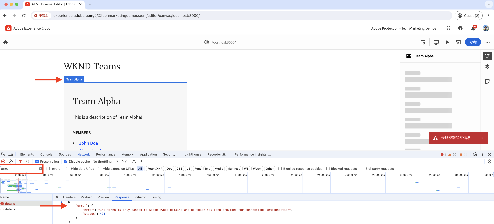
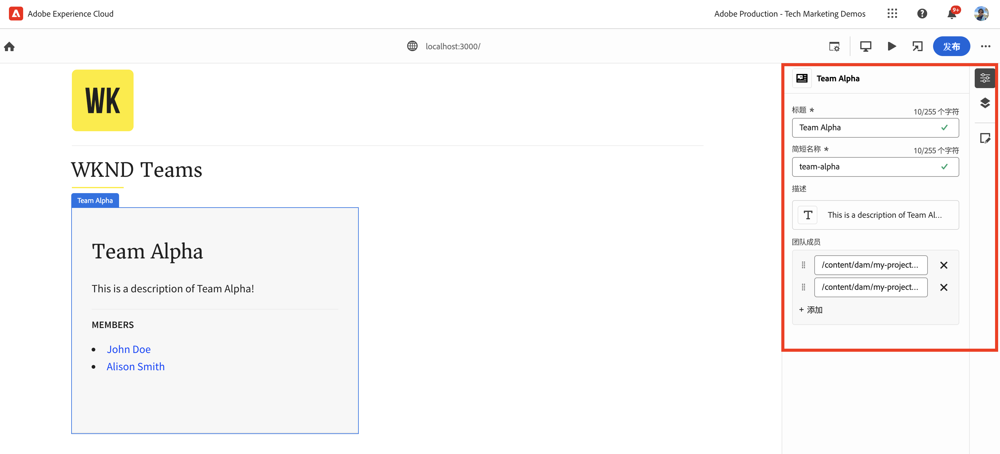

# 使用通用编辑器检测React应用程序以编辑内容

了解如何使用通用编辑器检测React应用程序以编辑内容。

## 先决条件

您已按照上一个[本地开发设置](./local-development-setup.md)步骤中的说明设置本地开发环境。

## 包含通用编辑器核心库

让我们从WKND团队React应用程序中包含Universal Editor核心库开始。 它是一个JavaScript库，提供了已编辑应用程序和通用编辑器之间的通信层。

有两种方法可以在React应用程序中包含Universal Editor核心库：

1. npm注册表中的节点模块依赖关系，请参见[@adobe/universal-editor-cors](https://www.npmjs.com/package/@adobe/universal-editor-cors)。
1. HTML文件中的脚本标记(`<script>`)。

在本教程中，让我们使用脚本标记方法。

1. 安装`react-helmet-async`包以在React应用程序中管理`<script>`标记。

   ```bash
   $ npm install react-helmet-async
   ```

1. 更新WKND Teams React应用程序的`src/App.js`文件以包含通用编辑器核心库。

   ```javascript
   ...
   import { Helmet, HelmetProvider } from "react-helmet-async";
   
   function App() {
   return (
       <HelmetProvider>
           <div className="App">
               <Helmet>
                   {/* AEM Universal Editor :: CORE Library
                     Loads the LATEST Universal Editor library
                   */}
                   <script
                       src="https://universal-editor-service.experiencecloud.live/corslib/LATEST"
                       async
                   />
               </Helmet>
               <Router>
                   <header>
                       <Link to={"/"}>
                       
                       </Link>
                       <hr />
                   </header>
                   <Routes>
                       <Route path="/" element={<Home />} />
                       <Route path="/person/:fullName" element={<Person />} />
                   </Routes>
               </Router>
           </div>
       </HelmetProvider>
   );
   }
   
   export default App;
   ```

## 添加元数据 — 内容源

要将WKND Teams React应用程序&#x200B;_与内容源_&#x200B;连接以进行编辑，您需要提供连接元数据。 Universal Editor服务使用此元数据与内容源建立连接。

连接元数据作为`<meta>`标记存储在HTML文件中。 连接元数据的语法如下：

```html
<meta name="urn:adobe:aue:<category>:<referenceName>" content="<protocol>:<url>">
```

让我们将连接元数据添加到`<Helmet>`组件中的WKND Teams React应用程序。 使用以下`<meta>`标记更新`src/App.js`文件。 在此示例中，内容源是在`https://localhost:8443`上运行的本地AEM实例。

```javascript
...
function App() {
return (
    <HelmetProvider>
        <div className="App">
            <Helmet>
                {/* AEM Universal Editor :: CORE Library
                    Loads the LATEST Universal Editor library
                */}
                <script
                    src="https://universal-editor-service.experiencecloud.live/corslib/LATEST"
                    async
                />
                {/* AEM Universal Editor :: Connection metadata 
                    Connects to local AEM instance
                */}
                <meta
                    name="urn:adobe:aue:system:aemconnection"
                    content={`aem:https://localhost:8443`}
                />
            </Helmet>
            ...
    </HelmetProvider>
);
}

export default App;
```

`aemconnection`提供了内容源的简短名称。 后续检测使用短名称来引用内容源。

## 添加元数据 — 本地通用编辑器服务配置

Universal Editor服务的本地副本用于本地开发，而不使用Adobe托管的通用编辑器服务。 本地服务绑定通用编辑器和AEM SDK，因此让我们将本地通用编辑器服务元数据添加到WKND Teams React应用程序。

这些配置设置还作为`<meta>`标记存储在HTML文件中。 本地Universal Editor服务元数据的语法如下：

```html
<meta name="urn:adobe:aue:config:service" content="<url>">
```

让我们将连接元数据添加到`<Helmet>`组件中的WKND Teams React应用程序。 使用以下`<meta>`标记更新`src/App.js`文件。 在此示例中，本地Universal Editor服务正在`https://localhost:8001`上运行。

```javascript
...

function App() {
  return (
    <HelmetProvider>
      <div className="App">
        <Helmet>
          {/* AEM Universal Editor :: CORE Library
              Loads the LATEST Universal Editor library
          */}
          <script
            src="https://universal-editor-service.experiencecloud.live/corslib/LATEST"
            async
          />
          {/* AEM Universal Editor :: Connection metadata 
              Connects to local AEM instance
          */}
          <meta
            name="urn:adobe:aue:system:aemconnection"
            content={`aem:https://localhost:8443`}
          />
          {/* AEM Universal Editor :: Configuration for Service
              Using locally running Universal Editor service
          */}
          <meta
            name="urn:adobe:aue:config:service"
            content={`https://localhost:8001`}
          />
        </Helmet>
        ...
    </HelmetProvider>
);
}
export default App;
```

## 检测React组件

要编辑WKND Teams React应用程序的内容（如&#x200B;_团队标题和团队描述_），您需要检测React组件。 检测是指将相关数据属性(`data-aue-*`)添加到您希望使用通用编辑器进行编辑的HTML元素。 有关数据属性的详细信息，请参阅[属性和类型](https://experienceleague.adobe.com/zh-hans/docs/experience-manager-cloud-service/content/implementing/developing/universal-editor/attributes-types)。

### 定义可编辑元素

让我们从定义要使用通用编辑器编辑的元素开始。 在WKND团队React应用程序中，团队标题和描述存储在AEM的团队内容片段中，因此是最佳编辑候选者。

让我们检测`Teams` React组件，使团队标题和描述可编辑。

1. 打开WKND Teams React应用程序的`src/components/Teams.js`文件。
1. 将`data-aue-prop`、`data-aue-type`和`data-aue-label`属性添加到团队标题和描述元素。

   ```javascript
   ...
   function Teams() {
       const { teams, error } = useAllTeams();
       ...
   
       return (
           <div className="team">
               // AEM Universal Editor :: Instrumentation using data-aue-* attributes
               <h2 className="team__title" data-aue-prop="title" data-aue-type="text" data-aue-label="title">{title}</h2>
               <p className="team__description" data-aue-prop="description" data-aue-type="richtext" data-aue-label="description">{description.plaintext}</p>
               ...
           </div>
       );
   }
   
   export default Teams;
   ```

1. 在加载WKND团队React应用程序的浏览器中刷新通用编辑器页面。 您现在可以看到团队标题和描述元素是可编辑的。

   

1. 如果尝试使用内联编辑或属性边栏编辑团队标题或描述，它会显示加载进度环但不允许您编辑内容。 因为通用编辑器不知道用于加载和保存内容的AEM资源详细信息。

   

总之，上述更改将团队标题和描述元素标记为可在通用编辑器中编辑。 但是，**您还不能编辑（通过内联或属性边栏）并保存更改**，为此，您需要使用`data-aue-resource`属性添加AEM资源详细信息。 让我们在下一个步骤中执行这项操作。

### 定义AEM资源详细信息

要将编辑后的内容保存回AEM并加载属性边栏中的内容，您需要向通用编辑器提供AEM资源详细信息。

在本例中，AEM资源是团队内容片段路径，因此让我们将资源详细信息添加到顶级`<div>`元素的`Teams` React组件。

1. 更新`src/components/Teams.js`文件以将`data-aue-resource`、`data-aue-type`和`data-aue-label`属性添加到顶级`<div>`元素。

   ```javascript
   ...
   function Teams() {
       const { teams, error } = useAllTeams();
       ...
   
       // Render single Team
       function Team({ _path, title, shortName, description, teamMembers }) {
           // Must have title, shortName and at least 1 team member
           if (!_path || !title || !shortName || !teamMembers) {
               return null;
           }
   
         return (
           // AEM Universal Editor :: Instrumentation using data-aue-* attributes
           <div className="team" data-aue-resource={`urn:aemconnection:${_path}/jcr:content/data/master`} data-aue-type="reference" data-aue-label={title}>
           ...
           </div>
       );
       }
   }
   export default Teams;
   ```

   `data-aue-resource`属性的值是团队内容片段的AEM资源路径。 `urn:aemconnection:`前缀使用连接元数据中定义的内容源的短名称。

1. 在加载WKND团队React应用程序的浏览器中刷新通用编辑器页面。 现在，您可以看到顶级“团队”元素是可编辑的，但属性边栏仍未加载内容。 在浏览器的网络选项卡中，您会看到加载内容的`details`请求出现401未授权错误。 它正在尝试使用IMS令牌进行身份验证，但本地AEM SDK不支持IMS身份验证。

   

1. 要修复401未授权错误，您需要使用通用编辑器中的&#x200B;**身份验证标头**&#x200B;选项向通用编辑器提供本地AEM SDK身份验证详细信息。 作为本地AEM SDK，请将`admin:admin`凭据的值设置为`Basic YWRtaW46YWRtaW4=`。

   

1. 在加载WKND团队React应用程序的浏览器中刷新通用编辑器页面。 现在，您可以看到属性边栏正在加载内容，并且可以内联或使用属性边栏编辑团队标题和描述。

   

#### 在幕后工作

属性边栏使用本地Universal Editor服务从AEM资源加载内容。 使用浏览器的网络选项卡，您可以看到本地通用编辑器服务(`https://localhost:8001/details`)的加载内容的POST请求。

使用内联编辑或属性边栏编辑内容时，更改会使用本地Universal Editor服务保存回AEM资源。 使用浏览器的网络选项卡，您可以看到本地通用编辑器服务（`https://localhost:8001/update`或`https://localhost:8001/patch`）保存内容的POST请求。


请求有效负载JSON对象包含必要的详细信息，如内容服务器(`connections`)、资源路径(`target`)和更新的内容(`patch`)。


### 展开可编辑的内容

让我们展开可编辑的内容并将检测应用到&#x200B;**团队成员**，以便您可以使用属性边栏编辑团队成员。

如上所述，让我们将相关的`data-aue-*`属性添加到`Teams` React组件中的团队成员。

1. 更新`src/components/Teams.js`文件以向`<li key={index} className="team__member">`元素添加数据属性。

   ```javascript
   ...
   function Teams() {
       const { teams, error } = useAllTeams();
       ...
   
       <div>
           <h4 className="team__members-title">Members</h4>
           <ul className="team__members">
               {/* Render the referenced Person models associated with the team */}
               {teamMembers.map((teamMember, index) => {
                   return (
                       // AEM Universal Editor :: Instrumentation using data-aue-* attributes
                       <li key={index} className="team__member" data-aue-resource={`urn:aemconnection:${teamMember?._path}/jcr:content/data/master`} data-aue-type="component" data-aue-label={teamMember.fullName}>
                       <Link to={`/person/${teamMember.fullName}`}>
                           {teamMember.fullName}
                       </Link>
                       </li>
                   );
               })}
           </ul>
       </div>
       ...
   }
   export default Teams;
   ```

   `data-aue-type`属性的值为`component`，因为团队成员在AEM中存储为`Person`内容片段，这有助于指示内容的移动/可删除部分。

1. 在加载WKND团队React应用程序的浏览器中刷新通用编辑器页面。 您现在可以看到可以使用属性边栏编辑团队成员。

   

#### 在幕后工作

如上所述，内容检索和保存由本地Universal Editor服务完成。 向本地通用编辑器服务发出`/details`、`/update`或`/patch`请求，以加载和保存内容。

### 定义添加和删除内容

到目前为止，您已使现有内容可编辑，但如果要添加新内容，该怎么做？ 让我们添加使用通用编辑器向WKND团队添加或删除团队成员的功能。 因此，内容作者无需转至AEM来添加或删除团队成员。

但是，快速回顾，WKND团队成员在AEM中存储为`Person`内容片段，并使用`teamMembers`属性与团队内容片段关联。 要查看AEM中的模型定义，请访问[my-project](http://localhost:4502/libs/dam/cfm/models/console/content/models.html/conf/my-project)。

1. 首先，创建组件定义文件`/public/static/component-definition.json`。 此文件包含`Person`内容片段的组件定义。 `aem/cf`插件允许基于提供要应用的默认值的模型和模板插入内容片段。

   ```json
   {
       "groups": [
           {
           "title": "Content Fragments",
           "id": "content-fragments",
           "components": [
               {
               "title": "Person",
               "id": "person",
               "plugins": {
                   "aem": {
                       "cf": {
                           "name": "person",
                           "cfModel": "/conf/my-project/settings/dam/cfm/models/person",
                           "cfFolder": "/content/dam/my-project/en",
                           "title": "person",
                           "template": {
                               "fullName": "New Person",
                               "biographyText": "This is biography of new person"
                               }
                           }
                       }
                   }
               }
           ]
           }
       ]
   }
   ```

1. 接下来，在WKND Team React应用程序的`index.html`中引用上述组件定义文件。 更新`public/index.html`文件的`<head>`部分以包含组件定义文件。

   ```html
   ...
   <script
       type="application/vnd.adobe.aue.component+json"
       src="/static/component-definition.json"
   ></script>
   <title>WKND App - Basic GraphQL Tutorial</title>
   </head>
   ...
   ```

1. 最后，更新`src/components/Teams.js`文件以添加数据属性。 要充当团队成员容器的&#x200B;**MEMBERS**&#x200B;部分，让我们将`data-aue-prop`、`data-aue-type`和`data-aue-label`属性添加到`<div>`元素。

   ```javascript
   ...
   function Teams() {
       const { teams, error } = useAllTeams();
       ...
   
       {/* AEM Universal Editor :: Team Members as container */}
       <div data-aue-prop="teamMembers" data-aue-type="container" data-aue-label="members">
           <h4 className="team__members-title">Members</h4>
           <ul className="team__members">
           {/* Render the referenced Person models associated with the team */}
           {teamMembers.map((teamMember, index) => {
               return (
               // AEM Universal Editor :: Instrumentation using data-aue-* attributes
               <li key={index} className="team__member" data-aue-resource={`urn:aemconnection:${teamMember?._path}/jcr:content/data/master`} data-aue-type="component" data-aue-label={teamMember.fullName}>
                   <Link to={`/person/${teamMember.fullName}`}>
                   {teamMember.fullName}
                   </Link>
               </li>
               );
           })}
           </ul>
       </div>
       ...
   }
   export default Teams;
   ```

1. 在加载WKND团队React应用程序的浏览器中刷新通用编辑器页面。 您现在可以看到&#x200B;**MEMBERS**&#x200B;分区充当容器。 您可以使用属性边栏和&#x200B;**+**&#x200B;图标插入新团队成员。

   

1. 要删除团队成员，请选择该团队成员，然后单击&#x200B;**删除**&#x200B;图标。

   

#### 在幕后工作

内容添加和删除操作由本地Universal Editor服务完成。 对具有详细有效负载的`/add`或`/remove`的POST请求被发送到本地Universal Editor服务，以将内容添加或删除到AEM。

## 解决方案文件

要验证您的实施更改或无法使WKND Teams React应用程序使用通用编辑器，请参阅[basic-tutorial-instructed-for-UE](https://github.com/adobe/aem-guides-wknd-graphql/tree/solution/basic-tutorial-instrumented-for-UE)解决方案分支。

[此处](https://github.com/adobe/aem-guides-wknd-graphql/compare/solution/basic-tutorial...solution/basic-tutorial-instrumented-for-UE?expand=1)提供了与正在运行的&#x200B;**basic-tutorial**&#x200B;分支逐个文件的比较。

## 恭喜

您已成功检测WKND Teams React应用程序是否使用通用编辑器添加、编辑和删除内容。 您已了解如何包含核心库、添加连接和本地Universal Editor服务元数据，以及使用各种数据(`data-aue-*`)属性检测React组件。
