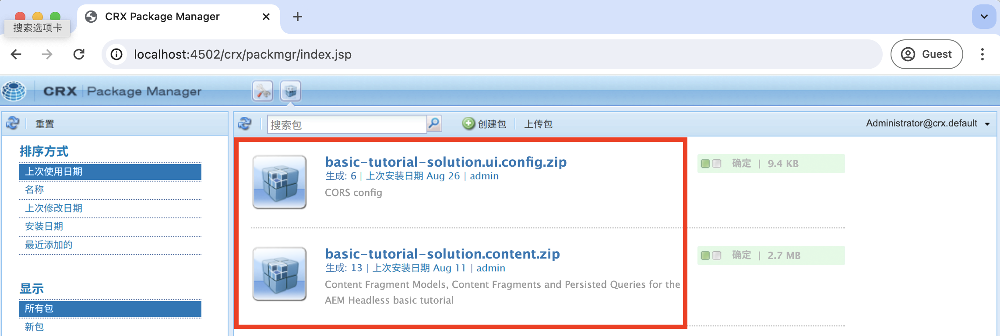
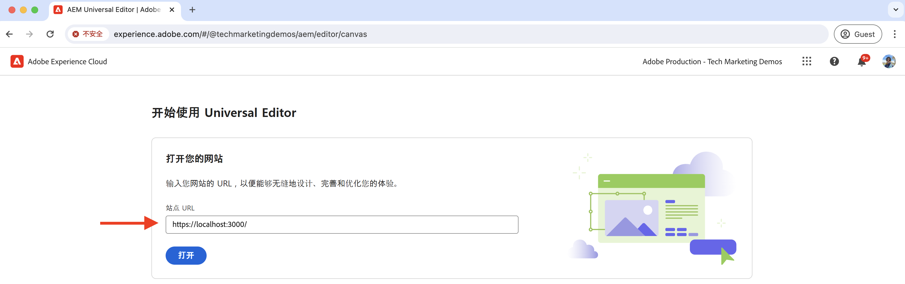
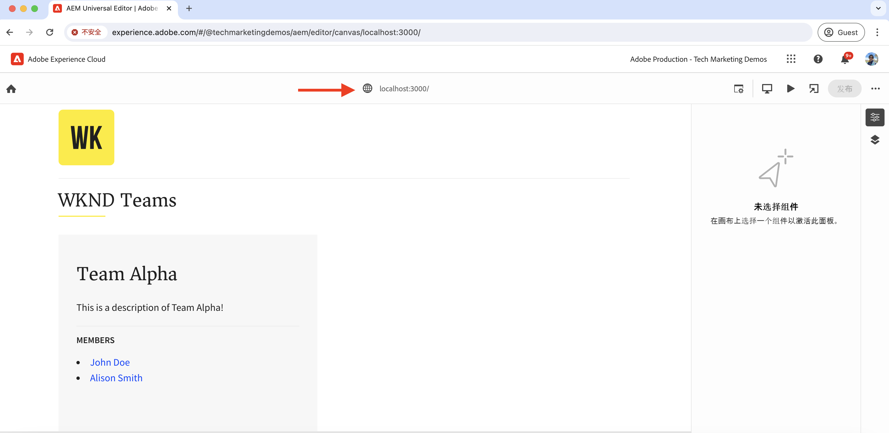

# 本地开发设置

了解如何使用AEM通用编辑器设置本地开发环境以编辑React应用程序的内容。

## 先决条件

按照本教程进行操作，需要执行以下操作：

- HTML和JavaScript的基本技能。
- 必须本地安装以下工具：
   - [Node.js](https://nodejs.org/en/download/)
   - [Git](https://git-scm.com/downloads)
   - IDE或代码编辑器，如[Visual Studio Code](https://code.visualstudio.com/)
- 下载并安装以下各项：
   - [AEM as a Cloud Service SDK](https://experienceleague.adobe.com/zh-hans/docs/experience-manager-learn/cloud-service/local-development-environment-set-up/aem-runtime#download-the-aem-as-a-cloud-service-sdk)：它包含快速入门Jar，用于在本地运行AEM创作和发布以进行开发。
   - [Universal Editor服务](https://experienceleague.adobe.com/zh-hans/docs/experience-cloud/software-distribution/home)： Universal Editor服务的本地副本，具有功能子集，可以从软件分发门户下载。
   - [local-ssl-proxy](https://www.npmjs.com/package/local-ssl-proxy#local-ssl-proxy)：使用自签名证书进行本地开发的简单本地SSL HTTP代理。 AEM通用编辑器需要React应用程序的HTTPS URL才能在编辑器中加载它。

## 本地设置

请按照以下步骤设置本地开发环境：

### AEM SDK

要提供WKND Teams React应用程序的内容，请在本地AEM SDK中安装以下包。

- [WKND团队 — 内容包](./assets/basic-tutorial-solution.content.zip)：包含内容片段模型、内容片段和持久的GraphQL查询。
- [WKND团队 — 配置包](./assets/basic-tutorial-solution.ui.config.zip)：包含跨源资源共享(CORS)和令牌身份验证处理程序配置。 CORS有助于非AEM Web资产对AEM的GraphQL API进行基于浏览器的客户端调用，并且令牌身份验证处理程序用于向AEM验证每个请求。

  

### React应用程序

要设置WKND Teams React应用程序，请执行以下步骤：

1. 从`basic-tutorial`解决方案分支克隆[WKND Teams React应用程序](https://github.com/adobe/aem-guides-wknd-graphql/tree/solution/basic-tutorial)。

   ```bash
   $ git clone -b solution/basic-tutorial git@github.com:adobe/aem-guides-wknd-graphql.git
   ```

1. 导航到`basic-tutorial`目录并在代码编辑器中将其打开。

   ```bash
   $ cd aem-guides-wknd-graphql/basic-tutorial
   $ code .
   ```

1. 安装依赖项并启动React应用程序。

   ```bash
   $ npm install
   $ npm start
   ```

1. 在[http://localhost:3000](http://localhost:3000)的浏览器中打开WKND Teams React应用程序。 它显示团队成员及其详细信息的列表。 React应用程序的内容由本地AEM SDK使用GraphQL API (`/graphql/execute.json/my-project/all-teams`)提供，您可以使用浏览器的“网络”选项卡验证该API。

   

### 通用编辑器服务

要设置&#x200B;**local**&#x200B;通用编辑器服务，请执行以下步骤：

1. 从[软件分发门户](https://experience.adobe.com/downloads)下载最新版本的通用编辑器服务。

   

1. 解压缩下载的zip文件，并将`universal-editor-service.cjs`文件复制到名为`universal-editor-service`的新目录。

   ```bash
   $ unzip universal-editor-service-vproduction-<version>.zip
   $ mkdir universal-editor-service
   $ cp universal-editor-service.cjs universal-editor-service
   ```

1. 在`universal-editor-service`目录中创建`.env`文件并添加以下环境变量：

   ```bash
   # The port on which the Universal Editor service runs
   EXPRESS_PORT=8000
   # Disable SSL verification
   NODE_TLS_REJECT_UNAUTHORIZED=0
   ```

1. 启动本地通用编辑器服务。

   ```bash
   $ cd universal-editor-service
   $ node universal-editor-service.cjs
   ```

上述命令在端口`8000`上启动通用编辑器服务，您应该会看到以下输出：

```bash
Either no private key or certificate was set. Starting as HTTP server
Universal Editor Service listening on port 8000 as HTTP Server
```

### 本地SSL HTTP代理

AEM通用编辑器要求通过HTTPS提供React应用程序。 让我们设置一个使用自签名证书进行本地开发的本地SSL HTTP代理。

请按照以下步骤设置本地SSL HTTP代理，并通过HTTPS提供AEM SDK和通用编辑器服务：

1. 全局安装`local-ssl-proxy`包。

   ```bash
   $ npm install -g local-ssl-proxy
   ```

1. 为以下服务启动本地SSL HTTP代理的两个实例：

   - 端口`8443`上的AEM SDK本地SSL HTTP代理。
   - 通用编辑器服务端口`8001`上的本地SSL HTTP代理。

   ```bash
   # AEM SDK local SSL HTTP proxy on port 8443
   $ local-ssl-proxy --source 8443 --target 4502
   
   # Universal Editor service local SSL HTTP proxy on port 8001
   $ local-ssl-proxy --source 8001 --target 8000
   ```

### 更新React应用程序以使用HTTPS

要为WKND Teams React应用程序启用HTTPS，请执行以下步骤：

1. 在终端中按`Ctrl + C`停止React。
1. 更新`package.json`文件以在`start`脚本中包含`HTTPS=true`环境变量。

   ```json
   "scripts": {
       "start": "HTTPS=true react-scripts start",
       ...
   }
   ```

1. 更新`.env.development`文件中的`REACT_APP_HOST_URI`以使用AEM SDK的HTTPS协议和本地SSL HTTP代理端口。

   ```bash
   REACT_APP_HOST_URI=https://localhost:8443
   ...
   ```

1. 更新`../src/proxy/setupProxy.auth.basic.js`文件以使用`secure: false`选项使用宽松SSL设置。

   ```javascript
   ...
   module.exports = function(app) {
   app.use(
       ['/content', '/graphql'],
       createProxyMiddleware({
       target: REACT_APP_HOST_URI,
       changeOrigin: true,
       secure: false, // Ignore SSL certificate errors
       // pass in credentials when developing against an Author environment
       auth: `${REACT_APP_BASIC_AUTH_USER}:${REACT_APP_BASIC_AUTH_PASS}`
       })
   );
   };
   ```

1. 启动React应用程序。

   ```bash
   $ npm start
   ```

## 验证设置

使用上述步骤设置本地开发环境后，我们来验证设置。

### 本地验证

请确保以下服务在本地通过HTTPS运行，您可能需要接受浏览器中针对自签名证书的安全警告：

1. [https://localhost:3000](https://localhost:3000)上的WKND Teams React应用程序
1. [https://localhost:8443](https://localhost:8443)上的AEM SDK
1. [https://localhost:8001](https://localhost:8001)上的通用编辑器服务

### 在通用编辑器中加载WKND Teams React应用程序

让我们在通用编辑器中加载WKND Teams React应用程序以验证设置：

1. 在浏览器中打开通用编辑器https://experience.adobe.com/#/aem/editor 。 如果出现提示，请使用您的Adobe ID登录。

1. 在通用编辑器的站点URL输入字段中输入WKND Teams React应用程序URL，然后单击`Open`。

   

1. WKND Teams React应用程序在通用编辑器&#x200B;**中加载，但您尚无法编辑内容**。 您需要检测React应用程序，以使用通用编辑器启用内容编辑。

   


## 后续步骤

了解如何[检测React应用程序以编辑内容](./instrument-to-edit-content.md)。
