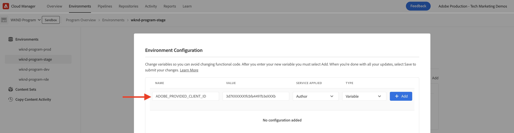

# 用于PIM集成的AEM Assets事件

>[!IMPORTANT]
>
>本教程使用实验性AEMas a Cloud ServiceAPI。 要访问这些API，您必须接受预发行软件协议，并由Adobe工程团队为您的环境手动启用这些API。 请求访问，请联系Adobe支持部门。

了解如何将AEM Assets与第三方系统(如产品信息管理(PIM)或产品线管理(PLM)系统)集成以更新资源元数据 **使用本机AEM IO事件**. 在收到AEM Assets事件后，可以根据业务需求在AEM、PIM或两个系统中更新资源元数据。 但是，此示例演示了如何在AEM中更新资源元数据。

>[!VIDEO](https://video.tv.adobe.com/v/3427592?quality=12&learn=on)

运行资源元数据更新 **AEM外部的代码**， [Adobe I/O Runtime](https://developer.adobe.com/runtime/docs/guides/overview/what_is_runtime/)，则使用无服务器平台。

事件处理流程如下所示：


1. AEM Author服务触发 _资产处理已完成_ 资产上传完成且所有资产处理活动都完成时的事件。 等待处理完成可确保已完成任何开箱即用的处理，例如元数据提取。
1. 该事件将发送到 [Adobe I/O事件](https://developer.adobe.com/events/) 服务。
1. Adobe I/O事件服务将事件传递给 [Adobe I/O Runtime操作](https://developer.adobe.com/runtime/docs/guides/using/creating_actions/) 以进行处理。
1. Adobe I/O Runtime操作调用PIM系统的API以检索其他元数据，如SKU、供应商信息或其他详细信息。
1. 然后，在AEM Assets中使用更新从PIM检索到的其他元数据 [资产创作API](https://developer.adobe.com/experience-cloud/experience-manager-apis/api/experimental/assets/author/).

## 先决条件

要完成本教程，您需要：

- AEMas a Cloud Service环境与 [已启用AEM事件](https://developer.adobe.com/experience-cloud/experience-manager-apis/guides/events/#enable-aem-events-on-your-aem-cloud-service-environment). 此外，示例 [WKND站点](https://github.com/adobe/aem-guides-wknd?#aem-wknd-sites-project) 必须将项目部署到其中。

- 访问 [Adobe Developer控制台](https://developer.adobe.com/developer-console/docs/guides/getting-started/).

- [ADOBE DEVELOPER CLI](https://developer.adobe.com/runtime/docs/guides/tools/cli_install/) 已安装在本地计算机上。

## 开发步骤

高级开发步骤包括：

1. [在Adobe Developer控制台(ADC)中创建项目](./runtime-action.md#Create-project-in-Adobe-Developer-Console)
1. [初始化项目以进行本地开发](./runtime-action.md#initialize-project-for-local-development)
1. 在ADC中配置项目
1. 配置AEM Author服务以启用ADC项目通信
1. 开发可协调元数据检索和更新的运行时操作
1. 将资源上传到AEM Author服务，并验证元数据是否已更新

有关步骤1-2的详细信息，请参阅 [Adobe I/O Runtime操作和AEM事件](./runtime-action.md#) 例如，对于步骤3-6，请参阅以下部分。

### 在Adobe Developer控制台(ADC)中配置项目

要接收AEM Assets事件并执行上一步中创建的Adobe I/O Runtime操作，请在ADC中配置项目。

- 在ADC中，导航到 [项目](https://developer.adobe.com/console/projects). 选择 `Stage` 工作区，这是部署运行时操作的地方。

- 单击 **添加服务** 按钮并选择 **事件** 选项。 在 **添加事件** 对话框，选择 **Experience Cloud** > **AEM Assets**，然后单击 **下一个**. 按照其他配置步骤，选择AEMCS实例 _资产处理已完成_ event、OAuth服务器到服务器身份验证类型和其他详细信息。

  

- 最后，在 **如何接收事件** 步骤，展开 **运行时操作** 选项，然后选择 _通用_ 在上一步中创建的操作。 单击 **保存配置的事件**.

  

- 同样，单击 **添加服务** 按钮并选择 **API** 选项。 在 **添加API** 模式，选择 **Experience Cloud** > **AEMAS A CLOUD SERVICEAPI** 并单击 **下一个**.

  

- 然后选择 **OAuth服务器到服务器** （对于身份验证类型），然后单击 **下一个**.

- 然后选择 **AEM管理员 — XXX** 产品配置文件并单击 **保存配置的API**. 要更新相关资源，所选产品配置文件必须与从中生成事件的AEM Assets环境关联，并且必须有足够权限在那里更新资源。

  

### 配置AEM Author服务以启用ADC项目通信

要从上述ADC项目更新AEM中的资产元数据，请使用ADC项目的客户端ID配置AEM Author服务。 此 _客户端ID_ 使用添加为环境变量 [AdobeCloud Manager](https://experienceleague.adobe.com/docs/experience-manager-cloud-service/content/implementing/using-cloud-manager/environment-variables.html#add-variables) UI。

- 登录 [AdobeCloud Manager](https://my.cloudmanager.adobe.com/)，选择 **项目** > **环境** > **省略号** > **查看详细信息** > **配置** 选项卡。

  

- 则 **添加配置** 按钮，并输入变量详细信息为

  | 名称 | 值 | AEM服务 | 类型 |
  | ----------- | ----------- | ----------- | ----------- |
  | Adobe提供的客户端ID | &lt;COPY_FROM_ADC_PROJECT_CREDENTIALS> | 创作 | 变量 |

  

- 单击 **添加** 和 **保存** 配置。

### 开发运行时操作

要执行元数据检索和更新，请首先更新自动创建的 _通用_ 中的操作代码 `src/dx-excshell-1/actions/generic` 文件夹。

请参阅附件中的 [WKND-Assets-PIM-Integration.zip](../assets/examples/assets-pim-integration/WKND-Assets-PIM-Integration.zip) 文件以了解完整代码，以下部分突出显示关键文件。

- 此 `src/dx-excshell-1/actions/generic/mockPIMCommunicator.js` 文件模拟PIM API调用以检索其他元数据，如SKU和供应商名称。 此文件用于演示目的。 在端到端流程正常工作后，请将此函数替换为对实际PIM系统的调用，以检索资产的元数据。

  ```javascript
  /**
   * Mock PIM API to get the product data such as SKU, Supplier, etc.
   *
   * In a real-world scenario, this function would call the PIM API to get the product data.
   * For this example, we are returning mock data.
   *
   * @param {string} assetId - The assetId to get the product data.
   */
  module.exports = {
      async getPIMData(assetId) {
          if (!assetId) {
          throw new Error('Invalid assetId');
          }
          // Mock response data for demo purposes
          const data = {
          SKUID: 'MockSKU 123',
          SupplierName: 'mock-supplier',
          // ... other product data
          };
          return data;
      },
  };
  ```

- 此 `src/dx-excshell-1/actions/generic/aemCommunicator.js` 文件使用更新AEM中的资源元数据 [资产创作API](https://developer.adobe.com/experience-cloud/experience-manager-apis/api/experimental/assets/author/).

  ```javascript
  const fetch = require('node-fetch');
  
  ...
  
  /**
  *  Get IMS Access Token using Client Credentials Flow
  *
  * @param {*} clientId - IMS Client ID from ADC project's OAuth Server-to-Server Integration
  * @param {*} clientSecret - IMS Client Secret from ADC project's OAuth Server-to-Server Integration
  * @param {*} scopes - IMS Meta Scopes from ADC project's OAuth Server-to-Server Integration as comma separated strings
  * @returns {string} - Returns the IMS Access Token
  */
  async function getIMSAccessToken(clientId, clientSecret, scopes) {
    const adobeIMSV3TokenEndpointURL = 'https://ims-na1.adobelogin.com/ims/token/v3';
  
    const options = {
      method: 'POST',
      headers: {
        'Content-Type': 'application/x-www-form-urlencoded',
      },
      body: `grant_type=client_credentials&client_id=${clientId}&client_secret=${clientSecret}&scope=${scopes}`,
    };
  
    const response = await fetch(adobeIMSV3TokenEndpointURL, options);
    const responseJSON = await response.json();
  
    return responseJSON.access_token;
  }    
  
  async function updateAEMAssetMetadata(metadataDetails, aemAssetEvent, params) {
    ...
    // Transform the metadata details to JSON Patch format,
    // see https://developer.adobe.com/experience-cloud/experience-manager-apis/api/experimental/assets/author/#operation/patchAssetMetadata
    const transformedMetadata = Object.keys(metadataDetails).map((key) => ({
      op: 'add',
      path: `wknd-${key.toLowerCase()}`,
      value: metadataDetails[key],
    }));
  
    ...
  
    // Get ADC project's OAuth Server-to-Server Integration credentials
    const clientId = params.ADC_CECREDENTIALS_CLIENTID;
    const clientSecret = params.ADC_CECREDENTIALS_CLIENTSECRET;
    const scopes = params.ADC_CECREDENTIALS_METASCOPES;
  
    // Get IMS Access Token using Client Credentials Flow
    const access_token = await getIMSAccessToken(clientId, clientSecret, scopes);
  
    // Call AEM Author service to update the metadata using Assets Author API
    // See https://developer.adobe.com/experience-cloud/experience-manager-apis/api/experimental/assets/author/
    const res = await fetch(`${aemAuthorHost}/adobe/assets/${assetId}/metadata`, {
      method: 'PATCH',
      headers: {
        'Content-Type': 'application/json-patch+json',
        'If-Match': '*',
        'X-Adobe-Accept-Experimental': '1',
        'X-Api-Key': 'aem-assets-management-api', // temporary value
        Authorization: `Bearer ${access_token}`,
      },
      body: JSON.stringify(transformedMetadata),
    });
  
    ...
  }
  
  module.exports = { updateAEMAssetMetadata };
  ```

  此 `.env` 文件存储ADC项目的OAuth服务器到服务器凭据详细信息，并使用作为参数传递给操作 `ext.config.yaml` 文件。 请参阅 [App Builder配置文件](https://developer.adobe.com/app-builder/docs/guides/configuration/) 用于管理密钥和操作参数。

- 此 `src/dx-excshell-1/actions/model` 文件夹包含 `aemAssetEvent.js` 和 `errors.js` 文件，操作将使用这些文件分别解析收到的事件和处理错误。

- 此 `src/dx-excshell-1/actions/generic/index.js` file使用前面提到的模块来编排元数据的检索和更新。

  ```javascript
  ...
  
  let responseMsg;
  // handle the challenge probe request, they are sent by I/O to verify the action is valid
  if (params.challenge) {
    logger.info('Challenge probe request detected');
    responseMsg = JSON.stringify({ challenge: params.challenge });
  } else {
    logger.info('AEM Asset Event request received');
  
    // create AEM Asset Event object from request parameters
    const aemAssetEvent = new AEMAssetEvent(params);
  
    // Call mock PIM API to get the product data such as SKU, Supplier, etc.
    const mockPIMData = await mockPIMAPI.getPIMData(
      aemAssetEvent.getAssetName(),
    );
    logger.info('Mock PIM API response', mockPIMData);
  
    // Update PIM received data in AEM as Asset metadata
    const aemUpdateStatus = await updateAEMAssetMetadata(
      mockPIMData,
      aemAssetEvent,
      params,
    );
    logger.info('AEM Asset metadata update status', aemUpdateStatus);
  
    if (aemUpdateStatus) {
      // create response message
      responseMsg = JSON.stringify({
        message:
          'AEM Asset Event processed successfully, updated the asset metadata with PIM data.',
        assetdata: {
          assetName: aemAssetEvent.getAssetName(),
          assetPath: aemAssetEvent.getAssetPath(),
          assetId: aemAssetEvent.getAssetId(),
          aemHost: aemAssetEvent.getAEMHost(),
          pimdata: mockPIMData,
        },
      });
    } 
  
    // response object
    const response = {
      statusCode: 200,
      body: responseMsg,
    };
  
    // Return the response to the caller
    return response;
  
    ...
  }
  ```

使用以下命令将更新的操作部署到Adobe I/O Runtime：

```bash
$ aio app deploy
```

### 资产上传和元数据验证

要验证AEM Assets与PIM集成，请执行以下步骤：

- 要查看模拟PIM提供的元数据（如SKU和供应商名称），请在AEM Assets中创建元数据架构，请参阅 [元数据架构](https://experienceleague.adobe.com/docs/experience-manager-learn/assets/configuring/metadata-schemas.html) 显示SKU和供应商名称元数据属性。

- 在AEM创作服务中上传资源并验证元数据更新。

  

## 概念和关键要点

企业通常需要在AEM和其他系统（如PIM）之间同步资源元数据。 使用AEM事件可以实现此类要求。

- 资源元数据检索代码在AEM外部执行，避免了AEM Author服务上的负载，因此事件驱动的架构可以独立扩展。
- 新引入的资产创作API用于更新AEM中的资产元数据。
- API身份验证使用OAuth服务器到服务器（也称为客户端凭据流），请参阅 [OAuth服务器到服务器凭据实施指南](https://developer.adobe.com/developer-console/docs/guides/authentication/ServerToServerAuthentication/implementation/).
- 与Adobe I/O Runtime操作不同，其他Webhook或Amazon EventBridge可用于接收AEM Assets事件并处理元数据更新。
- 通过AEM Eventing开展的资产事件使企业能够自动化和简化关键流程，从而提高内容生态系统之间的效率和一致性。

