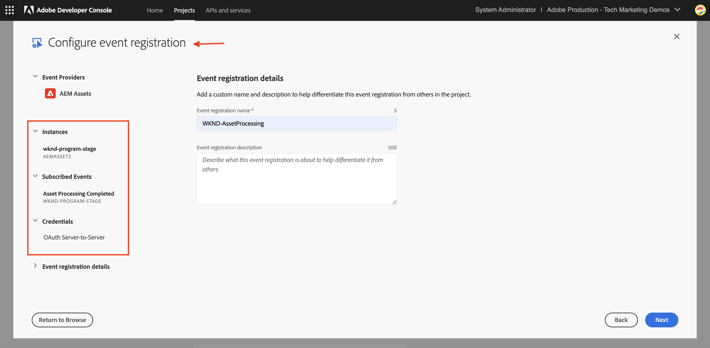

# 用于PIM集成的AEM Assets事件

>[!IMPORTANT]
>
>本教程使用基于OpenAPI的AEM API。 如果您有兴趣访问它们，我们建议您通过电子邮件发送[aem-apis@adobe.com](mailto:aem-apis@adobe.com)，并提供用例说明。

了解如何使用基于OpenAPI的Assets创作API接收AEM事件并对其执行操作以更新AEM中的内容状态。

如何处理收到的事件取决于业务要求。 例如，事件数据可用于更新第三方系统或AEM，或同时更新两者。

此示例演示了如何将第三方系统(如产品信息管理(PIM)系统)与AEM as a Cloud Service Assets集成。 在收到AEM Assets事件时，对其进行处理以从PIM系统检索其他元数据并更新AEM中的资源元数据。 更新的资产元数据可以包含附加信息，如SKU、供应商名称或其他产品详细信息。

为了接收和处理AEM Assets事件[Adobe I/O Runtime](https://developer.adobe.com/runtime/docs/guides/overview/what_is_runtime/)，使用了无服务器平台。 但是，也可以使用第三方系统中的Webhook或Amazon EventBridge等其他事件处理系统。

集成的高层流程如下所示：

用于PIM集成的

1. 当完成资源上传并完成所有资源处理活动时，AEM创作服务会触发&#x200B;_资源处理已完成_&#x200B;事件。 等待资产处理完成可确保已完成任何现成的处理，例如元数据提取。
1. 该事件已发送到[Adobe I/O事件](https://developer.adobe.com/events/)服务。
1. Adobe I/O事件服务将事件传递到[Adobe I/O Runtime操作](https://developer.adobe.com/runtime/docs/guides/using/creating_actions/)进行处理。
1. Adobe I/O Runtime操作调用PIM系统的API以检索其他元数据，如SKU、供应商信息或其他详细信息。
1. 然后，在AEM Assets中使用基于OpenAPI的[Assets创作API](https://developer.adobe.com/experience-cloud/experience-manager-apis/api/experimental/assets/author/)更新从PIM检索到的其他元数据。

## 先决条件

要完成本教程，您需要：

- 启用了[AEM事件](https://developer.adobe.com/experience-cloud/experience-manager-apis/guides/events/#enable-aem-events-on-your-aem-cloud-service-environment)的AEM as a Cloud Service环境。 此外，示例[WKND Sites](https://github.com/adobe/aem-guides-wknd?#aem-wknd-sites-project)项目必须部署到该项目。

- 访问[Adobe Developer Console](https://developer.adobe.com/developer-console/docs/guides/getting-started/)。

- 本地计算机上已安装[Adobe Developer CLI](https://developer.adobe.com/runtime/docs/guides/tools/cli_install/)。

## 开发步骤

高级开发步骤包括：

1. [AEM as a Cloud Service环境的现代化](https://experienceleague.adobe.com/en/docs/experience-manager-learn/cloud-service/aem-apis/invoke-openapi-based-aem-apis#modernization-of-aem-as-a-cloud-service-environment)
1. [启用AEM API访问](https://experienceleague.adobe.com/en/docs/experience-manager-learn/cloud-service/aem-apis/invoke-openapi-based-aem-apis#enable-aem-apis-access)
1. [在Adobe Developer Console (ADC)中创建项目](./runtime-action.md#Create-project-in-Adobe-Developer-Console)
1. [初始化项目以进行本地开发](./runtime-action.md#initialize-project-for-local-development)
1. 在ADC中配置项目
1. 配置AEM Author服务以启用ADC项目通信
1. 开发运行时操作以进行编排
   1. 从PIM系统检索元数据
   1. 使用Assets创作API在AEM Assets中更新元数据
1. 创建和应用资源元数据架构
1. 验证资产上传和元数据更新

有关步骤1-2的详细信息，请参阅[调用基于OpenAPI的AEM API](https://experienceleague.adobe.com/zh-hans/docs/experience-manager-learn/cloud-service/aem-apis/invoke-openapi-based-aem-apis)指南，有关步骤3-4，请参阅[Adobe I/O Runtime操作和AEM事件](./runtime-action.md#)示例。 有关步骤5-9，请参阅以下部分。

### 在Adobe Developer Console (ADC)中配置项目

要接收AEM Assets事件并执行上一步中创建的Adobe I/O Runtime操作，请在ADC中配置项目。

- 在ADC中，导航到您在步骤3中创建的[项目](https://developer.adobe.com/console/projects)。 在该项目中，选择`Stage`工作区，运行时操作将在您运行`aio app deploy`时作为步骤4说明的一部分进行部署。

- 单击&#x200B;**添加服务**&#x200B;按钮并选择&#x200B;**事件**&#x200B;选项。 在&#x200B;**添加事件**&#x200B;对话框中，选择&#x200B;**Experience Cloud** > **AEM Assets**，然后单击&#x200B;**下一步**。
  

- 在&#x200B;**配置事件注册**&#x200B;步骤中，选择所需的AEMCS实例，然后选择&#x200B;_已完成资产处理_&#x200B;事件和OAuth服务器到服务器身份验证类型。

  

- 最后，在&#x200B;**如何接收事件**&#x200B;步骤中，展开&#x200B;**运行时操作**&#x200B;选项并选择在上一步中创建的&#x200B;_通用_&#x200B;操作。 单击&#x200B;**保存配置的事件**。

  

- 同样，单击&#x200B;**添加服务**&#x200B;按钮并选择&#x200B;**API**&#x200B;选项。 在&#x200B;**添加API**&#x200B;模式中，选择&#x200B;**Experience Cloud** > **AEM Assets创作API**，然后单击&#x200B;**下一步**。

  

- 然后，为身份验证类型选择&#x200B;**OAuth服务器到服务器**，然后单击&#x200B;**下一步**。

- 然后，选择与从中生成事件的AEM Assets环境关联的正确&#x200B;**产品配置文件**，该配置文件具有足够的访问权限来更新资源。 最后，单击&#x200B;**保存配置的API**&#x200B;按钮。

  

  在我选择了&#x200B;_AEM Administrators - author - Program XXX - Environment YYYY_&#x200B;产品配置文件的情况下，它启用了&#x200B;**AEM Assets API Users**&#x200B;服务。

  

## 配置AEM实例以启用ADC项目通信

要启用ADC项目的OAuth服务器到服务器凭据ClientID以便与AEM实例通信，您需要配置AEM实例。

此操作可通过在AEM项目的`config.yaml`文件中定义配置来完成。 然后，使用Cloud Manager中的配置管道部署`config.yaml`文件。

- 在AEM项目中，从`config`文件夹中找到或创建`config.yaml`文件。

  

- 将以下配置添加到`config.yaml`文件。

  ```yaml
  kind: "API"
  version: "1.0"
  metadata: 
      envTypes: ["dev", "stage", "prod"]
  data:
      allowedClientIDs:
          author:
          - "<ADC Project's OAuth Server-to-Server credential ClientID>"
  ```

  将`<ADC Project's OAuth Server-to-Server credential ClientID>`替换为ADC项目的OAuth服务器到服务器凭据的实际ClientID。

  >[!CAUTION]
  >
  > 出于演示目的，所有环境均使用相同的ClientID。 建议为每个环境（开发、暂存、生产）使用单独的ClientID，以便更好地进行安全和控制。


- 将配置更改提交到Git存储库并将更改推送到远程存储库。

- 使用Cloud Manager中的配置管道来部署上述更改。 请注意，`config.yaml`文件也可以使用命令行工具安装在RDE中。

  

### 开发运行时操作

要执行元数据检索和更新，请先更新`src/dx-excshell-1/actions/generic`文件夹中自动创建的&#x200B;_通用_&#x200B;操作代码。

有关完整代码，请参阅附加的[WKND-Assets-PIM-Integration.zip](../assets/examples/assets-pim-integration/WKND-Assets-PIM-Integration.zip)文件，以下部分突出显示关键文件。

- `src/dx-excshell-1/actions/generic/mockPIMCommunicator.js`文件模拟PIM API调用以检索其他元数据，如SKU和供应商名称。 此文件用于演示目的。 在端到端流程正常工作后，请将此函数替换为对实际PIM系统的调用，以检索资产的元数据。

  ```javascript
  /**
   * Mock PIM API to get the product data such as SKU, Supplier, etc.
   *
   * In a real-world scenario, this function would call the PIM API to get the product data.
   * For this example, we are returning mock data.
   *
   * @param {string} assetId - The assetId to get the product data.
   */
  module.exports = {
      async getPIMData(assetId) {
          if (!assetId) {
          throw new Error('Invalid assetId');
          }
          // Mock response data for demo purposes
          const data = {
          SKUID: 'MockSKU 123',
          SupplierName: 'mock-supplier',
          // ... other product data
          };
          return data;
      },
  };
  ```

- `src/dx-excshell-1/actions/generic/aemCommunicator.js`文件使用[Assets创作API](https://developer.adobe.com/experience-cloud/experience-manager-apis/api/experimental/assets/author/)更新AEM中的资源元数据。

  ```javascript
  const fetch = require('node-fetch');
  ...
  /**
  *  Get IMS Access Token using Client Credentials Flow
  *
  * @param {*} clientId - IMS Client ID from ADC project's OAuth Server-to-Server Integration
  * @param {*} clientSecret - IMS Client Secret from ADC project's OAuth Server-to-Server Integration
  * @param {*} scopes - IMS Meta Scopes from ADC project's OAuth Server-to-Server Integration as comma separated strings
  * @returns {string} - Returns the IMS Access Token
  */
  async function getIMSAccessToken(clientId, clientSecret, scopes) {
    const adobeIMSV3TokenEndpointURL = 'https://ims-na1.adobelogin.com/ims/token/v3';
    const options = {
      method: 'POST',
      headers: {
        'Content-Type': 'application/x-www-form-urlencoded',
      },
      body: `grant_type=client_credentials&client_id=${clientId}&client_secret=${clientSecret}&scope=${scopes}`,
    };
    const response = await fetch(adobeIMSV3TokenEndpointURL, options);
    const responseJSON = await response.json();
    return responseJSON.access_token;
  }    
  async function updateAEMAssetMetadata(metadataDetails, aemAssetEvent, params) {
    ...
    // Transform the metadata details to JSON Patch format,
    // see https://developer.adobe.com/experience-cloud/experience-manager-apis/api/experimental/assets/author/#operation/patchAssetMetadata
    const transformedMetadata = Object.keys(metadataDetails).map((key) => ({
      op: 'add',
      path: `wknd-${key.toLowerCase()}`,
      value: metadataDetails[key],
    }));
    ...
    // Get ADC project's OAuth Server-to-Server Integration credentials
    const clientId = params.ADC_CECREDENTIALS_CLIENTID;
    const clientSecret = params.ADC_CECREDENTIALS_CLIENTSECRET;
    const scopes = params.ADC_CECREDENTIALS_METASCOPES;
    // Get IMS Access Token using Client Credentials Flow
    const access_token = await getIMSAccessToken(clientId, clientSecret, scopes);
    // Call AEM Author service to update the metadata using Assets Author API
    // See https://developer.adobe.com/experience-cloud/experience-manager-apis/api/experimental/assets/author/
    const res = await fetch(`${aemAuthorHost}/adobe/assets/${assetId}/metadata`, {
      method: 'PATCH',
      headers: {
        'Content-Type': 'application/json-patch+json',
        'If-Match': '*',
        'X-Adobe-Accept-Experimental': '1',
        'X-Api-Key': 'aem-assets-management-api', // temporary value
        Authorization: `Bearer ${access_token}`,
      },
      body: JSON.stringify(transformedMetadata),
    });
    ...
  }
  module.exports = { updateAEMAssetMetadata };
  ```

  `.env`文件存储ADC项目的OAuth服务器到服务器凭据详细信息，并使用`ext.config.yaml`文件将这些凭据作为参数传递给操作。 有关管理密钥和操作参数，请参阅[App Builder配置文件](https://developer.adobe.com/app-builder/docs/guides/configuration/)。
- `src/dx-excshell-1/actions/model`文件夹包含`aemAssetEvent.js`和`errors.js`个文件，操作使用这些文件分别分析收到的事件和处理错误。
- `src/dx-excshell-1/actions/generic/index.js`文件使用上述模块来编排元数据检索和更新。

  ```javascript
  ...
  let responseMsg;
  // handle the challenge probe request, they are sent by I/O to verify the action is valid
  if (params.challenge) {
    logger.info('Challenge probe request detected');
    responseMsg = JSON.stringify({ challenge: params.challenge });
  } else {
    logger.info('AEM Asset Event request received');
    // create AEM Asset Event object from request parameters
    const aemAssetEvent = new AEMAssetEvent(params);
    // Call mock PIM API to get the product data such as SKU, Supplier, etc.
    const mockPIMData = await mockPIMAPI.getPIMData(
      aemAssetEvent.getAssetName(),
    );
    logger.info('Mock PIM API response', mockPIMData);
    // Update PIM received data in AEM as Asset metadata
    const aemUpdateStatus = await updateAEMAssetMetadata(
      mockPIMData,
      aemAssetEvent,
      params,
    );
    logger.info('AEM Asset metadata update status', aemUpdateStatus);
    if (aemUpdateStatus) {
      // create response message
      responseMsg = JSON.stringify({
        message:
          'AEM Asset Event processed successfully, updated the asset metadata with PIM data.',
        assetdata: {
          assetName: aemAssetEvent.getAssetName(),
          assetPath: aemAssetEvent.getAssetPath(),
          assetId: aemAssetEvent.getAssetId(),
          aemHost: aemAssetEvent.getAEMHost(),
          pimdata: mockPIMData,
        },
      });
    } 
    // response object
    const response = {
      statusCode: 200,
      body: responseMsg,
    };
    // Return the response to the caller
    return response;
    ...
  }
  ```

- 使用以下命令将更新的操作部署到Adobe I/O Runtime：

  ```bash
  $ aio app deploy
  ```

### 创建和应用资源元数据架构

默认情况下，WKND Sites项目没有用于显示PIM特定元数据（如SKU、供应商名称等）的资源元数据架构。 让我们在AEM实例中创建资源元数据架构并将其应用到资源文件夹。

1. 登录到AEM as a Cloud Service资源实例，并出现在[资源视图](https://experienceleague.adobe.com/en/docs/experience-manager-learn/assets/authoring/switch-views)中。

   

1. 从左边栏导航到&#x200B;**设置** > **元数据Forms**&#x200B;选项，然后单击&#x200B;**创建**&#x200B;按钮。 在&#x200B;**创建元数据表单**&#x200B;对话框中，输入以下详细信息，然后单击&#x200B;**创建**。
   - 名称：`PIM`
   - 将现有的表单结构用作模板： `Check`
   - 选择自： `default`

   

1. 单击&#x200B;**+**&#x200B;图标以添加新的&#x200B;**PIM**&#x200B;选项卡并向其中添加&#x200B;**单行文本**&#x200B;组件。

   

   下表列出了元数据属性及其相应字段。

   | 标签 | 占位符 | 元数据属性 |
   | --- | --- | --- |
   | SKU | 通过AEM Eventing集成自动填充 | `wknd-skuid` |
   | 供应商名称 | 通过AEM Eventing集成自动填充 | `wknd-suppliername` |

1. 单击&#x200B;**保存**&#x200B;和&#x200B;**关闭**&#x200B;以保存元数据表单。

1. 最后，将&#x200B;**PIM**&#x200B;元数据架构应用于&#x200B;**PIM**&#x200B;文件夹。

   

通过上述步骤，**冒险**&#x200B;文件夹中的资产可以显示特定于PIM的元数据，如SKU、供应商名称等。

### 资产上传和元数据验证

要验证AEM Assets和PIM集成，请将资产上传到AEM Assets中的&#x200B;**Adventures**&#x200B;文件夹。 资产详细信息页中的PIM标签应显示SKU和供应商名称元数据。


## 概念和关键要点

企业通常需要在AEM和其他系统（如PIM）之间同步资源元数据。 使用AEM事件可以实现此类要求。

- 资产元数据检索代码在AEM外部执行，避免了AEM Author服务上的负载，因此这是一种独立扩展的事件驱动架构。
- 新引入的Assets创作API用于更新AEM中的资源元数据。
- API身份验证使用OAuth服务器到服务器（也称为客户端凭据流），请参阅[OAuth服务器到服务器凭据实施指南](https://developer.adobe.com/developer-console/docs/guides/authentication/ServerToServerAuthentication/implementation/)。
- 与Adobe I/O Runtime操作不同，其他Webhook或Amazon EventBridge可用于接收AEM Assets事件并处理元数据更新。
- 通过AEM Eventing开展的资产事件使企业能够自动化和简化关键流程，从而提高内容生态系统的效率和一致性。
