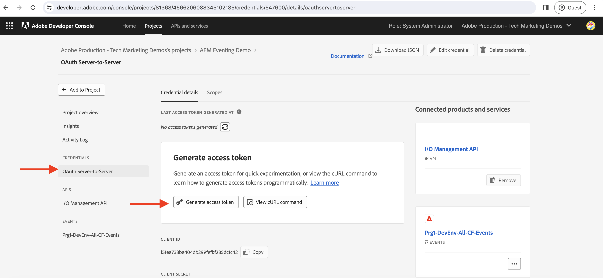
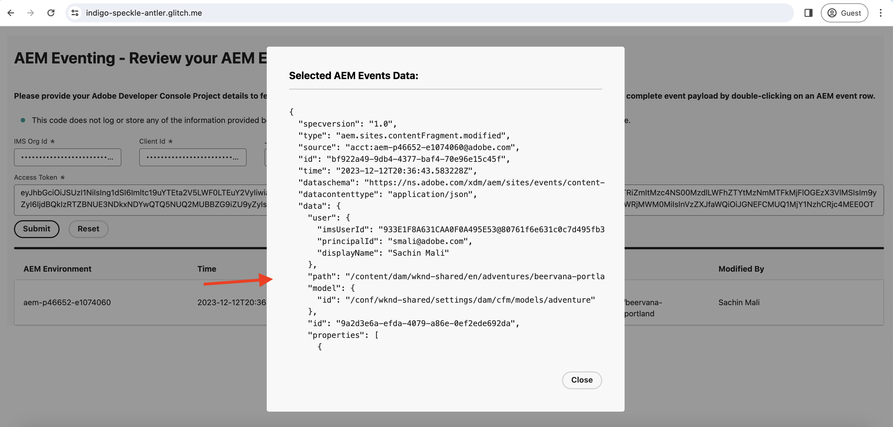

# 日志记录和AEM事件

了解如何从日志中检索初始AEM事件集并浏览有关每个事件的详细信息。

>[!VIDEO](https://video.tv.adobe.com/v/3427052?quality=12&learn=on)

日记帐是一种使用AEM事件的拉取方法，日记帐是事件的有序列表。 使用Adobe I/O事件日记API，您可以从日记中获取AEM事件并在应用程序中处理它们。 此方法允许您根据指定的节奏管理事件并高效地批量处理它们。 请参阅[日记](https://developer.adobe.com/events/docs/guides/journaling_intro/)以获得深入的见解，包括保留期、分页等基本注意事项。

在Adobe Developer Console项目中，会自动为日志启用每个事件注册，从而实现无缝集成。

在此示例中，利用Adobe提供的&#x200B;_托管Web应用程序_，您可以从日志中获取第一批AEM事件，而无需设置应用程序。 此Adobe提供的Web应用程序托管在[Glitch](https://glitch.com/)上，这是一个众所周知的平台，它提供了有助于构建和部署Web应用程序的基于Web的环境。 但是，如果愿意，也可以选择使用您自己的应用程序。

## 先决条件

要完成本教程，您需要：

- 启用了[AEM事件](https://developer.adobe.com/experience-cloud/experience-manager-apis/guides/events/#enable-aem-events-on-your-aem-cloud-service-environment)的AEM as a Cloud Service环境。

- 为AEM事件配置的[Adobe Developer Console项目](https://developer.adobe.com/experience-cloud/experience-manager-apis/guides/events/#how-to-subscribe-to-aem-events-in-the-adobe-developer-console)。

## 访问Web应用程序

要访问Adobe提供的Web应用程序，请执行以下步骤：

- 验证是否可以在新的浏览器选项卡中访问[问题 — 托管的Web应用程序](https://indigo-speckle-antler.glitch.me/)。

  

## 收集Adobe Developer Console项目详细信息

若要从日志中获取AEM事件，需要凭据，如&#x200B;_IMS组织ID_、_客户端ID_&#x200B;和&#x200B;_访问令牌_。 要收集这些凭据，请执行以下步骤：

- 在[Adobe Developer Console](https://developer.adobe.com)中，导航到您的项目并单击以将其打开。

- 在&#x200B;**凭据**&#x200B;部分下，单击&#x200B;**OAuth服务器到服务器**&#x200B;链接以打开&#x200B;**凭据详细信息**&#x200B;选项卡。

- 单击&#x200B;**生成访问令牌**&#x200B;按钮以生成访问令牌。

  

- 复制&#x200B;**生成的访问令牌**、**客户端ID**&#x200B;和&#x200B;**组织ID**。 在本教程的后面部分，您需要这些组件。

  

- 每个事件注册都会自动启用日志。 要获取事件注册的&#x200B;_独特日记API端点_，请单击已订阅AEM Events的事件卡。 从&#x200B;**注册详细信息**&#x200B;选项卡，复制&#x200B;**日志唯一API终结点**。

  

## 加载AEM事件日志

为简单起见，此托管的Web应用程序仅从日志中获取第一批AEM事件。 这些是日志中最旧可用的事件。 有关详细信息，请参阅[第一批事件](https://developer.adobe.com/events/docs/guides/api/journaling_api/#fetching-your-first-batch-of-events-from-the-journal)。

- 在[问题 — 托管的Web应用程序](https://indigo-speckle-antler.glitch.me/)中，输入您之前从Adobe Developer Console项目复制的&#x200B;**IMS组织ID**、**客户端ID**&#x200B;和&#x200B;**访问令牌**，然后单击&#x200B;**提交**。

- 成功后，表组件会显示AEM Events Journal数据。

  

- 要查看完整的事件有效负载，请双击该行。 您可以看到，AEM事件详细信息中提供了在webhook中处理该事件所需的所有信息。 例如，事件类型(`type`)、事件源(`source`)、事件ID (`event_id`)、事件时间(`time`)和事件数据(`data`)。

  

## 其他资源

- [Glitch webhook源代码](https://glitch.com/edit/#!/indigo-speckle-antler)可供参考。 它是使用[AdobeReact Spectrum](https://react-spectrum.adobe.com/react-spectrum/index.html)组件呈现UI的简单React应用程序。

- [Adobe I/O事件日记API](https://developer.adobe.com/events/docs/guides/api/journaling_api/)提供有关API的详细信息，如第一批、下一批和上一批事件、分页等。
