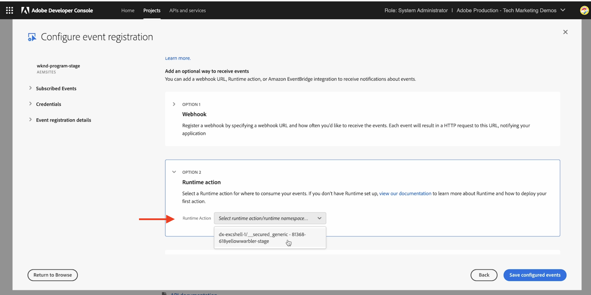

# Adobe I/O Runtime操作和AEM事件

了解如何使用接收AEM事件 [Adobe I/O Runtime](https://developer.adobe.com/runtime/docs/guides/overview/what_is_runtime/) 操作和查看事件详细信息，例如有效负载、标头和元数据。

>[!VIDEO](https://video.tv.adobe.com/v/3427053?quality=12&learn=on)

Adobe I/O Runtime是一个无服务器平台，允许执行代码以响应Adobe I/O事件。 从而帮助您构建事件驱动型应用程序，而无需担心基础架构。

在本例中，您创建了一个Adobe I/O Runtime [操作](https://developer.adobe.com/runtime/docs/guides/using/creating_actions/) 会接收AEM事件并记录事件详细信息。
https://developer.adobe.com/runtime/docs/guides/overview/what_is_runtime/

高级步骤包括：

- 在Adobe Developer控制台中创建项目
- 初始化项目以进行本地开发
- 在Adobe Developer控制台中配置项目
- 触发AEM事件并验证操作的执行

## 前提条件

要完成本教程，您需要：

- AEMas a Cloud Service环境与 [已启用AEM事件](https://developer.adobe.com/experience-cloud/experience-manager-apis/guides/events/#enable-aem-events-on-your-aem-cloud-service-environment).

- 访问 [Adobe Developer控制台](https://developer.adobe.com/developer-console/docs/guides/getting-started/).

- [ADOBE DEVELOPER CLI](https://developer.adobe.com/runtime/docs/guides/tools/cli_install/) 已安装在本地计算机上。

>[!IMPORTANT]
>
>AEMas a Cloud Service事件仅适用于预发行模式下的注册用户。 要在AEMas a Cloud Service环境中启用AEM事件，请联系 [AEM事件团队](mailto:grp-aem-events@adobe.com).

## 在Adobe Developer控制台中创建项目

要在Adobe Developer控制台中创建项目，请执行以下步骤：

- 导航到 [Adobe Developer控制台](https://developer.adobe.com/) 并单击 **控制台** 按钮。

- 在 **快速入门** 部分，单击 **从模板创建项目**. 然后，在 **浏览模板** 对话框，选择 **App Builder** 模板。

- 根据需要更新项目标题、应用程序名称并添加工作区。 然后，单击 **保存**.

  


## 初始化项目以进行本地开发

要将Adobe I/O Runtime操作添加到项目中，必须初始化项目以进行本地开发。 在本地计算机打开终端上，导航到要初始化项目的位置，然后执行以下步骤：

- 通过运行初始化项目

  ```bash
  aio app init
  ```

- 选择 `Organization`， `Project` 您在上一步中创建了，并创建了工作区。 在 `What templates do you want to search for?` 步骤，选择 `All Templates` 选项。

  

- 从模板列表中，选择 `@adobe/generator-app-excshell` 选项。

  

- 在收藏的IDE中打开项目，例如VSCode。

- 选定的 _可扩展性模板_ (`@adobe/generator-app-excshell`)提供了一个通用的运行时操作，代码位于 `src/dx-excshell-1/actions/generic/index.js` 文件。 让我们更新它以使其简单，记录事件详细信息并返回成功响应。 但在下一个示例中，增强了处理收到的AEM事件的功能。

  ```javascript
  const fetch = require("node-fetch");
  const { Core } = require("@adobe/aio-sdk");
  const {
  errorResponse,
  getBearerToken,
  stringParameters,
  checkMissingRequestInputs,
  } = require("../utils");
  
  // main function that will be executed by Adobe I/O Runtime
  async function main(params) {
  // create a Logger
  const logger = Core.Logger("main", { level: params.LOG_LEVEL || "info" });
  
  try {
      // 'info' is the default level if not set
      logger.info("Calling the main action");
  
      // log parameters, only if params.LOG_LEVEL === 'debug'
      logger.debug(stringParameters(params));
  
      const response = {
      statusCode: 200,
      body: {
          message: "Received AEM Event, it will be processed in next example",
      },
      };
  
      // log the response status code
      logger.info(`${response.statusCode}: successful request`);
      return response;
  } catch (error) {
      // log any server errors
      logger.error(error);
      // return with 500
      return errorResponse(500, "server error", logger);
  }
  }
  
  exports.main = main;
  ```

- 最后，通过运行在Adobe I/O Runtime上部署更新的操作。

  ```bash
  aio app deploy
  ```

## 在Adobe Developer控制台中配置项目

要接收AEM事件并执行上一步中创建的Adobe I/O Runtime操作，请在Adobe Developer Console中配置项目。

- 在Adobe Developer Console中，导航到 [项目](https://developer.adobe.com/console/projects) 在上一步中创建，然后单击以将其打开。 选择 `Stage` 工作区，这是部署操作的地方。

- 单击 **添加服务** 按钮并选择 **API** 选项。 在 **添加API** 模式，选择 **Adobe服务** > **I/O管理API** 并单击 **下一个**，执行其他配置步骤并单击 **保存配置的API**.

  

- 同样，单击 **添加服务** 按钮并选择 **事件** 选项。 在 **添加事件** 对话框，选择 **Experience Cloud** > **AEM Sites**，然后单击 **下一个**. 按照其他配置步骤，选择AEMCS实例、事件类型和其他详细信息。

- 最后，在 **如何接收事件** 步骤，展开 **运行时操作** 选项，然后选择 _通用_ 在上一步中创建的操作。 单击 **保存配置的事件**.

  

- 查看“事件注册”详细信息，以及 **调试跟踪** 选项卡并验证 **质询探测器** 请求和响应。

  


## 触发AEM事件

要通过已在上述AEM Console项目中注册的AEMas a Cloud Service环境触发Adobe Developer事件，请执行以下步骤：

- 通过以下方式访问和登录您的AEMas a Cloud Service创作环境 [Cloud Manager](https://my.cloudmanager.adobe.com/).

- 根据您的 **订阅的事件**、创建、更新、删除、发布或取消发布内容片段。

## 查看事件详细信息

完成上述步骤后，您应该会看到要交付给常规操作的AEM事件。

您可以在中查看事件详细信息 **调试跟踪** 选项卡。


## 后续步骤

在下一个示例中，我们将增强此操作以处理AEM事件，回调AEM创作服务以获取内容详细信息，将详细信息存储在Adobe I/O Runtime存储中，并通过单页应用程序(SPA)显示它们。

