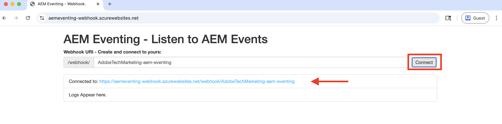

# Webhook和AEM活动

了解如何在webhook上接收AEM事件并查看事件详细信息，例如有效负载、标头和元数据。


>[!VIDEO](https://video.tv.adobe.com/v/3449758?quality=12&learn=on&captions=chi_hans)


>[!IMPORTANT]
>
>该视频引用了Glitch托管的webhook端点。 由于Glitch已停止其托管服务，因此webhook已迁移到Azure应用程序服务。
>
>功能保持不变 — 只有托管平台发生了更改。


除了使用Adobe提供的示例webhook之外，您还可以使用自己的webhook端点来接收AEM事件。

## 先决条件

要完成本教程，您需要：

- 已启用[AEM事件的AEM as a Cloud Service环境](https://developer.adobe.com/experience-cloud/experience-manager-apis/guides/events/#enable-aem-events-on-your-aem-cloud-service-environment)。

- 已为Adobe Developer Console事件配置[AEM项目](https://developer.adobe.com/experience-cloud/experience-manager-apis/guides/events/#how-to-subscribe-to-aem-events-in-the-adobe-developer-console)。


## 访问webhook

要访问Adobe提供的webhook示例，请执行以下步骤：

- 验证您是否可以在新的浏览器选项卡中访问[Adobe提供的webhook](https://aemeventing-webhook.azurewebsites.net/)示例。

  

- 为webhook输入唯一的名称，例如`<YOUR_PETS_NAME>-aem-eventing`，然后单击&#x200B;**连接**。 您应该会看到屏幕上显示`Connected to: ${YOUR-WEBHOOK-URL}`消息。

  

- 记下&#x200B;**Webhook URL**。 在本教程的后面部分，您需要使用该功能。

## 在Adobe Developer Console项目中配置webhook

要在上述webhook URL上接收AEM活动，请执行以下步骤：

- 在[Adobe Developer Console](https://developer.adobe.com)中，导航到您的项目并单击以将其打开。

- 在&#x200B;**产品和服务**&#x200B;部分下，单击应将AEM活动发送到webhook的所需活动信息卡旁边的省略号`...`，然后选择&#x200B;**编辑**。

  

- 在新打开的&#x200B;**配置事件注册**&#x200B;对话框中，单击&#x200B;**下一步**&#x200B;以继续执行&#x200B;**如何接收事件**&#x200B;步骤。

  

- 在&#x200B;**如何接收事件**&#x200B;步骤中，选择&#x200B;**Webhook**&#x200B;选项并粘贴您之前从Adobe提供的示例webhook中复制的&#x200B;**Webhook URL**，然后单击&#x200B;**保存配置的事件**。

  

- 在Adobe提供的示例webhook页面中，您应该看到GET请求，它是Adobe I/O Events发送的验证webhook URL的质询请求。

  


## 触发AEM事件

要通过已在上述AEM项目中注册的AEM as a Cloud Service环境触发Adobe Developer Console事件，请执行以下步骤：

- 通过[Cloud Manager](https://my.cloudmanager.adobe.com/)访问并登录AEM as a Cloud Service创作环境。

- 根据您的&#x200B;**订阅事件**，创建、更新、删除、发布或取消发布内容片段。

## 查看事件详细信息

完成上述步骤后，您应该会看到正在交付到webhook的AEM活动。 在Adobe提供的示例webhook页面中查找POST请求。


以下是POST请求的关键详细信息：

- 路径： `/webhook/${YOUR-WEBHOOK-URL}`，例如`/webhook/AdobeTM-aem-eventing`

- 标头：由Adobe I/O Events发送的请求标头，例如：

```json
{
  "host": "aemeventing-webhook.azurewebsites.net",
  "user-agent": "Adobe/1.0",
  "accept-encoding": "deflate,compress,identity",
  "max-forwards": "10",
  "x-adobe-public-key2-path": "/prod/keys/pub-key-kruhWwu4Or.pem",
  "x-adobe-delivery-id": "25c36f70-9238-4e4c-b1d8-4d9a592fed9d",
  "x-adobe-provider": "aemsites_7ABB3E6A5A7491460A495D61@AdobeOrg_acct-aem-p63947-e1249010@adobe.com",
  "x-adobe-public-key1-path": "/prod/keys/pub-key-lyTiz3gQe4.pem",
  "x-adobe-event-id": "b555a1b1-935b-4541-b410-1915775338b5",
  "x-adobe-event-code": "aem.sites.contentFragment.modified",
  "x-adobe-digital-signature-2": "Lvw8+txbQif/omgOamJXJaJdJMLDH5BmPA+/RRLhKG2LZJYWKiomAE9DqKhM349F8QMdDq6FXJI0vJGdk0FGYQa6JMrU+LK+1fGhBpO98LaJOdvfUQGG/6vq8/uJlcaQ66tuVu1xwH232VwrQOKdcobE9Pztm6UX0J11Uc7vtoojUzsuekclKEDTQx5vwBIYK12bXTI9yLRsv0unBZfNRrV0O4N7KA9SRJFIefn7hZdxyYy7IjMdsoswG36E/sDOgcnW3FVM+rhuyWEizOd2AiqgeZudBKAj8ZPptv+6rZQSABbG4imOa5C3t85N6JOwffAAzP6qs7ghRID89OZwCg==",
  "x-adobe-digital-signature-1": "ZQywLY1Gp/MC/sXzxMvnevhnai3ZG/GaO4ThSGINIpiA/RM47ssAw99KDCy1loxQyovllEmN0ifAwfErQGwDa5cuJYEoreX83+CxqvccSMYUPb5JNDrBkG6W0CmJg6xMeFeo8aoFbePvRkkDOHdz6nT0kgJ70x6mMKgCBM+oUHWG13MVU3YOmU92CJTzn4hiSK8o91/f2aIdfIui/FDp8U20cSKKMWpCu25gMmESorJehe4HVqxLgRwKJHLTqQyw6Ltwy2PdE0guTAYjhDq6AUd/8Fo0ORCY+PsS/lNxim9E9vTRHS7TmRuHf7dpkyFwNZA6Au4GWHHS87mZSHNnow==",
  "x-arr-log-id": "881073f0-7185-4812-9f17-4db69faf2b68",
  "client-ip": "52.37.214.82:46066",
  "disguised-host": "aemeventing-webhook.azurewebsites.net",
  "x-site-deployment-id": "aemeventing-webhook",
  "was-default-hostname": "aemeventing-webhook.azurewebsites.net",
  "x-forwarded-proto": "https",
  "x-appservice-proto": "https",
  "x-arr-ssl": "2048|256|CN=Microsoft Azure RSA TLS Issuing CA 03, O=Microsoft Corporation, C=US|CN=*.azurewebsites.net, O=Microsoft Corporation, L=Redmond, S=WA, C=US",
  "x-forwarded-tlsversion": "1.3",
  "x-forwarded-for": "52.37.214.82:46066",
  "x-original-url": "/webhook/AdobeTechMarketing-aem-eventing",
  "x-waws-unencoded-url": "/webhook/AdobeTechMarketing-aem-eventing",
  "x-client-ip": "52.37.214.82",
  "x-client-port": "46066",
  "content-type": "application/cloudevents+json; charset=UTF-8",
  "content-length": "1178"
}
```

- body/payload：由Adobe I/O Events发送的请求正文，例如：

```json
{
  "specversion": "1.0",
  "id": "83b0eac0-56d6-4499-afa6-4dc58ff6ac7f",
  "source": "acct:aem-p63947-e1249010@adobe.com",
  "type": "aem.sites.contentFragment.modified",
  "datacontenttype": "application/json",
  "dataschema": "https://ns.adobe.com/xdm/aem/sites/events/content-fragment-modified.json",
  "time": "2025-07-24T13:53:23.994109827Z",
  "eventid": "b555a1b1-935b-4541-b410-1915775338b5",
  "event_id": "b555a1b1-935b-4541-b410-1915775338b5",
  "recipient_client_id": "606d4074c7ea4962aaf3bc2a5ac3b7f9",
  "recipientclientid": "606d4074c7ea4962aaf3bc2a5ac3b7f9",
  "data": {
    "user": {
      "imsUserId": "ims-933E1F8A631CAA0F0A495E53@80761f6e631c0c7d495fb3.e",
      "principalId": "xx@adobe.com",
      "displayName": "Sachin Mali"
    },
    "path": "/content/dam/wknd-shared/en/adventures/beervana-portland/beervana-in-portland",
    "sourceUrl": "https://author-p63947-e1249010.adobeaemcloud.com",
    "model": {
      "id": "L2NvbmYvd2tuZC1zaGFyZWQvc2V0dGluZ3MvZGFtL2NmbS9tb2RlbHMvYWR2ZW50dXJl",
      "path": "/conf/wknd-shared/settings/dam/cfm/models/adventure"
    },
    "id": "9e1e9835-64c8-42dc-9d36-fbd59e28f753",
    "tags": [
      "wknd-shared:region/nam/united-states",
      "wknd-shared:activity/social",
      "wknd-shared:season/fall"
    ],
    "properties": [
      {
        "name": "price",
        "changeType": "modified"
      }
    ]
  }
}
```

您可以看到，AEM事件详细信息具有在webhook中处理该事件所需的所有信息。 例如，事件类型(`type`)、事件源(`source`)、事件ID (`event_id`)、事件时间(`time`)和事件数据(`data`)。

## 其他资源

- [AEM — 事件Webhook](../assets/examples/webhook/aemeventing-webhook.tgz)源代码可供您参考。
