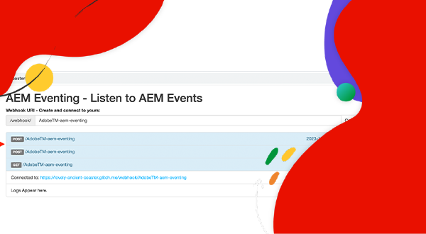

# AEM 事件机制

了解 AEM 事件机制，它是什么，为何以及何时使用它，以及它的示例。

>[!VIDEO](https://video.tv.adobe.com/v/3426686?quality=12&learn=on)

## 它是什么

AEM 事件机制是一个云原生事件系统，其支持订阅 AEM 事件，以便在外部系统中进行处理。AEM 事件机制是 AEM 在特定操作发生时发送的状态更改通知。例如，这可能包括内容片段被创建、更新或删除时的事件。

上图展示了 AEM as a Cloud Service 如何生成事件，并将其发送至 Adobe I/O Events，后者进而会将这些事件呈现给事件订阅者。

概括起来主要有以下三个组成部分：

1. **活动提供者：** AEM as a Cloud Service。
1. **Adobe I/O Events：** 基于 Adobe 产品和技术，用于集成、扩展和构建应用程序和体验的开发人员平台。
1. **事件消费者：** 订阅 AEM 事件的客户所拥有的系统。例如，CRM（客户关系管理）、PIM（产品信息管理）、OMS（订单管理系统）或自定义应用程序。

### 它有什么不同

[Apache Sling 事件机制](https://sling.apache.org/documentation/bundles/apache-sling-eventing-and-job-handling.html)、OSGi 事件机制和 [JCR 观察](https://jackrabbit.apache.org/oak/docs/features/observation.html)都提供了订阅和处理事件的机制。然而，这些与本文档中讨论的 AEM 事件机制有所不同。

AEM 事件机制的主要特点包括：

- 事件消费者代码在 AEM 之外执行，并未与 AEM 运行在同一 JVM 中。
- AEM 产品代码负责定义事件，并将其发送至 Adobe I/O Events。
- 事件信息经过标准化处理，并以 JSON 格式发送。如需更多详情，请参阅 [cloudevents](https://cloudevents.io/)。
- 为了与 AEM 进行通信，事件消费者会使用 AEM as a Cloud Service API。

## 为何以及何时使用它

AEM 事件机制为系统架构和运营效率提供了众多优势。使用 AEM 事件机制的主要原因包括：

- **构建由事件驱动的架构**：有助于创建松散耦合的系统，这些系统能够独立扩展且具备故障恢复能力。
- **低代码和更低的运营成本**：避免了在 AEM中 进行定制，使得系统更易于维护和扩展，从而降低了运营费用。
- **简化 AEM 与外部系统之间的通信**：通过让 Adobe I/O Events 管理通信（例如确定应将哪些 AEM 事件传递到特定系统或服务）来消除点对点连接。
- **更高的事件持久性**：Adobe I/O Events 是一个高可用且可扩展的系统，旨在处理大量事件，并可靠地将它们传递给订阅者。
- **事件并行处理**：能够同时将事件传递给多个订阅者，从而实现跨多个系统的分布式事件处理。
- **无服务器应用程序开发**：支持将事件消费者代码部署为无服务器应用程序，从而进一步提升系统的灵活性和可扩展性。

### 限制

AEM 事件机制虽然功能强大，但也存在一些需要考虑的局限性：

- **仅限 AEM as a Cloud Service 可用**：目前，AEM Eventing 仅适用于 AEM as a Cloud Service。

- **可用的事件类型**：请在[此处](https://developer.adobe.com/experience-cloud/experience-manager-apis/guides/events/#available-event-types)查看当前可用事件类型的列表。

## 如何启用

请参阅[在 AEM 云服务环境中启用 AEM 事件](https://developer.adobe.com/experience-cloud/experience-manager-apis/guides/events/#enable-aem-events-on-your-aem-cloud-service-environment)，以了解后续步骤。

## 如何订阅

要订阅 AEM 事件，您无需在 AEM 中创作任何代码，而是需要配置一个 [Adobe Developer Console](https://developer.adobe.com/) 项目。Adobe Developer Console 是通往 Adobe API、SDK、Events、Runtime 以及 App Builder 的门户。

在这种情况下，Adobe Developer Console 中的&#x200B;_项目_&#x200B;使您能够订阅从 AEM as a Cloud Service 环境发出的事件，并配置向外部系统的事件传递。

有关更多信息，请参阅[如何在 Adobe Developer Console 中订阅 AEM 事件](https://developer.adobe.com/experience-cloud/experience-manager-apis/guides/events/#how-to-subscribe-to-aem-events-in-the-adobe-developer-console)。

## 如何使用

使用 AEM 事件主要有两种方法：一是&#x200B;_推送_&#x200B;方法，二是&#x200B;_拉取_&#x200B;方法。

- **推送方法**：在此方法中，当有事件可用时，Adobe I/O Events 会主动通知事件消费者。集成选项包括 Webhooks、Adobe I/O Runtime 和 Amazon EventBridge。
- **拉取方法**：在此，事件消费者主动向 Adobe I/O Events 发起轮询，以检查是否有新事件。此方法的主要集成选项是 Adobe Developer Journaling API。

如需更多信息，请参阅[通过 Adobe I/O Events 处理 AEM 事件](https://developer.adobe.com/experience-cloud/experience-manager-apis/guides/events/#aem-events-processing-via-adobe-io)。

## 示例

<table>
  <tr>
    <td>
        
        
<strong><a href="./examples/webhook.md">通过 Webhook 接收 AEM 事件</a></strong>

        

          使用 Adobe 提供的 Webhook 接收 AEM 事件并查看事件详细信息。
        

      </td>
      <td>
        
        
<strong><a href="./examples/journaling.md">加载 AEM 事件日志</a></strong>

        

          使用 Adobe 提供的 Web 应用程序从日志中加载 AEM 事件并查看事件详细信息。
        

      </td>
    </tr>
  <tr>
    <td>
        
        
<strong><a href="./examples/runtime-action.md">在 Adobe I/O Runtime 操作上接收 AEM 事件</a></strong>

        

          接收 AEM 事件并查看事件详细信息。
        

      </td>
      <td>
        
        
<strong><a href="./examples/event-processing-using-runtime-action.md">使用 Adobe I/O Runtime 操作处理 AEM 事件</a></strong>

        

          了解如何使用 Adobe I/O Runtime 操作处理接收到的 AEM 事件。事件处理包括 AEM 回调、事件数据持久化以及在 SPA 中显示这些数据。
        

      </td>
  </tr>
  <tr>
    <td>
        
        
<strong><a href="./examples/assets-pim-integration.md">用于 PIM 集成的 AEM Assets 事件</a></strong>

        

          了解如何集成 AEM Assets 和产品信息管理 (PIM) 系统以进行元数据更新。
        

      </td>
  </tr> 
</table>
