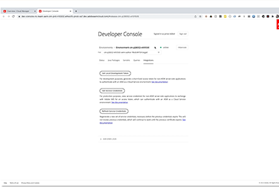

# Cloud 5第1季

## 简介

欢迎使用AEM Engineering的Cloud 5系列。 任何产品实施阶段的主要问题之一就是要有足够的代码示例和/或这些示例、工具或API的实时演示。 本系列的目标是在5分钟或更短的时间内提供关于AEMas a Cloud Service的有用信息。

访问 [建议框](https://forms.office.com/r/74P5Xz4UH0) 用于提交主题建议。

## 第1季

每一季的时间长度各异，并按照固定计划发布。 第1季的主题主要来自我们在与客户和合作伙伴的日常接触中遇到的过去请求。 请访问此页面以了解每周更新，或关注您选择的社交网络。

<table>
  <tr>
   <td>
      
      

         <a href="./cloud5-aem-cdn-part1.md"><strong>AEM CDN深入分析（第1部分）</strong></a>         
          <em>高级云架构师Darin Kuntze和James Talbot</em>
      

      

         
         第1部分介绍AEMas a Cloud Service的CDN以及如何在实施中使用。
      

     </td>   
     <td>
      
      

         <a href="./cloud5-aem-cdn-part2.md"><strong>AEM CDN深入分析（第2部分）</strong></a>
          <em>高级云架构师Darin Kuntze和James Talbot</em>
      

      

         
         第2部分是我们对AEMas a Cloud ServiceCDN的延续。 我们回答了一些关于您使用新CDN可以获得哪些功能的更常见问题和误解。
      

   </td>
     <td>
        
      

         <a href="./cloud5-aem-log-files.md"><strong>日志文件和日志记录</strong></a>
          <em>高级云架构师Darin Kuntze和James Talbot</em>
      

      

         
         本节快速介绍如何在AEMas a Cloud Service中访问日志，包括如何通过用户界面以及从API访问它们。
      

   </td> 
  </tr>
  <tr>
   <td>
        
      

        <a href="./cloud5-getting-login-token-integrations.md"><strong>与访问令牌集成</strong></a>        
          <em>高级云架构师Darin Kuntze和James Talbot</em>
      

      

         
         与登录令牌交互以在云服务环境中执行集成工作的快速概述和演示。
      

     </td>   
     <td>
        
      

        <a href="./cloud5-aem-dispatcher-cloud.md"><strong>云中的调度程序</strong></a>
          <em>高级云架构师Darin Kuntze和James Talbot</em>
      

      

         
        Darin和James讨论了AEM云中的Dispatcher，包括一些最佳实践以及与AMS/内部部署的差异。 
      

   </td>
     <td>
        
      

         <a href="./cloud5-aem-content-migration-part-1.md"><strong>迁移（第1部分）</strong></a>
          <em>Darin Kuntze和James Talbot，高级云架构师和Applesmith博士</em>
      

      

         
         我们迁移到cloud的提示和技巧的第一部分（共两部分）。 我们第一部分的主要重点是帮助您做好迁移准备的最佳实践和准备工作。
      

   </td> 
  </tr>
<tr>
   <td>
        
      

        <a href="./cloud5-aem-content-migration-part-2.md"><strong>迁移（第2部分）</strong></a>     
          <em>高级云架构师Darin Kuntze和James Talbot</em>
      

      

         
         我们迁移到cloud的提示和技巧中的第二部分（共两部分）。 第二部分主要介绍如何使用可用的迁移工具。
      

     </td>   
     <td>
        
      

         <a href="./cloud5-aem-dispatcher-validator.md"><strong>Dispatcher验证器</strong></a>
          <em>高级云架构师Darin Kuntze和James Talbot</em>
      

      

         
         作为前面迁移讨论的一个分支，我们将看一下Dispatcher验证器及其可以完成的一些任务。
      

   </td>
     <td>
        
      

         <a href="./cloud5-aem-search-and-indexing.md"><strong>索引和搜索提示</strong></a>
          <em>高级云架构师Darin Kuntze和James Talbot</em>
      

      

         
         对于像索引和搜索这样复杂的东西，团队会向您展示一些优化开发时间和在问题出现之前解决问题的简单方法。
      

   </td> 
  </tr>
    <tr>
        <td>
            
            

                <a href="./cloud5-adobe-app-builder.md"><strong>Adobe应用程序生成器</strong></a>         
                <em>高级云架构师兼Amol Anand的Darin Kuntze和James Talbot</em>
            

            
 
                来看看您可以使用AdobeApp Builder做的一些有趣的事情，并了解关于云中自定义项未来的一些新信息。
            

        </td>
        <td></td>
        <td></td>
    </tr>
</table>
