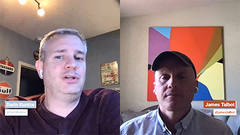

# Cloud 5第2季

>[!VIDEO](https://video.tv.adobe.com/v/346567?quality=12&learn=on)

## 简介

欢迎观看AEM Engineering第二季的Cloud 5系列。 任何产品实施阶段的主要问题之一就是要有足够的代码示例和/或这些示例、工具或API的实时演示。 本系列的目标是在5分钟或更短的时间内提供关于AEMas a Cloud Service的有用信息。

## 建议框

访问 [建议框](https://forms.office.com/r/74P5Xz4UH0) 用于提交主题建议。

## 第2季

每一季的时间长度各异，并按照固定计划发布。 第二季的主题主要来自我们在与客户和合作伙伴的日常接触中遇到的过去请求。 请访问此页面以了解每周更新，或关注您选择的社交网络。

<table>
    <tr>
        <td>
            
            

                <a href="season-2/cloud5-experience-v-content-fragments.md"><strong>片段</strong></a>        
                 <em>高级云架构师Darin Kuntze和James Talbot</em>
            

            

                 
                以丰富多彩的方式呈现体验与内容片段之间的差异。 剧透者：每个人都赢了。
            

        </td>   
         <td>
            
            

                <a href="season-2/cloud5-repo-modernizer.md"><strong>存储库现代化器</strong></a> 
                <em>高级云架构师Darin Kuntze和James Talbot</em>
            

            

                 
                快速了解如何使用存储库现代化器将现有项目包重构为与AEM as a Cloud Service兼容的离散包。
            

         </td>
         <td>
            
            

                  <a href="season-2/cloud5-admin-console.md"><strong>Admin Console</strong></a>
                <em>高级云架构师Darin Kuntze和James Talbot</em>
            

            

             
               Darin和James讨论了人们应该了解的一些有关Admin Console、配置和访问的常见问题。
            

         </td> 
  </tr>
  <tr>
         <td>
            
            

                  <a href="season-2/cloud5-sling-job-scheduler.md"><strong>Sling作业</strong></a>
                <em>高级云架构师Darin Kuntze和James Talbot</em>
            

            

             
               Darin和James讨论了AEM as a cloud service中的任务安排和消耗情况。
            

         </td> 
         <td>
            
            

                  <a href="season-2/cloud5-repoinit.md"><strong>Sling存储库初始值设定项</strong></a>
                <em>高级云架构师Darin Kuntze和James Talbot</em>
            

            

             
              学习一些技巧以解锁使用Sling存储库初始值设定项（即repoinit）的强大功能。
            

         </td>   
     <td>
            
      

         <a href="season-2/cloud5-fix-your-cache.md"><strong>修复您的……缓存</strong></a>
          <em>高级云架构师Damian Langsweirdt和James Talbot</em>
      

      

          
             浏览区域以优化缓存并加快站点在AEMas a Cloud Service上运行的速度。
      

   </td> 
  </tr>
<tr>
   <td>
           
      

            <a href="season-2/cloud5-fix-your-rewrites.md"><strong>修复您的……重写</strong></a>
          <em>高级云架构师Darin Kuntze和James Talbot</em>
      

      

         
         快速洞察将有助于加快您在AEMas a Cloud Service上的重写开发和优化的事项。
      

     </td>   
     <td>
            
      

            <a href="season-2/cloud5-mocm-experience-audit.md"><strong>Cloud Manager的秘密……体验审核</strong></a>
          <em>高级云架构师Darin Kuntze的帮助</em>
      

      

         
        探索Cloud Manager的基础知识及其体验审核功能。
      

   </td>
     <td>
            
      

            <a href="season-2/cloud5-mocm-unit-tests.md"><strong>Cloud Manager的秘密……单元测试</strong></a>
          <em>高级云架构师Darin Kuntze和Bryan Stopp</em>
      

      

         
        Darin和Bryan讨论了Cloud Manager如何将单元测试执行和代码覆盖率报告集成到其CI/CD管道中，以帮助鼓励和推广单元测试AEM代码的最佳实践。
      

   </td> 
  </tr>
    <tr>
        <td>
               
            

                <a href="season-2/cloud5-mocm-functional-tests.md"><strong>Cloud Manager的秘密……功能测试</strong> </a>        
                <em>高级云架构师Darin Kuntze和Bryan Stopp</em>
            

            
 
                Darin和Bryan讨论了AEMas a Cloud Service部署过程中内置的各种类型的功能测试，以确保代码的质量和可靠性。
            

        </td>
        <td></td>
        <td></td>
    </tr>
</table>
