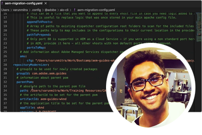
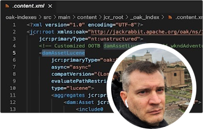
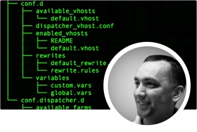

# AEMas a Cloud Service专家系列

与构建Adobe Experience Manager (AEM)的Adobe专家工程师和提供该产品的专业服务团队as a Cloud Service，了解该产品。 与Adobe的专家一起探索什么是AEMas a Cloud Service、它与AEM 6有何相同和不同，以及如何从AEM 6迁移至AEMas a Cloud Service。

  
 

## AEMas a Cloud Service入门

了解AEM as aCloud Service的基础知识，以及它与AEM 6和Adobe工程部门的高级云架构师有何不同。

<table>
  <tr>
   <td>
      
      

         <a href="../../migration/moving-to-aem-as-a-cloud-service/introduction.md"><strong>思维方式不同</strong></a>         
          <em>高级云架构师Darin Kuntze的帮助</em>
      

      

         
         了解AEMas a Cloud Service的架构，以及如何以不同的方式思考AEMas a Cloud Service的实施。
      

     </td>   
     <td>
      
      

         <a href="../../migration/moving-to-aem-as-a-cloud-service/onboarding.md"><strong>AEMas a Cloud Service入门</strong></a>
          <em>与高级云架构师Damian Langsweirdt一起</em>
      

      

         
         了解如何上手使用AEMas a Cloud Service，从合同阶段开始使用Cloud Manager设置自助服务环境。
      

   </td>     
   </td>   
     <td>
      
      

         <a href="../../migration/moving-to-aem-as-a-cloud-service/cloud-manager.md"><strong>Cloud Manager for AEMas a Cloud Service</strong></a>
          <em>与高级云架构师Bryan Stopp合作</em>
      

      

         
         了解Cloud Manager for AEMas a Cloud Service，以及它与Cloud Manager for AEM onAdobe管理服务(AMS)的区别。
      

   </td> 
  </tr>
</table>

## 迁移到AEMas a Cloud Service？

是否计划从AEM 6迁移到AEMas a Cloud Service？ 了解Adobe迁移到AEMas a Cloud Service的方法以及使迁移顺利进行的各种工具和功能。

<table>
  <tr>
   <td>
      
      

         <a href="../../migration/moving-to-aem-as-a-cloud-service/bpa-and-cam.md" target="_aem-experts-series-video"><strong>迁移方法</strong></a>
          <em>与Adobe咨询服务技术架构师Roger Blanton一起</em>
      

      

         
        了解使用AEM Best Practice Analyzer (BPA)和Cloud Acceleration Manager (CAM)从AEM 6迁移到AEMas a Cloud Service的最佳实践迁移方法。
      

   </td>   
     <td>
      
      

         <a href="../../migration/moving-to-aem-as-a-cloud-service/aem-modernization-tools.md" target="_aem-experts-series-video"><strong>实现内容现代化</strong></a>
          <em>与高级云架构师Bryan Stopp合作</em>
      

      

         
         了解如何自动使您的AEM内容符合现代化要求以利用最新的AEMas a Cloud Service功能。
      

   </td>     
   </td>   
     <td>
      
      

         <a href="../../migration/moving-to-aem-as-a-cloud-service/repository-modernization.md" target="_aem-experts-series-video"><strong>实现您的AEM Maven项目的现代化</strong></a>
          <em>云架构师Varun Mitra</em>
      

      

         
         了解如何自动使自定义AEM应用程序的Maven项目结构和组织现代化以便AEMas a Cloud Service兼容并符合Adobe的最新最佳实践。
      

   </td> 
  </tr>
  <tr>
   <td>
      
      

         <a href="../../migration/moving-to-aem-as-a-cloud-service/search-and-indexing.md" target="_aem-experts-series-video"><strong>实现Oak索引的现代化</strong></a>
          <em>高级云架构师Darin Kuntze的帮助</em>
      

      

         
        了解如何将AEM 6 Oak索引定义自动转换为AEMas a Cloud Service兼容的定义，以及如何在未来维护AEMas a Cloud Service的Oak索引。
      

   </td>   
     <td>
      
      

         <a href="../../migration/moving-to-aem-as-a-cloud-service/dispatcher.md" target="_aem-experts-series-video"><strong>实现调度程序配置的现代化</strong></a>
          <em>与高级云架构师Bryan Stopp合作</em>
      

      

         
         了解AEM Dispatcher for AEMas a Cloud Service，并专注于Dispatcher for AEM 6的重要更改、 Dispatcher转换工具以及如何使用Dispatcher Tools SDK。
      

   </td>     
   </td>   
     <td>
      
      

         <a href="../../migration/moving-to-aem-as-a-cloud-service/content-migration/content-transfer-tool.md" target="_aem-experts-series-video"><strong>将您的内容传输到AEMas a Cloud Service</strong></a>
          <em>与高级云架构师Kiran Murugulla一起</em>
      

      

         
         了解内容传输工具如何帮助您将内容从AEM 6.3+as a Cloud Service迁移到AEM。
      

   </td> 
  </tr>  
</table>

## AEM as aCloud Service功能

向Adobe的专家了解AEMas a Cloud Service的独特功能。

<table>
  <tr>
   <td>
      
      

         <a href="../../migration/moving-to-aem-as-a-cloud-service/asset-compute-microservices.md" target="_aem-experts-series-video"><strong>asset compute微服务</strong></a>
          <em>首席云架构师，Amol Anand</em>
      

      

         
        了解AEM Assets的Asset compute微服务，它们如何取代AEM 6资源处理，以及如何扩展它们以生成自定义资源演绎版。
      

   </td>   
   <td>
      
      

         <a href="../../migration/moving-to-aem-as-a-cloud-service/content-migration/bulk-import-service.md" target="_aem-experts-series-video"><strong>批量导入内容</strong></a>
          <em>与高级云架构师Kiran Murugulla一起</em>
      

      

         
        了解如何使用批量导入服务和AEM包管理器安全而高效地将内容批量导入AEMas a Cloud Service。
      

   </td> 
    <td></td>
  </tr>
</table>

## 需要AEM as aCloud Service方面的帮助？

从专家那里了解如何对AEMas a Cloud Service和AEM SDK进行调试和故障排除！

<table>
  <tr>
   <td>
      
      

         <a href="../../migration/moving-to-aem-as-a-cloud-service/troubleshooting.md" 
         target="_aem-experts-series-video"><strong>AEMas a Cloud Service故障诊断</strong></a>
          <em>云架构师Kunwar Saluja</em>
      

      

         
        了解如何对AEMas a Cloud Service的各个方面进行故障诊断，从调试AEM SDK和AEMas a Cloud Service到Cloud Manager构建和部署失败。
      

   </td>   
    <td></td>
    <td></td>
  </tr>
</table>
