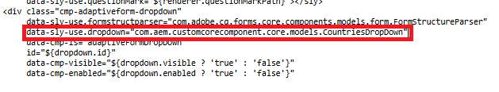

# 为国家/地区组件创建结构

登录到AEM Forms实例，然后按照以下步骤基于现成的下拉组件创建新组件：

1. 导航到CRXDE Lite中的“/apps/&lt;yourproject>/components/adaptiveForm/dropdown”。
2. 复制下拉组件并将其粘贴到同一目录级别。
3. 将复制的组件重命名为国家/地区。
4. 将cq：template节点的jcr：title属性更新为“国家/地区”。
5. 保存更改。

您现在有一个名为国家/地区的新组件，它是现成下拉组件的精确副本。 这是进一步自定义的基础。

## 创建HTL文件

要为国家/地区组件创建HTL文件，请执行以下操作：

1. 导航到crx存储库中的国家/地区文件夹
2. 创建一个名为countries.html的新文件。
3. 打开crx存储库中的/apps/core/fd/components/form/dropdown/v1/dropdown/dropdown.html文件并复制其内容。
4. 将复制的内容粘贴到countries.html中。
5. 更改代码以使用新的sling模型，如屏幕快照中所示
6. 保存更改。

最后，将您的项目与这些更新同步，以确保CRX存储库中的更改反映在AEM项目中。

## 后续步骤

[创建cq-dialog](./dialog.md)
