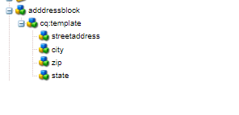

# 创建地址组件

登录到AEM Forms的本地云就绪实例的CRXDE。

复制 ``/apps/bankingapplication/components/adaptiveForm/button`` 节点，并将其重命名为addressblock。 选择地址块节点并设置其属性，如下所示。

>[!NOTE]
>
> ``bankingapplication`` 是创建Maven项目时提供的appId。 您的环境中此appId可能不同。 您可以制作任何组件的副本，而我刚好制作了一个按钮组件的副本

## cq-template节点属性

选择 ``cq-template`` 下的节点 ``addressblock`` 节点并设置其属性，如下所示。 请注意，fieldType设置为panel

## 在cq-template下添加节点

添加以下类型节点 ``nt:unstructured`` 下 ``cq-template``

* streetaddress
* 城市
* zip
* 州/省

这些节点表示地址块组件的字段。 streetaddress、city和zip字段将是文本输入字段，state字段将是下拉字段。

## 设置streetaddress节点的属性

>[!NOTE]
>
> 此 **_银行应用程序_** 在路径中引用maven项目的appId。 您的环境中可能存在差异

选择 ``streetaddress`` 节点并设置其属性，如下所示。

## 设置城市节点的属性

选择 ``city`` 节点并设置其属性，如下所示。

## 设置zip节点的属性

选择 ``zip`` 节点并设置其属性，如下所示。

## 设置状态节点的属性

选择 ``state`` 节点并设置其属性，如下所示。 注意fieldType的状态类型 — 它设置为下拉列表

最终的地址块组件将如下所示

## 后续步骤

[部署项目](./deploy-your-project.md)

