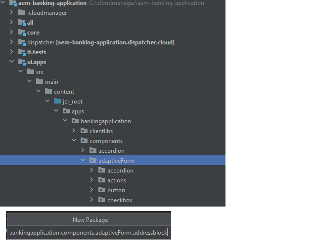

# 部署项目

在开始将项目部署到AEM Forms as a Cloud Service之前，建议将该项目部署到AEM Forms的本地云就绪实例。

## 将更改与您的AEM项目同步

启动IntelliJ并导航到``ui.apps``文件夹下的adaptiveForm文件夹，如下所示

右键单击``adaptiveForm``节点并选择“新建” | 包
请确保将名称**addressblock**&#x200B;添加到包中

右键单击新创建的包``addressblock``并选择``repo | Get Command``，如下所示

此操作应该将项目与本地云就绪的AEM Forms实例同步。 您可以验证.content.xml文件以确认属性

## 将项目部署到本地实例

启动新的命令提示符窗口，导航到项目的根文件夹，然后使用下面显示的命令构建项目

成功部署项目后，
地址组件现在可以在自适应表单中使用

## 将项目部署到云环境

如果本地开发环境一切正常，则下一步是使用Cloud Manager部署到[云实例。](https://experienceleague.adobe.com/en/docs/experience-manager-learn/cloud-service/forms/developing-for-cloud-service/push-project-to-cloud-manager-git)
