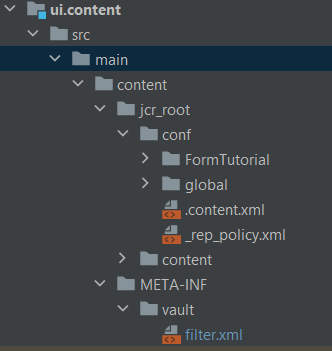

# 在您的项目中包含云服务配置

创建一个名为“FormTutorial”的配置容器来存放云服务配置通过提供Azure存储帐户详细信息和Azure访问密钥，在“FormTutorial”容器中为Azure存储创建一个名为“FormsCSAndAzureBlob”的云服务配置。

在IntelliJ中打开您的AEM项目。 确保添加文件夹FormTutorial，如ui.content项目中所示


确保在ui.content项目的filter.xml中添加以下条目

```xml
<filter root="/conf/FormTutorial" mode="replace"/>
```



## 在您的项目中包含表单数据模型

基于您在上一步中创建的云服务配置创建表单数据模型。 要在项目中包含表单数据模型，请在intelliJ的AEM项目中创建相应的文件夹结构。 例如，我的表单数据模型位于名为“注册”的文件夹中


在ui.content项目的filter.xml中包含相应的条目

```xml
<filter root="/content/dam/formsanddocuments-fdm/registrations" mode="replace"/>
```


>[!NOTE]
>
>现在，当您使用Cloud Manager构建和部署项目时，必须在云服务配置中重新输入Azure访问密钥。 为避免重新输入访问键，建议使用环境变量创建上下文感知配置，如中所述 [下一篇文章](./context-aware-fdm.md)

## 后续步骤

[创建上下文感知配置](./context-aware-fdm.md)
