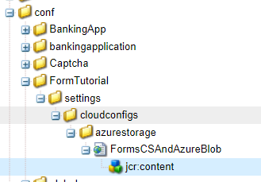

# 上下文感知云配置

在本地环境中创建云配置并成功测试时，您会希望在上游环境中使用相同的云配置，但无需更改端点、密钥/密码和用户名。 为了实现此用例，Cloud Service上的AEM Forms引入了定义上下文感知云配置的功能。
例如，Azure存储帐户云配置可以在开发、暂存和生产环境中通过为使用不同的连接字符串和键重复使用。

创建上下文感知云配置时需要执行以下步骤

## 创建环境变量

可以通过Cloud Manager配置和管理标准环境变量。 它们提供给运行时环境，并可用于OSGi配置。 环境变量可以是特定于环境的值，也可以是基于所更改的内容的环境密钥。

[环境变量](https://experienceleague.adobe.com/docs/experience-manager-cloud-service/content/implementing/using-cloud-manager/environment-variables.html?lang=en)

以下屏幕截图显示了定义的azure_key和azure_connection_string环境变量


然后，可以在配置文件中指定这些环境变量以在相应的环境中使用。例如，如果您希望所有创作实例都使用这些环境变量，您将按照下面指定的方式在config.author文件夹中定义配置文件

## 创建配置文件

在IntelliJ中打开您的项目。 导航到config.author并创建一个名为

```java
org.apache.sling.caconfig.impl.override.OsgiConfigurationOverrideProvider-integrationTest.cfg.json
```


将以下文本复制到在上一步中创建的文件中。 此文件中的代码正在使用环境变量覆盖accountName和accountKey属性的值 **azure_connection_string** 和 **azure_key**.

```json
{
  "enabled":true,
  "description":"dermisITOverrideConfig",
  "overrides":[
   "cloudconfigs/azurestorage/FormsCSAndAzureBlob/accountName=\"$[env:azure_connection_string]\"",
   "cloudconfigs/azurestorage/FormsCSAndAzureBlob/accountKey=\"$[secret:azure_key]\""

  ]
}
```

>[!NOTE]
>
>此配置将适用于云服务实例中的所有创作环境。 要将配置应用于发布环境，您必须将相同的配置文件放置在您intelliJ项目的config.publish文件夹中
>[!NOTE]
> 请确保正在覆盖的属性是云配置的有效属性。 导航到云配置以查找要覆盖的资产，如下所示。



对于基于REST的云配置，通常需要为serviceEndPoint、userName和密码属性创建环境变量。