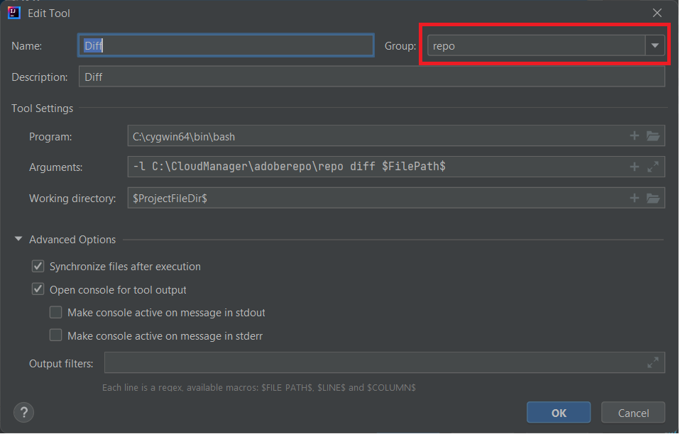

# 安装Cygwin

Cygwin是一种与POSIX兼容的编程和运行时环境，在Microsoft Windows上以本机方式运行。
安装[Cygwin](https://www.cygwin.com/)。 我已在C:\cygwin64文件夹中安装
>[!NOTE]
> 确保在cygwin安装中安装zip、unzip、curl和rsync包

在c：\cloudmanager下创建名为adoberepo的文件夹。

[安装repo工具](https://github.com/Adobe-Marketing-Cloud/tools/tree/master/repo)安装repo工具只是复制repo文件并将其放在c：\cloudmanger\adoberepo文件夹中。

将以下内容添加到路径环境变量C:\cygwin64\bin；C:\CloudManager\adoberepo；

## 设置外部工具

* 启动IntelliJ
* 按Ctrl+Alt+S键以启动设置窗口。
* 选择工具 — >外部工具，然后单击+符号并输入以下内容，如屏幕快照中所示。
  
* 确保在组下拉字段中键入“repo”来创建名为repo的组，并且您创建的所有命令都属于&#x200B;**repo**&#x200B;组

**Put命令**
**计划**： C:\cygwin64\bin\bash
**参数**： -l C:\CloudManager\adoberepo\repo put -f \$FilePath\$
**工作目录**： \$ProjectFileDir\$

**获取命令**
**计划**： C:\cygwin64\bin\bash
**参数**： -l C:\CloudManager\adoberepo\repo get -f \$FilePath\$
**工作目录**： \$ProjectFileDir\$

**状态命令**
**计划**： C:\cygwin64\bin\bash
**参数**： -l C:\CloudManager\adoberepo\repo st -f \$FilePath\$
**工作目录**： \$ProjectFileDir\$

**比较命令**
**计划**： C:\cygwin64\bin\bash
**参数**： -l C:\CloudManager\adoberepo\repo diff -f $FilePath$
**工作目录**： \$ProjectFileDir\$

从[repo.zip](assets/repo.zip)中提取.repo文件并将其放置到AEM项目的根文件夹中。 (C:\CloudManager\aem-banking-application)。 打开.repo文件，并确保服务器和凭据设置与您的环境相匹配。
打开.gitignore文件并向文件底部添加以下内容并保存更改
\#存储库
.repo

选择aem-banking-application项目中的任何项目（如ui.content），然后右键单击，此时您应会看到“repo”选项，而在“repo”选项下方，您会看到我们之前添加的4个命令。

## 设置AEM创作实例{#set-up-aem-author-instance}

可以执行以下步骤，在本地系统上快速设置云就绪实例。
* [下载最新的AEM SDK](https://experience.adobe.com/#/downloads/content/software-distribution/en/aemcloud.html)

* [下载最新的AEM Forms加载项](https://experience.adobe.com/#/downloads/content/software-distribution/en/aemcloud.html)

* 创建以下文件夹结构
c：\aemformscs\aem-sdk\author

* 从AEM SDK zip文件中提取aem-sdk-quickstart-xxxxxxx.jar文件并将其放置在c：\aemformscs\aem-sdk\author文件夹中。将jar文件重命名为aem-author-p4502.jar

* 打开命令提示符并导航到c：\aemformscs\aem-sdk\author
输入以下命令： java -jar aem-author-p4502.jar -gui。 这将开始安装AEM。
* 使用管理员/管理员凭据登录
* 停止AEM实例
* 创建以下文件夹结构。C:\aemformscs\aem-sdk\author\crx-quickstart\install
* 将aem-forms-addon-xxxxxx.far复制到安装文件夹中
* 打开命令提示符并导航到c：\aemformscs\aem-sdk\author
输入以下命令： java -jar aem-author-p4502.jar -gui。 这将在您的AEM实例中部署表单加载项包。

## 后续步骤

[将AEM表单和模板与AEM项目同步](./deploy-your-first-form.md)
