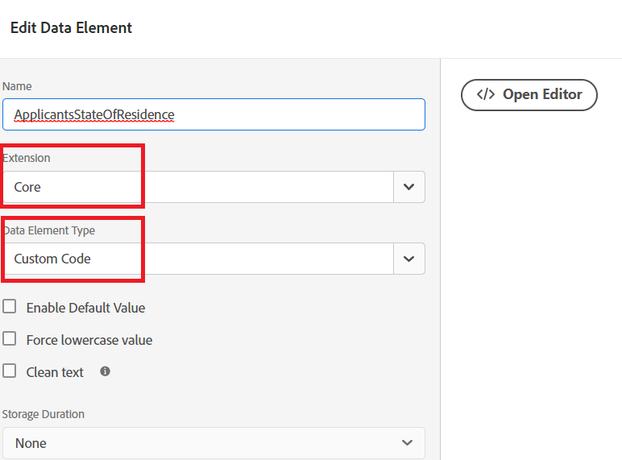

# 创建适当的数据元素

在“标记”属性中，我们添加了两个新的数据元素（ReplicationsStateOfResidence和validationError）。


## ApplicentStateOfResidence

的 **ApplicentStateOfResidence** 通过选择 **核心** 在扩展下拉菜单和 **自定义代码** 数据元素类型的URL，如下面的屏幕快照所示


以下自定义代码用于从 **_state_** 自适应表单字段。

```javascript
// use the GuideBridge API to access adaptive form elements
//The state field's SOM expression is used to access the state field
var ApplicantsStateOfResidence = guideBridge.resolveNode("guide[0].guide1[0].guideRootPanel[0].state[0]").value;
_satellite.logger.log(" Returning  Applicants State Of Residence is "+ApplicantsStateOfResidence);
return ApplicantsStateOfResidence;
```

## validationError

的 **验证错误** 通过选择 **核心** 在扩展下拉菜单和 **自定义代码** 数据元素类型的URL，如下面的屏幕快照所示


编写了以下自定义代码以设置validationError数据元素值。

```javascript
var validationError = "";
// Using GuideBridge API to access adaptive forms fields using the fields SOM expression
var tel = guideBridge.resolveNode("guide[0].guide1[0].guideRootPanel[0].telephone[0]");
var email = guideBridge.resolveNode("guide[0].guide1[0].guideRootPanel[0].email[0]");
_satellite.logger.log("Got tel in Tags custom script "+tel.isValid)
_satellite.logger.log("Got email in Tags custom script "+email.isValid)
if(tel.isValid == false)
{  
  validationError = "error: telephone number";
  _satellite.logger.log("Validation error is "+ validationError);
}

if(email.isValid == false)
{  
  validationError = "error: invalid email";
  _satellite.logger.log("Validation error is "+ validationError);
}

return validationError;
```
