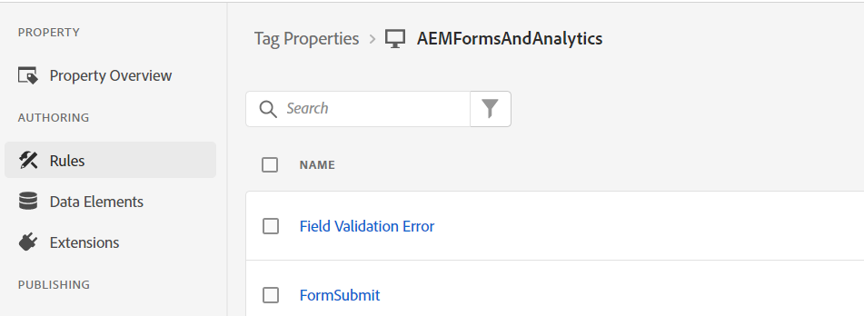

# 定义规则

在Tags属性中，我们创建了2个新的[规则](https://experienceleague.adobe.com/docs/platform-learn/implement-in-websites/configure-tags/add-data-elements-rules.html)（**字段验证错误和FormSubmit**）。

## 字段验证错误

每次在自适应表单字段中存在验证错误时，都会触发&#x200B;**字段验证错误**&#x200B;规则。 例如，在我们的表单中，如果电话号码或电子邮件不是预期格式，则会显示验证错误消息。

字段验证错误规则是通过将事件设置为&#x200B;_&#x200B;**Adobe Experience Manager Forms-Error**&#x200B;_&#x200B;配置的，如屏幕快照中所示

Adobe Analytics — 设置变量的配置如下

## 表单提交规则

每次成功提交自适应表单时都会触发表单提交规则。

表单提交规则是使用&#x200B;_&#x200B;**Adobe Experience Manager Forms — 提交**&#x200B;_&#x200B;事件配置的

在表单提交规则中，数据元素&#x200B;_&#x200B;**ApplicationsStateOfResidence**&#x200B;_&#x200B;的值映射到prop5，数据元素FormTitle的值映射到prop8。

Adobe Analytics - Set变量的配置如下。

当您准备好测试标记代码时，请[使用发布流发布对标记所做的更改](https://experienceleague.adobe.com/docs/experience-platform/tags/publish/publishing-flow.html)。

## 后续步骤

[测试解决方案](./test.md)