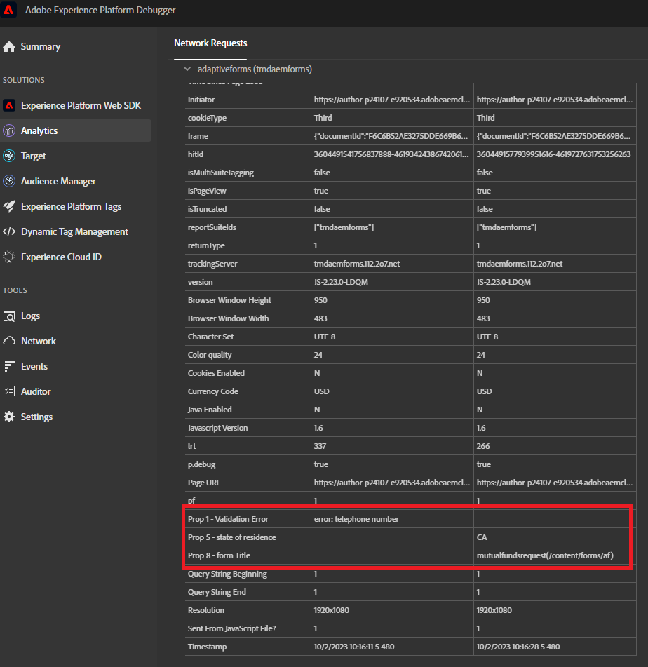

# 测试您的解决方案

使用多种表单值组合预览并提交表单。 请在Adobe Analytics报表中等待几到30分钟以查看您的数据。 设置为prop的数据比设置为eVar的数据更快地显示在报表中。

## 报表包

在Adobe Analytics中捕获的表单数据以圆环格式显示

**各国提交的材料**


字段验证错误


## 调试

确保自适应表单使用的配置容器与包含AdobeLaunch配置的容器相同。

要确认表单向Adobe Analytics发送数据，请执行以下操作

* 在浏览器中打开开发人员工具。
* 在控制台面板的以下文本中输入。

```javascript
_satellite.setDebug(true)
```

与表单交互，同时保持控制台窗口打开。 您应该看到类似这样的内容


## 使用Adobe Experience Platform Debugger

添加 [AEP调试器扩展](https://experienceleague.adobe.com/docs/experience-platform/debugger/home.html) ，则需要登录)以获取更多调试信息



## 恭喜

您已成功将AEM Formsas a Cloud Service与Adobe Analytics集成以报告表单数据字段。