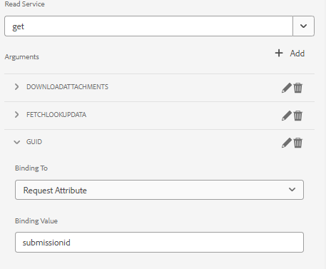

# 使用共享点列表数据预填充自适应表单

在AEM Form的早期版本(6.5)中，必须写入自定义代码以使用请求属性预填充表单数据模型支持的自适应表单。 在AEM Forms as a Cloud Service中，不再需要编写自定义代码。

本文介绍了使用表单数据模型预填充服务使用从SharePoint列表中获取的数据预填充/预填充自适应表单所需的步骤。

本文假定您拥有 [已成功配置自适应表单以将数据提交到SharePoint列表。](https://experienceleague.adobe.com/docs/experience-manager-cloud-service/content/forms/adaptive-forms-authoring/authoring-adaptive-forms-core-components/create-an-adaptive-form-on-forms-cs/configure-submit-actions-core-components.html?lang=en#connect-af-sharepoint-list)

以下是SharePoint列表中的数据


要使用与特定guid关联的数据预填充自适应表单，需要执行以下步骤

## 配置get服务

* 使用guid属性为表单数据模型的顶级对象创建get服务
  

在此屏幕快照中，guid列通过名为的请求属性进行绑定 `submissionid`.

完全配置的get服务如下所示



## 配置自适应表单以使用表单数据模型预填充服务

* 打开基于共享点列表表单数据模型的自适应表单。 关联表单数据模型预填充服务
  

## 测试表单

通过包含预览表单 `submissionid` 在URL中，如下所示

```html
http://localhost:4502/content/dam/formsanddocuments/contactusform/jcr:content?wcmmode=disabled&submissionid=57e12249-751a-4a38-a81f-0a4422b24412
```
