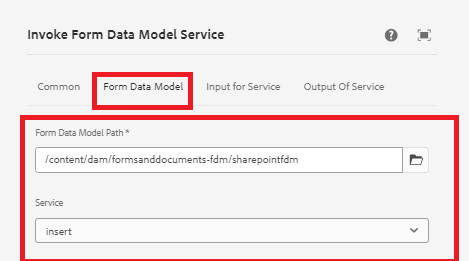

# 使用调用FDM工作流步骤将数据插入SharePoint列表


本文介绍了在AEM Workflow中使用调用FDM步骤将数据插入SharePoint列表所需的步骤。

本文假设您已[成功配置自适应表单以将数据提交到SharePoint列表。](https://experienceleague.adobe.com/docs/experience-manager-cloud-service/content/forms/adaptive-forms-authoring/authoring-adaptive-forms-core-components/create-an-adaptive-form-on-forms-cs/configure-submit-actions-core-components.html?lang=en#connect-af-sharepoint-list)


## 基于SharePoint列表数据源创建表单数据模型

* 基于SharePoint列表数据源创建新的表单数据模型。
* 添加相应的模型和表单数据模型的get服务。
* 配置插入服务以插入顶级模型对象。
* 测试插入服务。


## 创建工作流

* 通过调用FDM步骤创建简单的工作流。
* 配置调用FDM步骤，以使用在上一步中创建的表单数据模型。
* 

## 基于核心组件的自适应表单

提交的数据采用以下格式。 我们需要在调用表单数据模型服务工作流步骤中使用点表示法提取ContactUS对象，如屏幕快照中所示

```json
{
  "ContactUS": {
    "Title": "Mr",
    "Products": "Photoshop",
    "HighNetWorth": "1",
    "SubmitterName": "John Does"
  }
}
```


* 


## 基于基础组件的自适应表单

提交的数据采用以下格式。 在调用表单数据模型服务工作流步骤中使用点表示法提取ContactUS JSON对象

```json
{
    "afData": {
        "afUnboundData": {
            "data": {}
        },
        "afBoundData": {
            "data": {
                "ContactUS": {
                    "Title": "Lord",
                    "HighNetWorth": "true",
                    "SubmitterName": "John Doe",
                    "Products": "Forms"
                }
            }
        },
        "afSubmissionInfo": {
            "lastFocusItem": "guide[0].guide1[0].guideRootPanel[0].afJsonSchemaRoot[0]",
            "stateOverrides": {},
            "signers": {},
            "afPath": "/content/dam/formsanddocuments/foundationform",
            "afSubmissionTime": "20240517100126"
        }
    }
}
```


## 配置自适应表单以触发AEM Workflow

* 使用上一步骤中创建的表单数据模型创建自适应表单。
* 将数据源中的一些字段拖放到表单上。
* 配置表单的提交操作，如下所示
* 


## 测试表单

预览在上一步中创建的表单。 填写表单并提交。 表单中的数据应插入SharePoint列表中。
