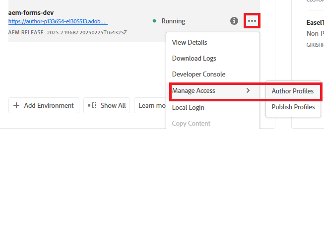

# 在AEM Forms as a Cloud Service上配置基于OpenAPI的AEM Forms通信API

## 先决条件

* AEM Forms as a Cloud Service的最新实例。
* 所有必需的[产品配置文件均已添加到环境中。](https://experienceleague.adobe.com/zh-hans/docs/experience-manager-learn/cloud-service/aem-apis/invoke-openapi-based-aem-apis)

* 启用对产品配置文件的AEM API访问权限，如下所示
  
  

## 创建Adobe Developer Console项目

使用您的Adobe ID登录到[Adobe Developer Console](https://developer.adobe.com/console/)。
单击相应的图标以创建新项目

为项目提供有意义的名称，然后单击添加API图标

选择Experience Cloud

选择AEM Forms Communications API并单击“下一步”

确保选择了服务器到服务器身份验证，然后单击“下一步”

选择配置文件并单击保存配置的API按钮以保存您的设置

单击OAuth服务器到服务器

复制客户端ID、客户端密钥和范围

## 配置AEM实例以启用ADC项目通信

如果您已有AEM Forms项目，[请按照以下说明进行操作](https://experienceleague.adobe.com/zh-hans/docs/experience-manager-learn/cloud-service/aem-apis/invoke-openapi-based-aem-apis)，以启用Adobe Developer Console项目的OAuth服务器到服务器凭据ClientID与AEM实例通信

如果您没有AEM Forms项目，请按照本文档创建一个[AEM Forms项目。](https://experienceleague.adobe.com/zh-hans/docs/experience-manager-learn/cloud-service/forms/developing-for-cloud-service/getting-started)，然后启用Adobe Developer Console项目的OAuth服务器到服务器凭据ClientID以使用此文档与AEM实例[通信。](https://experienceleague.adobe.com/zh-hans/docs/experience-manager-learn/cloud-service/aem-apis/invoke-openapi-based-aem-apis)

## 后续步骤

[生成访问令牌](./generate-access-token.md)
