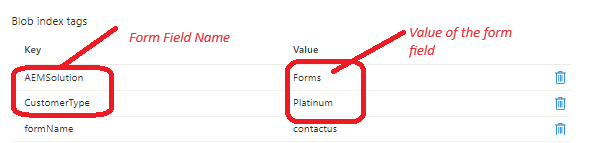

# 添加Blob索引标记

随着数据集的增大，在海量数据中查找特定对象可能会变得困难。 Blob索引标记通过使用键值索引标记属性提供数据管理和发现功能。 您可以在存储帐户中的单个容器或所有容器中对对象进行分类和查找。 例如，blob索引标记 _**CustomerType=白金**_，其中Platinum是CustomerType字段的值。


以下代码从提交的数据中创建blob索引数据标记字符串及其相应的值

```java
@Override
    public String getMetaDataTags(String submittedFormName,String formPath,Session session,String formData) {

        JsonObject jsonObject = JsonParser.parseString(formData).getAsJsonObject();
        List<String>metaDataTags = new ArrayList<String>();
        metaDataTags.add("formName="+submittedFormName);
        Map< String, String > map = new HashMap< String, String >();
        map.put("path", formPath);
        map.put("1_property", "Searchable");
        map.put("1_property.value","true");
        Query query = queryBuilder.createQuery(PredicateGroup.create(map),session);
        query.setStart(0);
        query.setHitsPerPage(20);
        SearchResult result = query.getResult();
        logger.debug("Get result hits " + result.getHits().size());
        for (Hit hit: result.getHits()) {
            try {
                    logger.debug(hit.getPath());
                    String jsonElementName = (String) hit.getProperties().get("name");
                    String fieldName = hit.getProperties().get("name").toString();
                    if(jsonObject.get(jsonElementName).isJsonArray())
                    {
                        
                        JsonArray arrayOfValues = jsonObject.get(jsonElementName).getAsJsonArray();
                        StringBuilder valuesString = new StringBuilder();
                        for(int j=0;j<arrayOfValues.size();j++)
                        {
                            valuesString.append(arrayOfValues.get(j).getAsString());
                            if(j < arrayOfValues.size() -1)
                            {
                                valuesString.append(" and ");
                            }
                        }

                        
                        metaDataTags.add(fieldName + "=" + valuesString.toString());

                    }
                    else
                    {
                        logger.debug("The searchable field name is " + fieldName + "the json element name is " + jsonElementName);
                        metaDataTags.add(fieldName + "=" + jsonObject.get(jsonElementName).getAsString());
                    }

            } catch (RepositoryException e) {
                throw new RuntimeException(e);
            }
        }
        return String.join("&",metaDataTags);
    }
```

## 后续步骤

[创建自定义提交处理程序](./create-custom-submit.md)


