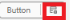

# 在组件的策略中定义样式

* 登录到本地云就绪的AEM实例，然后导航到“工具” | 常规 | 模板 | 您的项目名称。

* 在编辑模式下选择并打开&#x200B;**带核心组件的空白**&#x200B;模板。
* 单击按钮组件的策略图标以打开策略编辑器。

* 

定义策略，如下所示

我们定义了2个称为“营销”和“公司”的样式/变体。这些变体与相应的CSS类关联。**请确保CSS类名前后没有空格**。
保存更改。

| 样式 | CSS 类 |
|-----------|------------------------------------|
| 营销 | cmp-adaptiveform-button — 营销 |
| 企业 | cmp-adaptiveform-button—corporate |

这些CSS类将在组件的scss文件(_button.scss)中定义。

## 后续步骤

[定义CSS类](./create-variations.md)
