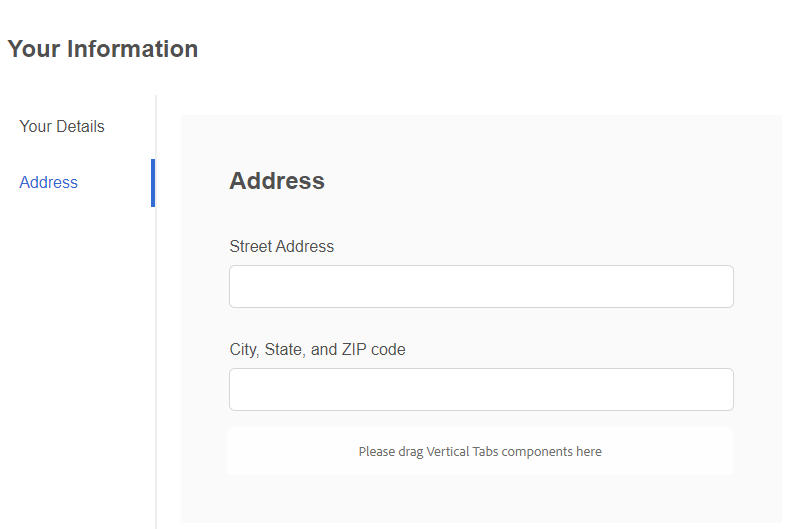

# 创建自适应表单

创建基于核心组件的自适应表单，并在表单上插入垂直选项卡组件。

## 配置垂直组件

单击垂直选项卡组件以打开配置属性表。 配置以下选项卡

1. 基本 — 为垂直选项卡组件提供有意义的名称和标题，如下所示
   
1. 项 — 使用项选项卡，可将项添加到垂直选项卡组件。 通常，您将添加一个面板作为项目，然后将表单元素添加到该面板。 默认情况下，垂直选项卡包含两个项目，您可以根据要求命名这些项目，如下所示
   

## 配置各个面板

1. 您的详细信息 — 选择&#x200B;**您的信息**节点下的项1并打开配置属性表。 提供有意义的名称和标题，如下所示
   

将以下字段添加到“您的详细信息”面板，如下所示

1. 地址 — 选择&#x200B;**您的信息**节点下的项2并打开配置属性表。 提供有意义的名称和标题，如下所示
   

将以下2个文本字段添加到“地址”面板，如下所示

