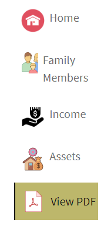

# 添加自定义图标

将自定义图标添加到选项卡可以通过以下几种方式改善用户体验和视觉吸引力：

* 增强的可用性：图标可以快速传达每个选项卡的用途，使用户更容易一眼就找到他们要找的内容。 图标等视觉提示可帮助用户更直观地导航。

* 可视层次结构和聚焦：图标可在选项卡之间创建更加明显的分离，从而改善可视层次结构。 这有助于突出重要选项卡，并有效指导用户的注意。
阅读本文后，您应该能够放置如下所示的图标



## 先决条件

要阅读本文，您需要熟悉Git、使用Cloud Manager创建和部署AEM项目、在AEM Cloud Manager中设置前端管道以及少量CSS。 如果您不熟悉上述主题，请按照[使用主题设置核心组件样式](https://experienceleague.adobe.com/en/docs/experience-manager-cloud-service/content/forms/adaptive-forms-authoring/authoring-adaptive-forms-core-components/create-an-adaptive-form-on-forms-cs/using-themes-in-core-components#rename-env-file-theme-folder)文章中的说明进行操作。

## 在主题中添加图标

在visual studio代码或您选择的任何其他编辑器中打开主题项目。
将您选择的图标添加到images文件夹。
标记为红色的图标是添加的新图标。


## 创建图标映射以存储图标

在_variable.scss文件中创建图标映射。 SCSS映射$icon-map是键值对的集合，其中每个键代表一个图标名称（如home、family等），每个值都是与该图标关联的图像文件的路径。


```css
$icon-map: (
    home: "./resources/images/home.png",
    family: "./resources/images/icons8-family-80.png",
    pdf: "./resources/images/pdf.png",
    income: "./resources/images/income.png",
    assets: "./resources/images/assets.png",
    cars: "./resources/images/cars.png"
);
```

## 添加Mixin

将以下代码添加到_mixin.scss

```css
@mixin add-icon-to-vertical-tab($image-url) {
  display: inline-flex;
  align-self: center;
  &::before {
    content: "";
    display:inline-block;
    background: url($image-url) left center / cover no-repeat;
    margin-right: 8px; /* Space between icon and text */
    height:40px;
    width:40px;
    vertical-align:middle;
    
  }
  
}
```

添加到垂直选项卡的add-icon-to-vertical-tab mixin可在垂直选项卡上的文本旁添加自定义图标。 它允许您轻松地在选项卡上添加图像作为图标，将其放置在文本旁边，并设置其样式以确保一致性和对齐方式。

Mixin的细分，以下是mixin的每个部分所执行的操作：

参数：

* $image-url：要在选项卡文本旁边显示的图标或图像的URL。 传递此参数可使mixin具有通用性，因为它允许根据需要将不同的图标添加到不同的选项卡中。

* 应用的样式：

   * display： inline-flex：这将使元素成为flex容器，水平对齐任何嵌套内容（如图标和文本）。
   * align-self： center：确保元素在其容器中垂直居中。
   * 伪元素(：：before)：
   * 内容：“”：初始化：：before伪元素，该元素用于将图标显示为背景图像。
   * display： inline-block：将伪元素设置为inline-block，使其行为类似于与文本内联放置的图标。
   * background： url($image-url) left center / cover no-repeat；：使用通过$image-url提供的URL添加背景图像。 图标与左侧对齐，并垂直居中。

## 更新_verticaltables.scss

出于文章的目的，我创建了一个新的css类(cmp-verticaltabs—marketing)来显示选项卡图标。 在此新类中，我们通过添加图标来扩展选项卡元素。 css类的完整列表如下

```css
.cmp-verticaltabs--marketing
{
  .cmp-verticaltabs
    {
      &__tab 
        {
          cursor:pointer;
            @each $name, $url in $icon-map {
            &[data-icon-name="#{$name}"]
              {
                  @include add-icon-to-vertical-tab($url);
              }
            }
        }
    }
}
```

## 修改verticaltabs组件

从```/apps/core/fd/components/form/verticaltabs/v1/verticaltabs/verticaltabs.html```复制verticaltabs.html文件并将其粘贴到项目的verticaltabs组件下。 将以下行```data-icon-name="${tab.name}"```添加到li角色下的复制文件，如下图所示

我们将使用选项卡名称的值设置一个名为data-icon-name的自定义数据属性。如果选项卡名称与图标映射中的图像名称匹配，则相应的图像将与选项卡关联。


## 测试代码

将更新的verticaltables组件部署到云实例。
使用前端管道部署更新的主题。
为垂直选项卡组件创建样式变体，如下所示

我们创建了一个名为Marketing的样式变量，该变量与css类_**cmp-verticaltables—marketing**_关联。
创建具有垂直选项卡组件的自适应表单。 将垂直选项卡组件与营销样式变量关联。
将几个选项卡添加到垂直选项卡并命名它们，以匹配图标映射中定义的图像，如home、family。


预览表单时，您应该会看到与选项卡关联的相应图标
