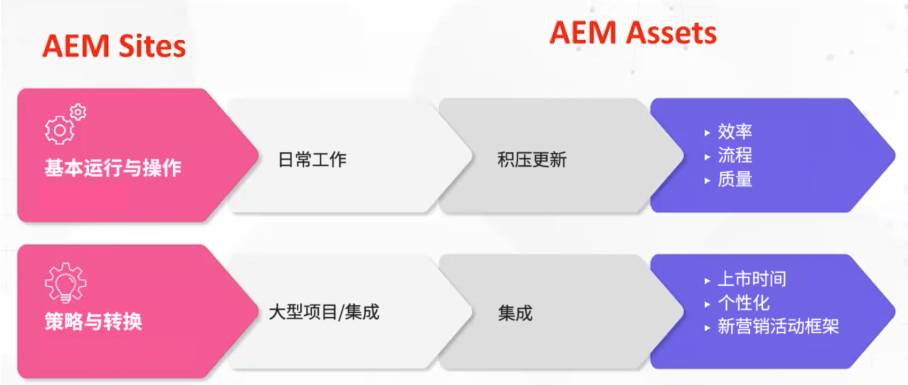

# Adobe Experience Manager (AEM) — 治理和人员配备模型与原型

作为客户体验的领导者，Adobe了解确保您拥有适当的人员和治理框架以提高运营效率对您来说是一项多么具有挑战性的任务。 利用Adobe经业界验证的治理和人员配备模型，您拥有必要的工具和知识来打造坚实的内容和资产管理基础。 在本篇文章中，我们将讨论如何操作Adobe Experience Manager (AEM)平台并从您的工作中获取最大价值。

## 创建卓越的操作框架

为了能够运行和操作AEM，请考虑以下元素：

* 执行战略里程碑 — 将有许多战略里程碑，（个性化、多渠道集成等） 除非您拥有合适的人员配备模型，否则无法执行此操作。
* 为数字转型奠定基础 — AEM通常用作组织现代化过程中的第一步。 通过创建基础，您可以充分利用AEM。
* 用户参与 — 建立团队以执行战术工作（更新工作流、权限、CSS等） 用户想要的东西和他们得到的东西之间的差距越大，他们就越会感到沮丧。 让用户持续投资于该系统、投资于该解决方案以及确保您具备正确的操作模式是非常重要的。

那么，正确的模式是什么？ 要创建的角色的正确矩阵是什么？

没有一个具体的答案，因为正如组织差别很大一样，AEM配置也可能差别很大，从而导致需要不同的支持角色。 每个垂直、每个行业、每个团队结构都需要不同的实施。 但可以通过建立原型来创建基线。

## 原型

原型是映射到特定属性的特定高级角色想法。 这进而可用于创建基础前提，帮助您了解您真正需要的模型。 请注意，原型不限于每个原型一个人，这一点很重要。 例如，DAM库管理员可能有一些技术经验。

### 可操作流

有两个操作流 [!DNL AEM Sites] 和 [!DNL AEM Assets]：

1. 基本运行和运行日常工作（元数据更新）

1. 战略和转型工作，如大型跨组织项目

### AEM Asset高级角色

**一般差距：** 此基线支持集中式和分散式模型。 如果您有一个分散模型，则可以抽象地使用AEM。 请注意，必须创造性地使用“产品责任人”角色，但您还需要具有产品责任人，该责任人拥有一种资产类型的不同样式，并且还需要具有另一个责任人来监督整个组织。

1. 基本运行和操作角色

   * 技术资源 — 具有AEM经验的人员了解权限并可以更新元数据架构
   * 版本管理器
   * 产品所有者 — 这是一个与解决方案一致的角色。 有些产品所有者可能会参与分析。
   * DAM库管理员 — 他可以帮助引导集成框架流程。 此创意角色可能与其他角色重叠。 （注意：这是一个在过去五年中人气暴增的角色。）
   * 创意

1. 战略和转型

   * 开发团队 — 当从事重大战略里程碑工作时，需要此团队。
   * Business Architect — 开发要求以帮助实现技术里程碑和战略计划；可通过另外一位产品所有者获得报酬
   * 技术架构师 — 具有企业级知识并在整个组织中长期驻扎的人员。 此角色用作DAM中心真实点。

**示例场景**

1. **运行和操作：**

以下是轻型（运动服装公司）和重型（化妆品公司）方案的角色示例：

1. 轻量级 — 运动服装公司角色：

   * 2个兼职开发人员 — 兼职，离岸
   * 1名产品负责人 — 全职，在岸
   * 1 DAM库管理员 — 全职，在岸
   * 1名技术架构师 — 兼职，在岸
   * 1发布经理 — 兼职，在岸

1. 重型 — 化妆品公司（多品牌）

   * 3名全职开发人员 — 全职，离岸
   * 4个产品所有者 — 3个特定品牌，1个主要供应商
   * 1 DAM库管理员 — 全职，在岸
   * 每个品牌的4个主要管理员SME
   * 1名技术架构师

### 高级 [!DNL AEM Sites] 角色

1. 基本运行和操作

   **一般差距：** CSS开发人员为组件创建新的外观。 Adobe高级业务顾问Joseph Van Buskirk建议“使用开塞组件和样式系统。 这是推动成本节约的角色。 已创建的体验中，80%应该使用之前创建的组件或核心组件完成。” 目标是使用CSS开发人员（或前端开发团队）以新样式重新调整核心组件或自定义组件的用途。

   角色示例：

   * CSS开发 — 通过用新样式重新调整组件的用途来创建体验工件。
   * 后端开发 — 创建新组件或扩展核心组件。 如果操作正确，则此角色不应包含多个人员，除非需要执行大型动画任务。
   * 版本管理 — 监督代码部署，并充当当前的Adobe客户团队。
   * 产品负责人 — 与BU协作以将“技术”和“战略”愿景结合起来；创建维护任务和增强功能，并作为解决方案的业务负责人。
   * 管理员作者 — 更新CSS外观，并为正在更新和应用内容的作者提供指导。 此角色适用于工作流配置，并创建指导文档以供内容作者应用。 注意：在6.5版中，Adobe建议使用可编辑的模板。
   * 内容作者 — 应用内容、分层所有权，并在出现与CSM相关的通信问题和顾虑时提供它们。

1. 战略和转型

   角色示例：

   * 开发团队 — 向技术架构师提供AEM知识并执行新的变革性里程碑。
   * 技术架构师 — 提供集成知识，与产品所有者合作来映射技术里程碑，并提供AEM的深厚技术知识。
   * 业务架构师 — 为用户故事创建任务，并帮助产品所有者管理技术和业务里程碑。

### 示例场景

以下是轻量级和繁重级客户端方案的角色示例：

1. 亮

   * 2 CSS开发人员 — 在岸
   * 1名产品负责人 — 全职，在岸
   * 1名后端开发人员 — 离岸
   * 1名技术架构师 — 在岸
   * 1发布经理 — 兼职，在岸

1. 繁重（以活动为中心）

   * 4 CSS开发人员 — 全职，在岸
   * 2名后端开发人员 — 全职，在岸
   * 1名技术架构师 — 在岸
   * 1个产品所有者
   * 2业务架构师 — 离岸

### 主要要点

**了解原型**  — 慢慢开始，了解并分析原型。 要有创造性和灵活性，同时要记住，没有一种正确的模式可循。

**了解您的路线图**  — 某些组织希望执行许多里程碑。 准备分配比您估计的技术资源更多的资源。

**利用内部资源**  — 差距可能会意外出现。 通过采购内部团队成员，而不是在组织外部搜索，您可以更快地填充这些内容。

有关管理和人员配备模型与原型的更深入讨论，请收听此一小时的小组讨论： [角色原型和创建操作框架 [!DNL AEM Assets] 和 [!DNL Sites]](https://adobecustomersuccess.adobeconnect.com/p8ml5nmy0758mp4/)

要了解有关战略和思想领导力的更多信息，请参阅 [客户成功](https://experienceleague.adobe.com/docs/customer-success/customer-success/overview.html) 集线器。
