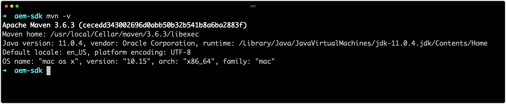

# 设置开发工具 {#set-up-development-tools}

>[!CONTEXTUALHELP]
>id="aemcloud_localdev_devtools"
>title="设置开发工具"
>abstract="Adobe Experience Manager (AEM) 开发需要在开发人员计算机上，安装和设置一组必不可少的开发工具。这些工具包括 Java、Maven、Adobe I/O CLI、开发 IDE 等。"
>additional-url="https://experienceleague.adobe.com/docs/experience-manager-cloud-service/implementing/developing/development-guidelines.html?lang=zh-Hans" text="开发准则"
>additional-url="https://experienceleague.adobe.com/docs/experience-manager-learn/cloud-service/developing/basics/aem-sdk.html?lang=zh-Hans" text="开发基础"

Adobe Experience Manager (AEM) 开发需要在开发人员计算机上，安装和设置一组必不可少的开发工具。这些工具支持AEM项目的开发和构建。

请注意，`~`用作用户目录的简写。 在Windows中，这相当于`%HOMEPATH%`。

## 安装Java

Experience Manager是一种Java应用程序，因此需要Java SDK来支持开发和AEM as a Cloud Service SDK。

1. [下载并安装最新版本的Java 11 SDK](https://experience.adobe.com/#/downloads/content/software-distribution/en/general.html?1_group.propertyvalues.property=.%2Fjcr%3Acontent%2Fmetadata%2Fdc%3AsoftwareType&amp;1_group.propertyvalues.operation=equals&amp;1_group.propertyvalues.0_values=software-type%3Atooling&amp;fulltext=Oracle%7E+JDK%7E+11%7E&amp;orderby=%40jcr%3Acontent%2Fjcr%3AlastModified&amp;orderby.sort=desc&amp;layout=list&amp;p=list&amp;p.offset=limit&amp;p.offset=0&amp;p.limit=14444)
1. 通过运行以下命令验证是否已安装OracleJava 11 SDK：

>[!BEGINTABS]

>[!TAB macOS]

```shell
$ java --version
```

>[!TAB Windows]

```shell
$ java -version
```

>[!TAB Linux]

```shell
$ java --version
```

>[!ENDTABS]


## 安装Homebrew

_使用Homebrew是可选的，但建议使用。_

Homebrew是适用于macOS、Windows和Linux的开源包管理器。 所有的支持工具都可以单独安装，Homebrew为安装和更新Experience Manager开发所需的各种开发工具提供了便捷的方式。

1. 打开终端
1. 通过运行以下命令检查是否已安装Homebrew： `brew --version`。
1. 如果未安装Homebrew，请安装Homebrew

>[!BEGINTABS]

>[!TAB macOS]

macOS](https://brew.sh/)上的[Homebrew需要[Xcode](https://apps.apple.com/us/app/xcode/id497799835)或[命令行工具](https://developer.apple.com/download/more/)，可通过命令安装：

```shell
$ xcode-select --install
```

>[!TAB Windows]

[在Windows 10](https://docs.brew.sh/Installation#linux-or-windows-10-subsystem-for-linux)上安装Homebrew

>[!TAB Linux]

在Linux上[安装Homebrew](https://docs.brew.sh/Installation#linux-or-windows-10-subsystem-for-linux)

>[!ENDTABS]

1. 通过运行以下命令验证是否已安装Homebrew： `brew --version`


如果您使用的是Homebrew，请按照以下部分中的&#x200B;__使用Homebrew安装__&#x200B;说明进行操作。 如果您&#x200B;__不是__&#x200B;使用Homebrew，请使用特定于操作系统的链接安装工具。

## 安装Git

[Git](https://git-scm.com/)是[AdobeCloud Manager](https://experienceleague.adobe.com/docs/experience-manager-cloud-manager/using/requirements/source-code-repository.html)使用的源代码管理系统，因此是开发所必需的。

>[!BEGINTABS]

>[!TAB 使用Homebrew安装Git]

1. 打开终端/命令提示符
1. 执行命令： `$ brew install git`
1. 使用命令`$ git --version`验证Git是否已安装

>[!TAB 下载并安装Git]

1. [下载并安装Git](https://git-scm.com/downloads)
1. 打开终端/命令提示符
1. 使用命令`$ git --version`验证Git是否已安装

>[!ENDTABS]


## 安装Node.js（和npm）{#node-js}

[Node.js](https://nodejs.org)是一个用于处理AEM项目&#x200B;__ui.frontend__&#x200B;子项目的前端资源的JavaScript运行时环境。 Node.js随[npm](https://www.npmjs.com/)分发，是实际的Node.js包管理器，用于管理JavaScript依赖项。

>[!BEGINTABS]

>[!TAB 使用Homebrew安装Node.js]

1. 打开终端/命令提示符
1. 执行命令： `$ brew install node`
1. 使用命令`$ node -v`验证是否已安装Node.js
1. 使用命令`$ npm -v`验证是否已安装npm

>[!TAB 下载并安装Node.js]

1. [下载并安装Node.js](https://nodejs.org/en/download/)
2. 打开终端/命令提示符
3. 使用命令`$ node -v`验证是否已安装Node.js
4. 使用命令`$ npm -v`验证是否已安装npm

>[!ENDTABS]


>[!TIP]
>
>基于[AEM Project Archetype](https://github.com/adobe/aem-project-archetype)的AEM项目在生成时安装隔离版本的Node.js。 最好使本地开发系统的版本与在AEM Maven项目的Reactor pom.xml中指定的Node.js和npm版本保持同步（或接近）。
>
>请参阅此示例[AEM Project Reactor pom.xml](https://github.com/adobe/aem-guides-wknd/blob/9ac94f3f40c978a53ec88fae79fbc17dd2db72f2/pom.xml#L117-L118)，了解在何处找到Node.js和npm内部版本的位置。

## 安装Maven

Apache Maven是一个开源Java命令行工具，用于构建从AEM项目Maven原型生成的AEM项目。 所有主要IDE （[IntelliJ IDEA](https://www.jetbrains.com/idea/)、[Visual Studio Code](https://code.visualstudio.com/)、[Eclipse](https://www.eclipse.org/)等） 集成了Maven支持。


>[!BEGINTABS]

>[!TAB 使用Homebrew安装Maven]

1. 打开终端/命令提示符
1. 执行命令： `$ brew install maven`
1. 使用命令`$ mvn -v`验证是否已安装Maven

>[!TAB 下载并安装Maven]

1. [下载Maven](https://maven.apache.org/download.cgi)
1. [安装Maven](https://maven.apache.org/install.html)
1. 打开终端/命令提示符
1. 使用命令`$ mvn -v`验证是否已安装Maven

>[!ENDTABS]



## 设置Adobe I/OCLI{#aio-cli}

[Adobe I/OCLI](https://github.com/adobe/aio-cli)或`aio`提供各种Adobe服务的命令行访问权限，包括[Cloud Manager](https://github.com/adobe/aio-cli-plugin-cloudmanager)和[Asset compute](https://github.com/adobe/aio-cli-plugin-asset-compute)。 Adobe I/OCLI在AEM as a Cloud Service的开发中起着不可或缺的作用，因为它使开发人员能够：

+ AEM as aCloud Service服务中的尾日志
+ 从CLI管理Cloud Manager管道
+ 部署到[AEM快速开发环境](https://experienceleague.adobe.com/docs/experience-manager-learn/cloud-service/developing/rde/overview.html)

### 安装Adobe I/OCLI

1. 确保已安装[Node.js](#node-js)，因为Adobe I/OCLI是npm模块
   + 运行`node --version`以确认
1. 执行`npm install -g @adobe/aio-cli`以全局安装`aio` npm模块

### 设置Adobe I/OCLI Cloud Manager插件{#aio-cloud-manager}

Adobe I/OCloud Manager插件允许aio CLI通过`aio cloudmanager`命令与AdobeCloud Manager交互。

1. 执行`aio plugins:install @adobe/aio-cli-plugin-cloudmanager`以安装[aio Cloud Manager插件](https://github.com/adobe/aio-cli-plugin-cloudmanager)。

#### 设置Adobe I/OCLI身份验证

为了使Adobe I/OCLI与Cloud Manager进行通信，必须在Adobe I/O控制台](https://github.com/adobe/aio-cli-plugin-cloudmanager)中创建[Cloud Manager集成，并且必须获取凭据才能成功进行身份验证。

1. 登录到[console.adobe.io](https://console.adobe.io)
1. 确保包含要连接到的Cloud Manager产品的组织在Adobe组织切换器中处于活动状态
1. 创建新项目或打开现有[Adobe I/O](https://www.adobe.io/apis/experienceplatform/console/docs.html#!AdobeDocs/adobeio-console/master/projects.md)
   + Adobe I/O控制台项目只是由集成、创建或使用以及现有项目组成的组织分组，具体取决于您希望如何管理您的集成。
   + 如果创建新项目，则在出现提示时选择“空项目”（与“从模板创建”）
   + Adobe I/O控制台程序是与Cloud Manager程序不同的概念
1. 创建新的Cloud Manager API集成
   + 选择已弃用的“服务帐户(JWT)”身份验证类型（目前CLI不支持OAuth）。
   + 创建或上传密钥。
   + 选择“开发人员 — Cloud Service”产品配置文件
1. 获取服务帐户(JWT)凭据需要填充Adobe I/OCLI的[config.json](https://github.com/adobe/aio-cli-plugin-cloudmanager#authentication)

   ```json
   //config.json 
   {
      "client_id": "Client ID from Service Account (JWT) credential",
      "client_secret": "Client Secret from Service Account (JWT) credential",
      "technical_account_id": "Technical Account ID from Service Account (JWT) credential",
      "ims_org_id": "Organization ID from Service Account (JWT) credential",
      "meta_scopes": [
        "ent_cloudmgr_sdk"
      ]
   }
   ```

1. 将`config.json`文件加载到Adobe I/OCLI
   + `$ aio config:set ims.contexts.aio-cli-plugin-cloudmanager ./path/to/config.json --file --json`
1. 将`private.key`文件加载到Adobe I/OCLI
   + `$ aio config:set ims.contexts.aio-cli-plugin-cloudmanager.private_key ./path/to/private.key --file`

通过Adobe I/OCLI开始[执行Cloud Manager的命令](https://github.com/adobe/aio-cli-plugin-cloudmanager#commands)。

### 设置AEM快速开发环境插件{#rde}

AEM快速开发环境插件允许aio CLI通过`aio aem:rde`命令与AEM as a Cloud Service [快速开发环境](https://experienceleague.adobe.com/docs/experience-manager-learn/cloud-service/developing/rde/overview.html)交互。

1. 执行`aio plugins:install @adobe/aio-cli-plugin-aem-rde`以安装[AEM快速开发环境插件](https://github.com/adobe/aio-cli-plugin-aem-rde)。

### 设置Adobe I/OCLIAsset compute插件{#aio-asset-compute}

Adobe I/OCloud Manager插件允许aio CLI通过`aio asset-compute`命令生成和运行Asset compute工作程序。

1. 执行`aio plugins:install @adobe/aio-cli-plugin-asset-compute`以安装[aioAsset compute插件](https://github.com/adobe/aio-cli-plugin-asset-compute)。

## 设置开发IDE

AEM开发主要包括了Java和前端(JavaScript、CSS等)开发以及XML管理。 以下是AEM开发中最常用的IDE。

### IntelliJ IDEA

__[IntelliJ IDEA](https://www.jetbrains.com/idea/)__&#x200B;是用于Java开发的功能强大的IDE。 IntelliJ IDEA有两种风格：免费社区版和商业（付费）Ultimate版。 免费社区版本已足够AEM开发，但Ultimate [扩展了其功能集](https://www.jetbrains.com/idea/download)。

>[!VIDEO](https://video.tv.adobe.com/v/26089?quality=12&learn=on)

+ [下载IntelliJ IDEA](https://www.jetbrains.com/idea/download)
+ [下载存储库工具](https://github.com/Adobe-Marketing-Cloud/tools/tree/master/repo#installation)

### Microsoft Visual Studio代码

__[Visual Studio Code](https://code.visualstudio.com/)__ (VS Code)是面向前端开发人员的免费开源工具。 Visual Studio代码可以设置为在Adobe工具&#x200B;__[repo](https://github.com/Adobe-Marketing-Cloud/tools/tree/master/repo#integration-into-visual-studio-code)__&#x200B;的帮助下与AEM集成content sync。

Visual Studio代码是前端开发人员（主要创建前端代码）的理想选择；JavaScript、CSS和HTML。 虽然VS Code通过[扩展](https://code.visualstudio.com/docs/java/java-tutorial)支持Java，但它可能缺少某些由更特定于Java的高级功能。

>[!VIDEO](https://video.tv.adobe.com/v/25907?quality=12&learn=on)

+ [下载Visual Studio代码](https://code.visualstudio.com/Download)
+ [下载存储库工具](https://github.com/Adobe-Marketing-Cloud/tools/tree/master/repo#integration-into-visual-studio-code)
+ [下载aemfed VS代码扩展](https://aemfed.io/)
+ [下载AEM Sync VS代码扩展](https://marketplace.visualstudio.com/items?itemName=Yinkai15.aemsync)

### Eclipse

__[Eclipse IDE](https://www.eclipse.org/ide/)__&#x200B;是用于Java开发的常用IDE，它支持Adobe提供的&#x200B;__[AEM Developer Tools](https://experienceleague.adobe.com/docs/experience-manager-65/developing/devtools/aem-eclipse.html)__&#x200B;插件，从而提供了IDE GUI用于创作和将JCR内容与本地AEM实例同步。

>[!VIDEO](https://video.tv.adobe.com/v/25906?quality=12&learn=on)

+ [下载Eclipse](https://www.eclipse.org/ide/)
+ [下载Eclipse开发工具](https://experienceleague.adobe.com/docs/experience-manager-65/developing/devtools/aem-eclipse.html)
