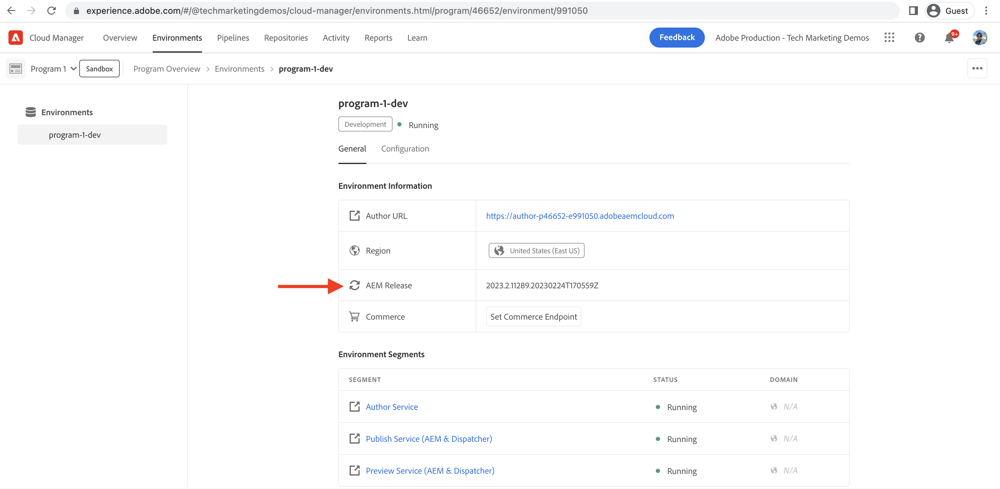

# 设置本地Dispatcher工具

>[!CONTEXTUALHELP]
>id="aemcloud_localdev_dispatcher"
>title="本地Dispatcher工具"
>abstract="Dispatcher是整体Experience Manager架构的一个组成部分，应该是本地开发设置的一部分。 AEM as a Dispatcher SDK包含推荐的Dispatcher工具版本，该版本便于在本地配置、验证和模拟Dispatcher。"
>additional-url="https://experienceleague.adobe.com/docs/experience-manager-cloud-service/implementing/content-delivery/disp-overview.html" text="云中的调度程序"
>additional-url="https://experience.adobe.com/#/downloads/content/software-distribution/en/aemcloud.html" text="下载AEM as aCloud ServiceSDK"

Adobe Experience Manager(AEM)的Dispatcher是一个Apache HTTP Web服务器模块，在CDN和AEM发布层之间提供一个安全和性能层。 Dispatcher是整体Experience Manager架构的一个组成部分，应该是本地开发设置的一部分。

AEM as a Dispatcher SDK包含推荐的Dispatcher工具版本，该版本便于在本地配置、验证和模拟Dispatcher。 调度程序工具由以下部分组成：

+ 位于`.../dispatcher-sdk-x.x.x/src`的一组Apache HTTP Web服务器和Dispatcher配置文件
+ 位于`.../dispatcher-sdk-x.x.x/bin/validate`的配置验证器CLI工具
+ 位于`.../dispatcher-sdk-x.x.x/bin/validator`的配置生成CLI工具
+ 位于`.../dispatcher-sdk-x.x.x/bin/docker_run`的配置部署CLI工具
+ 使用Dispatcher模块运行Apache HTTP Web服务器的Docker图像

请注意， `~`用作用户目录的简写形式。 在Windows中，这等同于`%HOMEPATH%`。

>[!NOTE]
>
> 本页中的视频在macOS中进行录制。 Windows用户可以跟随，但使用随每个视频一起提供的对等的Dispatcher Tools Windows命令。

## 前提条件

1. Windows用户必须使用Windows 10 Professional（或支持Docker的版本）
1. 在本地开发计算机上安装[Experience Manager发布快速入门Jar](./aem-runtime.md)。
   + （可选）在本地AEM发布服务上安装最新的[AEM引用网站](https://github.com/adobe/aem-guides-wknd/releases)。 本教程中使用此网站可视化Dispatcher运行情况。
1. 在本地开发计算机上安装并启动最新版本的[Docker](https://www.docker.com/)(Docker Desktop 2.2.0.5+ / Docker Engine v19.03.9+)。

## 下载Dispatcher工具(作为AEM SDK的一部分)

AEM as a Dispatcher SDK或AEM SDK包含用于在本地使用Dispatcher模块运行Apache HTTP Web服务器以进行开发的Dispatcher工具，以及兼容的快速入门Jar。

如果已将AEM as a Cloud ServiceSDK下载到[设置本地AEM运行时](./aem-runtime.md)，则无需重新下载它。

1. 使用您的Adobe ID登录到[experience.adobe.com/#/downloads](https://experience.adobe.com/#/downloads/content/software-distribution/en/aemcloud.html?fulltext=AEM*+SDK*&amp;1_group.propertyvalues.property=。%2Fjcr%3Acontent%2Fmetadata%2Fdc%3AsoftwareType&amp;1_group.propertyvalues.operation=equals&amp;1_group.propertyvalues.0_values=software-type%3Atoling&amp;orderby=%40jcr%3Acontent%2Fjcr%3AlastModified&amp;orderby.sort=desc&amp;layout=list&amp;p.offset=0&amp;p.limit=1)
   + 您的Adobe组织&#x200B;__必须__&#x200B;配置AEM作为Cloud Service，才能将AEM作为Cloud ServiceSDK下载
1. 单击要下载的最新&#x200B;__AEM SDK__&#x200B;结果行

## 从AEM SDK zip解压缩Dispatcher工具

>[!TIP]
>
> Windows用户在包含本地Dispatcher工具的文件夹的路径中不能有任何空格或特殊字符。 如果路径中存在空格，则`docker_run.cmd`将失败。

Dispatcher工具的版本与AEM SDK的版本不同。 确保通过与AEM作为Cloud Service版本相匹配的AEM SDK版本提供Dispatcher工具版本。

1. 解压缩下载的`aem-sdk-xxx.zip`文件
1. 将调度程序工具解包到`~/aem-sdk/dispatcher`中
   + Windows:将`aem-sdk-dispatcher-tools-x.x.x-windows.zip`解压缩到`C:\Users\<My User>\aem-sdk\dispatcher`（根据需要创建缺少的文件夹）
   + macOS / Linux:执行随附的Shell脚本`aem-sdk-dispatcher-tools-x.x.x-unix.sh`以解包Dispatcher工具
      + `chmod a+x aem-sdk-dispatcher-tools-x.x.x-unix.sh && ./aem-sdk-dispatcher-tools-x.x.x-unix.sh`

请注意，下面发出的所有命令都假定当前工作目录包含扩展的Dispatcher工具内容。

>[!VIDEO](https://video.tv.adobe.com/v/30601/?quality=12&learn=on)

*此视频使用macOS作说明性用途。等效的Windows/Linux命令可用于获得类似结果*

## 了解Dispatcher配置文件

>[!TIP]
> 从[AEM Project Maven Archetype](https://github.com/adobe/aem-project-archetype)创建的Experience Manager项目已预填充此Dispatcher配置文件集，因此无需从Dispatcher Tools src文件夹进行复制。

“调度程序工具”提供一组Apache HTTP Web服务器和调度程序配置文件，这些文件定义所有环境（包括本地开发）的行为。

如果Experience ManagerMaven项目中不存在这些文件，则将这些文件复制到`dispatcher/src`文件夹的Experience ManagerMaven项目中。

未打包的Dispatcher工具中提供了配置文件的完整说明，如`dispatcher-sdk-x.x.x/docs/Config.html`。

## 验证配置

或者，也可以使用`validate`脚本（不要与`validator`可执行文件混淆）验证Dispatcher和Apache Web服务器配置（通过`httpd -t`）。 `validate`脚本为运行`validator`的[3个阶段](https://experienceleague.adobe.com/docs/experience-manager-cloud-service/implementing/content-delivery/validation-debug.html?lang=en#local-validation-flexible-mode)提供了一种便捷的方法。

+ 使用:
   + Windows: `bin\validate src`
   + macOS / Linux:`./bin/validate.sh ./src`

## 在本地运行Dispatcher

AEM Dispatcher是针对`src` Dispatcher和Apache Web服务器配置文件使用Docker在本地运行的。

+ 使用:
   + Windows:`bin\docker_run <src-folder> <aem-publish-host>:<aem-publish-port> <dispatcher-port>`
   + macOS / Linux:`./bin/docker_run.sh <src-folder> <aem-publish-host>:<aem-publish-port> <dispatcher-port>`

`<aem-publish-host>`可以设置为`host.docker.internal`,Docker在容器中提供一个特殊的DNS名称，该名称可解析为主机的IP。 如果`host.docker.internal`未解析，请参阅下面的[疑难解答](#troubleshooting-host-docker-internal)部分。

例如，使用Dispatcher工具提供的默认配置文件启动Dispatcher Docker容器：

启动Dispatcher Docker容器，提供Dispatcher配置src文件夹的路径：

+ Windows:`bin\docker_run src host.docker.internal:4503 8080`
+ macOS / Linux:`./bin/docker_run.sh ./src host.docker.internal:4503 8080`

在端口4503本地运行的AEM as a Cloud ServiceSDK的发布服务将通过Dispatcher在`http://localhost:8080`上提供。

要针对Experience Manager项目的Dispatcher配置运行Dispatcher工具，请指向您项目的`dispatcher/src`文件夹。

+ Windows:

   ```shell
   $ bin\docker_run <User Directory>/code/my-project/dispatcher/src host.docker.internal:4503 8080
   ```

+ macOS / Linux:

   ```shell
   $ ./bin/docker_run.sh ~/code/my-project/dispatcher/src host.docker.internal:4503 8080
   ```

## Dispatcher工具日志

在本地开发过程中，Dispatcher日志有助于了解HTTP请求是否被阻止以及为何被阻止。 可通过使用环境参数预定`docker_run`的执行来设置日志级别。

运行`docker_run`时，调度程序工具日志会发出到标准输出。

用于调试Dispatcher的有用参数包括：

+ `DISP_LOG_LEVEL=Debug` 将调度程序模块日志记录设置为“调试”级别
   + 默认值为: `Warn`
+ `REWRITE_LOG_LEVEL=Debug` 将Apache HTTP Web服务器重写模块日志记录设置为“调试”级别
   + 默认值为: `Warn`
+ `DISP_RUN_MODE` 设置Dispatcher环境的“运行模式”，加载相应的Dispatcher配置文件运行模式。
   + 默认为 `dev`
+ 有效值：`dev`、`stage`或`prod`

一个或多个参数可以传递到`docker_run`

+ Windows:

   ```shell
   $ DISP_LOG_LEVEL=Debug REWRITE_LOG_LEVEL=Debug bin\docker_run <User Directory>/code/my-project/dispatcher/src host.docker.internal:4503 8080
   ```

+ macOS / Linux:

   ```shell
   $ DISP_LOG_LEVEL=Debug REWRITE_LOG_LEVEL=Debug ./bin/docker_run.sh ~/code/my-project/dispatcher/src host.docker.internal:4503 8080
   ```

### 日志文件访问

可以在Docker容器中直接访问Apache Web服务器和AEM Dispatcher日志：

+ [访问Docker容器中的日志](../debugging/aem-sdk-local-quickstart/logs.md#dispatcher-tools-access-logs)
+ [将Docker日志复制到本地文件系统](../debugging/aem-sdk-local-quickstart/logs.md#dispatcher-tools-copy-logs)

## 何时更新Dispatcher工具{#dispatcher-tools-version}

Dispatcher工具版本的增加频率低于Experience Manager，因此Dispatcher工具在本地开发环境中需要的更新较少。

推荐的Dispatcher工具版本是与AEM as a Dispatcher SDK捆绑在一起，该版本与Experience Manager作为Cloud Service版本相匹配。 可以通过[Cloud Manager](https://my.cloudmanager.adobe.com/)找到AEM as aCloud Service的版本。

+ __Cloud Manager >环境__，根据AEM Releaselabel指定的 __环__ 境



_请注意，调度程序工具版本本身与Experience Manager版本不匹配。_

## 疑难解答

### docker_run导致“等待host.docker.internal可用”消息{#troubleshooting-host-docker-internal}

`host.docker.internal` 是提供给Docker包含的可解析到主机的主机名。根据docs.docker.com([macOS](https://docs.docker.com/docker-for-mac/networking/#i-want-to-connect-from-a-container-to-a-service-on-the-host), [Windows](https://docs.docker.com/docker-for-windows/networking/)):

> 从Docker 18.03开始，我们的建议是连接到特殊的DNS名称host.docker.internal，该名称解析为主机使用的内部IP地址

如果`bin/docker_run src host.docker.internal:4503 8080`导致出现消息&#x200B;__Waiting untith ost.docker.internal可用__&#x200B;时，则：

1. 确保已安装的Docker版本为18.03或更高版本
2. 您可能已设置本地计算机，该计算机会阻止`host.docker.internal`名称的注册/解析。 请改用本地IP。
   + Windows:
      + 在命令提示符下，执行`ipconfig`并记录主机的&#x200B;__IPv4地址__。
      + 然后，使用此IP地址执行`docker_run`:
         `bin\docker_run src <HOST IP>:4503 8080`
   + macOS / Linux:
      + 从“终端”中，执行`ifconfig`并记录主机&#x200B;__inet__ IP地址，通常是&#x200B;__en0__&#x200B;设备。
      + 然后，使用主机IP地址执行`docker_run`:
         `bin/docker_run.sh src <HOST IP>:4503 8080`

#### 示例错误

```shell
$ docker_run src host.docker.internal:4503 8080

Running script /docker_entrypoint.d/10-check-environment.sh
Running script /docker_entrypoint.d/20-create-docroots.sh
Running script /docker_entrypoint.d/30-wait-for-backend.sh
Waiting until host.docker.internal is available
```

### docker_run在Windows上启动失败{#troubleshooting-windows-compatible}

在Windows上运行`docker_run`可能会导致以下错误，从而阻止Dispatcher启动。 这是Windows上的Dispatcher报告的问题，将在未来版本中修复。

#### 示例错误

```shell
$ \Users\MyUser\aem-sdk\dispatcher>bin\docker_run src host.docker.internal:4503 8080

Running script /docker_entrypoint.d/10-check-environment.sh
Running script /docker_entrypoint.d/20-create-docroots.sh
Running script /docker_entrypoint.d/30-wait-for-backend.sh
Waiting until host.docker.internal is available
host.docker.internal resolves to 192.168.65.2
Running script /docker_entrypoint.d/40-generate-allowed-clients.sh
Running script /docker_entrypoint.d/50-check-expiration.sh
Running script /docker_entrypoint.d/60-check-loglevel.sh
Running script /docker_entrypoint.d/70-check-forwarded-host-secret.sh
Starting httpd server
[Sun Feb 09 17:32:22.256020 2020] [dispatcher:warn] [pid 1:tid 140080096570248] Unable to obtain parent directory of /etc/httpd/conf.dispatcher.d/enabled_farms/farms.any: No such file or directory
[Sun Feb 09 17:32:22.256069 2020] [dispatcher:alert] [pid 1:tid 140080096570248] Unable to import config file: /etc/httpd/conf.dispatcher.d/dispatcher.any
[Sun Feb 09 17:32:22.256074 2020] [dispatcher:alert] [pid 1:tid 140080096570248] Dispatcher initialization failed.
AH00016: Configuration Failed
```

## 其他资源

+ [下载AEM SDK](https://experience.adobe.com/#/downloads)
+ [AdobeCloud Manager](https://my.cloudmanager.adobe.com/)
+ [下载Docker](https://www.docker.com/)
+ [下载AEM参考网站(WKND)](https://github.com/adobe/aem-guides-wknd/releases)
+ [Experience ManagerDispatcher文档](https://experienceleague.adobe.com/docs/experience-manager-dispatcher/using/dispatcher.html?lang=zh-Hans)
