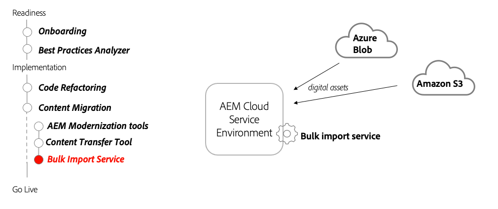

# 批量导入服务

了解如何使用AEM as a Cloud Services的批量导入服务从非AEM源导入资产。

>[!VIDEO](https://video.tv.adobe.com/v/336969?quality=12&learn=on)

## 使用批量导入服务

批量导入服务用于将Azure Blob Storage或Amazon S3存储中存储的文件作为资产传输到AEMas a Cloud Service。

## 关键活动

+ 将要导入的文件上传到云存储提供程序(Azure Blob Storage或Amazon S3)。
+ 从AEMas a Cloud Service创作服务配置并运行批量导入服务。
+ 将批量服务导入程序作为一次性导入运行或计划定期导入。

## 其他资源

+ [批量导入服务配置选项](https://experienceleague.adobe.com/docs/experience-manager-cloud-service/content/assets/manage/add-assets.html#configure-bulk-ingestor-tool)
+ [Adobe Developers Live资产摄取会议](https://experienceleague.adobe.com/docs/adobe-developers-live-events/events/2021/feb2021/asset-bulk-ingestion.html)

