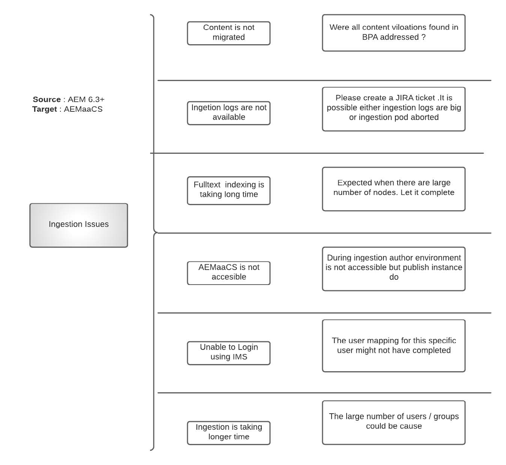

# AEM as a Cloud Service内容迁移常见问题解答

获取有关将内容迁移到AEM as a Cloud Service的常见问题解答。

## 术语

+ **AEMaaCS**： [AEM as a Cloud Service](https://experienceleague.adobe.com/docs/experience-manager-cloud-service/content/overview/introduction.html?lang=zh-Hans#)
+ **BPA**： [最佳实践分析器](https://experienceleague.adobe.com/docs/experience-manager-cloud-service/content/migration-journey/cloud-migration/best-practices-analyzer/overview-best-practices-analyzer.html?lang=zh-Hans#)
+ **CTT**： [内容传输工具](https://experienceleague.adobe.com/docs/experience-manager-cloud-service/content/migration-journey/cloud-migration/content-transfer-tool/overview-content-transfer-tool.html?lang=zh-Hans)
+ **摄像头**： [Cloud Acceleration Manager](https://experienceleague.adobe.com/docs/experience-manager-cloud-service/content/migration-journey/cloud-acceleration-manager/using-cam/getting-started-cam.html?lang=zh-Hans)
+ **IMS**： [Identity Management系统](https://experienceleague.adobe.com/docs/experience-manager-cloud-service/content/security/ims-support.html?lang=zh-Hans)
+ **DM**： [Dynamic Media](https://experienceleague.adobe.com/docs/experience-manager-cloud-service/content/assets/dynamicmedia/dm-journey/dm-journey-part1.html?lang=zh-Hans)

请在创建与CTT相关的Adobe支持票证时，使用以下模板提供更多详细信息。

 { align=&quot;center&quot; }

## 一般内容迁移问题

### 问：将内容迁移到AEM as Cloud Service有哪些不同方法？

有三种不同的方法可用

+ 使用内容传输工具(AEM 6.3+ → AEMaaCS)
+ 通过包管理器(AEM→AEMaaCS)
+ 开箱即用的Assets批量导入服务(S3/Azure→AEMaaCS)

### 问：可以使用CTT传输的内容数量是否有限制？

不行。CTT作为一种工具可以从AEM源中提取并摄取到AEMaaCS中。 但是，在迁移之前应考虑对AEMaaCS平台的特定限制。

有关详细信息，请参阅[云迁移先决条件](https://experienceleague.adobe.com/docs/experience-manager-cloud-service/content/migration-journey/cloud-migration/content-transfer-tool/prerequisites-content-transfer-tool.html?lang=zh-Hans)。

### 问：我已收到来自源系统的最新BPA报告，应该对其执行哪些操作？

将报表导出为CSV，然后将其上传到Cloud Acceleration Manager（与您的IMS组织[&#128279;](https://experienceleague.adobe.com/docs/experience-manager-cloud-service/content/migration-journey/cloud-acceleration-manager/using-cam/getting-started-cam.html?lang=zh-Hans)关联的[）。 然后按照准备阶段](https://experienceleague.adobe.com/docs/experience-manager-cloud-service/content/migration-journey/cloud-acceleration-manager/using-cam/cam-readiness-phase.html?lang=zh-Hans)中所述的进行审核过程。

请检查工具提供的代码和内容复杂性评估，并记下导致代码重构积压或云迁移评估的相关操作项。

### 问：是否建议对源作者进行提取，并摄取到AEMaaCS作者和发布中？

始终建议在创作层和发布层之间执行1:1提取和摄取。 也就是说，可以提取源生产作者并将其摄取到开发、暂存和生产CS中。

### 问：有没有方法可以预计使用CTT将内容从源AEM迁移到AEMaaCS所需的时间？

由于迁移过程取决于Internet带宽、为CTT进程分配的栈、可用的可用内存以及磁盘IO（对每个源系统而言都是主观的），因此建议尽早执行Proof Migration并推断数据点得出估计值。

### 问：如果我启动CTT提取流程，那么我的源AEM性能会受到什么影响？

CTT工具在其自己的Java™进程中运行，该进程最多需要4gb栈，该栈可通过OSGi配置进行配置。 此数字可能会发生变化，但您可以深究Java™进程并找出原因。

如果安装了AZCopy和/或启用了预复制选项/验证功能，则AZCopy进程将占用CPU周期。

除了jvm之外，该工具还使用磁盘IO将数据存储在过渡临时空间中，该数据将在提取周期后清除。 除了RAM、CPU和磁盘IO之外，CTT工具还使用源系统的网络带宽将数据上载到Azure blob存储。

CTT提取过程所用的资源量取决于节点数、Blob数及其聚合大小。 很难提供公式，因此建议执行少量迁移证明以确定源服务器的大小要求。

如果使用克隆环境进行迁移，则不会影响实时生产服务器资源的利用率，但在实时生产和克隆之间同步内容方面有其自身的缺点

### 问：在CTT的上下文中，“划出”和“覆盖”这两个术语表示什么？

在[提取阶段](https://experienceleague.adobe.com/docs/experience-manager-cloud-service/content/migration-journey/cloud-migration/content-transfer-tool/getting-started-content-transfer-tool.html?lang=zh-Hans#extraction-setup-phase)的上下文中，选项为覆盖暂存容器中先前提取周期的数据，或向其中添加差异（添加/更新/删除）。 暂存容器不执行任何操作，但与迁移集关联的Blob存储容器除外。 每个迁移集都有各自的暂存容器。

在[摄取阶段](https://experienceleague.adobe.com/docs/experience-manager-cloud-service/content/migration-journey/cloud-migration/content-transfer-tool/ingesting-content.html?lang=zh-Hans)的上下文中，选项为+以替换AEMaaCS的整个内容存储库或从暂存迁移容器同步差异（添加/更新/删除）内容。

### 问：源系统中有多个网站、关联的资产、用户和组。 是否可以分阶段将它们迁移到AEMaaCS？

是的，这是可能的，但需要谨慎规划：

+ 创建迁移集假定站点、资源位于其各自的层级中
   + 验证是否可以接受在一个迁移集中迁移所有资产，然后分阶段引入正在使用这些资产的站点
+ 在当前状态下，作者摄取过程使作者实例不可用于内容创作，即使发布层仍可以提供内容
   + 这意味着在摄取到创作中之前，内容创作活动将被冻结
+ 尽管组已迁移，但用户已不再迁移。

在规划迁移之前，请查看增补提取和摄取流程（如文档中所述）。

### 问：即使AEMaaCS创作或发布实例正在进行引入，我的网站是否仍可供最终用户使用？

是。内容迁移活动不会中断最终用户流量。 但是，作者摄取会冻结内容创作，直到它完成。

### 问：BPA报告会显示与缺少原始演绎版相关的项目。 是否应在提取之前清理源上的这些文件？

是。缺少原始演绎版意味着资产二进制文件无法正确上传。 考虑到数据损坏，请进行检查，使用包管理器进行备份（如果需要），并在运行提取之前从源AEM中删除这些数据。 错误数据将对资产处理步骤产生负面结果。

### 问：BPA报告包含与文件夹缺少`jcr:content`节点相关的项。 我该拿他们怎么办？

在文件夹级别缺少`jcr:content`时，执行任何传播设置的操作，如处理配置文件等。 来自父母的将在此级别中断。 请检查缺少`jcr:content`的原因。 虽然这些文件夹可以迁移，但请注意，此类文件夹会降低用户体验并会在以后导致不必要的故障排除周期。

### 问：我已创建迁移集。 能否检查其大小？

是，有一个[检查大小](https://experienceleague.adobe.com/docs/experience-manager-cloud-service/content/migration-journey/cloud-migration/content-transfer-tool/getting-started-content-transfer-tool.html?lang=zh-Hans#migration-set-size)功能是CTT的一部分。

### 问：我正在执行迁移（提取、摄取）。 是否可以验证我提取的所有内容是否都已摄取到Target中？

是，有一个[验证](https://experienceleague.adobe.com/docs/experience-manager-cloud-service/content/migration-journey/cloud-migration/content-transfer-tool/validating-content-transfers.html?lang=zh-Hans)功能是CTT的一部分。

### 问：我的客户要求在AEMaaCS环境（例如从AEMaaCS Dev到AEMaaCS Stage或到AEMaaCS Prod）之间移动内容。 我能否对这些用例使用内容传输工具？

很遗憾，不能。 CTT的使用案例是将内容从本地/AMS托管的AEM 6.3+源迁移到AEMaaCS云环境。 [请阅读CTT文档](https://experienceleague.adobe.com/docs/experience-manager-cloud-service/content/migration-journey/cloud-migration/content-transfer-tool/overview-content-transfer-tool.html?lang=zh-Hans)。

### 问：在提取期间会出现哪些问题？

提取阶段是一个涉及的过程，需要多个方面才能按预期工作。 了解可能会发生的各种问题以及如何缓解这些问题，可以提高内容迁移的整体成功率。

公共文档根据学习内容不断进行改进，但以下是一些高级别的问题类别和可能的基本原因。

 { align=&quot;center&quot; }

### 问：在摄取期间会遇到哪些问题？

摄取阶段完全在云平台中进行，需要有权访问AEMaaCS基础结构的资源的帮助。 请创建支持工单以获取更多帮助。

以下是可能的问题类别（请勿将此视为排他列表）

 { align=&quot;center&quot; }

### 问：我的源服务器是否需要具有出站Internet连接才能使CTT正常工作？

简短的答案为“**是**”。

CTT流程需要连接到以下资源：

+ 目标AEM as a Cloud Service环境： `author-p<program_id>-e<env_id>.adobeaemcloud.com`
+ Azure Blob存储服务： `casstorageprod.blob.core.windows.net`

有关[源连接](https://experienceleague.adobe.com/docs/experience-manager-cloud-service/content/migration-journey/cloud-migration/content-transfer-tool/getting-started-content-transfer-tool.html?lang=zh-Hans#source-environment-connectivity)的详细信息，请参阅文档。

## 资产处理Dynamic Media相关问题

### 问：资产在AEMaaCS中摄取后是否会自动重新处理？

不行。要处理资产，必须启动重新处理的请求。

### 问：资产在AEMaaCS中引入后是否会自动重新索引？

是。资源将根据AEMaaCS上可用的索引定义重新编入索引。

### 问：源AEM与Dynamic Media集成。 在迁移内容之前是否必须考虑任何特定事项？

是，当源AEM具有Dynamic Media集成时，请考虑以下事项。

+ AEMaaCS仅支持Dynamic Media Scene7模式。 如果源系统处于混合模式，则需要将DM迁移到Scene7模式。
+ 如果方法是从源克隆实例进行迁移，则可以安全地禁用将用于CTT的克隆上的DM集成。 此步骤纯粹是为了避免向DM进行任何写入或避免DM流量加载。
+ 请注意，CTT会将节点，迁移集的元数据从源AEM迁移到AEMaaCS。 它不会直接对DM执行任何操作。

### 问：Source AEM上存在DM集成时，有哪些不同的迁移方法？

请先阅读上述问题和答案

（这是两种可能的选择，但不仅限于这两种）。 这取决于客户希望如何进行UAT 、性能测试、可用的环境以及是否使用克隆进行迁移。 请将这两者作为讨论的起点

**选项1**

如果源环境中的资产/节点数较低（约100K），并且假设这些资产或节点可以在24 + 72小时的时间内（包括提取和摄取）进行迁移，则更好的方法为

+ 直接从生产环境执行迁移
+ 使用`wipe=true`运行初始提取并摄取到AEMaaCS中
   + 此步骤会迁移所有节点和二进制文件
+ 继续在On-Premise/AMS Prod作者中工作
+ 从现在开始，使用`wipe=true`运行所有其他迁移周期证明
   + 请注意，此操作会迁移完整的节点存储，但只迁移修改的Blob而不是整个Blob。 上一组Blob位于目标AEMaaCS实例的Azure Blob存储中。
   + 使用此迁移证明来衡量迁移持续时间、测试和验证所有其他功能
+ 最后，在上线一周之前，执行wipe=true迁移
   + 在AEMaaCS上连接Dynamic Media
   + 从AEM本地源断开DM配置

利用此选项，您可以运行一对一迁移，即内部部署→AEMaaCS开发等。 并从各自的环境中移动DM配置

（如果计划从克隆执行迁移）

**选项2**

+ 创建生产作者的克隆，从克隆中删除DM配置
+ 将内部部署克隆迁移→AEMaaCS开发/暂存
   + 将生产DM公司简要连接到AEMaaCS开发/暂存以进行验证
   + 在DM连接处于活动状态期间，避免将资产引入AEMaaCS
   + 这使他们能够验证CTT、DM特定的验证
+ 在AEMaaCS上完成测试后
   + 运行从内部部署阶段到AEMaaCS阶段的划出迁移

运行从内部部署Dev到AEMaaCS Dev的擦除迁移。

上述方法可用于仅测量迁移持续时间，但需要稍后进行清理。

## 其他资源

+ [在云中迁移到Experience Manager的提示和技巧( Summit 2022)](https://business.adobe.com/cn/summit/2022/sessions/tips-and-tricks-for-migrating-to-experience-manage-tw109.html)

+ [CTT专家系列视频](https://experienceleague.adobe.com/docs/experience-manager-learn/cloud-service/migration/moving-to-aem-as-a-cloud-service/content-migration/content-transfer-tool.html?lang=zh-Hans)

+ 其他AEMaaCS主题的[专家系列视频](https://experienceleague.adobe.com/docs/experience-manager-learn/cloud-service/expert-resources/aem-experts-series.html?lang=zh-Hans)
