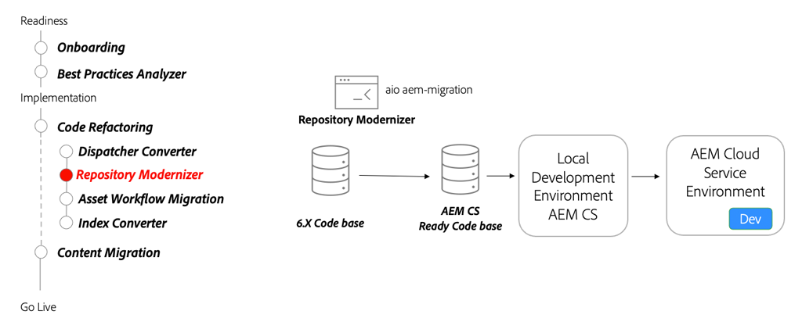

# 存储库现代化

了解存储库现代化、可变和不可变内容、包结构和存储库现代化器CLI工具。

>[!VIDEO](https://video.tv.adobe.com/v/336958/?quality=12&learn=on)

## Repository Modernizer工具

在重构代码库时，请使用 [Repository Modernizer工具](https://experienceleague.adobe.com/docs/experience-manager-cloud-service/moving/refactoring-tools/repo-modernizer.html) 将6.x代码库重构为更现代的结构。

### 关键活动

* 使用 [Adobe I/O存储库Modernizer](https://github.com/adobe/aio-cli-plugin-aem-cloud-service-migration#command-aio-aem-migrationrepository-modernizer) 用于调整项目结构以匹配AEMas a Cloud Service项目的预期结构的工具。
* 手动调整和修复更新的代码库中的任何生成错误。
* 设置 [本地开发环境](https://experienceleague.adobe.com/docs/experience-manager-learn/cloud-service/local-development-environment-set-up/overview.html) 和部署更新的代码库。 迭代直到项目处于稳定状态。
* 将更新的代码库部署到AEMas a Cloud Service开发环境，并继续验证。
