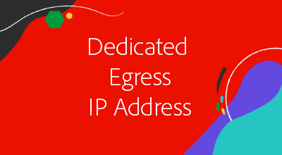

# 高级联网

AEMas a Cloud Service提供高级联网功能，允许精确管理与AEMas a Cloud Service程序的连接。

|  | [生产程序](https://experienceleague.adobe.com/docs/experience-manager-cloud-service/content/implementing/using-cloud-manager/programs/introduction-production-programs.html) | [沙盒程序](https://experienceleague.adobe.com/docs/experience-manager-cloud-service/content/implementing/using-cloud-manager/programs/introduction-sandbox-programs.html) |
|---------------------------------------------------|:-----------------------:|:---------------------:|
| 支持高级联网 | ✔ | ✘ |

AEM高级联网包含三个选项，用于管理与外部服务的连接。 Cloud Manager程序及其AEMas a Cloud Service环境一次只能使用一种类型的高级联网配置，因此请确保选择最合适的类型。

|  | 标准端口上的HTTP/HTTPS | 非标准端口上的HTTP/HTTPS | 非HTTP/HTTPS连接 | 专用出口IP | “无代理主机”列表 | 连接到受VPN保护的服务 | 按IP限制AEM发布流量 |
|-----------------------------------|:----------------------------:|:--------------------------------:|:--------------------------:|:-------------------:|:-------------------------------------:|:-------------------------------------:|:----:|
| __无高级联网__ | ✔ | ✘ | ✘ | ✘ | ✘ | ✘ | ✘ |
| [__灵活端口出口__](./flexible-port-egress.md) | ✔ | ✔ | ✔ | ✘ | ✘ | ✘ | ✘ |
| [__专用出口IP地址__](./dedicated-egress-ip-address.md) | ✔ | ✔ | ✔ | ✔ | ✔ | ✘ | ✘ |
| [__虚拟专用网络__](./vpn.md) | ✔ | ✔ | ✔ | ✔ | ✔ | ✔ | ✔ |

有关选择适当的高级网络类型时涉及的注意事项的更多详细信息，请参阅 [高级联网文档](https://experienceleague.adobe.com/docs/experience-manager-cloud-service/security/configuring-advanced-networking.html).

## 高级联网教程

在根据贵组织的需求确定最合适的高级联网选项后，单击下面的相应教程以获取分步说明和代码示例。

<table>
  <tr>
   <td>
      
      
<strong><a href="./flexible-port-egress.md">灵活端口出口</a></strong>

      

          允许非标准端口上的出站AEMas a Cloud Service通信。
      

    </td>   
   <td>
      
      
<strong><a href="./dedicated-egress-ip-address.md">专用出口IP地址</a></strong>

      

        从专用IP发起出站AEMas a Cloud Service流量。
      

    </td>   
   <td>
      
      
<strong><a href="./vpn.md">虚拟专用网络 (VPN)</a></strong>

      

        保护客户或供应商基础设施与AEMas a Cloud Service之间的流量。
      

    </td>   
  </tr>
</table>

## 代码示例

本收藏集提供了针对特定用例利用高级联网功能所需的配置和代码示例。

确保相应 [高级联网配置](#advanced-networking) 已在完成这些教程之前设置。

<table><tr>
   <td>
      
      
<strong><a href="./examples/email-service.md">电子邮件服务</a></strong>

      

        使用AEM连接到外部电子邮件服务的OSGi配置示例。
      

    </td>  
    <td>
        
        
<strong><a href="./examples/http-dedicated-egress-ip-vpn.md">HTTP/HTTPS</a></strong>

        

            Java™代码示例使用HTTP/HTTPS协议使从AEM的HTTP/HTTPS连接as a Cloud Service到外部服务。
        

    </td>
    <td>
      
      
<strong><a href="./examples/sql-datasourcepool.md">使用JDBC数据源池的SQL连接</a></strong>

      

            通过配置AEM JDBC数据源池连接到外部SQL数据库的Java™代码示例。
      

    </td>   
    </tr><tr>
    <td>
      
      
<strong><a href="./examples/sql-java-apis.md">使用Java™ API的SQL连接</a></strong>

      

            Java™代码示例使用Java™的SQL API连接到外部SQL数据库。
      

    </td>   
    <td>
      
      
<strong><a href="https://experienceleague.adobe.com/docs/experience-manager-cloud-service/implementing/using-cloud-manager/ip-allow-lists/apply-allow-list.html">应用IP允许列表</a></strong>

      

            配置IP 允许列表，以便只有VPN流量可以访问AEM。
      

    </td>
   <td>
      
      
<strong><a href="https://experienceleague.adobe.com/docs/experience-manager-cloud-service/security/configuring-advanced-networking.html#restrict-vpn-to-ingress-connections">AEM发布的基于路径的VPN访问限制</a></strong>

      

            要求AEM Publish上的特定路径具有VPN访问权限。
      

    </td>
</tr>
</table>
