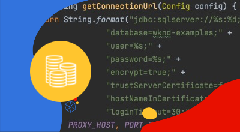

# 专用出口IP地址

了解如何设置和使用专用出口IP地址，该地址允许来自AEM的出站连接源自专用IP。

## 专用出口IP地址是什么？

专用出口IP地址允许来自AEMas a Cloud Service的请求使用专用IP地址，从而允许外部服务按此IP地址筛选传入请求。 点赞 [灵活出口端口](./flexible-port-egress.md)，专用出口IP允许您从非标准端口出口。

Cloud Manager程序只能具有 __单身__ 网络基础架构类型。 确保专用出口IP地址最多 [适当类型的网络基础架构](./advanced-networking.md)  ，然后才可执行AEMas a Cloud Service。

>[!MORELIKETHIS]
>
> 阅读AEMas a Cloud Service [高级网络配置文档](https://experienceleague.adobe.com/docs/experience-manager-cloud-service/content/security/configuring-advanced-networking.html#dedicated-egress-IP-address) 以获取有关专用出口IP地址的更多详细信息。

## 前提条件

设置专用出口IP地址时，需要满足以下条件：

+ Cloud Manager API包含 [Cloud Manager业务负责人权限](https://developer.adobe.com/experience-cloud/cloud-manager/guides/getting-started/permissions/)
+ 访问 [Cloud Manager API身份验证凭据](https://developer.adobe.com/experience-cloud/cloud-manager/guides/getting-started/authentication/)
   + 组织ID （又称IMS组织ID）
   + 客户端ID（又称API密钥）
   + 访问令牌（又称持有者令牌）
+ Cloud Manager项目ID
+ Cloud Manager环境ID

有关更多详细信息，请观看以下演练，了解如何设置、配置和获取Cloud Manager API凭据，以及如何使用它们进行Cloud Manager API调用。

>[!VIDEO](https://video.tv.adobe.com/v/342235?quality=12&learn=on)

本教程使用 `curl` 以配置Cloud Manager API。 提供的 `curl` 命令采用Linux/macOS语法。 如果使用Windows命令提示符，请将 `\` 换行符 `^`.

## 在程序上启用专用出口IP地址

首先，在AEMas a Cloud Service上启用并配置专用出口IP地址。

1. 首先，使用Cloud Manager API确定需要高级联网的区域 [listRegions](https://developer.adobe.com/experience-cloud/cloud-manager/reference/api/) 操作。 此 `region name` 进行后续Cloud Manager API调用时需要使用。 通常，会使用生产环境所在的区域。

   在中查找您的AEMas a Cloud Service环境所在的地区 [Cloud Manager](https://my.cloudmanager.adobe.com) 在 [环境详细信息](https://experienceleague.adobe.com/docs/experience-manager-cloud-service/content/implementing/using-cloud-manager/manage-environments.html?lang=en#viewing-environment). Cloud Manager中显示的区域名称可以是 [映射到区域代码](https://developer.adobe.com/experience-cloud/cloud-manager/guides/api-usage/creating-programs-and-environments/#creating-aem-cloud-service-environments) 在Cloud Manager API中使用。

   __listRegions HTTP请求__

   ```shell
   $ curl -X GET https://cloudmanager.adobe.io/api/program/{programId}/regions \
       -H 'x-gw-ims-org-id: <ORGANIZATION_ID>' \
       -H 'x-api-key: <CLIENT_ID>' \
       -H 'Authorization: Bearer <ACCESS_TOKEN>' \
       -H 'Content-Type: application/json' 
   ```

1. 使用Cloud Manager API为Cloud Manager程序启用专用出口IP地址 [createNetworkInfrastructure](https://developer.adobe.com/experience-cloud/cloud-manager/reference/api/) 操作。 使用适当的 `region` 从Cloud Manager API获得的代码 `listRegions` 操作。

   __createNetworkInfrastructure HTTP请求__

   ```shell
   $ curl -X POST https://cloudmanager.adobe.io/api/program/{programId}/networkInfrastructures \
       -H 'x-gw-ims-org-id: <ORGANIZATION_ID>' \
       -H 'x-api-key: <CLIENT_ID>' \
       -H 'Authorization: Bearer <ACCESS_TOKEN>' \
       -H 'Content-Type: application/json' \
       -d '{ "kind": "dedicatedEgressIp", "region": "va7" }'
   ```

   等待15分钟，让Cloud Manager项目配置网络基础架构。

1. 检查程序是否已完成 __专用出口IP地址__ 使用Cloud Manager API进行配置 [getNetworkInfrastructure](https://developer.adobe.com/experience-cloud/cloud-manager/reference/api/#operation/getNetworkInfrastructure) 操作，使用 `id` 从上一步中的createNetworkInfrastructure HTTP请求返回。

   __getNetworkInfrastructure HTTP请求__

   ```shell
   $ curl -X GET https://cloudmanager.adobe.io/api/program/{programId}/networkInfrastructure/{networkInfrastructureId} \
       -H 'x-gw-ims-org-id: <ORGANIZATION_ID>' \
       -H 'x-api-key: <CLIENT_ID>' \
       -H 'Authorization: Bearer <ACCESS_TOKEN>' \
       -H 'Content-Type: application/json'
   ```

   验证HTTP响应中是否包含 __状态__ 之 __就绪__. 如果尚未准备就绪，请每隔几分钟重新检查一次状态。

## 按环境配置专用出口IP地址代理

1. 配置 __专用出口IP地址__ 使用Cloud Manager API在每个AEMas a Cloud Service环境中进行配置 [enableEnvironmentAdvancedNetworkingConfiguration](https://developer.adobe.com/experience-cloud/cloud-manager/reference/api/) 操作。

   __enableEnvironmentAdvancedNetworkingConfiguration HTTP请求__

   ```shell
   $ curl -X PUT https://cloudmanager.adobe.io/api/program/{programId}/environment/{environmentId}/advancedNetworking \
       -H 'x-gw-ims-org-id: <ORGANIZATION_ID>' \
       -H 'x-api-key: <CLIENT_ID>' \
       -H 'Authorization: Bearer <ACCESS_TOKEN>' \
       -H 'Content-Type: application/json' \
       -d @./dedicated-egress-ip-address.json
   ```

   在中定义JSON参数 `dedicated-egress-ip-address.json` 提供给curl via `... -d @./dedicated-egress-ip-address.json`.

   [下载示例dedicated-egress-ip-address.json](./assets/dedicated-egress-ip-address.json). 此文件只是一个示例。 根据以下位置记录的可选/必填字段，根据需要配置文件： [enableEnvironmentAdvancedNetworkingConfiguration](https://developer.adobe.com/experience-cloud/cloud-manager/reference/api/).

   ```json
   {
       "nonProxyHosts": [
           "example.net",
           "*.example.org",
       ],
       "portForwards": [
           {
               "name": "mysql.example.com",
               "portDest": 3306,
               "portOrig": 30001
           },
           {
               "name": "smtp.sendgrid.net",
               "portDest": 465,
               "portOrig": 30002
           }
       ]
   }
   ```

   专用出口IP地址配置的HTTP签名仅与 [灵活出口端口](./flexible-port-egress.md#enable-dedicated-egress-ip-address-per-environment) 因为它也支持可选 `nonProxyHosts` 配置。

   `nonProxyHosts` 声明了一组主机，应通过默认共享IP地址范围而不是专用出口IP为其路由端口80或443。 `nonProxyHosts` 可能很有用，因为通过共享IP传出的流量可由Adobe进一步自动优化。

   针对每个 `portForwards` 映射，高级联网定义以下转发规则：

   | 代理主机 | 代理端口 |  | 外部主机 | 外部端口 |
   |---------------------------------|----------|----------------|------------------|----------|
   | `AEM_PROXY_HOST` | `portForwards.portOrig` | → | `portForwards.name` | `portForwards.portDest` |

1. 对于每个环境，使用Cloud Manager API验证出口规则是否有效 [getEnvironmentAdvancedNetworkingConfiguration](https://developer.adobe.com/experience-cloud/cloud-manager/reference/api/) 操作。

   __getEnvironmentAdvancedNetworkingConfiguration HTTP请求__

   ```shell
   $ curl -X GET https://cloudmanager.adobe.io/api/program/{programId}/environment/{environmentId}/advancedNetworking \
       -H 'x-gw-ims-org-id: <ORGANIZATION_ID>' \
       -H 'x-api-key: <CLIENT_ID>' \
       -H 'Authorization: <YOUR_TOKEN>' \
       -H 'Content-Type: application/json'
   ```

1. 专用出口IP地址配置可以使用Cloud Manager API更新 [enableEnvironmentAdvancedNetworkingConfiguration](https://developer.adobe.com/experience-cloud/cloud-manager/reference/api/) 操作。 记住 `enableEnvironmentAdvancedNetworkingConfiguration` 是 `PUT` 因此，每次调用此操作时，都必须向所有规则提供。

1. 获取 __专用出口IP地址__ 通过使用DNS解析器(例如 [DNSChecker.org](https://dnschecker.org/))： `p{programId}.external.adobeaemcloud.com`，或通过运行 `dig` 命令行。

   ```shell
   $ dig +short p{programId}.external.adobeaemcloud.com
   ```

   主机名不能为 `pinged`，因为它是出口，并且 _非_ 和入口。

   请注意 __专用出口IP地址__ 由程序中的所有AEMas a Cloud Service环境共享。

1. 现在，您可以在自定义AEM代码和配置中使用专用出口IP地址。 在使用专用出口IP地址时，AEMas a Cloud Service连接的外部服务通常配置为仅允许来自此专用IP地址的流量。

## 通过专用出口IP地址连接到外部服务

启用专用出口IP地址后，AEM代码和配置可以使用专用出口IP调用外部服务。 AEM对两种外部调用的处理方式有所不同：

1. 对外部服务的HTTP/HTTPS调用
   + 包括对在标准80或443端口以外的端口上运行的服务发出的HTTP/HTTPS调用。
1. 对外部服务的非HTTP/HTTPS调用
   + 包括任何非HTTP调用，例如与Mail服务器、SQL数据库或在其他非HTTP/HTTPS协议上运行的服务的连接。

默认情况下，允许标准端口(80/443)上来自AEM的HTTP/HTTPS请求，但如果未按照以下所述进行适当配置，则这些请求不会使用专用出口IP地址。

>[!TIP]
>
> 请参阅AEMas a Cloud Service的专用出口IP地址文档，了解 [整套路由规则](https://experienceleague.adobe.com/docs/experience-manager-cloud-service/content/security/configuring-advanced-networking.html#dedcated-egress-ip-traffic-routing=).


### HTTP/HTTPS

从AEM创建HTTP/HTTPS连接时，如果使用专用出口IP地址，则会自动使用专用出口IP地址从AEM中代理HTTP/HTTPS连接。 无需其他代码或配置即可支持HTTP/HTTPS连接。

#### 代码示例

<table>
<tr>
<td>
    <a  href="./examples/http-dedicated-egress-ip-vpn.md"></a>
    <div><strong><a href="./examples/http-dedicated-egress-ip-vpn.md">HTTP/HTTPS</a></strong></div>
    <p>
        Java™代码示例使用HTTP/HTTPS协议使从AEM的HTTP/HTTPS连接as a Cloud Service到外部服务。
    </p>
</td>   
<td></td>   
<td></td>   
</tr>
</table>

### 到外部服务的非HTTP/HTTPS连接

创建非HTTP/HTTPS连接时(例如 AEM SQL、SMTP等)，必须通过AEM提供的特殊主机名建立连接。

|变量名称 |使用 | Java™代码 | OSGi配置 | | - | - | - | - | | `AEM_PROXY_HOST` |非HTTP/HTTPS连接的代理主机 | `System.getenv("AEM_PROXY_HOST")` | `$[env:AEM_PROXY_HOST]` |


然后，通过调用与外部服务的连接 `AEM_PROXY_HOST` 和映射的端口(`portForwards.portOrig`)，然后AEM将路由到映射的外部主机名(`portForwards.name`)和端口(`portForwards.portDest`)。

| 代理主机 | 代理端口 |  | 外部主机 | 外部端口 |
|---------------------------------|----------|----------------|------------------|----------|
| `AEM_PROXY_HOST` | `portForwards.portOrig` | → | `portForwards.name` | `portForwards.portDest` |

#### 代码示例

<table><tr>
   <td>
      <a  href="./examples/sql-datasourcepool.md"></a>
      <div><strong><a href="./examples/sql-datasourcepool.md">使用JDBC数据源池的SQL连接</a></strong></div>
      <p>
            通过配置AEM JDBC数据源池连接到外部SQL数据库的Java™代码示例。
      </p>
    </td>   
   <td>
      <a  href="./examples/sql-java-apis.md"></a>
      <div><strong><a href="./examples/sql-java-apis.md">使用Java™ API的SQL连接</a></strong></div>
      <p>
            Java™代码示例使用Java™的SQL API连接到外部SQL数据库。
      </p>
    </td>   
   <td>
      <a  href="./examples/email-service.md"></a>
      <div><strong><a href="./examples/email-service.md">电子邮件服务</a></strong></div>
      <p>
        使用AEM连接到外部电子邮件服务的OSGi配置示例。
      </p>
    </td>   
</tr></table>
