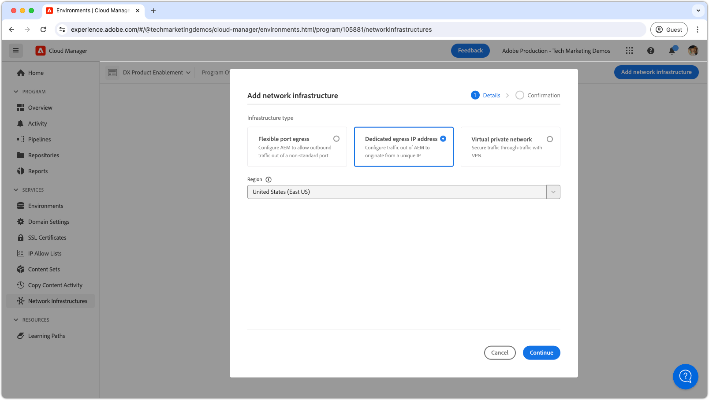
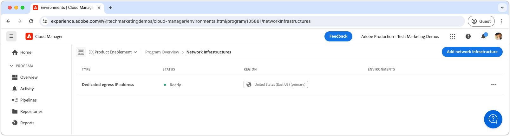

# 专用出口 IP 地址

了解如何设置和使用专用出口IP地址，该地址允许来自AEM的出站连接源自专用IP。

## 专用出口IP地址是什么？

专用出口IP地址允许来自AEM as a Cloud Service的请求使用专用IP地址，允许外部服务按此IP地址过滤传入请求。 与[灵活出口端口](./flexible-port-egress.md)一样，专用出口IP允许您在非标准端口上出口。

Cloud Manager程序只能具有&#x200B;__单个__&#x200B;网络基础架构类型。 在执行以下命令之前，请确保专用出口IP地址是AEM as a Cloud Service最适合[的网络基础架构类型](./advanced-networking.md)。

>[!MORELIKETHIS]
>
> 有关专用出口IP地址的更多详细信息，请阅读AEM as a Cloud Service [高级网络配置文档](https://experienceleague.adobe.com/zh-hans/docs/experience-manager-cloud-service/content/security/configuring-advanced-networking)。

## 先决条件

使用Cloud Manager API设置专用出口IP地址时，需要满足以下条件：

+ 具有[Cloud Manager业务负责人权限的Cloud Manager API](https://developer.adobe.com/experience-cloud/cloud-manager/guides/getting-started/permissions/)
+ 访问[Cloud Manager API身份验证凭据](https://developer.adobe.com/experience-cloud/cloud-manager/guides/getting-started/create-api-integration/)
   + 组织ID （又称IMS组织ID）
   + 客户端ID（又称API密钥）
   + 访问令牌（又称持有者令牌）
+ Cloud Manager项目ID
+ Cloud Manager环境ID

有关更多详细信息，[请查看如何设置、配置和获取Cloud Manger API凭据](https://experienceleague.adobe.com/zh-hans/docs/experience-manager-learn/cloud-service/developing/extensibility/app-builder/server-to-server-auth)，以使用这些凭据进行Cloud Manager API调用。

本教程使用`curl`来进行Cloud Manager API配置。 提供的`curl`命令采用Linux/macOS语法。 如果使用Windows命令提示符，请将`\`换行符替换为`^`。

## 在程序上启用专用出口IP地址

首先，在AEM as a Cloud Service上启用并配置专用出口IP地址。

>[!BEGINTABS]

>[!TAB Cloud Manager]

可使用Cloud Manager启用专用出口IP地址。 以下步骤概述了如何使用Cloud Manager在AEM as a Cloud Service上启用专用出口IP地址。

1. 以Cloud Manager业务负责人身份登录到[Adobe Experience Manager Cloud Manager](https://experience.adobe.com/cloud-manager/)。
1. 导航到所需的项目。
1. 在左侧菜单中，导航到&#x200B;__服务>网络基础架构__。
1. 选择&#x200B;__添加网络基础架构__&#x200B;按钮。

   

1. 在&#x200B;__添加网络基础架构__&#x200B;对话框中，选择&#x200B;__专用出口IP地址__&#x200B;选项，然后选择&#x200B;__区域__&#x200B;以创建专用出口IP地址。

   

1. 选择&#x200B;__保存__&#x200B;以确认添加专用出口IP地址。

   

1. 等待创建网络基础结构并标记为&#x200B;__就绪__。 此过程最多可能需要1小时。

   

在创建专用出口IP地址后，您现在可以使用Cloud Manager API对其进行配置，如下所述。

>[!TAB Cloud Manager API]

可以使用Cloud Manager API启用专用出口IP地址。 以下步骤概述了如何使用Cloud Manager API在AEM as a Cloud Service上启用专用出口IP地址。


1. 首先，使用Cloud Manager API [listRegions](https://developer.adobe.com/experience-cloud/cloud-manager/reference/api/)操作确定需要高级联网的区域。 进行后续Cloud Manager API调用需要`region name`。 通常，会使用生产环境所在的区域。

   在[环境的详细信息](https://experienceleague.adobe.com/zh-hans/docs/experience-manager-cloud-service/content/implementing/using-cloud-manager/manage-environments)下的[Cloud Manager](https://my.cloudmanager.adobe.com)中查找您的AEM as a Cloud Service环境所在的地区。 Cloud Manager中显示的地区名称可以是[映射到Cloud Manager API中使用的地区代码](https://developer.adobe.com/experience-cloud/cloud-manager/guides/api-usage/creating-programs-and-environments/#creating-aem-cloud-service-environments)。

   __listRegions HTTP请求__

   ```shell
   $ curl -X GET https://cloudmanager.adobe.io/api/program/{programId}/regions \
       -H 'x-gw-ims-org-id: <ORGANIZATION_ID>' \
       -H 'x-api-key: <CLIENT_ID>' \
       -H 'Authorization: Bearer <ACCESS_TOKEN>' \
       -H 'Content-Type: application/json' 
   ```

2. 使用Cloud Manager API [createNetworkInfrastructure](https://developer.adobe.com/experience-cloud/cloud-manager/reference/api/)操作为Cloud Manager程序启用专用出口IP地址。 使用从Cloud Manager API `listRegions`操作获得的相应`region`代码。

   __createNetworkInfrastructure HTTP请求__

   ```shell
   $ curl -X POST https://cloudmanager.adobe.io/api/program/{programId}/networkInfrastructures \
       -H 'x-gw-ims-org-id: <ORGANIZATION_ID>' \
       -H 'x-api-key: <CLIENT_ID>' \
       -H 'Authorization: Bearer <ACCESS_TOKEN>' \
       -H 'Content-Type: application/json' \
       -d '{ "kind": "dedicatedEgressIp", "region": "va7" }'
   ```

   等待15分钟，让Cloud Manager计划配置网络基础设施。

3. 检查程序是否已使用Cloud Manager API [getNetworkInfrastructure](https://developer.adobe.com/experience-cloud/cloud-manager/reference/api/#operation/getNetworkInfrastructure)操作，使用上一步中从`createNetworkInfrastructure` HTTP请求返回的`id`，完成&#x200B;__专用出口IP地址__&#x200B;配置。

   __getNetworkInfrastructure HTTP请求__

   ```shell
   $ curl -X GET https://cloudmanager.adobe.io/api/program/{programId}/networkInfrastructure/{networkInfrastructureId} \
       -H 'x-gw-ims-org-id: <ORGANIZATION_ID>' \
       -H 'x-api-key: <CLIENT_ID>' \
       -H 'Authorization: Bearer <ACCESS_TOKEN>' \
       -H 'Content-Type: application/json'
   ```

   验证HTTP响应是否包含&#x200B;__就绪__&#x200B;的&#x200B;__状态__。 如果尚未准备就绪，请每隔几分钟重新检查一次状态。

在创建专用出口IP地址后，您现在可以使用Cloud Manager API对其进行配置，如下所述。

>[!ENDTABS]


## 为每个环境配置专用出口IP地址代理

1. 使用[enableEnvironmentAdvancedNetworkingConfiguration](https://developer.adobe.com/experience-cloud/cloud-manager/reference/api/)操作在每个AEM as a Cloud ServiceCloud Manager环境中配置&#x200B;__专用出口IP地址__&#x200B;配置。

   __enableEnvironmentAdvancedNetworkingConfiguration HTTP请求__

   ```shell
   $ curl -X PUT https://cloudmanager.adobe.io/api/program/{programId}/environment/{environmentId}/advancedNetworking \
       -H 'x-gw-ims-org-id: <ORGANIZATION_ID>' \
       -H 'x-api-key: <CLIENT_ID>' \
       -H 'Authorization: Bearer <ACCESS_TOKEN>' \
       -H 'Content-Type: application/json' \
       -d @./dedicated-egress-ip-address.json
   ```

   在`dedicated-egress-ip-address.json`中定义JSON参数，并通过`... -d @./dedicated-egress-ip-address.json`提供给curl。

   [下载示例dedicated-egress-ip-address.json](./assets/dedicated-egress-ip-address.json)。 此文件只是一个示例。 根据[enableEnvironmentAdvancedNetworkingConfiguration](https://developer.adobe.com/experience-cloud/cloud-manager/reference/api/)中记录的可选/必填字段根据需要配置文件。

   ```json
   {
       "nonProxyHosts": [
           "example.net",
           "*.example.org",
       ],
       "portForwards": [
           {
               "name": "mysql.example.com",
               "portDest": 3306,
               "portOrig": 30001
           },
           {
               "name": "smtp.sendgrid.net",
               "portDest": 465,
               "portOrig": 30002
           }
       ]
   }
   ```

   专用出口IP地址配置的HTTP签名仅与[灵活出口端口](./flexible-port-egress.md#enable-dedicated-egress-ip-address-per-environment)不同，因为它也支持可选的`nonProxyHosts`配置。

   `nonProxyHosts`声明了一组主机，端口80或443应通过默认共享IP地址范围而不是专用出口IP进行路由。 `nonProxyHosts`可能很有用，因为Adobe会自动优化通过共享IP传出的流量。

   对于每个`portForwards`映射，高级联网定义以下转发规则：

   | 代理主机 | 代理端口 |  | 外部主机 | 外部端口 |
   |---------------------------------|----------|----------------|------------------|----------|
   | `AEM_PROXY_HOST` | `portForwards.portOrig` | → | `portForwards.name` | `portForwards.portDest` |

1. 对于每个环境，使用Cloud Manager API [getEnvironmentAdvancedNetworkingConfiguration](https://developer.adobe.com/experience-cloud/cloud-manager/reference/api/)操作验证出口规则是否有效。

   __getEnvironmentAdvancedNetworkingConfiguration HTTP请求__

   ```shell
   $ curl -X GET https://cloudmanager.adobe.io/api/program/{programId}/environment/{environmentId}/advancedNetworking \
       -H 'x-gw-ims-org-id: <ORGANIZATION_ID>' \
       -H 'x-api-key: <CLIENT_ID>' \
       -H 'Authorization: <YOUR_TOKEN>' \
       -H 'Content-Type: application/json'
   ```

1. 可以使用Cloud Manager API [enableEnvironmentAdvancedNetworkingConfiguration](https://developer.adobe.com/experience-cloud/cloud-manager/reference/api/)操作更新专用出口IP地址配置。 请记住`enableEnvironmentAdvancedNetworkingConfiguration`是`PUT`操作，因此必须随每次调用此操作提供所有规则。

1. 在主机`p{programId}.external.adobeaemcloud.com`上使用DNS解析器（如[DNSChecker.org](https://dnschecker.org/)）或通过从命令行运行`dig`获取&#x200B;__专用出口IP地址__。

   ```shell
   $ dig +short p{programId}.external.adobeaemcloud.com
   ```

   主机名不能为`pinged`，因为它是出口，_不是_&#x200B;和入口。

   请注意，专用出口IP地址由程序中的所有AEM as a Cloud Service环境共享。

1. 现在，您可以在自定义AEM代码和配置中使用专用出口IP地址。 在使用专用出口IP地址时，AEM as a Cloud Service连接到的外部服务通常配置为仅允许来自此专用IP地址的流量。

## 通过专用出口IP地址连接到外部服务

在启用了专用出口IP地址的情况下，AEM代码和配置可以使用专用出口IP调用外部服务。 AEM对两种外部调用处理方式不同：

1. 对外部服务的HTTP/HTTPS调用
   + 包括对在标准80或443端口以外的端口上运行的服务发出的HTTP/HTTPS调用。
1. 对外部服务的非HTTP/HTTPS调用
   + 包括任何非HTTP调用，例如与Mail服务器、SQL数据库或在其他非HTTP/HTTPS协议上运行的服务的连接。

默认情况下，允许标准端口(80/443)上来自AEM的HTTP/HTTPS请求，但如果未按照以下所述进行适当配置，则它们不使用专用出口IP地址。

>[!TIP]
>
> 有关[完整的路由规则集](https://experienceleague.adobe.com/zh-hans/docs/experience-manager-cloud-service/content/security/configuring-advanced-networking)，请参阅AEM as a Cloud Service的专用出口IP地址文档。


### HTTP/HTTPS

从AEM创建HTTP/HTTPS连接时，如果使用专用出口IP地址，则会自动使用专用出口IP地址代理出AEM的HTTP/HTTPS连接。 除了设置专用出口IP地址高级联网外，无需其他代码或配置即可支持HTTP/HTTPS连接。

#### 代码示例

<table>
<tr>
<td>
    <a  href="./examples/http-dedicated-egress-ip-vpn.md"></a>
    <div><strong><a href="./examples/http-dedicated-egress-ip-vpn.md">HTTP/HTTPS</a></strong></div>
    <p>
        Java™代码示例使用HTTP/HTTPS协议从AEM as a Cloud Service建立与外部服务的HTTP/HTTPS连接。
    </p>
</td>   
<td></td>   
<td></td>   
</tr>
</table>

### 与外部服务的非HTTP/HTTPS连接

创建非HTTP/HTTPS连接时(例如 AEM SQL、SMTP等)，必须通过AEM提供的特殊主机名建立连接。

| 变量名称 | 使用 | Java™代码 | OSGi配置 |
| - |  - | - | - |
| `AEM_PROXY_HOST` | 非HTTP/HTTPS连接的代理主机 | `System.getenv("AEM_PROXY_HOST")` | `$[env:AEM_PROXY_HOST]` |


然后，通过`AEM_PROXY_HOST`和映射的端口(`portForwards.portOrig`)调用与外部服务的连接，AEM随后将其路由到映射的外部主机名(`portForwards.name`)和端口(`portForwards.portDest`)。

| 代理主机 | 代理端口 |  | 外部主机 | 外部端口 |
|---------------------------------|----------|----------------|------------------|----------|
| `AEM_PROXY_HOST` | `portForwards.portOrig` | → | `portForwards.name` | `portForwards.portDest` |

#### 代码示例

<table><tr>
   <td>
      <a  href="./examples/sql-datasourcepool.md"></a>
      <div>使用JDBC DataSourcePool的<strong><a href="./examples/sql-datasourcepool.md">SQL连接</a></strong></div>
      <p>
            通过配置AEM的JDBC数据源池连接到外部SQL数据库的Java™代码示例。
      </p>
    </td>   
   <td>
      <a  href="./examples/sql-java-apis.md"></a>
      <div>使用Java™ API的<strong><a href="./examples/sql-java-apis.md">SQL连接</a></strong></div>
      <p>
            Java™代码示例使用Java™的SQL API连接到外部SQL数据库。
      </p>
    </td>   
   <td>
      <a  href="./examples/email-service.md"></a>
      <div><strong><a href="./examples/email-service.md">电子邮件服务</a></strong></div>
      <p>
        使用AEM连接到外部电子邮件服务的OSGi配置示例。
      </p>
    </td>   
</tr></table>
