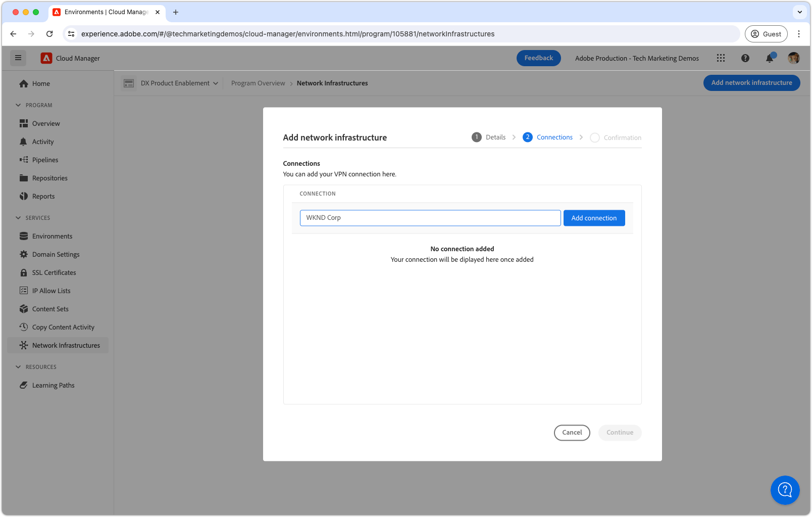
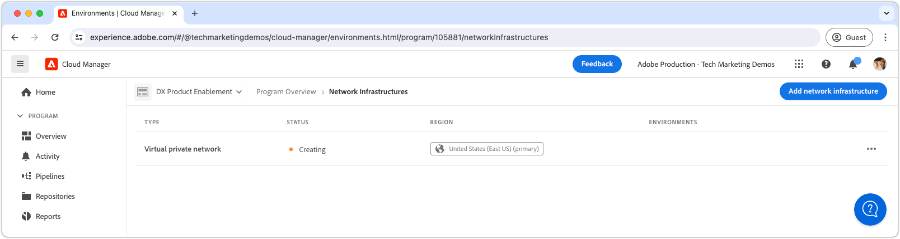

# 虚拟专用网络 (VPN)

了解如何将AEM as a Cloud Service与您的VPN连接起来，以便在AEM和内部服务之间创建安全的通信渠道。

## 什么是虚拟专用网络？

虚拟专用网络(VPN)允许AEM as a Cloud Service客户将Cloud Manager计划中的&#x200B;**AEM环境**&#x200B;连接到现有的[支持的](https://experienceleague.adobe.com/en/docs/experience-manager-cloud-service/content/security/configuring-advanced-networking)个VPN。 VPN允许在AEM as a Cloud Service与客户网络内的服务之间安全且受控的连接。

Cloud Manager程序只能具有&#x200B;__单个__&#x200B;网络基础架构类型。 在执行以下命令之前，请确保虚拟专用网络是您的AEM as a Cloud Service最[合适的网络基础架构类型](https://experienceleague.adobe.com/en/docs/experience-manager-cloud-service/content/security/configuring-advanced-networking)。

>[!NOTE]
>
>请注意，不支持将构建环境从Cloud Manager连接到VPN。 如果必须从专用存储库访问二进制项目，则必须使用公共Internet [上可用的URL设置安全且受密码保护的存储库，如此处](https://experienceleague.adobe.com/en/docs/experience-manager-cloud-service/content/implementing/using-cloud-manager/create-application-project/setting-up-project)所述。

>[!MORELIKETHIS]
>
> 有关虚拟专用网络的更多详细信息，请阅读AEM as a Cloud Service [高级网络配置文档](https://experienceleague.adobe.com/en/docs/experience-manager-cloud-service/content/security/configuring-advanced-networking)。

## 先决条件

使用Cloud Manager API设置虚拟专用网络时，需要满足以下条件：

+ 具有[Cloud Manager业务负责人权限的Adobe帐户](https://developer.adobe.com/experience-cloud/cloud-manager/guides/getting-started/permissions/)
+ 访问[Cloud Manager API的身份验证凭据](https://developer.adobe.com/experience-cloud/cloud-manager/guides/getting-started/create-api-integration/)
   + 组织ID （又称IMS组织ID）
   + 客户端ID（又称API密钥）
   + 访问令牌（又称持有者令牌）
+ Cloud Manager项目ID
+ Cloud Manager环境ID
+ **基于路由的**&#x200B;虚拟专用网络，可访问所有必要的连接参数。

有关更多详细信息，[请查看如何设置、配置和获取Cloud Manger API凭据](https://experienceleague.adobe.com/en/docs/experience-manager-learn/cloud-service/developing/extensibility/app-builder/server-to-server-auth)，以使用这些凭据进行Cloud Manager API调用。

本教程使用`curl`来进行Cloud Manager API配置。 提供的`curl`命令采用Linux/macOS语法。 如果使用Windows命令提示符，请将`\`换行符替换为`^`。

## 为每个项目启用虚拟专用网络

首先在AEM as a Cloud Service上启用“虚拟专用网络”。


>[!BEGINTABS]

>[!TAB Cloud Manager]

可以使用Cloud Manager启用灵活端口出口。 以下步骤概述了如何使用Cloud Manager在AEM as a Cloud Service上启用灵活端口出口。

1. 以Cloud Manager业务负责人身份登录到[Adobe Experience Manager Cloud Manager](https://experience.adobe.com/cloud-manager/)。
1. 导航到所需的项目。
1. 在左侧菜单中，导航到&#x200B;__服务>网络基础架构__。
1. 选择&#x200B;__添加网络基础架构__&#x200B;按钮。

   

1. 在&#x200B;__添加网络基础架构__&#x200B;对话框中，选择&#x200B;__虚拟专用网络__&#x200B;选项。 填写字段并选择&#x200B;__继续__。 请与贵组织的网络管理员合作以获取正确的值。

   

1. 创建至少一个VPN连接。 为连接指定有意义的名称并选择&#x200B;__添加连接__&#x200B;按钮。

   

1. 配置VPN连接。 请与贵组织的网络管理员合作以获取正确的值。 选择&#x200B;__保存__&#x200B;以确认添加连接。

   

1. 如果需要多个VPN连接，请根据需要使用更多连接。 添加所有VPN连接后，选择&#x200B;__继续__。

   

1. 选择&#x200B;__保存__&#x200B;以确认添加VPN和所有配置的连接。

   

1. 等待创建网络基础结构并标记为&#x200B;__就绪__。 此过程最多可能需要1小时。

   

创建VPN后，您现在可以使用Cloud Manager API对其进行配置，如下所述。

>[!TAB Cloud Manager API]

可以使用Cloud Manager API启用虚拟专用网络。 以下步骤概述了如何使用Cloud Manager API在AEM as a Cloud Service上启用VPN。

1. 首先，使用Cloud Manager API [listRegions](https://developer.adobe.com/experience-cloud/cloud-manager/reference/api/)操作确定需要高级联网的区域。 进行后续Cloud Manager API调用需要`region name`。 通常，会使用生产环境所在的区域。

   在[环境的详细信息](https://experienceleague.adobe.com/en/docs/experience-manager-cloud-service/content/implementing/using-cloud-manager/manage-environments)下的[Cloud Manager](https://my.cloudmanager.adobe.com)中查找您的AEM as a Cloud Service环境所在的地区。 Cloud Manager中显示的地区名称可以是[映射到Cloud Manager API中使用的地区代码](https://developer.adobe.com/experience-cloud/cloud-manager/guides/api-usage/creating-programs-and-environments/#creating-aem-cloud-service-environments)。

   __listRegions HTTP请求__

   ```shell
   $ curl -X GET https://cloudmanager.adobe.io/api/program/{programId}/regions \
       -H 'x-gw-ims-org-id: <ORGANIZATION_ID>' \
       -H 'x-api-key: <CLIENT_ID>' \
       -H 'Authorization: Bearer <ACCESS_TOKEN>' \
       -H 'Content-Type: application/json'
   ```

1. 使用Cloud Manager API [createNetworkInfrastructure](https://developer.adobe.com/experience-cloud/cloud-manager/reference/api/)操作为Cloud Manager项目启用虚拟专用网络。 使用从Cloud Manager API `listRegions`操作获得的相应`region`代码。

   __createNetworkInfrastructure HTTP请求__

   ```shell
   $ curl -X POST https://cloudmanager.adobe.io/api/program/{programId}/networkInfrastructures \
       -H 'x-gw-ims-org-id: <ORGANIZATION_ID>' \
       -H 'x-api-key: <CLIENT_ID>' \
       -H 'Authorization: Bearer <ACCESS_TOKEN>' \
       -H 'Content-Type: application/json'
       -d @./vpn-create.json
   ```

   在`vpn-create.json`中定义JSON参数，并通过`... -d @./vpn-create.json`提供给curl。

   [下载示例vpn-create.json](./assets/vpn-create.json)。  此文件只是一个示例。 根据[enableEnvironmentAdvancedNetworkingConfiguration](https://developer.adobe.com/experience-cloud/cloud-manager/reference/api/)中记录的可选/必填字段根据需要配置文件。

   ```json
   {
       "kind": "vpn",
       "region": "va7",
       "addressSpace": [
           "10.104.182.64/26"
       ],
       "dns": {
           "resolvers": [
               "10.151.201.22",
               "10.151.202.22",
               "10.154.155.22"
           ],
           "domains": [
               "wknd.site",
               "wknd.com"
           ]
       },
       "connections": [{
           "name": "connection-1",
           "gateway": {
               "address": "195.231.212.78",
               "addressSpace": [
                   "10.151.0.0/16",
                   "10.152.0.0/16",
                   "10.153.0.0/16",
                   "10.154.0.0/16",
                   "10.142.0.0/16",
                   "10.143.0.0/16",
                   "10.124.128.0/17"
               ]
           },
           "sharedKey": "<secret_shared_key>",
           "ipsecPolicy": {
               "dhGroup": "ECP256",
               "ikeEncryption": "AES256",
               "ikeIntegrity": "SHA256",
               "ipsecEncryption": "AES256",
               "ipsecIntegrity": "SHA256",
               "pfsGroup": "ECP256",
               "saDatasize": 102400000,
               "saLifetime": 3600
           }
       }]
   }
   ```

   等待45-60分钟，让Cloud Manager计划配置网络基础设施。

1. 检查环境是否已使用上一步中从`createNetworkInfrastructure` HTTP请求返回的`id`，使用Cloud Manager API [getNetworkInfrastructure](https://developer.adobe.com/experience-cloud/cloud-manager/reference/api/#operation/getNetworkInfrastructure)操作完成&#x200B;__虚拟专用网络__&#x200B;配置。

   __getNetworkInfrastructure HTTP请求__

   ```shell
   $ curl -X GET https://cloudmanager.adobe.io/api/program/{programId}/networkInfrastructure/{networkInfrastructureId} \
       -H 'x-gw-ims-org-id: <ORGANIZATION_ID>' \
       -H 'x-api-key: <CLIENT_ID>' \
       -H 'Authorization: <YOUR_BEARER_TOKEN>' \
       -H 'Content-Type: application/json'
   ```

   验证HTTP响应是否包含&#x200B;__就绪__&#x200B;的&#x200B;__状态__。 如果尚未准备就绪，请每隔几分钟重新检查一次状态。


创建VPN后，您现在可以使用Cloud Manager API对其进行配置，如下所述。

>[!ENDTABS]

## 为每个环境配置虚拟专用网络代理

1. 使用Cloud Manager API [enableEnvironmentAdvancedNetworkingConfiguration](https://developer.adobe.com/experience-cloud/cloud-manager/reference/api/)操作在每个AEM as a Cloud Service环境中启用和配置&#x200B;__虚拟专用网络__&#x200B;配置。

   __enableEnvironmentAdvancedNetworkingConfiguration HTTP请求__

   ```shell
   $ curl -X PUT https://cloudmanager.adobe.io/api/program/{programId}/environment/{environmentId}/advancedNetworking \
       -H 'x-gw-ims-org-id: <ORGANIZATION_ID>' \
       -H 'x-api-key: <CLIENT_ID>' \
       -H 'Authorization: Bearer <ACCESS_TOKEN>' \
       -H 'Content-Type: application/json' \
       -d @./vpn-configure.json
   ```

   在`vpn-configure.json`中定义JSON参数，并通过`... -d @./vpn-configure.json`提供给curl。

[下载示例vpn-configure.json](./assets/vpn-configure.json)

   ```json
   {
       "nonProxyHosts": [
           "example.net",
           "*.example.org"
       ],
       "portForwards": [
           {
               "name": "mysql.example.com",
               "portDest": 3306,
               "portOrig": 30001
           },
           {
               "name": "smtp.sendgrid.com",
               "portDest": 465,
               "portOrig": 30002
           }
       ]
   }
   ```

   `nonProxyHosts`声明了一组主机，端口80或443应通过默认共享IP地址范围而不是专用出口IP进行路由。 `nonProxyHosts`可能很有用，因为Adobe会自动优化通过共享IP传出的流量。

   对于每个`portForwards`映射，高级联网定义以下转发规则：

   | 代理主机 | 代理端口 |  | 外部主机 | 外部端口 |
   |---------------------------------|----------|----------------|------------------|----------|
   | `AEM_PROXY_HOST` | `portForwards.portOrig` | → | `portForwards.name` | `portForwards.portDest` |

   如果您的AEM部署&#x200B;__仅__&#x200B;需要与外部服务的HTTP/HTTPS连接，请将`portForwards`数组留空，因为只有非HTTP/HTTPS请求才需要这些规则。


2. 对于每个环境，使用Cloud Manager API的[getEnvironmentAdvancedNetworkingConfiguration](https://developer.adobe.com/experience-cloud/cloud-manager/reference/api/)操作验证VPN路由规则是否有效。

   __getEnvironmentAdvancedNetworkingConfiguration HTTP请求__

   ```shell
   $ curl -X GET https://cloudmanager.adobe.io/api/program/{programId}/environment/{environmentId}/advancedNetworking \
       -H 'x-gw-ims-org-id: <ORGANIZATION_ID>' \
       -H 'x-api-key: <CLIENT_ID>' \
       -H 'Authorization: Bearer <ACCESS_TOKEN>' \
       -H 'Content-Type: application/json'
   ```

3. 可以使用Cloud Manager API的[enableEnvironmentAdvancedNetworkingConfiguration](https://developer.adobe.com/experience-cloud/cloud-manager/reference/api/)操作更新虚拟专用网络代理配置。 请记住`enableEnvironmentAdvancedNetworkingConfiguration`是`PUT`操作，因此必须随每次调用此操作提供所有规则。

4. 现在，您可以在自定义AEM代码和配置中使用虚拟专用网络出口配置。

## 通过虚拟专用网络连接到外部服务

启用虚拟专用网络后，AEM代码和配置可以使用它们通过VPN调用外部服务。 AEM对两种外部调用的处理方式有所不同：

1. 对外部服务的HTTP/HTTPS调用
   + 包括对在标准80或443端口以外的端口上运行的服务发出的HTTP/HTTPS调用。
1. 对外部服务的非HTTP/HTTPS调用
   + 包括任何非HTTP调用，例如与Mail服务器、SQL数据库或在其他非HTTP/HTTPS协议上运行的服务的连接。

默认情况下，允许标准端口(80/443)上来自AEM的HTTP/HTTPS请求，但如果配置不正确，请勿使用VPN连接，如下所述。

### HTTP/HTTPS

从AEM创建HTTP/HTTPS连接时，如果使用VPN，则会自动从AEM中代理HTTP/HTTPS连接。 无需其他代码或配置即可支持HTTP/HTTPS连接。

>[!TIP]
>
> 有关[完整的路由规则集](https://experienceleague.adobe.com/en/docs/experience-manager-cloud-service/content/security/configuring-advanced-networking)，请参阅AEM as a Cloud Service的虚拟专用网络文档。

#### 代码示例

<table>
<tr>
<td>
    <a  href="./examples/http-dedicated-egress-ip-vpn.md"></a>
    <div><strong><a href="./examples/http-dedicated-egress-ip-vpn.md">HTTP/HTTPS</a></strong></div>
    <p>
        Java™代码示例使用HTTP/HTTPS协议从AEM as a Cloud Service建立与外部服务的HTTP/HTTPS连接。
    </p>
</td>
<td></td>
<td></td>
</tr>
</table>

### 非HTTP/HTTPS连接代码示例

创建非HTTP/HTTPS连接时(例如 AEM SQL、SMTP等)，必须通过AEM提供的特殊主机名建立连接。

| 变量名称 | 使用 | Java™代码 | OSGi配置 |
| - |  - | - | - |
| `AEM_PROXY_HOST` | 非HTTP/HTTPS连接的代理主机 | `System.getenv("AEM_PROXY_HOST")` | `$[env:AEM_PROXY_HOST]` |


然后，通过`AEM_PROXY_HOST`和映射端口(`portForwards.portOrig`)调用与外部服务的连接，AEM随后将其路由到映射的外部主机名(`portForwards.name`)和端口(`portForwards.portDest`)。

| 代理主机 | 代理端口 |  | 外部主机 | 外部端口 |
|---------------------------------|----------|----------------|------------------|----------|
| `AEM_PROXY_HOST` | `portForwards.portOrig` | → | `portForwards.name` | `portForwards.portDest` |


#### 代码示例

<table><tr>
   <td>
      <a  href="./examples/sql-datasourcepool.md"></a>
      <div>使用JDBC DataSourcePool的<strong><a href="./examples/sql-datasourcepool.md">SQL连接</a></strong></div>
      <p>
            通过配置AEM的JDBC数据源池连接到外部SQL数据库的Java™代码示例。
      </p>
    </td>
   <td>
      <a  href="./examples/sql-java-apis.md"></a>
      <div>使用Java™ API的<strong><a href="./examples/sql-java-apis.md">SQL连接</a></strong></div>
      <p>
            Java™代码示例使用Java™的SQL API连接到外部SQL数据库。
      </p>
    </td>
   <td>
      <a  href="./examples/email-service.md"></a>
      <div><strong><a href="./examples/email-service.md">电子邮件服务</a></strong></div>
      <p>
        使用AEM连接到外部电子邮件服务的OSGi配置示例。
      </p>
    </td>
</tr></table>

### 限制通过VPN访问AEM as a Cloud Service

虚拟专用网络配置限制对AEM as a Cloud Service环境的VPN访问。

#### 配置示例

<table><tr>
   <td>
      <a href="https://experienceleague.adobe.com/en/docs/experience-manager-cloud-service/content/implementing/using-cloud-manager/ip-allow-lists/apply-allow-list"></a>
      <div>列入允许列表 <strong><a href="https://experienceleague.adobe.com/en/docs/experience-manager-cloud-service/content/implementing/using-cloud-manager/ip-allow-lists/apply-allow-list">应用IP</a></strong></div>
      <p>
            列入允许列表配置IP，以便只有VPN通信可以访问AEM。
      </p>
    </td>
   <td>
      <a  href="https://experienceleague.adobe.com/en/docs/experience-manager-cloud-service/content/security/configuring-advanced-networking"></a>
      <div><strong><a href="https://experienceleague.adobe.com/en/docs/experience-manager-cloud-service/content/security/configuring-advanced-networking">对AEM Publish基于路径的VPN访问限制</a></strong></div>
      <p>
            要求AEM Publish上的特定路径具有VPN访问权限。
      </p>
    </td>
   <td></td>
</tr></table>
