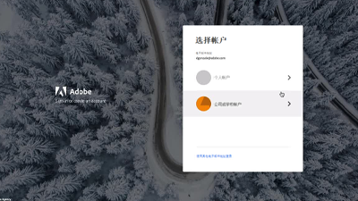

# AEM asCloud Service视频和教程 {#overview}

Adobe Experience Manager (AEM) 现已作为云服务提供。AEM as a Cloud Service引入了新一代Experience Manager产品线，以过去的投资和创新为基础，保留和扩展所有用例和功能。

>[!VIDEO](https://video.tv.adobe.com/v/31085/?quality=12&learn=on)

## 新增功能

* **[基于令牌的身份验证（教程）](https://experienceleague.adobe.com/docs/experience-manager-learn/getting-started-with-aem-headless/authentication/overview.html)**

   *了解如何使用基于令牌的身份验证通过HTTP与AEMas a Cloud Service进行交互*

* **[无头图形QL（教程）](https://experienceleague.adobe.com/docs/experience-manager-learn/getting-started-with-aem-headless/graphql/overview.html)**

   *了解如何使用AEM GraphQL API为外部应用程序中的体验提供动力。*

* **[批量导入（视频）](./migration/bulk-import.md)**

   *了解如何将资产从Azure Blob Storage或Amazon S3批量导入AEM*

* **[asset compute元数据工作程序（教程）](./asset-compute/advanced/metadata.md)**

   *了解如何从Asset compute工作程序将资产元数据写回AEM*

* **[asset compute微服务可扩展性（教程）](./asset-compute/overview.md)**

   *了解如何开发Asset compute工作程序以生成自定义资产演绎版*

## 员工挑选

<table>
   <td>
      
      

         <a href="./accessing/overview.md">
         <strong>配置对AEM教程的访问权限</strong>
         </a>
      

      

         <em>在Adobe Admin Console中配置IMS用户以访问AEM。</em>
      

   </td>   
   <td>
      
      

         <a href="./local-development-environment/overview.md">
         <strong>本地开发环境设置教程</strong>
         </a>
      

      

         <em>为AEMas a Cloud Service开发做好本地开发准备！</em>
      

   </td>   
   <td>
      
      

         <a href="./debugging/aem-sdk-local-quickstart/overview.md">
         <strong>调试AEM SDK</strong>
         </a>
      

      

         <em>浏览用于在AEMas a Cloud ServiceSDK的本地快速启动中调试应用程序的工具。</em>
      

   </td>
</table>

## 其他资源

* [Experience League — 浏览Adobe Experience Manager](https://experienceleague.adobe.com/#recommended/solutions/experience-manager)
* [Adobe Experience Manager as a Cloud Service文档](https://experienceleague.adobe.com/docs/experience-manager-cloud-service/landing/home.html?lang=zh-Hans)
