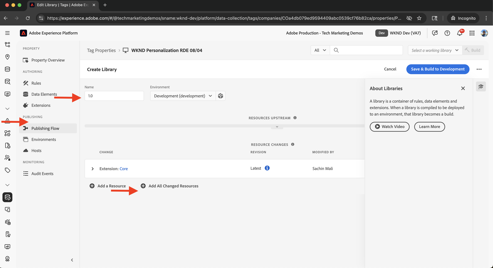

# 在Adobe Experience Platform中集成标记

了解如何将AEM as a Cloud Service (AEMCS)与Adobe Experience Platform中的标记集成。 标记（又称Launch）集成允许您部署Adobe Web SDK并将自定义JavaScript注入到AEM页面中，以便收集数据和进行个性化。

通过该集成，您的营销或开发团队可以管理和部署JavaScript以进行个性化和数据收集，而无需重新部署AEM代码。

## 高级步骤

集成过程涉及四个主要步骤，这些步骤用于在AEM和Tags之间建立连接：

1. **在Adobe Experience Platform中创建、配置和发布Tags属性**
2. **验证AEM中标记的Adobe IMS配置**
3. **在AEM中创建标记配置**
4. **将标记配置应用于您的AEM页面**

## 在Adobe Experience Platform中创建、配置和发布标记属性

首先，在Adobe Experience Platform中创建Tags属性。 此属性可帮助您管理Adobe Web SDK以及个性化和数据收集所需的任何自定义JavaScript的部署。

1. 转到[Adobe Experience Platform](https://experience.adobe.com/platform)，使用您的Adobe ID登录，然后从左侧菜单导航到&#x200B;**标记**。\
   

2. 单击&#x200B;**新建属性**&#x200B;可创建新的Tags属性。\
   

3. 在&#x200B;**创建属性**&#x200B;对话框中，输入以下内容：
   - **属性名称**：标记属性的名称
   - **属性类型**：选择&#x200B;**Web**
   - **域**：部署资产的域（例如，`.adobeaemcloud.com`）

   单击&#x200B;**保存**。

   

4. 打开新资产。 **Core**&#x200B;扩展应已包含。 稍后，您将在设置试验用例时添加&#x200B;**Web SDK**&#x200B;扩展，因为它需要其他配置，如&#x200B;**数据流ID**。\
   

5. 转到&#x200B;**发布流**&#x200B;并单击&#x200B;**添加库**&#x200B;以创建部署库，从而发布Tags属性。
   

6. 在&#x200B;**创建库**&#x200B;对话框中，提供：
   - **名称**：库的名称
   - **环境**：选择&#x200B;**开发**
   - **资源更改**：选择&#x200B;**添加所有更改的资源**

   单击&#x200B;**保存并生成到开发**。

   

7. 要将库发布到生产环境，请单击&#x200B;**批准并发布到生产环境**。 发布完成后，该资产即可在AEM中使用。\
   

## 验证AEM中标记的Adobe IMS配置

在配置AEMCS环境时，它自动包含标记的Adobe IMS配置以及相应的Adobe Developer Console项目。 此配置可确保AEM与Tags之间的安全API通信。

1. 在AEM中，导航到&#x200B;**工具** > **安全性** > **Adobe IMS配置**。\
   

2. 找到&#x200B;**Adobe Launch**&#x200B;配置。 如果可用，请选择它并单击&#x200B;**检查运行状况**&#x200B;以验证连接。 您应该会看到一个成功响应。\
   

## 在AEM中创建标记配置

在AEM中创建标记配置，以指定网站页面所需的属性和设置。

1. 在AEM中，转到&#x200B;**工具** > **Cloud Services** > **Adobe Launch配置**。\
   

2. 选择站点的根文件夹（例如，WKND站点），然后单击&#x200B;**创建**。\
   

3. 在对话框中，输入以下内容：
   - **标题**：例如，“Adobe标记”
   - **IMS配置**：选择已验证的&#x200B;**Adobe Launch** IMS配置
   - **公司**：选择链接到Tags属性的公司
   - **属性**：选择之前创建的Tags属性

   单击&#x200B;**下一步**。

   

4. 出于演示目的，请保留&#x200B;**暂存**&#x200B;和&#x200B;**生产**&#x200B;环境的默认值。 单击&#x200B;**创建**。\
   

5. 选择新创建的配置并单击&#x200B;**发布**&#x200B;以使其可用于您的网站页面。\
   

## 将标记配置应用于您的AEM站点

应用标记配置以将Web SDK和个性化逻辑插入网站页面。

1. 在AEM中，转到&#x200B;**站点**，选择您的根站点文件夹（例如，WKND站点），然后单击&#x200B;**属性**。\
   

2. 在&#x200B;**站点属性**&#x200B;对话框中，打开&#x200B;**高级**&#x200B;选项卡。 在&#x200B;**配置**&#x200B;下，确保为`/conf/wknd`云配置&#x200B;**选择**。\
   

## 验证集成

要确认Tags配置是否正常工作，您可以：

1. 检查AEM发布页面的查看源，或使用浏览器开发人员工具检查该页面
2. 使用[Adobe Experience Platform Debugger](https://chromewebstore.google.com/detail/adobe-experience-platform/bfnnokhpnncpkdmbokanobigaccjkpob)验证Web SDK和JavaScript注入

## 其他资源

- [Adobe Experience Platform Debugger概述](https://experienceleague.adobe.com/zh-hans/docs/experience-platform/debugger/home)
- [Tags 概述](https://experienceleague.adobe.com/zh-hans/docs/experience-platform/tags/home)
