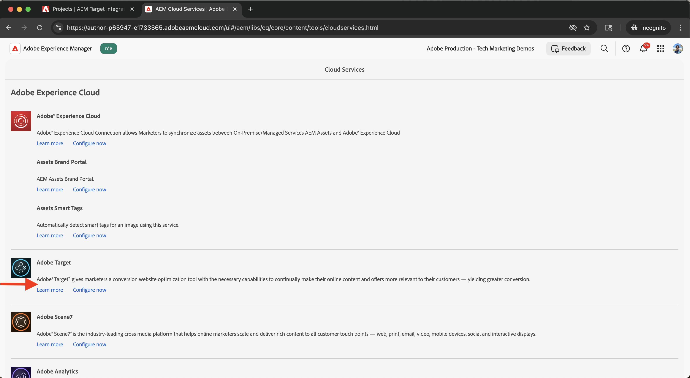

# 集成 Adobe Target

了解如何将AEM as a Cloud Service (AEMCS)与Adobe Target集成以在Adobe Target中激活个性化内容（如体验片段）作为选件。

通过该集成，您的营销团队可以在AEM中集中创建和管理个性化内容。 然后，可在Adobe Target中将此内容无缝激活为选件。

>[!IMPORTANT]
>
>如果您的团队希望完全在Adobe Target中管理选件，而不使用AEM作为集中式内容存储库，则集成步骤是可选的。

## 高级步骤

集成过程涉及四个主要步骤，用于在AEM和Adobe Target之间建立连接：

1. **创建和配置Adobe Developer Console项目**
2. **在AEM中为Target创建Adobe IMS配置**
3. **在AEM中创建旧版Adobe Target配置**
4. **将Adobe Target配置应用于体验片段**

## 创建和配置Adobe Developer Console项目

要使AEM能够与Adobe Target安全通信，您必须使用OAuth服务器到服务器身份验证配置Adobe Developer Console项目。 您可以使用现有项目或创建新项目。

1. 转到[Adobe Developer Console](https://developer.adobe.com/console)并使用您的Adobe ID登录。

2. 创建新项目或选择现有项目。\
   

3. 单击&#x200B;**添加API**。 在&#x200B;**添加API**&#x200B;对话框中，按&#x200B;**Experience Cloud**&#x200B;进行筛选，选择&#x200B;**Adobe Target**，然后单击&#x200B;**下一步**。\
   

4. 在&#x200B;**配置API**&#x200B;对话框中，选择&#x200B;**OAuth服务器到服务器**&#x200B;身份验证方法，然后单击&#x200B;**下一步**。\
   

5. 在&#x200B;**选择产品配置文件**&#x200B;步骤中，选择&#x200B;**默认Workspace**，然后单击&#x200B;**保存配置的API**。\
   

6. 在左侧导航中，选择&#x200B;**OAuth服务器到服务器**并查看配置详细信息。 请注意客户端ID和客户端密码 — 您需要这两个值才能在AEM中配置IMS集成。
   

## 在AEM中为Target创建Adobe IMS配置

在AEM中，使用Adobe Developer Console中的凭据为Target创建Adobe IMS配置。 此配置允许AEM使用Adobe Target API进行身份验证。

1. 在AEM中，导航到&#x200B;**工具** > **安全性**，然后选择&#x200B;**Adobe IMS配置**。\
   

2. 单击&#x200B;**创建**。\
   

3. 在&#x200B;**Adobe IMS技术帐户配置**&#x200B;页面上，输入以下内容：
   - **云解决方案**： Adobe Target
   - **标题**：配置的标签，如“Adobe Target”
   - **授权服务器**： `https://ims-na1.adobelogin.com`
   - **客户端ID**：来自Adobe Developer Console
   - **客户端密钥**：来自Adobe Developer Console
   - **作用域**：来自Adobe Developer Console
   - **组织ID**：来自Adobe Developer Console

   然后单击&#x200B;**创建**。

   

4. 选择配置并单击&#x200B;**检查运行状况**&#x200B;以验证连接。 此时将显示一条成功消息，确认AEM能够连接到Adobe Target。\
   

## 在AEM中创建旧版Adobe Target配置

要将体验片段作为选件导出到Adobe Target，请在AEM中创建旧版Adobe Target配置。

1. 在AEM中，导航到&#x200B;**工具** > **云服务**，然后选择&#x200B;**旧版云服务**。\
   

2. 在 **Adobe Target** 部分中，单击&#x200B;**立即配置**。\
   

3. 在&#x200B;**创建配置**&#x200B;对话框中，输入“Adobe Target旧版”之类的名称，然后单击&#x200B;**创建**。\
   

4. 在&#x200B;**Adobe Target旧版配置**&#x200B;页面上，提供以下内容：
   - **身份验证**： IMS
   - **客户端代码**：您的Adobe Target客户端代码(可在&#x200B;**管理** > **实现**&#x200B;下的Adobe Target中找到)
   - **IMS配置**：您之前创建的IMS配置

   单击&#x200B;**连接到Adobe Target**&#x200B;以验证连接。

   

## 将Adobe Target配置应用于体验片段

将Adobe Target配置与您的体验片段关联，以便可以将其导出并在Target中用作选件。

1. 在AEM中，转到&#x200B;**体验片段**。\
   

2. 选择包含您的体验片段的根文件夹（例如，`WKND Site Fragments`），然后单击&#x200B;**属性**。\
   

3. 在&#x200B;**属性**&#x200B;页面上，打开&#x200B;**云服务**&#x200B;选项卡。 在&#x200B;**Cloud Service配置**&#x200B;部分中，选择您的Adobe Target配置。\
   

4. 在出现的&#x200B;**Adobe Target**&#x200B;部分中，完成以下操作：
   - **Adobe Target导出格式**： HTML
   - **Adobe Target Workspace**：选择要使用的工作区(例如，“默认Workspace”)
   - **外部化器域**：输入用于生成外部URL的域

   

5. 单击&#x200B;**保存并关闭**&#x200B;以应用配置。

## 验证集成

要确认集成是否正常工作，请测试导出功能：

1. 在AEM中，创建一个新的体验片段或打开一个现有的体验片段。 单击工具栏中的&#x200B;**导出到Adobe Target**。\
   

2. 在Adobe Target中，转到&#x200B;**选件**&#x200B;部分，然后验证体验片段是否显示为选件。\
   

## 其他资源

- [Target API概述](https://experienceleague.adobe.com/en/docs/target-dev/developer/api/target-api-overview)
- [目标选件](https://experienceleague.adobe.com/en/docs/target/using/experiences/offers/manage-content)
- [Adobe Developer Console](https://developer.adobe.com/developer-console/docs/guides/)
- AEM中的[体验片段](https://experienceleague.adobe.com/en/docs/experience-manager-learn/sites/experience-fragments/experience-fragments-feature-video-use)
