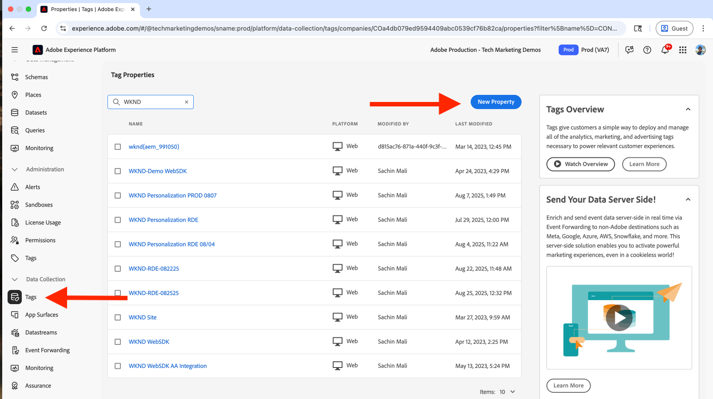
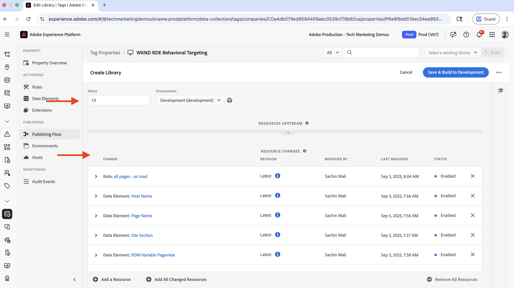
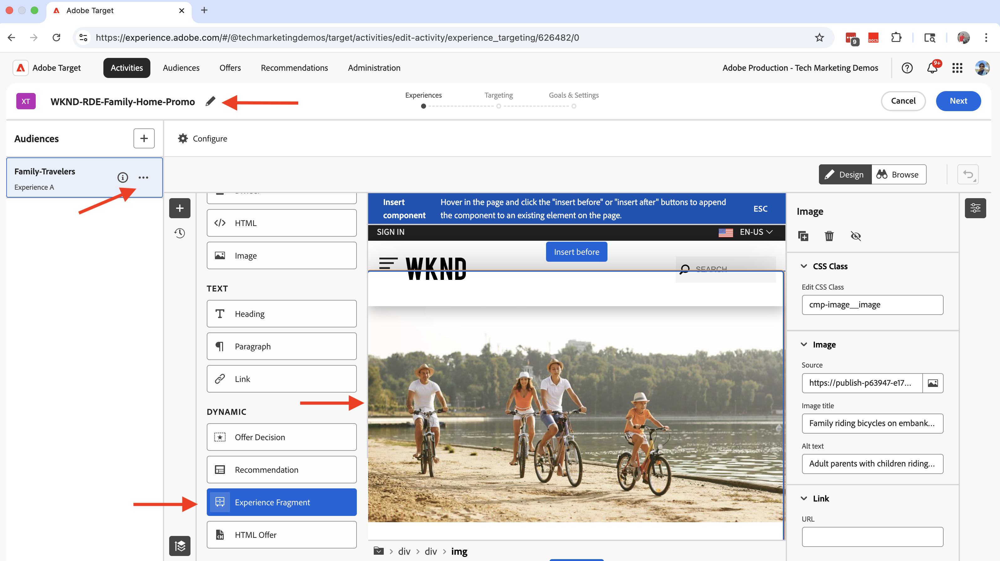

# 行为定位

了解如何使用Adobe Experience Platform (AEP)和Adobe Target根据用户行为使内容个性化。

行为定位可帮助您根据用户行为（例如他们访问的页面、他们浏览的产品或类别）提供下一页面个性化。 常见情况包括：

- **主页部分Personalization**：根据用户的浏览活动，在下一页上显示个性化的主页内容
- **内容元素自定义**：根据用户的浏览活动更改标题、图像或call-to-action按钮
- **页面内容自适应**：根据用户的浏览活动修改整个页面内容

## 演示用例

在本教程中，该过程演示了访问过&#x200B;**巴厘岛冲浪营**、_河滨露营_&#x200B;或&#x200B;_Tahoe滑雪_&#x200B;冒险页面的&#x200B;_匿名用户_&#x200B;如何查看WKND主页的&#x200B;**下一个冒险**&#x200B;部分上显示的个性化主页。


为了进行演示，具有此浏览行为的用户被分类为&#x200B;**家庭旅行者**&#x200B;受众。

### 实时演示

访问[WKND启用网站](https://wknd.enablementadobe.com/us/en.html)以查看行为定位的实际操作情况。 该网站提供了三种不同的行为定位体验：

- **主页**：用户浏览&#x200B;_巴厘岛冲浪营_、_河滨露营_&#x200B;或&#x200B;_太浩滑雪场_&#x200B;冒险页面后访问主页时，他们被分类为&#x200B;**家庭旅行者**&#x200B;受众，并在&#x200B;_下一个冒险_&#x200B;部分上方看到个性化的英雄部分。

- **冒险页面**：当用户查看&#x200B;_巴厘岛冲浪营_&#x200B;或&#x200B;_哥斯达黎加冲浪营_&#x200B;冒险页面时，他们被分类为&#x200B;**冲浪兴趣**&#x200B;受众，并在冒险页面上看到个性化的英雄部分。

- **杂志页面**：用户阅读&#x200B;_三篇或更多_&#x200B;篇文章时，被分类为&#x200B;**杂志读者**&#x200B;受众，并在杂志页面上看到个性化的主页部分。

>[!VIDEO](https://video.tv.adobe.com/v/3474001/?learn=on&enablevpops)

>[!TIP]
>
>第一个受众使用&#x200B;**Edge**&#x200B;评估进行实时个性化，而第二个和第三个受众使用&#x200B;**批处理**&#x200B;评估进行个性化，该评估非常适合于回访访客。

## 先决条件

在继续行为定位用例之前，请确保您已完成以下操作：

- [集成Adobe Target](../setup/integrate-adobe-target.md)：使团队能够在AEM中集中创建和管理个性化内容，并在Adobe Target中将其激活为选件。
- [在Adobe Experience Platform中集成标记](../setup/integrate-adobe-tags.md)：允许团队管理和部署JavaScript以进行个性化和数据收集，而无需重新部署AEM代码。

还熟悉[Adobe Experience Cloud Identity Service (ECID)](https://experienceleague.adobe.com/zh-hans/docs/id-service/using/home)和[Adobe Experience Platform](https://experienceleague.adobe.com/zh-hans/docs/experience-platform/landing/home)概念，如架构、数据流、受众、标识和配置文件。

虽然您可以在Adobe Target中创建简单的受众，但Adobe Experience Platform (AEP)提供了现代方法来创建和管理受众，并使用各种数据源（如行为和事务性数据）构建完整的客户配置文件。

## 高级步骤

行为定位设置过程涉及Adobe Experience Platform、AEM和Adobe Target中的步骤。

1. Adobe Experience Platform中的&#x200B;**：**
   1. 创建和配置架构
   2. 创建和配置数据集
   3. 创建和配置数据流
   4. 创建和配置标记属性
   5. 配置配置配置文件的合并策略
   6. 设置(V2) Adobe Target目标
   7. 创建和配置受众

2. AEM中的&#x200B;**：**
   1. 使用体验片段创建个性化优惠
   2. 将标记属性集成并注入到AEM页面中
   3. 集成Adobe Target并将个性化优惠导出到Adobe Target

3. Adobe Target中的&#x200B;**：**
   1. 验证受众和选件
   2. 创建和配置活动

4. **验证AEM页面上的行为定位实施**

AEP的各种解决方案用于收集、管理和收集行为数据以创建受众。 然后，将在Adobe Target中激活这些受众。 通过使用Adobe Target中的活动，可以向符合受众标准的用户交付个性化体验。

## Adobe Experience Platform步骤

要根据行为数据创建受众，必须在用户访问您的网站或与其交互时收集并存储数据。 在此示例中，要将用户分类为&#x200B;**家庭旅行者**&#x200B;受众，需要收集页面查看数据。 此过程从Adobe Experience Platform中启动，用于设置收集此数据的必要组件。

登录到[Adobe Experience Cloud](https://experience.adobe.com/)，然后从应用程序切换器或快速访问部分导航到&#x200B;**Experience Platform**。


### 创建和配置架构

架构定义您在Adobe Experience Platform中收集的数据的结构和格式。 它可确保数据一致性，并允许您根据标准化数据字段创建有意义的受众。 对于行为定位，需要一个可以捕获页面查看事件和用户交互的架构。

创建一个架构以收集用于行为定位的页面查看数据。

- 在&#x200B;**Adobe Experience Platform**&#x200B;主页中，从左侧导航栏中单击&#x200B;**架构**，然后单击&#x200B;**创建架构**。

  

- 在&#x200B;**创建架构**&#x200B;向导中，对于&#x200B;**架构详细信息**&#x200B;步骤，请选择&#x200B;**体验事件**&#x200B;选项，然后单击&#x200B;**下一步**。

  

- 对于&#x200B;**命名并复查**&#x200B;步骤，请输入以下内容：
   - **架构显示名称**： WKND-RDE-Behavioral-Targeting
   - 已选择&#x200B;**类**： XDM ExperienceEvent

  

- 按如下方式更新架构：
   - **添加字段组**： AEP Web SDK ExperienceEvent
   - **配置文件**：启用

  

- 单击&#x200B;**保存**&#x200B;以创建架构。

### 创建和配置数据集

数据集是适用于遵循特定架构的数据的容器。 它充当收集和整理行为数据的存储位置。 必须为配置文件启用数据集，以允许创建受众和进行个性化。

让我们创建一个数据集以存储页面查看数据。

- 在&#x200B;**Adobe Experience Platform**&#x200B;中，单击左侧导航栏中的&#x200B;**数据集**，然后单击&#x200B;**创建数据集**。
  

- 在&#x200B;**创建数据集**&#x200B;步骤中，选择&#x200B;**从架构创建数据集**&#x200B;选项，然后单击&#x200B;**下一步**。
  

- 在&#x200B;**从架构创建数据集**&#x200B;向导中，对于&#x200B;**选择架构**&#x200B;步骤，请选择&#x200B;**WKND-RDE-Behavioral-Targeting**&#x200B;架构，然后单击&#x200B;**下一步**。
  

- 对于&#x200B;**配置数据集**&#x200B;步骤，请输入以下内容：
   - **名称**： WKND-RDE-Behavioral-Targeting
   - **描述**：用于存储页面查看数据的数据集

  

  单击&#x200B;**完成**&#x200B;以创建数据集。

- 按如下方式更新数据集：
   - **配置文件**：启用

  

### 创建和配置数据流

数据流是一种配置，它定义数据如何通过Web SDK从您的网站流向Adobe Experience Platform。 它在您的网站和平台之间起到桥梁的作用，确保数据格式正确并路由到正确的数据集。 对于行为定位，我们需要启用特定服务，如Edge Segmentation和Personalization Destinations。

让我们创建一个数据流，以通过Web SDK将页面查看数据发送到Experience Platform。

- 在&#x200B;**Adobe Experience Platform**&#x200B;中，单击左侧导航栏中的&#x200B;**数据流**，然后单击&#x200B;**创建数据流**。

- 在&#x200B;**新建数据流**&#x200B;步骤中，输入以下内容：
   - **名称**： WKND-RDE-Behavioral-Targeting
   - **描述**：用于将页面查看数据发送到Experience Platform的数据流
   - **映射架构**： WKND-RDE-Behavioral-Targeting
单击&#x200B;**保存**&#x200B;以创建数据流。

  

- 创建数据流后，单击&#x200B;**添加服务**。

  

- 在&#x200B;**添加服务**&#x200B;步骤中，从下拉列表中选择&#x200B;**Adobe Experience Platform**，然后输入以下内容：
   - **事件数据集**： WKND-RDE-Behavioral-Targeting
   - **配置文件数据集**： WKND-RDE-Behavioral-Targeting
   - **Offer Decisioning**：启用
   - **Edge分段**：启用
   - **Personalization目标**：启用

  单击&#x200B;**保存**&#x200B;以添加该服务。

  

- 在&#x200B;**添加服务**&#x200B;步骤中，从下拉列表中选择&#x200B;**Adobe Target**，并输入&#x200B;**Target环境ID**。 您可以在Adobe Target中的&#x200B;**管理** > **环境**&#x200B;下找到目标环境ID。 单击&#x200B;**保存**&#x200B;以添加该服务。
  

### 创建和配置标记属性

Tags资产是JavaScript代码的容器，用于从您的网站收集数据并将其发送到Adobe Experience Platform。 它充当数据收集层，用于捕获用户交互和页面查看。 对于行为定位，我们收集特定页面详细信息（如页面名称、URL、网站区域和主机名）以创建有意义的受众。

让我们创建一个Tags属性，以在用户访问您的网站时捕获页面查看数据。

对于此用例，将收集页面名称、URL、网站部分和主机名等页面详细信息。 这些详细信息用于创建行为受众。

您可以更新在[集成Adobe标记](../setup/integrate-adobe-tags.md)步骤中创建的Tags属性。 但是，为了使其简单，将创建一个新的Tags属性。

#### 创建标记属性

要创建Tags属性，请完成以下步骤：

- 在&#x200B;**Adobe Experience Platform**&#x200B;中，单击左侧导航栏中的&#x200B;**标记**，然后单击&#x200B;**新建属性**&#x200B;按钮。
  

- 在&#x200B;**创建属性**&#x200B;对话框中，输入以下内容：
   - **属性名称**： WKND-RDE-Behavioral-Targeting
   - **属性类型**：选择&#x200B;**Web**
   - **域**：部署资产的域（例如，`.adobeaemcloud.com`）

  单击&#x200B;**保存**&#x200B;以创建属性。

  

- 打开新属性，从左侧导航栏中单击&#x200B;**扩展**，然后单击&#x200B;**目录**&#x200B;选项卡。 搜索&#x200B;**Web SDK**，然后单击&#x200B;**安装**&#x200B;按钮。
  

- 在&#x200B;**安装扩展**&#x200B;对话框中，选择您之前创建的&#x200B;**数据流**，然后单击&#x200B;**保存**。
  

#### 添加数据元素

数据元素是从您的网站中捕获特定数据点的变量，这些数据点可用于规则和其他标记配置。 它们用作数据收集的构建块，允许您从用户交互和页面查看中提取有意义的信息。 对于行为定位，需要捕获主机名、网站部分和页面名称等页面详细信息才能创建受众区段。

创建以下数据元素以捕获重要页面详细信息。

- 从左侧导航中单击&#x200B;**数据元素**，然后单击&#x200B;**新建数据元素**&#x200B;按钮。
  

- 在&#x200B;**创建新数据元素**&#x200B;对话框中，输入以下内容：
   - **名称**：主机名
   - **扩展**：选择&#x200B;**核心**
   - **数据元素类型**：选择&#x200B;**自定义代码**
   - **打开编辑器**&#x200B;按钮并输入以下代码片段：

     ```javascript
     if(window && window.location && window.location.hostname) {
         return window.location.hostname;
     }
     ```

  

- 同样，创建以下数据元素：

   - **名称**：网站区域
   - **扩展**：选择&#x200B;**核心**
   - **数据元素类型**：选择&#x200B;**自定义代码**
   - **打开编辑器**&#x200B;按钮并输入以下代码片段：

     ```javascript
     if(event && event.component && event.component.hasOwnProperty('repo:path')) {
         let pagePath = event.component['repo:path'];
     
         let siteSection = '';
     
         //Check for html String in URL.
         if (pagePath.indexOf('.html') > -1) { 
         siteSection = pagePath.substring(0, pagePath.lastIndexOf('.html'));
     
         //replace slash with colon
         siteSection = siteSection.replaceAll('/', ':');
     
         //remove `:content`
         siteSection = siteSection.replaceAll(':content:','');
         }
     
         return siteSection 
     }        
     ```

   - **名称**：页面名称
   - **扩展**：选择&#x200B;**核心**
   - **数据元素类型**：选择&#x200B;**自定义代码**
   - **打开编辑器**&#x200B;按钮并输入以下代码片段：

     ```javascript
     if(event && event.component && event.component.hasOwnProperty('dc:title')) {
         // return value of 'dc:title' from the data layer Page object, which is propagated via 'cmp:show' event
         return event.component['dc:title'];
     }        
     ```

- 接下来，创建&#x200B;**变量**&#x200B;类型的数据元素。 此数据元素在发送到Experience Platform之前会填充页面详细信息。

   - **名称**： XDM变量页面视图
   - **扩展**：选择&#x200B;**Adobe Experience Platform Web SDK**
   - **数据元素类型**：选择&#x200B;**变量**

  在右侧面板中，

   - **沙盒**：选择您的沙盒
   - **架构**：选择&#x200B;**WKND-RDE-Behavioral-Targeting**&#x200B;架构

  单击&#x200B;**保存**&#x200B;以创建数据元素。

  

- 在&#x200B;**数据元素**&#x200B;列表中，您应该有四个数据元素：

  

#### 添加规则

规则定义何时以及如何收集数据并将其发送到Adobe Experience Platform。 它们用作逻辑层，可决定在网站上发生特定事件时会发生什么情况。 对于行为定位，可创建规则以捕获页面查看事件，并在将数据元素发送到平台之前使用收集的信息填充数据元素。

创建规则以使用其他数据元素填充&#x200B;**XDM-Variable Pageview**&#x200B;数据元素，然后再将其发送到Experience Platform。 规则在用户浏览WKND网站时触发。

- 从左侧导航栏中单击&#x200B;**规则**，然后单击&#x200B;**创建新规则**&#x200B;按钮。
  

- 在&#x200B;**创建新规则**&#x200B;对话框中，输入以下内容：

   - **名称**：所有页面 — 正在加载

   - 对于&#x200B;**事件**&#x200B;部分，单击&#x200B;**添加**&#x200B;以打开&#x200B;**事件配置**&#x200B;向导。
      - **扩展**：选择&#x200B;**核心**
      - **事件类型**：选择&#x200B;**自定义代码**
      - **打开编辑器**&#x200B;按钮并输入以下代码片段：

        ```javascript
        var pageShownEventHandler = function(evt) {
            // defensive coding to avoid a null pointer exception
            if(evt.hasOwnProperty("eventInfo") && evt.eventInfo.hasOwnProperty("path")) {
                //trigger Launch Rule and pass event
                console.debug("cmp:show event: " + evt.eventInfo.path);
                var event = {
                    //include the path of the component that triggered the event
                    path: evt.eventInfo.path,
                    //get the state of the component that triggered the event
                    component: window.adobeDataLayer.getState(evt.eventInfo.path)
                };
        
                //Trigger the Launch Rule, passing in the new 'event' object
                // the 'event' obj can now be referenced by the reserved name 'event' by other Launch data elements
                // i.e 'event.component['someKey']'
                trigger(event);
            }
        }
        
        //set the namespace to avoid a potential race condition
        window.adobeDataLayer = window.adobeDataLayer || [];
        
        //push the event listener for cmp:show into the data layer
        window.adobeDataLayer.push(function (dl) {
            //add event listener for 'cmp:show' and callback to the 'pageShownEventHandler' function
            dl.addEventListener("cmp:show", pageShownEventHandler);
        });
        ```

   - 对于&#x200B;**条件**&#x200B;部分，单击&#x200B;**添加**&#x200B;以打开&#x200B;**条件配置**&#x200B;向导。
      - **逻辑类型**：选择&#x200B;**常规**
      - **扩展**：选择&#x200B;**核心**
      - **条件类型**：选择&#x200B;**自定义代码**
      - **打开编辑器**&#x200B;按钮并输入以下代码片段：

        ```javascript
        if(event && event.component && event.component.hasOwnProperty('@type') && event.component.hasOwnProperty('xdm:template')) {
            console.log('The cmp:show event is from PAGE HANDLE IT');
            return true;
        }else{
            console.log('The cmp:show event is NOT from PAGE IGNORE IT');
            return false;
        }            
        ```

   - 对于&#x200B;**操作**&#x200B;部分，单击&#x200B;**添加**&#x200B;以打开&#x200B;**操作配置**&#x200B;向导。
      - **扩展**：选择&#x200B;**Adobe Experience Platform Web SDK**
      - **操作类型**：选择&#x200B;**更新变量**
      - 将&#x200B;**web** > **webPageDetails** > **name**&#x200B;映射到&#x200B;**Page Name**&#x200B;数据元素

        

      - 同样，将&#x200B;**服务器**&#x200B;映射到&#x200B;**Host Name**&#x200B;数据元素，将&#x200B;**siteSection**&#x200B;映射到&#x200B;**站点区域**&#x200B;数据元素。 对于&#x200B;**pageView** > **值**，请输入`1`以指示页面查看事件。

      - 单击&#x200B;**保留更改**&#x200B;以保存操作配置。

   - 再次单击&#x200B;**添加**&#x200B;以添加其他操作并打开&#x200B;**操作配置**&#x200B;向导。
      - **扩展**：选择&#x200B;**Adobe Experience Platform Web SDK**
      - **操作类型**：选择&#x200B;**发送事件**
      - 在右侧面板的&#x200B;**数据**&#x200B;部分中，将&#x200B;**XDM变量页面视图**&#x200B;数据元素映射到&#x200B;**Web网页详细信息页面视图**&#x200B;类型。

     

      - 此外，在右侧面板的&#x200B;**Personalization**&#x200B;部分中，选中&#x200B;**呈现可视化个性化决策**&#x200B;选项。  然后，单击&#x200B;**保留更改**&#x200B;以保存操作。

     

   - 单击&#x200B;**保留更改**&#x200B;以保存规则。

- 您的规则应如下所示：

  

上述规则创建步骤包含大量详细信息，因此在创建规则时请务必谨慎。 这听起来可能很复杂，但请记住这些配置步骤，以便可以即插即用，而无需更新AEM代码并重新部署应用程序。

#### 添加库并发布它

库是已构建并部署到网站的所有标记配置（数据元素、规则、扩展）的集合。 它将所有内容打包在一起，以便数据收集正常工作。 对于行为定位，将发布库以使数据收集规则在您的网站上处于活动状态。

- 从左侧导航栏中单击&#x200B;**发布流**，然后单击&#x200B;**添加库**&#x200B;按钮。
  

- 在&#x200B;**添加库**&#x200B;对话框中，输入以下内容：
   - **名称**： 1.0
   - **环境**：选择&#x200B;**开发**
   - 单击&#x200B;**添加所有更改的资源**&#x200B;以选择所有资源。

  单击&#x200B;**保存并生成到开发**&#x200B;以创建库。

  

- 为&#x200B;**开发**&#x200B;泳道构建库后，单击省略号（三个点）并选择&#x200B;**批准并发布到生产环境**&#x200B;选项。
  

恭喜！您已使用规则创建Tags属性以收集页面详细信息并将它们发送到Experience Platform。 这是创建行为受众的基本步骤。

### 配置配置配置文件的合并策略

合并策略定义如何将来自多个源的客户数据统一到单个配置文件中。 它确定当存在冲突时哪些数据优先，确保您对每个客户的行为定位具有完整且一致的视图。

在此用例中，将创建或更新合并策略，即：

- **默认合并策略**：启用
- **Edge上的活动合并策略**：启用

要创建合并策略，请完成以下步骤：

- 在&#x200B;**Adobe Experience Platform**&#x200B;中，单击左侧导航栏中的&#x200B;**配置文件**，然后单击&#x200B;**合并策略**&#x200B;选项卡。

  

- 您可以使用现有的合并策略，但在本教程中，将使用以下配置创建新的合并策略：

  

- 确保同时启用&#x200B;**默认合并策略**&#x200B;和&#x200B;**Edge上的活动合并策略**&#x200B;选项。 这些设置可确保您的行为数据正确统一，并可用于实时受众评估。

### 设置(V2) Adobe Target目标

Adobe Target目标(V2)允许您直接在Adobe Target中激活在Experience Platform中创建的行为受众。 利用此连接，可以将行为受众用于Adobe Target中的个性化活动。

- 在&#x200B;**Adobe Experience Platform**&#x200B;中，从左侧导航栏中单击&#x200B;**目标**，然后单击&#x200B;**目录**&#x200B;选项卡并按&#x200B;**Personalization**&#x200B;进行筛选，然后选择&#x200B;**(v2) Adobe Target**&#x200B;目标。

  

- 在&#x200B;**激活目标**&#x200B;步骤中，提供目标的名称，然后单击&#x200B;**连接到目标**&#x200B;按钮。
  

- 在&#x200B;**目标详细信息**&#x200B;部分中，输入以下内容：
   - **名称**： WKND-RDE-Behavioral-Targeting-Destination
   - **描述**：行为定位受众的目标
   - **数据流**：选择您之前创建的&#x200B;**数据流**
   - **Workspace**：选择您的Adobe Target工作区

  

- 单击&#x200B;**下一步**&#x200B;并完成目标配置。

配置完毕后，此目标允许您将Experience Platform中的行为受众激活到Adobe Target，以用于个性化活动。

### 创建和配置受众

受众根据其行为模式和特征定义特定用户组。 在此步骤中，使用行为数据规则创建了“家庭旅行者”受众。

要创建受众，请完成以下步骤：

- 在&#x200B;**Adobe Experience Platform**&#x200B;中，单击左侧导航栏中的&#x200B;**受众**，然后单击&#x200B;**创建受众**&#x200B;按钮。
  

- 在&#x200B;**创建受众**&#x200B;对话框中，选择&#x200B;**生成规则**&#x200B;选项，然后单击&#x200B;**创建**&#x200B;按钮。
  

- 在&#x200B;**创建**&#x200B;步骤中，输入以下内容：
   - **姓名**：家庭旅行者
   - **描述**：访问过适合家庭的冒险页面的用户
   - **评估方法**：选择&#x200B;**Edge**（用于实时受众评估）

  

- 然后，单击“**事件**”选项卡并导航到&#x200B;**Web** > **网页详细信息**，并将&#x200B;**URL**&#x200B;字段拖放到&#x200B;**事件规则**&#x200B;部分。 将&#x200B;**URL**&#x200B;字段再拖至&#x200B;**事件规则**&#x200B;部分两次。 输入以下值：
   - **URL**：选择&#x200B;**包含**&#x200B;选项并输入`riverside-camping-australia`
   - **URL**：选择&#x200B;**包含**&#x200B;选项并输入`bali-surf-camp`
   - **URL**：选择&#x200B;**包含**&#x200B;选项并输入`gastronomic-marais-tour`

  

- 在&#x200B;**事件**&#x200B;部分中，选择&#x200B;**今天**&#x200B;选项。 您的受众应当如下所示：

  

- 查看受众并单击&#x200B;**激活到目标**&#x200B;按钮。

  

- 在&#x200B;**激活到目标**&#x200B;对话框中，选择您之前创建的Adobe Target目标，然后按照步骤激活受众。

  

- AEP中还没有数据，因此受众数为0。 一旦用户开始访问网站，就会收集数据并增加受众计数。

  

恭喜！您已创建受众并将其激活到Adobe Target目标。

这将完成Adobe Experience Platform步骤，并且流程已准备好在AEM中创建个性化体验并在Adobe Target中使用它。

## AEM步骤

在AEM中，集成了Tags属性以收集页面查看数据并将其发送到Experience Platform。 Adobe Target也已集成，并为&#x200B;**家庭旅行者**&#x200B;受众创建了个性化优惠。 这些步骤使AEM能够与在Experience Platform中创建的行为定位设置配合使用。

我们首先登录到AEM Author服务来创建和配置个性化内容。

- 登录到[Adobe Experience Cloud](https://experience.adobe.com/)，然后从应用程序切换器或快速访问部分导航到&#x200B;**Experience Manager**。

  

- 导航到您的AEM创作环境，然后单击&#x200B;**站点**&#x200B;按钮。
  

### 将标记属性集成并注入到AEM页面中

此步骤将之前创建的Tags属性集成到AEM页面中，从而启用行为定位的数据收集。 Tags属性会自动捕获页面查看数据，并在用户访问您的网站时将其发送到Experience Platform。

要将Tags属性集成到AEM页面，请按照[在Adobe Experience Platform中集成标记](../setup/integrate-adobe-tags.md)中的步骤操作。

请确保使用之前创建的&#x200B;**WKND-RDE-Behavioral-Targeting** Tags属性，而不是其他属性。


集成后，Tags属性会开始从AEM页面收集行为数据，并将其发送到Experience Platform以创建受众。

### 集成Adobe Target并将个性化优惠导出到Adobe Target

此步骤将Adobe Target与AEM集成，并且允许将个性化内容（体验片段）导出到Adobe Target。 通过此连接，Adobe Target可以将在AEM中创建的内容与Experience Platform中创建的行为受众一起用于个性化活动。

要集成Adobe Target并将&#x200B;**家庭旅行者**&#x200B;受众选件导出到Adobe Target，请按照[将Adobe Target集成到Adobe Experience Platform](../setup/integrate-adobe-target.md)中的步骤操作。

确保Target配置已应用于体验片段，以便可以将其导出到Adobe Target以用于个性化活动。

具有Target配置的

集成后，您可以将AEM中的体验片段导出到Adobe Target，并在其中用作行为受众的个性化优惠。

### 为目标受众创建个性化优惠

体验片段是可重复使用的内容组件，可以作为个性化优惠导出到Adobe Target。 对于行为定位，内容是专门为&#x200B;**家庭旅行者**&#x200B;受众创建的，当用户符合行为条件时，将会显示该受众。

为家庭旅客受众创建新的具有个性化内容的体验片段。

- 在AEM中，单击&#x200B;**体验片段**

  

- 导航到&#x200B;**WKND站点片段**&#x200B;文件夹，然后导航到&#x200B;**精选**&#x200B;子文件夹，并单击&#x200B;**创建**&#x200B;按钮。

  

- 在&#x200B;**创建体验片段**&#x200B;对话框中，选择Web变体模板，然后单击&#x200B;**下一步**。

  

- 通过添加Teaser组件创作新创建的体验片段，并使用与家庭旅客相关的内容对其进行自定义。 添加引人注目的标题、描述和call-to-action ，吸引对冒险旅行感兴趣的家庭。

  

- 选择创作的体验片段，然后单击&#x200B;**导出到Adobe Target**&#x200B;按钮。

  

恭喜！您已创作了&#x200B;**家庭旅行者**&#x200B;受众选件并将其导出到Adobe Target。 体验片段现在在Adobe Target中作为个性化选件提供，可用于个性化活动。

## Adobe Target步骤

在Adobe Target中，经验证，在Experience Platform中创建的行为受众和从AEM导出的个性化优惠均正确可用。 然后，创建了一个活动，该活动将受众定位与个性化内容结合起来以提供行为定位体验。

- 登录到[Adobe Experience Cloud](https://experience.adobe.com/)，然后从应用程序切换器或快速访问部分导航到&#x200B;**Adobe Target**。

  

### 验证受众和选件

在创建个性化活动之前，系统会验证Experience Platform中的行为受众和AEM中的个性化选件在Adobe Target中是否正确可用。 这可确保行为定位所需的所有组件都已准备就绪。

- 在Adobe Target中，单击&#x200B;**受众**&#x200B;并验证是否已创建家庭旅客受众。

  

- 通过单击受众，您可以查看受众详细信息并验证其是否已正确配置。

  

- 接下来，单击&#x200B;**选件**，并验证AEM导出的选件是否存在。 在我的示例中，优惠（或体验片段）称为&#x200B;**全家人的冒险体验**。

  

### 创建和配置活动

Adobe Target中的活动是一种个性化营销活动，它定义将个性化内容交付给特定受众的时间和方式。 对于行为定位，将创建一个活动，向符合家庭旅客受众标准的用户显示个性化优惠。

现在，创建了一个活动以向&#x200B;**家庭旅行者**&#x200B;受众的主页提供个性化体验。

- 在Adobe Target中，单击&#x200B;**活动**，然后单击&#x200B;**创建活动**&#x200B;按钮，然后选择&#x200B;**体验定位**&#x200B;活动类型。
  

- 在&#x200B;**创建体验定位活动**&#x200B;对话框中，选择&#x200B;**Web**&#x200B;类型和&#x200B;**可视化**&#x200B;编辑器选项，并输入WKND网站主页URL。 单击&#x200B;**创建**&#x200B;按钮以创建该活动。

  

- 在编辑器中，选择&#x200B;**家庭旅行者**&#x200B;受众，并在&#x200B;**Next Adventure**&#x200B;部分之前添加&#x200B;**全家庭冒险体验**&#x200B;选件。 请参阅下面的屏幕快照以供参考。

  包含受众和选件的

- 单击“下一步”**&#x200B;**&#x200B;并使用适当的目标和量度配置&#x200B;**目标和设置**&#x200B;部分，然后激活它以实时推送更改。

  

恭喜！您已创建并启动该活动，以在WKND网站主页上为&#x200B;**家庭旅行者**&#x200B;受众提供个性化体验。 该活动现已上线，并向符合行为标准的用户显示个性化内容。

## 验证AEM页面上的行为定位实施

现在，完整的行为定位流程已设置，所有内容均已验证为正常工作。 此验证流程可确保数据收集、受众评估和个性化均按预期运行。

验证AEM页面上的行为定位实施。

- 访问已发布的网站（例如，[WKND启用网站](https://wknd.enablementadobe.com/us/en.html)），并浏览&#x200B;_巴厘岛冲浪营_&#x200B;或&#x200B;_河滨露营_&#x200B;或&#x200B;_Tahoe滑雪_&#x200B;冒险页面。 请确保在页面上至少花费30秒来触发页面查看事件并允许收集数据。

- 然后，重新访问主页，您应会在&#x200B;**下一个冒险**&#x200B;部分之前看到&#x200B;**家庭旅行者**&#x200B;受众的个性化体验。

  

- 打开浏览器的开发人员工具并检查&#x200B;**网络**&#x200B;选项卡。 按`interact`筛选以查找Web SDK请求。 该请求应显示Web SDK事件详细信息。

  

- 响应应包括Adobe Target所做的个性化决策，指示您属于&#x200B;**家庭旅行者**&#x200B;受众。

  

恭喜！您已验证AEM页面上的行为定位实施。 现在，从数据收集到受众评估再到个性化的整个流程均可正确运行。

## 实时演示

要查看行为定位的实际操作情况，请访问[WKND启用网站](https://wknd.enablementadobe.com/us/en.html)。 有三种不同的行为定位体验：

- **主页**：对于家庭旅行者受众，_下一个冒险_&#x200B;部分上方将显示个性化的主页优惠。 当用户访问主页并访问&#x200B;_巴厘岛冲浪营_&#x200B;或&#x200B;_河滨露营_&#x200B;或&#x200B;_塔霍滑雪_&#x200B;冒险页面时，该用户被分类为&#x200B;**家庭旅行者**&#x200B;受众。 受众类型为&#x200B;**Edge**，因此评估是实时进行的。

- **冒险页面**：对于冲浪爱好者，将显示包含个性化主页部分的冒险页面。 当用户查看&#x200B;_Bali Surf Camp_&#x200B;或&#x200B;_Surf Camp In Costa Rica_&#x200B;冒险页面时，用户被分类为&#x200B;**冲浪兴趣**&#x200B;受众。 受众类型是&#x200B;**批次**，因此评估不是实时的，而是像一天这样的一段时间。 对回访访客很有用。

  

- **杂志页面**：对于杂志读者，显示带有个性化主页部分的杂志页面。 当用户阅读&#x200B;_三篇或更多_&#x200B;篇文章时，该用户被分类为&#x200B;**杂志读者**&#x200B;受众。 受众类型是&#x200B;**批次**，因此评估不是实时的，而是像一天这样的一段时间。 对回访访客很有用。

  

第一个受众使用&#x200B;**Edge**&#x200B;评估进行实时个性化，而第二个和第三个受众使用&#x200B;**批处理**&#x200B;评估进行个性化，该评估非常适合于回访访客。


## 其他资源

- [Adobe Experience Platform Web SDK](https://experienceleague.adobe.com/zh-hans/docs/experience-platform/web-sdk/home)
- [数据流概述](https://experienceleague.adobe.com/zh-hans/docs/experience-platform/datastreams/overview)
- [可视化体验编辑器(VEC)](https://experienceleague.adobe.com/zh-hans/docs/target/using/experiences/vec/visual-experience-composer)
- [Edge分段](https://experienceleague.adobe.com/zh-hans/docs/experience-platform/segmentation/methods/edge-segmentation)
- [受众类型](https://experienceleague.adobe.com/zh-hans/docs/experience-platform/segmentation/types/overview)
- [Adobe Target连接](https://experienceleague.adobe.com/zh-hans/docs/experience-platform/destinations/catalog/personalization/adobe-target-connection)
