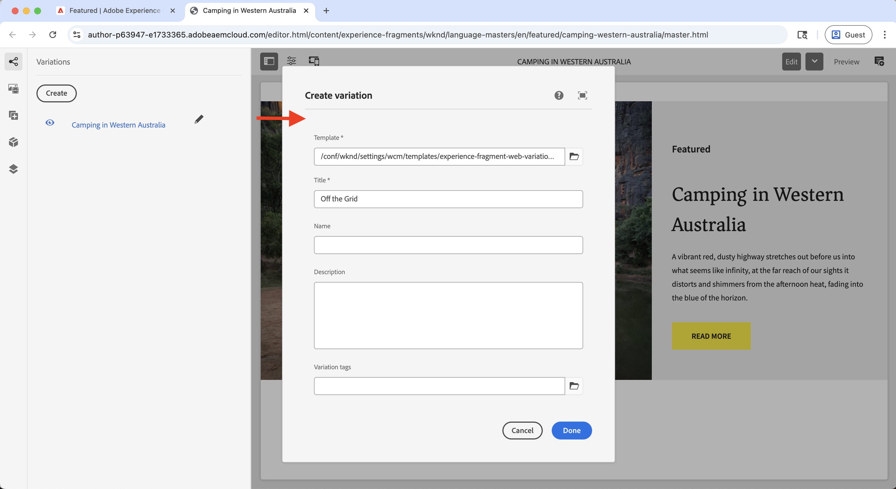
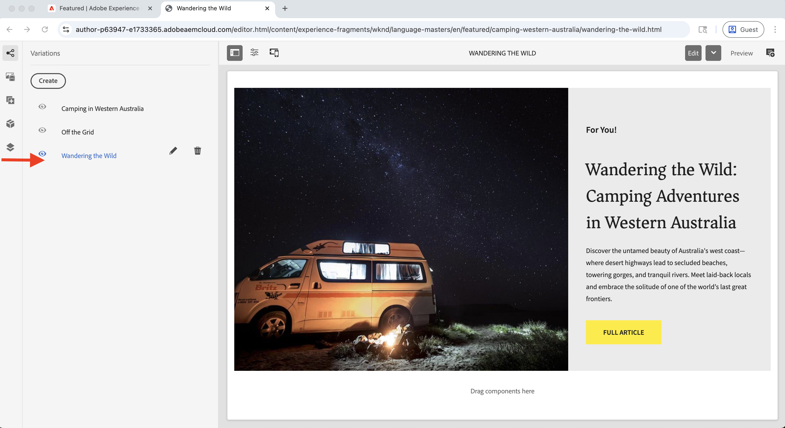
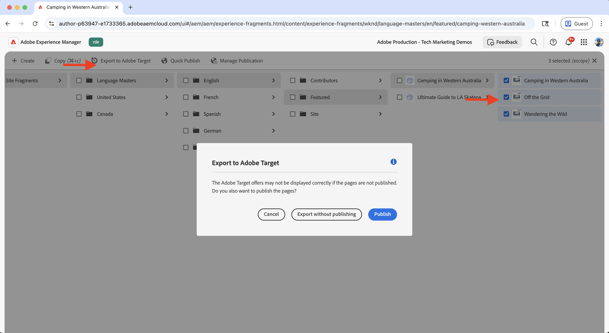
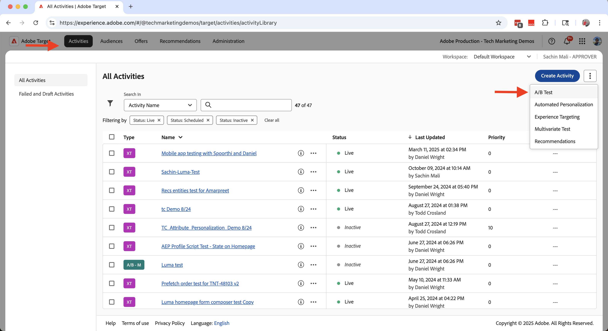
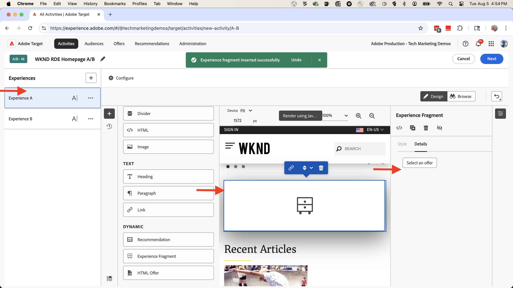

# 试验（A/B测试）

了解如何使用Adobe Target在AEM as a Cloud Service (AEMCS)网站上测试各种内容变体。

A/B测试可帮助您比较不同版本的内容，以确定哪些版本在实现业务目标方面表现更好。 常见情况包括：

- 测试登陆页面上的标题、图像或call-to-action按钮中的变化
- 比较产品详细信息页面的不同布局或设计
- 评估促销优惠或折扣策略

## 演示用例

在本教程中，您将为WKND网站上的&#x200B;**Camping in Western Australia** Experience Fragment (XF)配置A/B测试。 可创建三个XF变体并通过Adobe Target管理A/B测试。

这些变化会显示在WKND主页上，使您能够衡量性能并确定哪些版本可促进更好的参与和转化。

访问[WKND启用网站](https://wknd.enablementadobe.com/us/en.html)以查看A/B测试的实际执行情况。

## 先决条件

在继续使用此试验用例之前，请确保您已完成以下操作：

- [集成Adobe Target](../setup/integrate-adobe-target.md)：使您的团队能够在AEM中集中创建和管理个性化内容，并在Adobe Target中将其激活为选件。
- [在Adobe Experience Platform中集成标记](../setup/integrate-adobe-tags.md)：允许您的团队管理和部署JavaScript以进行个性化和数据收集，而无需重新部署AEM代码。

## 高级步骤

A/B测试设置过程包括创建和配置试验的六个主要步骤：

1. **在AEM中创建内容变体**
2. **将变体作为选件导出到Adobe Target**
3. **在Adobe Target中创建A/B测试活动**
4. **在Adobe Experience Platform中创建并配置数据流**
5. **使用Web SDK扩展更新Tags属性**
6. **验证AEM页面上的A/B测试实施**

## 在AEM中创建内容变体

在此示例中，您使用AEM WKND项目中的&#x200B;**Camping in Western Australia** Experience Fragment (XF)创建三个变体，这些变体将用于WKND网站主页的A/B测试。

1. 在AEM中，单击&#x200B;**体验片段**&#x200B;卡片，导航到&#x200B;**Camping in Western Australia**，然后单击&#x200B;**编辑**。
   

1. 在编辑器的&#x200B;**变体**&#x200B;部分下，单击&#x200B;**创建**，然后选择&#x200B;**变体**。\
   

1. 在&#x200B;**创建变量**&#x200B;对话框中：
   - **模板**：体验片段Web变量模板
   - **标题**：例如，“脱离网格”

   单击&#x200B;**完成**。

   

1. 通过从主要变体复制&#x200B;**Teaser**&#x200B;组件来创作变体，然后自定义内容（例如，更新标题和图像）。\
   

   >[!TIP]
   >您可以使用[生成变体](https://experience.adobe.com/aem/generate-variations/)从主XF快速创建新变体。

1. 重复这些步骤以创建另一个变量（例如，“漫游”）。\
   

   您现在有三个用于A/B测试的体验片段变体。

1. 在使用Adobe Target显示变体之前，您需要从主页中删除现有的静态Teaser。 它可防止内容重复，因为体验片段变量是通过Target动态插入的。

   - 导航到&#x200B;**英语**&#x200B;主页`/content/wknd/language-masters/en`
   - 在编辑器中，删除&#x200B;**Camping in Western Australia** Teaser组件。\
     

1. 将更改转出到&#x200B;**美国>英语**&#x200B;主页(`/content/wknd/us/en`)以传播更新。\
   

1. 发布&#x200B;**美国>英语**&#x200B;主页以启用更新。\
   

## 将变体作为选件导出到Adobe Target

导出体验片段变量，以便它们可以用作Adobe Target中A/B测试的选件。

1. 在AEM中，导航到&#x200B;**Camping in Western Australia**，选择三个变体，然后单击&#x200B;**导出到Adobe Target**。\
   

2. 在Adobe Target中，转到&#x200B;**选件**&#x200B;并确认已导入变体。\
   Adobe Target中的

## 在Adobe Target中创建A/B测试活动

现在，创建A/B测试活动以在主页上运行试验。

1. 安装[Adobe Experience Cloud可视化编辑帮助程序](https://chromewebstore.google.com/detail/adobe-experience-cloud-vi/kgmjjkfjacffaebgpkpcllakjifppnca) Chrome扩展。

1. 在Adobe Target中，导航到&#x200B;**活动**&#x200B;并单击&#x200B;**创建活动**。\
   

1. 在&#x200B;**创建A/B测试活动**&#x200B;对话框中，输入以下内容：
   - **类型**： Web
   - **编辑器**：可视
   - **活动URL**：例如`https://wknd.enablementadobe.com/us/en.html`

   单击&#x200B;**创建**。

   

1. 将活动重命名为有意义的内容（例如，“WKND主页A/B测试”）。\
   

1. 在&#x200B;**体验A**&#x200B;中，在&#x200B;**最近的文章**&#x200B;部分上方添加&#x200B;**体验片段**&#x200B;组件。\
   

1. 在组件对话框中，单击&#x200B;**选择选件**。\
   

1. 选择&#x200B;**Camping in Western Australia**&#x200B;变量，然后单击&#x200B;**添加**。\
   

1. 重复执行&#x200B;**体验B**&#x200B;和&#x200B;**C**，分别选择&#x200B;**离开网格**&#x200B;和&#x200B;**漫游**。\
   

1. 在&#x200B;**定位**&#x200B;部分中，确认流量平均分配到所有体验。\
   

1. 在&#x200B;**目标和设置**&#x200B;中，定义您的成功量度(例如，CTA单击体验片段)。\
   

1. 单击右上角的&#x200B;**激活**&#x200B;以启动测试。\
   

## 在Adobe Experience Platform中创建和配置数据流

要将Adobe Web SDK连接到Adobe Target，请在Adobe Experience Platform中创建数据流。 数据流充当Web SDK和Adobe Target之间的路由层。

1. 在Adobe Experience Platform中，导航到&#x200B;**数据流**&#x200B;并单击&#x200B;**创建数据流**。\
   

1. 在&#x200B;**创建数据流**&#x200B;对话框中，输入数据流的&#x200B;**名称**，然后单击&#x200B;**保存**。\
   

1. 创建数据流后，单击&#x200B;**添加服务**。\
   

1. 在&#x200B;**添加服务**&#x200B;步骤中，从下拉列表中选择&#x200B;**Adobe Target**，并输入&#x200B;**Target环境ID**。 您可以在Adobe Target中的&#x200B;**管理** > **环境**&#x200B;下找到目标环境ID。 单击&#x200B;**保存**&#x200B;以添加该服务。\
   

1. 查看数据流详细信息，以验证是否已列出和正确配置Adobe Target服务。\
   

## 使用Web SDK扩展更新“标记”属性

要从AEM页面发送个性化和数据收集事件，请将Web SDK扩展添加到Tags属性中，并配置在页面加载时触发的规则。

1. 在Adobe Experience Platform中，导航到&#x200B;**标记**&#x200B;并打开您在[集成Adobe标记](../setup/integrate-adobe-tags.md)步骤中创建的属性。
   

1. 从左侧菜单中，单击&#x200B;**扩展**，切换到&#x200B;**目录**&#x200B;选项卡，然后搜索&#x200B;**Web SDK**。 单击右侧面板中的&#x200B;**安装**。\
   

1. 在&#x200B;**安装扩展**&#x200B;对话框中，选择您之前创建的&#x200B;**数据流**，然后单击&#x200B;**保存**。\
   

1. 安装后，请确认&#x200B;**Adobe Experience Platform Web SDK**&#x200B;和&#x200B;**Core**&#x200B;扩展都出现在&#x200B;**已安装**&#x200B;选项卡下。\
   

1. 接下来，配置用于在加载库时发送Web SDK事件的规则。 从左侧菜单导航到&#x200B;**规则**，然后单击&#x200B;**创建新规则**。

   

   >[!TIP]
   >
   >规则允许您根据用户交互或浏览器事件定义标记触发的时间和方式。

1. 在&#x200B;**创建规则**&#x200B;屏幕中，输入规则名称（例如，`All Pages - Library Loaded - Send Event`），然后单击&#x200B;**事件**&#x200B;部分下的&#x200B;**+添加**。
   

1. 在&#x200B;**事件配置**&#x200B;对话框中：
   - **扩展**：选择&#x200B;**核心**
   - **事件类型**：选择&#x200B;**已加载的库（页面顶部）**
   - **名称**：输入`Core - Library Loaded (Page Top)`

   单击&#x200B;**保留更改**&#x200B;以保存事件。

   

1. 在&#x200B;**操作**&#x200B;部分下，单击&#x200B;**+添加**&#x200B;以定义触发事件时发生的操作。

1. 在&#x200B;**操作配置**&#x200B;对话框中：
   - **扩展**：选择&#x200B;**Adobe Experience Platform Web SDK**
   - **操作类型**：选择&#x200B;**发送事件**
   - **名称**：选择&#x200B;**AEP Web SDK — 发送事件**

   

1. 在右侧面板的&#x200B;**Personalization**&#x200B;部分中，选中&#x200B;**呈现可视化个性化决策**&#x200B;选项。 然后，单击&#x200B;**保留更改**&#x200B;以保存操作。\
   

   >[!TIP]
   >
   >   此操作会在页面加载时发送AEP Web SDK事件，从而允许Adobe Target提供个性化内容。

1. 查看已完成的规则，然后单击&#x200B;**保存**。
   

1. 要应用更改，请转到&#x200B;**发布流**，将更新的规则添加到&#x200B;**库**。\
   

1. 最后，将库提升到&#x200B;**生产**。
   

## 验证AEM页面上的A/B测试实施

一旦活动上线且Tags库已发布到生产环境，您就可以在AEM页面上验证A/B测试。

1. 访问已发布的网站（例如，[WKND启用网站](https://wknd.enablementadobe.com/us/en.html)），并观察显示的变量。 尝试从不同的浏览器或移动设备访问它以查看其他变体。
   

1. 打开浏览器的开发人员工具并检查&#x200B;**网络**&#x200B;选项卡。 按`interact`筛选以查找Web SDK请求。 该请求应该包含有关Web SDK事件的详细信息。

   

响应应包括Adobe Target所做的个性化决策，以指示提供了哪个变量。\

1. 或者，您可以使用[Adobe Experience Platform Debugger](https://chromewebstore.google.com/detail/adobe-experience-platform/bfnnokhpnncpkdmbokanobigaccjkpob) Chrome扩展检查Web SDK事件。
   

## 实时演示

要查看A/B测试的实际执行情况，请访问[WKND启用网站](https://wknd.enablementadobe.com/us/en.html)，并观察体验片段的不同变体在主页上的显示方式。

## 其他资源

- [A/B测试概述](https://experienceleague.adobe.com/zh-hans/docs/target/using/activities/abtest/test-ab)
- [Adobe Experience Platform Web SDK](https://experienceleague.adobe.com/zh-hans/docs/experience-platform/web-sdk/home)
- [数据流概述](https://experienceleague.adobe.com/zh-hans/docs/experience-platform/datastreams/overview)
- [可视化体验编辑器(VEC)](https://experienceleague.adobe.com/zh-hans/docs/target/using/experiences/vec/visual-experience-composer)