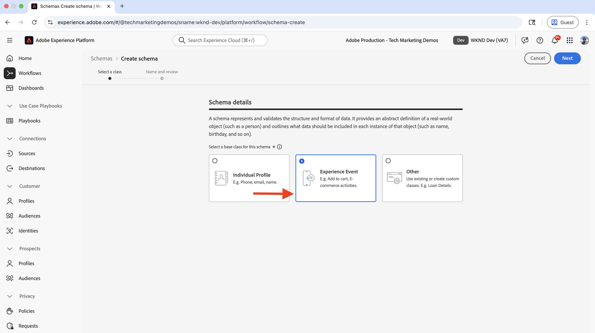
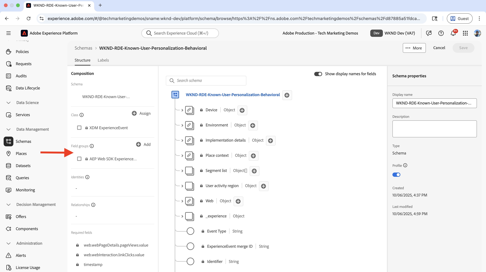
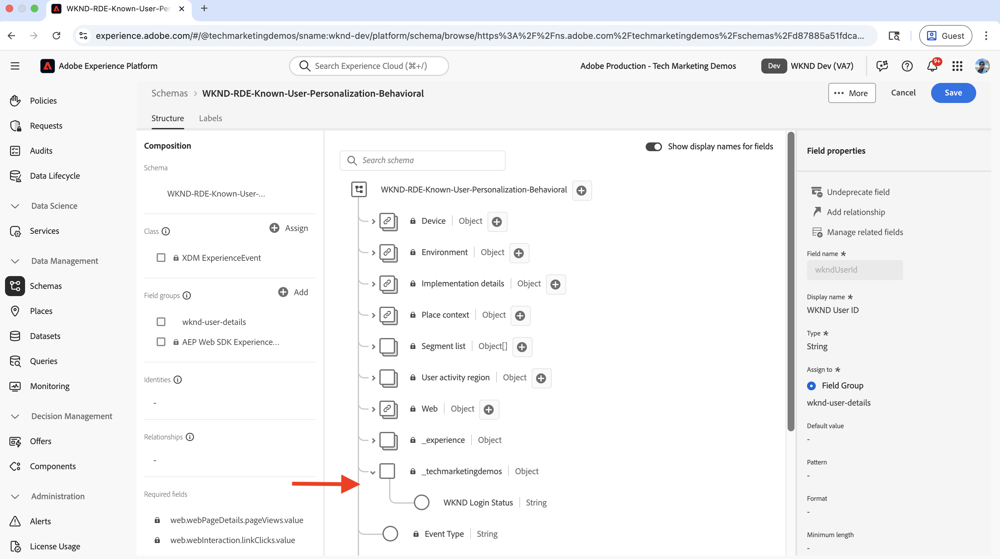
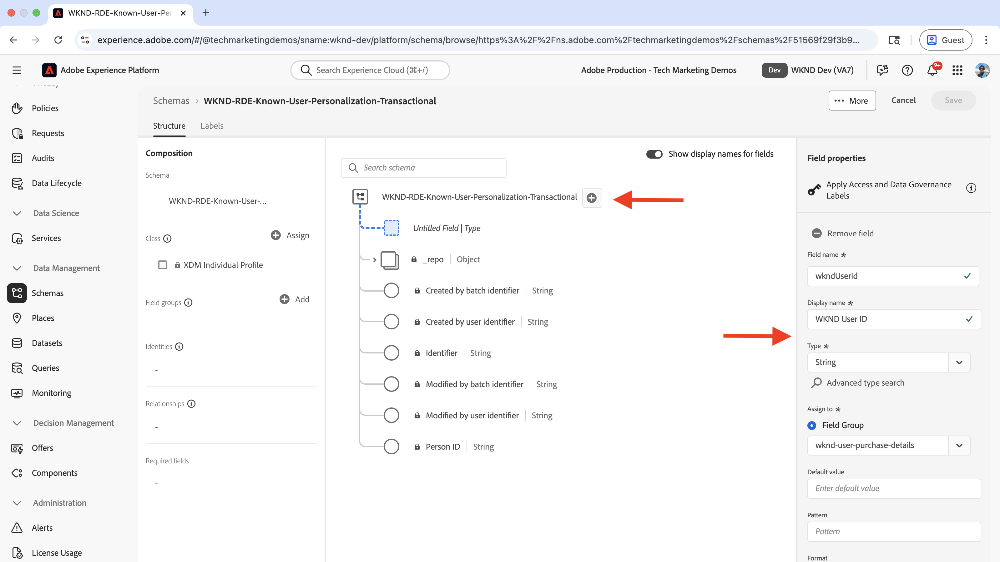
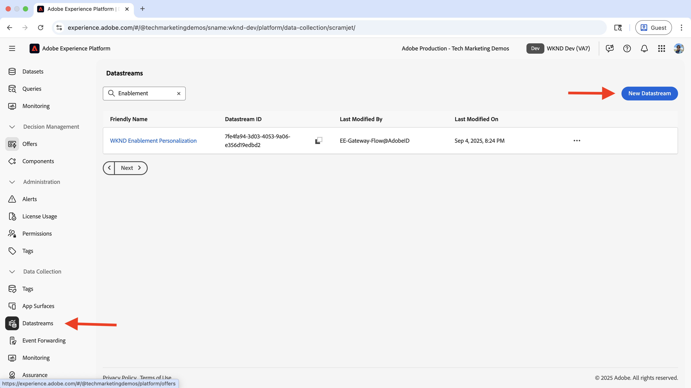
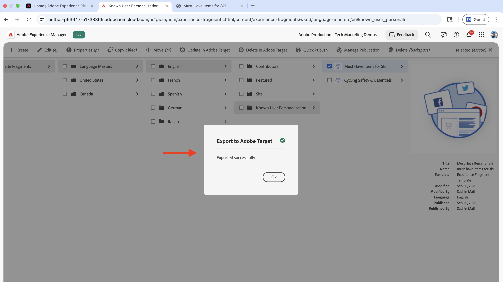
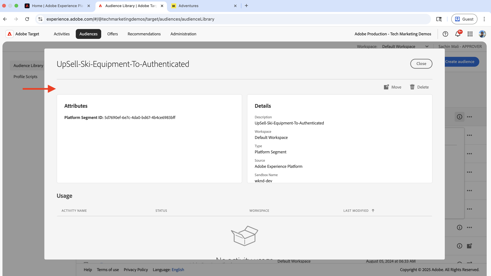
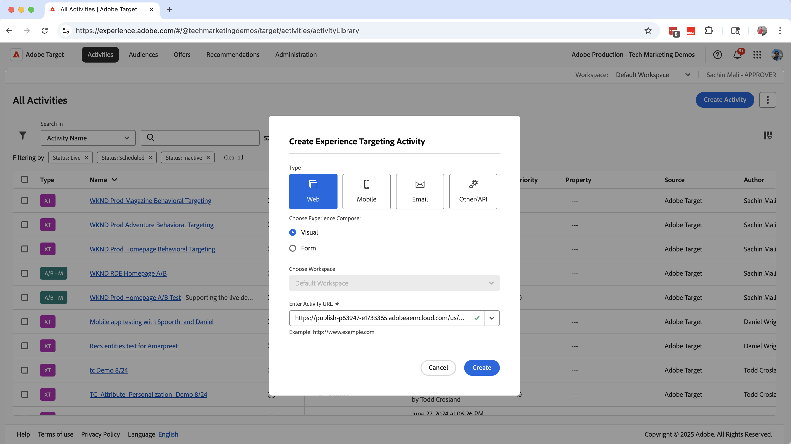

# 已知用户个性化

了解如何根据已知用户数据（如购买历史记录、CRM数据或收集的有关用户的其他数据）个性化内容。

已知用户个性化可帮助您根据所收集的有关用户的数据为用户提供个性化体验。 可能通过不同的系统&#x200B;_或渠道（如网站、移动应用程序、呼叫中心等）收集了_&#x200B;用户数据。 然后，将此&#x200B;_数据拼合在一起以创建完整的用户配置文件_，并用于个性化体验。

常见情况包括：

- **内容个性化**：根据用户的配置文件数据显示个性化体验。 例如，根据用户的购买历史记录，在主页中显示个性化的主页。
- **追加销售和交叉销售**：根据用户的购买历史记录显示个性化的追加销售和交叉销售推荐。 例如，针对用户的购买历史记录显示个性化的追加销售推荐。
- **忠诚度计划**：根据用户的购买历史记录显示个性化的忠诚度计划福利。 例如，针对用户的购买历史记录显示个性化的忠诚度计划福利。

您的组织可能具有不同的已知用户个性化用例。 以上只是一些例子。

## 示例用例

>[!VIDEO](https://video.tv.adobe.com/v/3476119/?captions=chi_hans&learn=on&enablevpops)

在本教程中，使用[示例WKND网站](https://github.com/adobe/aem-guides-wknd)，该过程演示了&#x200B;**登录的用户**&#x200B;如何在&#x200B;**WKND主页**&#x200B;上看到个性化英雄，这些用户已购买了任何&#x200B;**Ski**&#x200B;冒险活动。

英雄体验尝试向已购买任何&#x200B;_滑雪_&#x200B;冒险活动的用户&#x200B;**追加销售**&#x200B;基本的滑雪设备。 未购买任何&#x200B;**Ski**&#x200B;冒险的用户会看到默认的主页内容。 因此，主页体验会根据用户的购买历史记录和登录状态为用户进行个性化。 要启用此个性化，会将来自不同系统的数据拼合在一起，以创建完整的客户配置文件并用于个性化活动。


### 跨系统的用户数据管理

出于演示目的，假设WKND用户数据位于以下系统中。 每个系统存储不同类型的数据，这些数据可以分为两类：

- **行为数据**：捕获数字渠道上的用户交互和活动（页面查看次数、点击次数、网站导航、登录状态、浏览模式）
- **交易数据**：记录已完成的业务交易和客户配置文件信息（采购、订单历史记录、配置文件详细信息、首选项）

| 系统 | 用途 | 存储哪些数据？ | 数据类型 |
|------|------|------|------|
| AEM | 内容管理系统(CMS)、冒险列表和预订以及登录功能 | 用户交互：页面查看次数、登录状态、站点导航。 最小的用户标识符，例如用户ID、姓名、电子邮件。 | 行为数据 |
| 其他系统 | 用户配置文件和采购交易记录作为完整的记录系统。 | 完整的客户配置文件：用户ID、姓名、地址、电话号码、购买历史记录、订单详细信息、首选项。 | 事务性数据 |

另一系统可能是Order Management系统(OMS)、客户关系管理(CRM)系统、主数据管理(MDM)系统或存储事务数据的任何其他系统。

还假定WKND站点具有允许用户购买/预订&#x200B;**冒险**&#x200B;的用户界面(UI)。 AEM与其他系统集成，用于存储冒险购买数据。 此外，在购买之前或购买期间，用户已在WKND网站上创建了帐户。

逻辑图显示了用户与WKND站点的交互情况，以及如何收集行为和事务型数据并将其提供给Experience Platform。


这是一个过度简化的版本，用于演示已知用户个性化的概念。 在现实场景中，您可能具有多个系统，在这些系统中收集和存储行为数据和事务性数据。

### 要点

- **分布式数据存储**：用户数据跨多个系统存储 — AEM存储用于登录功能的最小用户数据（用户ID、姓名、电子邮件），而其他系统(OMS、CRM、MDM)维护完整的用户配置文件和交易数据，如购买历史记录。
- **标识拼接**：系统使用通用标识符（WKND用户ID - `wkndUserId`）链接，该标识符跨不同的平台和渠道唯一标识用户。
- **完成配置文件创建**：目标是拼合来自这些分布式系统的用户数据以创建统一的客户配置文件，然后使用该配置文件提供个性化体验。

您的用例可能具有不同的系统和数据存储。 关键是标识一个通用标识符，该标识符跨不同的平台和渠道唯一标识用户。

## 先决条件

在继续使用已知用户个性化用例之前，请确保您已完成以下操作：

- [集成Adobe Target](../setup/integrate-adobe-target.md)：使团队能够在AEM中集中创建和管理个性化内容，并在Adobe Target中将其激活为选件。
- [在Adobe Experience Platform中集成标记](../setup/integrate-adobe-tags.md)：允许团队管理和部署JavaScript以进行个性化和数据收集，而无需重新部署AEM代码。

还熟悉[Adobe Experience Cloud Identity Service (ECID)](https://experienceleague.adobe.com/zh-hans/docs/id-service/using/home)和[Adobe Experience Platform](https://experienceleague.adobe.com/zh-hans/docs/experience-platform/landing/home)概念，如架构、数据集、数据流、受众、标识和配置文件。

在本教程中，您将了解有关身份拼接以及在Adobe Experience Platform中构建客户个人资料的信息。 因此，将行为数据与事务型数据结合以创建完整的客户用户档案。

## 主要步骤

已知用户的个性化设置过程涉及Adobe Experience Platform、AEM和Adobe Target中的步骤。

1. Adobe Experience Platform中的&#x200B;**：**
   1. 为WKND用户ID (_)创建_&#x200B;身份命名空间`wkndUserId`
   1. 创建和配置两个XDM（体验数据模型）架构（定义如何组织和验证数据的标准化数据结构），一个用于行为数据，另一个用于事务数据
   1. 创建和配置两个数据集，一个用于行为数据，另一个用于事务数据
   1. 创建和配置数据流
   1. 创建和配置标记属性
   1. 配置配置配置文件的合并策略
   1. 设置(V2) Adobe Target目标

2. AEM中的&#x200B;**：**
   1. 增强WKND站点登录功能，将用户ID存储在浏览器的会话存储中。
   1. 将标记属性集成并注入到AEM页面中
   1. 验证AEM页面上的数据收集
   1. 集成 Adobe Target
   1. 创建个性化优惠

3. Adobe Experience Platform中的&#x200B;**：**
   1. 验证行为数据和用户档案创建
   1. 引入事务性数据
   1. 验证行为和事务性数据拼接
   1. 创建和配置受众
   1. 在Adobe Target中激活受众

4. Adobe Target中的&#x200B;**：**
   1. 验证受众和选件
   1. 创建和配置活动

5. **验证您的AEM页面上的已知用户个性化实施**

Adobe Experience Platform (AEP)的各种解决方案用于跨系统收集、管理、识别和拼合用户数据。 使用拼接的用户数据，在Adobe Target中创建并激活受众。 通过使用Adobe Target中的活动，可以向符合受众标准的用户交付个性化体验。

## Adobe Experience Platform设置

要创建完整的客户用户档案，必须收集和存储行为（页面查看数据）和事务性（WKND冒险购买）数据。 使用Tags属性收集行为数据，使用WKND Adventure购买系统收集事务型数据。

然后，将事务型数据摄取到Experience Platform并与行为数据拼合以创建完整的客户用户档案。

在此示例中，要对已购买任何&#x200B;**Ski**&#x200B;冒险的用户进行分类，需要页面查看数据及其冒险购买数据。 数据使用WKND用户ID (`wkndUserId`)拼合在一起，WKND用户ID是跨系统的通用标识符。

让我们登录到Adobe Experience Platform以设置收集和拼合数据所需的组件。

登录到[Adobe Experience Cloud](https://experience.adobe.com/)，然后从应用程序切换器或快速访问部分导航到&#x200B;**Experience Platform**。


### 创建身份命名空间

身份命名空间是一个逻辑容器，用于为身份提供上下文，以帮助Experience Platform了解正在使用的ID系统（例如，电子邮件、CRM ID或忠诚度ID）。 要关联两个或多个离散的配置文件数据，请使用身份命名空间。 当这两个离散的配置文件数据段具有相同的属性值并共享相同的命名空间时，它们就会拼合在一起。 要将属性限定为身份拼接属性，它们必须属于相同的命名空间。

在此示例中，WKND用户ID (`wkndUserId`)是行为数据和事务数据的通用标识符。 使用此通用标识符，可以将数据拼合在一起，以创建完整的客户用户档案。

让我们为WKND用户ID (`wkndUserId`)创建标识命名空间。

- 在&#x200B;**Adobe Experience Platform**&#x200B;中，单击左侧导航栏中的&#x200B;**标识**。 然后单击右上角的&#x200B;**创建身份命名空间**&#x200B;按钮。

  

- 在&#x200B;**创建身份命名空间**&#x200B;对话框中，输入以下内容：
   - **显示名称**： WKND用户ID
   - **描述**：已登录的WKND用户的用户ID或用户名
   - **选择类型**：单个跨设备ID

  单击&#x200B;**创建**&#x200B;以创建身份命名空间。

  

### 创建架构

架构定义您在Adobe Experience Platform中收集的数据的结构和格式。 它可确保数据一致性，并允许您根据标准化数据字段创建有意义的受众。 对于已知用户个性化，需要两个架构，一个用于行为数据，一个用于事务型数据。

#### 行为数据架构

首先，创建一个架构以收集行为数据，如页面查看事件和用户交互。

- 在&#x200B;**Adobe Experience Platform**&#x200B;中，单击左侧导航栏中的&#x200B;**架构**，然后单击右上角的&#x200B;**创建架构**&#x200B;按钮。 然后选择&#x200B;**手动**&#x200B;选项并单击&#x200B;**选择**&#x200B;按钮。

  

- 在&#x200B;**创建架构**&#x200B;向导中，对于&#x200B;**架构详细信息**&#x200B;步骤，选择&#x200B;**体验事件**&#x200B;选项（对于页面查看、点击和用户交互等时间序列数据），然后单击&#x200B;**下一步**。

  

- 对于&#x200B;**命名并复查**&#x200B;步骤，请输入以下内容：
   - **架构显示名称**： WKND-RDE-Known-User-Personalization-Behavioral
   - 已选择&#x200B;**类**： XDM ExperienceEvent

  

- 按如下方式更新架构：
   - **添加字段组**： AEP Web SDK ExperienceEvent
   - **配置文件**：启用

  单击&#x200B;**保存**&#x200B;以创建架构。

  

- 要了解用户是已登录（已通过身份验证）还是匿名，请向架构添加自定义字段。 在此使用案例中，目标是为已购买任何&#x200B;**Ski**&#x200B;冒险的已知用户个性化内容。 因此，确定用户是已登录（已通过身份验证）还是匿名很重要。


   - 单击架构名称旁边的&#x200B;**+**&#x200B;按钮。
   - 在&#x200B;**字段属性**&#x200B;部分中，输入以下内容：
      - **字段名称**： wkndLoginStatus
      - **显示名称**： WKND登录状态
      - **类型**：字符串
      - **分配给**：字段组> `wknd-user-details`

     向下滚动并单击&#x200B;**应用**&#x200B;按钮。

     

- 最终的行为数据架构应如下所示：

  

#### 事务性数据架构

接下来，创建一个架构以收集事务型数据，如WKND冒险购买。

- 在&#x200B;**创建架构**&#x200B;向导中，对于&#x200B;**架构详细信息**&#x200B;步骤，选择&#x200B;**个人配置文件**&#x200B;选项（适用于客户属性、偏好设置和购买历史记录等基于记录的数据），然后单击&#x200B;**下一步**。

  

- 对于&#x200B;**命名并复查**&#x200B;步骤，请输入以下内容：
   - **架构显示名称**： WKND-RDE-Known-User-Personalization-Transactional
   - **选择的类**： XDM个人资料

  

- 要存储用户的WKND冒险购买详细信息，我们首先添加一个自定义字段，作为购买的标识符。 请记住，WKND用户ID (`wkndUserId`)是跨系统的通用标识符。
   - 单击架构名称旁边的&#x200B;**+**&#x200B;按钮。
   - 在&#x200B;**字段属性**&#x200B;部分中，输入以下内容：
      - **字段名**： wkndUserId
      - **显示名称**： WKND用户ID
      - **类型**：字符串
      - **分配给**：字段组> `wknd-user-purchase-details`

  

   - 向下滚动，检查&#x200B;**标识**，检查&#x200B;**主标识**（用于将不同源的数据拼合到统一配置文件中的主标识符），并在&#x200B;**标识命名空间**&#x200B;下拉列表中选择&#x200B;**WKND用户ID**。 最后，单击&#x200B;**应用**&#x200B;按钮。

  

- 添加自定义主标识字段后，架构应如下所示：

  

- 同样，添加以下字段以存储其他用户和冒险购买详细信息：

  | 字段名称 | 显示名称 | 类型 | 分配给 |
  |----------|------------|----|---------|
  | 冒险已购买 | 已购买的冒险 | 字符串 | 字段组> `wknd-user-purchase-details` |
  | adventurePurchaseAmount | 冒险购买金额 | 两倍 | 字段组> `wknd-user-purchase-details` |
  | adventurePurchaseQuantity | 冒险购买数量 | 整数 | 字段组> `wknd-user-purchase-details` |
  | adventurePurchaseDate | 冒险购买日期 | 日期 | 字段组> `wknd-user-purchase-details` |
  | adventureStartDate | 冒险开始日期 | 日期 | 字段组> `wknd-user-purchase-details` |
  | adventureEndDate | 冒险结束日期 | 日期 | 字段组> `wknd-user-purchase-details` |
  | 名字 | 名字 | 字符串 | 字段组> `wknd-user-purchase-details` |
  | 姓氏 | 姓氏 | 字符串 | 字段组> `wknd-user-purchase-details` |
  | 电子邮件 | 电子邮件 | 电子邮件地址 | 字段组> `wknd-user-purchase-details` |
  | 电话 | 手机 | 对象 | 字段组> `wknd-user-purchase-details` |
  | 性别 | 性别 | 字符串 | 字段组> `wknd-user-purchase-details` |
  | 年龄 | 年龄 | 整数 | 字段组> `wknd-user-purchase-details` |
  | 地址 | 地址 | 字符串 | 字段组> `wknd-user-purchase-details` |
  | 城市 | 城市 | 字符串 | 字段组> `wknd-user-purchase-details` |
  | 州/省 | 状态 | 字符串 | 字段组> `wknd-user-purchase-details` |
  | 国家/地区 | 国家/地区 | 字符串 | 字段组> `wknd-user-purchase-details` |
  | zipCode | 邮政编码 | 字符串 | 字段组> `wknd-user-purchase-details` |

  

- 为架构启用配置文件。

  

现在，您已为行为和事务型数据创建了架构。

### 创建和配置数据集

数据集是适用于遵循特定架构的数据的容器。 在此示例中，创建两个数据集，一个用于行为数据，一个用于事务数据。

#### 行为数据集

- 在&#x200B;**Adobe Experience Platform**&#x200B;中，单击左侧导航栏中的&#x200B;**数据集**，然后单击右上方的&#x200B;**创建数据集**&#x200B;按钮。 然后选择&#x200B;**基于架构的**&#x200B;选项，然后单击&#x200B;**下一步**。

  

- 对于&#x200B;**选择架构**&#x200B;步骤，请选择&#x200B;**WKND-RDE-Known-User-Personalization-Behavioral**&#x200B;架构，然后单击&#x200B;**下一步**。

  

- 对于&#x200B;**配置数据集**&#x200B;步骤，请输入以下内容：
   - **名称**： WKND-RDE-Known-User-Personalization-Behavioral
   - **描述**：具有用户登录状态的行为数据（如页面查看次数）的数据集。

  

  单击&#x200B;**完成**&#x200B;以创建数据集。

- 切换&#x200B;**配置文件**&#x200B;开关以启用配置文件的数据集。

  

#### 事务性数据集

- 对事务性数据数据集重复相同的步骤。 唯一的区别是架构和数据集名称。

   - **架构**： WKND-RDE-Known-User-Personalization-Transactional
   - **数据集**： WKND-RDE-Known-User-Personalization-Transactional
   - **描述**：交易数据（如WKND冒险购买）的数据集。
   - **配置文件**：启用

  最终的事务性数据数据集应当如下所示：

  

现在，这两个数据集都已准备就绪，您可以创建一个数据流，以启用从网站到Experience Platform的数据流。

### 创建和配置数据流

数据流是一种配置，它定义数据如何通过Web SDK从您的网站流向Adobe Experience Platform。 它充当您的网站和平台之间的Bridge，确保数据格式正确并路由到正确的数据集。 对于已知用户个性化，请启用Edge分段和Personalization目标等服务。

让我们创建一个数据流，以通过Web SDK将&#x200B;_行为_（而非事务性）数据发送到Experience Platform。

- 在&#x200B;**Adobe Experience Platform**&#x200B;中，单击左侧导航栏中的&#x200B;**数据流**，然后单击&#x200B;**创建数据流**。

  

- 在&#x200B;**新建数据流**&#x200B;步骤中，输入以下内容：

   - **名称**： WKND-RDE-Known-User-Personalization-Behavioral
   - **描述**：用于向Experience Platform发送行为数据的数据流
   - **映射架构**： WKND-RDE-Known-User-Personalization-Behavioral

  

  单击&#x200B;**保存**&#x200B;以创建数据流。

- 创建数据流后，单击&#x200B;**添加服务**。

  

- 在&#x200B;**添加服务**&#x200B;步骤中，从下拉列表中选择&#x200B;**Adobe Experience Platform**，然后输入以下内容：
   - **事件数据集**： WKND-RDE-Known-User-Personalization-Behavioral
   - **配置文件数据集**： WKND-RDE-Known-User-Personalization-Behavioral
   - **Offer Decisioning**：启用(允许Adobe Target实时请求和提供个性化优惠)
   - **Edge分段**：启用（在边缘网络中实时评估受众以立即进行个性化）
   - **Personalization目标**：启用(允许受众与Adobe Target等个性化工具共享)

  单击&#x200B;**保存**&#x200B;以添加该服务。

  

- 在&#x200B;**添加服务**&#x200B;步骤中，从下拉列表中选择&#x200B;**Adobe Target**，并输入&#x200B;**Target环境ID**。 您可以在Adobe Target中的&#x200B;**管理** > **环境**&#x200B;下找到目标环境ID。 单击&#x200B;**保存**&#x200B;以添加该服务。
  

- 最终数据流应如下所示：

  

数据流现在配置为通过Web SDK向Experience Platform发送行为数据。

请注意，_事务性_&#x200B;数据是使用批量摄取摄取到Experience Platform的（一种用于按计划时间间隔而不是实时上传大型数据集的方法）。 WKND Adventure购买数据是使用WKND网站收集的，并存储在其他系统（例如，OMS或CRM或MDM）中。 然后，使用批量摄取将数据摄取到Experience Platform中。

也可以将该数据直接从网站摄取到Experience Platform，本教程未涉及这一点。 用例希望重点介绍跨系统拼合用户数据以及创建完整客户配置文件的过程。

## 创建和配置标记属性

Tags资产是JavaScript代码的容器，用于从您的网站收集数据并将其发送到Adobe Experience Platform。 它充当数据收集层，用于捕获用户交互和页面查看。 对于已知用户个性化以及页面查看数据（例如，页面名称、URL、网站区域和主机名），还会收集用户登录状态和WKND用户ID。 WKND用户ID (`wkndUserId`)作为Identity Map对象的一部分发送。

让我们创建一个Tags属性，以捕获用户访问WKND网站时的页面查看数据和用户登录状态+用户ID（如果已登录）。

您可以更新在[集成Adobe标记](../setup/integrate-adobe-tags.md)步骤中创建的Tags属性。 但是，为了使其简单，将创建一个新的Tags属性。

### 创建标记属性

- 在&#x200B;**Adobe Experience Platform**&#x200B;中，单击左侧导航栏中的&#x200B;**标记**，然后单击&#x200B;**新建属性**&#x200B;按钮。

  

- 在&#x200B;**创建属性**&#x200B;对话框中，输入以下内容：
   - **属性名称**： WKND-RDE-Known-User-Personalization
   - **属性类型**：选择&#x200B;**Web**
   - **域**：部署资产的域（例如，`adobeaemcloud.com`）

  单击&#x200B;**保存**&#x200B;以创建属性。

  

- 打开新属性，从左侧导航栏中单击&#x200B;**扩展**，然后单击&#x200B;**目录**&#x200B;选项卡。 搜索&#x200B;**Web SDK**，然后单击&#x200B;**安装**&#x200B;按钮。
  

- 在&#x200B;**安装扩展**&#x200B;对话框中，选择您之前创建的&#x200B;**数据流**，然后单击&#x200B;**保存**。
  

#### 添加数据元素

数据元素是从您的网站中捕获特定数据点的变量，这些数据点可用于规则和其他标记配置。 它们用作数据收集的构建块，允许您从用户交互和页面查看中提取有意义的信息。 对于已知用户个性化，需要捕获主机名、网站部分和页面名称等页面详细信息，才能创建受众区段。 此外，还需要捕获用户登录状态和WKND用户ID（如果已登录）。

创建以下数据元素以捕获重要页面详细信息。

- 从左侧导航中单击&#x200B;**数据元素**，然后单击&#x200B;**新建数据元素**&#x200B;按钮。
  

- 在&#x200B;**创建新数据元素**&#x200B;对话框中，输入以下内容：
   - **名称**：主机名
   - **扩展**：选择&#x200B;**核心**
   - **数据元素类型**：选择&#x200B;**自定义代码**
   - **打开编辑器**&#x200B;按钮并输入以下代码片段：

     ```javascript
     if(window && window.location && window.location.hostname) {
         return window.location.hostname;
     }        
     ```

  

- 同样，创建以下数据元素：

   - **名称**：网站区域
   - **扩展**：选择&#x200B;**核心**
   - **数据元素类型**：选择&#x200B;**自定义代码**
   - **打开编辑器**&#x200B;按钮并输入以下代码片段：

     ```javascript
     if(event && event.component && event.component.hasOwnProperty('repo:path')) {
         let pagePath = event.component['repo:path'];
     
         let siteSection = '';
     
         //Check of html String in URL.
         if (pagePath.indexOf('.html') > -1) { 
         siteSection = pagePath.substring(0, pagePath.lastIndexOf('.html'));
     
         //replace slash with colon
         siteSection = siteSection.replaceAll('/', ':');
     
         //remove `:content`
         siteSection = siteSection.replaceAll(':content:','');
         }
     
         return siteSection 
     }        
     ```

  

   - **名称**：页面名称
   - **扩展**：选择&#x200B;**核心**
   - **数据元素类型**：选择&#x200B;**自定义代码**
   - **打开编辑器**&#x200B;按钮并输入以下代码片段：

     ```javascript
     if(event && event.component && event.component.hasOwnProperty('dc:title')) {
         // return value of 'dc:title' from the data layer Page object, which is propogated via 'cmp:show' event
         return event.component['dc:title'];
     }
     ```

  


   - **名称**： WKND用户ID
   - **扩展**：选择&#x200B;**核心**
   - **数据元素类型**：选择&#x200B;**自定义代码**
   - **打开编辑器**&#x200B;按钮并输入以下代码片段：

     ```javascript
     // Data element for WKND User ID
     if(event && event.user && event.user.userId) {
         console.log('UserID:', event.user.userId);
         return event.user.userId;
     } else {
         console.log('UserID:');
         return "";
     }        
     ```

  


   - **名称**： WKND用户状态
   - **扩展**：选择&#x200B;**核心**
   - **数据元素类型**：选择&#x200B;**自定义代码**
   - **打开编辑器**&#x200B;按钮并输入以下代码片段：

     ```javascript
     // Data element for user login status
     if(event && event.user && event.user.status) {
         console.log('User status:', event.user.status);
         return event.user.status;
     } else {
         console.log('User status:anonymous');
         return 'anonymous';
     }        
     ```

  

- 接下来，创建&#x200B;**标识映射**&#x200B;类型的数据元素。 身份映射是一种标准XDM结构，用于存储多个用户标识符并将它们链接在一起，从而实现跨系统的身份拼接。 此数据元素用于存储WKND用户ID（如果已登录），作为Identity Map对象的一部分。

   - **名称**： IdentityMap-WKND用户ID
   - **扩展**：选择&#x200B;**Adobe Experience Platform Web SDK**
   - **数据元素类型**：选择&#x200B;**标识映射**

  在右侧面板中，
   - **命名空间**：选择&#x200B;**wkndUserId**
   - **ID**：选择&#x200B;**WKND用户ID**&#x200B;数据元素
   - **身份验证状态**：选择&#x200B;**已身份验证**
   - **Primary**：选择&#x200B;**true**


  单击&#x200B;**保存**&#x200B;以创建数据元素。

  

- 接下来，创建&#x200B;**变量**&#x200B;类型的数据元素。 此数据元素在发送到Experience Platform之前会填充页面详细信息。

   - **名称**： XDM变量页面视图
   - **扩展**：选择&#x200B;**Adobe Experience Platform Web SDK**
   - **数据元素类型**：选择&#x200B;**变量**

  在右侧面板中，
   - **沙盒**：选择您的沙盒
   - **架构**：选择&#x200B;**WKND-RDE-Known-User-Personalization**&#x200B;架构

  单击&#x200B;**保存**&#x200B;以创建数据元素。

  

   - 最终数据元素应当如下所示：

     

#### 添加规则

规则定义何时以及如何收集数据并将其发送到Adobe Experience Platform。 它们用作逻辑层，可决定在网站上发生特定事件时会发生什么情况。 对于已知用户个性化，请创建规则以捕获用户访问WKND网站时的页面查看数据和用户登录状态+用户ID（如果已登录）。

创建规则以使用其他数据元素填充&#x200B;**XDM-Variable Pageview**&#x200B;数据元素，然后再将其发送到Experience Platform。 规则在用户浏览WKND网站时触发。

- 从左侧导航栏中单击&#x200B;**规则**，然后单击&#x200B;**创建新规则**&#x200B;按钮。
  

- 在&#x200B;**创建新规则**&#x200B;对话框中，输入以下内容：
   - **名称**：所有页面 — 正在加载 — 包含用户数据

   - 对于&#x200B;**事件**&#x200B;部分，单击&#x200B;**添加**&#x200B;以打开&#x200B;**事件配置**&#x200B;向导。
      - **扩展**：选择&#x200B;**核心**
      - **事件类型**：选择&#x200B;**自定义代码**
      - **打开编辑器**&#x200B;按钮并输入以下代码片段：

     ```javascript
     var pageShownEventHandler = function(evt) {
         // defensive coding to avoid a null pointer exception
         if(evt.hasOwnProperty("eventInfo") && evt.eventInfo.hasOwnProperty("path")) {
             //trigger Launch Rule and pass event
             console.debug("cmp:show event: " + evt.eventInfo.path);
     
             // Get user data from session storage
             var userData = getUserDataFromSession();
     
             var event = {
                 //include the path of the component that triggered the event
                 path: evt.eventInfo.path,
                 //get the state of the component that triggered the event
                 component: window.adobeDataLayer.getState(evt.eventInfo.path),
                 //include user data in the event
                 user: userData
             };
     
             //Trigger the Launch Rule, passing in the new 'event' object
             trigger(event);
         }
     }
     
     /**
      * Get user data from session storage
     */
     function getUserDataFromSession() {
         var userData = {
             userId: null,
             status: 'anonymous'
         };
     
         try {
             var cachedUserState = sessionStorage.getItem('wknd_user_state');
     
             if (cachedUserState) {
                 var userState = JSON.parse(cachedUserState);
                 var userInfo = userState.data;
     
                 // Validate user data structure before transformation
                 if (userInfo && typeof userInfo === 'object' && userInfo.hasOwnProperty('authorizableId')) {
                     // Transform AEM user data to minimal AEP format
                     userData = {
                         userId: userInfo.authorizableId !== 'anonymous' ? userInfo.authorizableId : null,
                         status: userInfo.authorizableId === 'anonymous' ? 'anonymous' : 'authenticated',
                     };
     
                     //console.log('User details from session storage:', userData.username || 'Anonymous');
                 } else {
                     console.warn('Invalid user data structure in session storage');
                     console.log('Using anonymous user data');
                 }
             } else {
                 console.log('No user data in session storage, using anonymous');
             }
         } catch (e) {
             console.warn('Failed to read user data from session storage:', e);
             console.log('Using anonymous user data');
         }
     
         return userData;
     }
     
     //set the namespace to avoid a potential race condition
     window.adobeDataLayer = window.adobeDataLayer || [];
     
     //push the event listener for cmp:show into the data layer
     window.adobeDataLayer.push(function (dl) {
         //add event listener for 'cmp:show' and callback to the 'pageShownEventHandler' function
         dl.addEventListener("cmp:show", pageShownEventHandler);
     });
     ```

     请注意，`getUserDataFromSession`函数用于从会话存储中获取用户登录状态和WKND用户ID（如果已登录）。 AEM代码负责使用用户登录状态和WKND用户ID填充会话存储。 在AEM特定的步骤中，您增强了WKND站点登录功能，以将用户ID存储在浏览器的会话存储中。

   - 对于&#x200B;**条件**&#x200B;部分，单击&#x200B;**添加**&#x200B;以打开&#x200B;**条件配置**&#x200B;向导。
      - **逻辑类型**：选择&#x200B;**常规**
      - **扩展**：选择&#x200B;**核心**
      - **条件类型**：选择&#x200B;**自定义代码**
      - **打开编辑器**&#x200B;按钮并输入以下代码片段：

     ```javascript
     if(event && event.component && event.component.hasOwnProperty('@type') && event.component.hasOwnProperty('xdm:template')) {
         console.log('The cmp:show event is from PAGE HANDLE IT');
         return true;
     } else {
         console.log('The event is NOT from PAGE - IGNORE IT');
         return false;
     }
     ```

   - 对于&#x200B;**操作**&#x200B;部分，单击&#x200B;**添加**&#x200B;以打开&#x200B;**操作配置**&#x200B;向导。
      - **扩展**：选择&#x200B;**Adobe Experience Platform Web SDK**
      - **操作类型**：选择&#x200B;**更新变量**

      - 将XDM字段映射到数据元素：

        | XDM字段 | 数据元素 |
        |----------|------------|
        | web.webPageDetails.name | 页面名称 |
        | web.webPageDetails.server | 主机名 |
        | web.webPageDetails.siteSection | 网站区域 |
        | web.webPageDetails.value | 1 |
        | identityMap | IdentityMap-WKND用户ID |
        | _$YOUR_NAMESPACE$.wkndLoginStatus | WKND用户状态 |

     

      - 单击&#x200B;**保留更改**&#x200B;以保存操作配置。

   - 再次单击添加以添加其他操作并打开操作配置向导。

      - **扩展**：选择&#x200B;**Adobe Experience Platform Web SDK**
      - **操作类型**：选择&#x200B;**发送事件**
      - 在右侧面板的&#x200B;**数据**&#x200B;部分中，将&#x200B;**XDM变量页面视图**&#x200B;数据元素映射到&#x200B;**Web网页详细信息页面视图**&#x200B;类型。

     

   - 此外，在右侧面板的&#x200B;**Personalization**&#x200B;部分中，选中&#x200B;**呈现可视化个性化决策**&#x200B;选项。 然后单击&#x200B;**保留更改**&#x200B;以保存操作。

     

- 您的规则应如下所示：

  

现在，该规则配置为将页面查看数据和用户登录状态+用户ID（如果已登录）发送到Experience Platform。

上述规则创建步骤包含大量详细信息，因此在创建规则时请务必谨慎。 这听起来可能很复杂，但请记住这些配置步骤，以便可以即插即用，而无需更新AEM代码并重新部署应用程序。

#### 添加和发布标记库

库是已构建并部署到网站的所有标记配置（数据元素、规则、扩展）的集合。 它将所有内容打包在一起，以便数据收集正常工作。 对于已知用户个性化，将发布库以使数据收集规则在您的网站上处于活动状态。

- 从左侧导航栏中单击&#x200B;**发布流**，然后单击&#x200B;**添加库**&#x200B;按钮。
  

- 在&#x200B;**添加库**&#x200B;对话框中，输入以下内容：
   - **名称**： 1.0
   - **环境**：选择&#x200B;**开发**
   - 单击&#x200B;**添加所有更改的资源**&#x200B;以选择所有资源。

  单击&#x200B;**保存并生成到开发**&#x200B;以创建库。

  

- 要将库发布到生产环境，请单击&#x200B;**批准并发布到生产环境**。 发布完成后，该资产即可在AEM中使用。
  

库现已发布，可以从AEM页面中收集数据。

### 配置配置配置文件的合并策略

合并策略定义如何将来自多个源的客户数据统一到单个配置文件中。 它确定发生冲突时哪些数据优先，确保您对每个客户的已知用户个性化拥有完整且一致的视图。

- 在&#x200B;**Adobe Experience Platform**&#x200B;中，单击左侧导航栏中的&#x200B;**配置文件**，然后单击&#x200B;**合并策略**&#x200B;选项卡。

  

对于此用例，将创建一个合并策略。 但是，如果您有合并策略，则可以使用现有合并策略。 确保同时启用&#x200B;**默认合并策略**&#x200B;和&#x200B;**Edge上的活动合并策略**&#x200B;选项（这允许边缘网络中可用的配置文件数据用于实时个性化决策）。

这些设置可确保行为数据和事务数据正确统一，并可用于实时受众评估。


### 设置(V2) Adobe Target目标

Adobe Target目标(V2)允许您直接在Adobe Target中激活在Experience Platform中创建的受众。 利用此连接，可在Adobe Target中将受众用于个性化活动。

- 在&#x200B;**Adobe Experience Platform**&#x200B;中，从左侧导航栏中单击&#x200B;**目标**，然后单击&#x200B;**目录**&#x200B;选项卡。 搜索&#x200B;**Personalization**&#x200B;并选择&#x200B;**(v2) Adobe Target**&#x200B;目标。

  

- 在&#x200B;**激活目标**&#x200B;步骤中，提供目标的名称，然后单击&#x200B;**连接到目标**&#x200B;按钮。
  

- 在&#x200B;**目标详细信息**&#x200B;部分中，输入以下内容：
   - **名称**： WKND-RDE-Known-User-Personalization-Destination
   - **描述**：已知用户个性化的目标
   - **数据流**：选择您之前创建的&#x200B;**数据流**
   - **Workspace**：选择您的Adobe Target工作区

  

- 单击&#x200B;**下一步**&#x200B;并完成目标配置。

  

配置完毕后，此目标允许您将在Experience Platform中创建的受众激活到Adobe Target，以用于个性化活动。

## AEM设置

在以下步骤中，您将增强WKND站点登录功能，以便在浏览器的会话存储中存储用户ID，并将标记属性集成和插入AEM页面。

tags属性将插入到AEM页面中，以收集用户访问WKND网站时的页面查看数据和用户登录状态+用户ID（如果已登录）。 Adobe Target集成使您能够向Adobe Target导出个性化优惠。

### 增强WKND站点登录功能

要增强WKND站点登录功能，请从GitHub克隆[WKND站点项目](https://github.com/adobe/aem-guides-wknd)，创建一个新功能分支，并在您喜爱的IDE中将其打开。

```shell
$ mkdir -p ~/Code
$ git clone git@github.com:adobe/aem-guides-wknd.git
$ cd aem-guides-wknd
$ git checkout -b feature/known-user-personalization
```

- 导航到`ui.frontend`模块并打开`ui.frontend/src/main/webpack/components/form/sign-in-buttons/sign-in-buttons.js`文件。 查看代码，在对`currentuser.json`进行AJAX调用后，它会根据用户登录状态显示登录或注销按钮。

- 更新代码以将用户ID存储在浏览器的会话存储中，并优化代码以避免对`currentuser.json`进行多个AJAX调用。

  ```javascript
  import jQuery from "jquery";
  
  jQuery(function($) {
      "use strict";
  
      (function() {
          const currentUserUrl = $('.wknd-sign-in-buttons').data('current-user-url'),
              signIn = $('[href="#sign-in"]'),
              signOut = $('[href="#sign-out"]'),
              greetingLabel = $('#wkndGreetingLabel'),
              greetingText = greetingLabel.text(),
              body = $('body');
  
          // Cache configuration
          const CACHE_KEY = 'wknd_user_state';
          const CACHE_DURATION = 5 * 60 * 1000; // 5 minutes in milliseconds
  
          /**
           * Get cached user state from session storage
           */
          function getCachedUserState() {
              try {
                  const cached = sessionStorage.getItem(CACHE_KEY);
                  if (cached) {
                      const userState = JSON.parse(cached);
                      const now = Date.now();
  
                      // Check if cache is still valid
                      if (userState.timestamp && (now - userState.timestamp) < CACHE_DURATION) {
                          return userState.data;
                      } else {
                          // Cache expired, remove it
                          sessionStorage.removeItem(CACHE_KEY);
                      }
                  }
              } catch (e) {
                  console.warn('Failed to read cached user state:', e);
                  sessionStorage.removeItem(CACHE_KEY);
              }
              return null;
          }
  
          /**
           * Cache user state in session storage
           */
          function cacheUserState(userData) {
              try {
                  const userState = {
                      data: userData,
                      timestamp: Date.now()
                  };
                  sessionStorage.setItem(CACHE_KEY, JSON.stringify(userState));
              } catch (e) {
                  console.warn('Failed to cache user state:', e);
              }
          }
  
          /**
           * Clear cached user state
           */
          function clearCachedUserState() {
              try {
                  sessionStorage.removeItem(CACHE_KEY);
              } catch (e) {
                  console.warn('Failed to clear cached user state:', e);
              }
          }
  
          /**
           * Update UI based on user state
           */
          function updateUI(userData) {
              const isAnonymous = 'anonymous' === userData.authorizableId;
  
              if(isAnonymous) {
                  signIn.show();
                  signOut.hide();
                  greetingLabel.hide();
                  body.addClass('anonymous');
              } else {
                  signIn.hide();
                  signOut.show();
                  greetingLabel.text(greetingText + ", " + userData.name);
                  greetingLabel.show();
                  body.removeClass('anonymous');
              }
          }
  
          /**
           * Fetch user data from AEM endpoint
           */
          function fetchUserData() {
              return $.getJSON(currentUserUrl + "?nocache=" + new Date().getTime())
                  .fail(function(xhr, status, error) {
                      console.error('Failed to fetch user data:', error);
                      updateUI({ authorizableId: 'anonymous' });
                  });
          }
  
          /**
           * Initialize user state (check cache first, then fetch if needed)
           */
          function initializeUserState() {
              const cachedUserState = getCachedUserState();
  
              if (cachedUserState) {
                  updateUI(cachedUserState);
              } else {
                  fetchUserData().done(function(currentUser) {
                      updateUI(currentUser);
                      cacheUserState(currentUser);
                  });
              }
          }
  
          // Initialize user state
          initializeUserState();
  
          // Clear cache on sign-in/sign-out clicks
          $(document).on('click', '[href="#sign-in"], [href="#sign-out"]', function() {
              clearCachedUserState();
          });
  
          // Clear cache when modal is shown
          $('body').on('wknd-modal-show', function() {
              clearCachedUserState();
          });
  
          // Clear cache when on dedicated sign-in page
          if (window.location.pathname.includes('/sign-in') || window.location.pathname.includes('/errors/sign-in')) {
              clearCachedUserState();
          }
  
          // Clear cache when sign-in form is submitted
          $(document).on('submit', 'form[id*="sign-in"], form[action*="login"]', function() {
              clearCachedUserState();
          });
  
          // Clear cache on successful login redirect
          const urlParams = new URLSearchParams(window.location.search);
          if (urlParams.has('login') || urlParams.has('success') || window.location.hash === '#login-success') {
              clearCachedUserState();
          }
  
          // Debug function for testing
          window.debugUserState = function() {
              console.log('Cache:', sessionStorage.getItem('wknd_user_state'));
              clearCachedUserState();
              initializeUserState();
          };
  
      })();
  });
  ```

  请注意，Tags属性规则依赖于存储在浏览器的会话存储中的用户ID。 `wknd_user_state`键是AEM代码和用于存储和检索用户ID的Tags属性规则之间的通用协定。

- 通过构建项目并在本地运行该项目在本地验证更改。

  ```shell
  $ mvn clean install -PautoInstallSinglePackage
  ```

  使用`asmith/asmith` （或您创建的任何其他用户）凭据登录，它们是[项目中的](https://github.com/adobe/aem-guides-wknd/blob/main/ui.content.sample/src/main/content/jcr_root/home/users/wknd/l28HasMYWAMHAaGkv-Lj/.content.xml)包含`aem-guides-wknd`。

  

  在我的案例中，我创建了一个ID为`teddy`的新用户来进行测试。

- 确认用户ID已存储在浏览器的会话存储中（使用浏览器的开发人员工具）后，提交更改并将其推送到Adobe Cloud Manager远程存储库。

  ```shell
  $ git add .
  $ git commit -m "Enhance the WKND site Login functionality to store the user ID in browser's session storage"
  $ git push adobe-origin feature/known-user-personalization
  ```

- 使用AEM as a Cloud Service管道或Cloud Manager RDE命令将更改部署到AEM环境。

### 将标记属性集成并注入到AEM页面中

此步骤将之前创建的Tags属性集成到AEM页面中，从而为已知用户个性化启用数据收集。 Tags属性在用户访问WKND网站时自动捕获页面查看数据和用户登录状态+用户ID（如果已登录）。

要将Tags属性集成到AEM页面，请按照[在Adobe Experience Platform中集成标记](../setup/integrate-adobe-tags.md)中的步骤操作。

请确保使用之前创建的&#x200B;**WKND-RDE-Known-User-Personalization** Tags属性，而不是其他属性。


集成后，标记属性将开始从AEM页面收集已知用户个性化数据，并将其发送到Experience Platform以创建受众。

### 验证AEM页面上的数据收集

要验证从AEM页面收集的数据，您可以使用浏览器的开发人员工具来检查网络请求，并查看发送到Experience Platform的数据。 您还可以使用[Experience Platform Debugger](https://chromewebstore.google.com/detail/adobe-experience-platform/bfnnokhpnncpkdmbokanobigaccjkpob)来验证数据收集。

- 在浏览器中，导航到部署到AEM as a Cloud Service环境的WKND站点。 匿名，您应该会看到类似的数据收集请求。

  

- 使用`asmith/asmith`凭据登录，您应该会看到类似的数据收集请求。

  

请注意，`identityMap`和`_YOUR_NAMESPACE.wkndLoginStatus`变量分别设置为用户ID和登录状态。

### 集成 Adobe Target

此步骤将Adobe Target与AEM集成，并且允许将个性化内容（体验片段）导出到Adobe Target。 利用此连接，Adobe Target可以将在AEM中创建的内容用于在Experience Platform中创建的已知用户受众进行个性化活动。

要集成Adobe Target并将&#x200B;**WKND-RDE-Known-User-Personalization**&#x200B;受众选件导出到Adobe Target，请按照[在Adobe Experience Platform中集成Adobe Target](../setup/integrate-adobe-target.md)中的步骤操作。

确保Target配置已应用于体验片段，以便可以将其导出到Adobe Target以用于个性化活动。

具有Target配置的

集成后，您可以将体验片段从AEM导出到Adobe Target，并在其中用作已知用户受众的个性化优惠。

### 创建个性化优惠

体验片段是可重复使用的内容组件，可以作为个性化优惠导出到Adobe Target。 对于已知用户个性化，让我们通过创建新的体验片段&#x200B;_追加销售_&#x200B;滑雪设备。

- 在AEM中，单击&#x200B;**体验片段**&#x200B;并导航到&#x200B;**WKND站点片段**&#x200B;文件夹。 在所需位置创建一个新的体验片段。

  

- 通过添加Teaser组件创作体验片段，并使用与追加销售滑雪设备相关的内容对其进行自定义。

  

- 将体验片段导出到Adobe Target。

  

现在，您可以在Adobe Target中获取个性化的选件，以用于各种活动。

## Adobe Experience Platform设置

重新访问Adobe Experience Platform，以验证是否收集了行为数据以及是否创建了相关配置文件。 然后，摄取事务型数据，验证行为和事务型数据拼接，创建和配置受众，并将受众激活到Adobe Target。

### 验证行为数据和用户档案创建

让我们验证是否收集了行为数据以及是否创建了相关用户档案。

- 在Adobe Experience Platform中，单击&#x200B;**数据集**&#x200B;并打开&#x200B;**WKND-RDE-Known-User-Personalization-Behavioral**&#x200B;数据集。 确保摄取的数据统计信息有效。

  

- 要验证是否已创建配置文件，请从左侧导航中单击&#x200B;**配置文件**。 然后导航到&#x200B;**浏览**&#x200B;选项卡，并使用以下条件进行筛选：
   - **合并策略**：$YOUR_MERGE_POLICY_NAME
   - **身份命名空间**： ECID(Experience Cloud ID，Adobe自动分配给每位访客浏览器的唯一标识符)
   - **标识值**：使用浏览器的开发人员工具或Experience Platform Debugger查找。 它是不带`MCMID|`前缀的AMCV_$NAMESPACE$ Cookie值。

  

- 单击&#x200B;**查看**&#x200B;按钮。
  

- 单击该配置文件，您应该会看到该配置文件的详细信息。
  

  在我的例子中，我通过两个不同的浏览器访问我的WKND网站，因此我有两个与用户`teddy`关联的ECID。 两个ECID中的数据将拼合在一起，以创建配置文件。 您已开始了解身份拼接的强大功能以及如何将其用于创建完整的客户个人资料。 不久，事务型数据与行为数据将拼合在一起，以创建完整的客户用户档案。

- 单击&#x200B;**事件**&#x200B;选项卡，您应该会看到与配置文件相关的事件。
  

### 引入事务性数据

接下来，您将虚拟事务型数据摄取到Experience Platform。 在此示例中，事务型数据存储在其他系统（例如，OMS或CRM或MDM）中，并使用批量摄取将数据摄取到Experience Platform中。 事务型数据包含WKND用户ID，用于拼合行为和事务型数据。

- 在Adobe Experience Platform中，单击&#x200B;**数据集**&#x200B;并打开&#x200B;**WKND-RDE-Known-User-Personalization-Transactional**&#x200B;数据集。

  

- 在右侧面板中，查找&#x200B;**ADD DATA**&#x200B;部分，并将[ski-adventure-purchase-data.json](../assets/use-cases/known-user-personalization/ski-adventure-purchase-data.json)文件拖到其中。 此文件包含用于WKND Adventure购买的虚拟事务型数据。 在现实场景中，此数据是使用批量摄取或流式摄取从其他系统（例如，OMS或CRM或MDM）摄取的。

  

- 等待数据处理完成。

  

- 数据处理完成后，刷新数据集页面。

  

### 验证行为和事务性数据拼接

接下来，您要验证行为和事务性数据拼合，这是已知用户个性化用例中最重要的部分。 请记住，WKND站点用户ID是跨系统的通用标识符，用于拼合数据。 在此示例中，用户ID `teddy`用于拼合数据。

- 从左侧导航中单击&#x200B;**配置文件**。 然后导航到&#x200B;**浏览**&#x200B;选项卡，并使用以下条件进行筛选：
   - **合并策略**：$YOUR_MERGE_POLICY_NAME
   - **身份命名空间**： ECID
   - **标识值**：使用用于筛选行为数据和相关配置文件的ECID值。

  

- 单击该配置文件，您应该会看到该配置文件的详细信息。 事务型数据与行为数据拼合在一起，以创建完整的客户用户档案。

  

- 单击&#x200B;**属性**&#x200B;选项卡，您应该会看到与用户档案关联的事务性和行为数据详细信息。
  

- 单击&#x200B;**查看身份图**&#x200B;链接可查看配置文件的身份图。
  

恭喜！您已拼合行为和事务型数据以创建完整的客户用户档案。

身份拼接是一项强大的功能，它通过组合来自多个系统的数据来创建完整的客户档案。 为了演示目的，仅使用两个系统来拼合数据。 在现实场景中，您可能具有多个系统，如移动应用程序、呼叫中心、聊天机器人、销售点等。 收集数据并将其存储在它们各自的系统中。 使用通用标识符，可以将数据拼合在一起，以创建完整的客户配置文件并用于个性化活动。 这种方法通过向用户提供个性化体验，将静态的、一刀切的内容替换为基于单个客户个人资料的定制体验，从而实现客户体验的现代化。

#### 使用WKND用户标识查找配置文件

可以在Experience Platform中使用WKND用户ID（而非ECID）查找配置文件。

- 从左侧导航中单击&#x200B;**配置文件**。 然后导航到&#x200B;**浏览**&#x200B;选项卡，并使用以下条件进行筛选：
   - **合并策略**：$YOUR_MERGE_POLICY_NAME
   - **身份命名空间**： WKND用户ID
   - **标识值**：`teddy`或`asmith`或您已使用的任何其他用户ID。

  

- 单击该配置文件，您应该会看到与上一步中看到的配置文件相同的配置文件详细信息。
  

### 创建和配置受众

受众根据其行为和事务型数据定义特定用户组。 在此示例中，创建了一个受众，该受众使已购买任何&#x200B;**Ski**&#x200B;冒险并登录到WKND网站的用户符合条件。

要创建受众，请完成以下步骤：

- 在Adobe Experience Platform中，单击左侧导航栏中的&#x200B;**受众**，然后单击&#x200B;**创建受众**&#x200B;按钮。 然后选择&#x200B;**生成规则**&#x200B;选项并单击&#x200B;**创建**&#x200B;按钮。
  

- 在&#x200B;**创建**&#x200B;步骤中，输入以下内容：
   - **名称**： UpSell-Ski-Equipment-To-Authenticated
   - **描述**：已登录并购买过任何滑雪冒险活动的用户
   - **评估方法**：选择&#x200B;**Edge**（在用户浏览时实时评估受众成员资格，启用即时个性化）

  

- 然后单击&#x200B;**属性**&#x200B;选项卡并导航到&#x200B;**Techmarketingdemos**（或您的$NAMESPACE$）字段组。 将&#x200B;**Adventure Purchased**&#x200B;字段拖放到&#x200B;**开始生成**&#x200B;部分。 输入以下详细信息：

  **已购买的冒险活动**：选择&#x200B;**包含**&#x200B;并输入值&#x200B;**ski**。

  

- 然后，切换到&#x200B;**事件**&#x200B;选项卡并导航到&#x200B;**techmarketingdemos**（或您的$NAMESPACE$）字段组。 将&#x200B;**WKND登录状态**&#x200B;字段拖放到&#x200B;**事件**&#x200B;部分。 输入以下详细信息：

  **WKND登录状态**：选择&#x200B;**等于**&#x200B;并输入值&#x200B;**已通过身份验证**。

  另外，选择&#x200B;**今天**&#x200B;选项。

  

- 查看受众并单击&#x200B;**激活到目标**&#x200B;按钮。

  

- 在&#x200B;**激活到目标**&#x200B;对话框中，选择您之前创建的Adobe Target目标，然后按照步骤激活受众。 单击&#x200B;**下一步**&#x200B;并完成目标配置。

  

恭喜！您已创建受众并将其激活到Adobe Target目标。

## Adobe Target设置

在Adobe Target中，经验证在Experience Platform中创建的受众以及从AEM导出的个性化优惠均正确可用。 然后，创建了一个活动，该活动将受众定位与个性化内容结合起来以提供已知用户的个性化体验。

- 登录到Adobe Experience Cloud，然后从应用程序切换器或快速访问部分导航到&#x200B;**Adobe Target**。

  

### 验证受众和选件

让我们验证Adobe Target中是否正确提供了受众和选件。

- 在Adobe Target中，单击&#x200B;**受众**&#x200B;并验证是否已创建&#x200B;**UpSell-Ski-Equipment-To-Authenticated**&#x200B;受众。

  

- 通过单击受众，您可以查看受众详细信息并验证其是否已正确配置。

  

- 单击&#x200B;**选件**&#x200B;并验证AEM导出的选件是否存在。 在我的案例中，选件（或体验片段）名为&#x200B;**，必须包含Ski**&#x200B;的项。

  

  这将验证Adobe Experience Platform、AEM和Adobe Target中的集成操作。

### 创建和配置活动

Adobe Target中的活动是一种个性化营销活动，它定义将个性化内容交付给特定受众的时间和方式。 对于已知用户个性化，将创建一个活动，向已登录并已购买任何滑雪装备的用户显示滑雪装备追加销售选件。

- 在Adobe Target中，单击&#x200B;**活动**，然后单击&#x200B;**创建活动**&#x200B;按钮，然后选择&#x200B;**体验定位**&#x200B;活动类型。
  

- 在&#x200B;**创建体验定位活动**&#x200B;对话框中，选择&#x200B;**Web**&#x200B;类型和&#x200B;**Visual**&#x200B;编辑器选项(一个WYSIWYG编辑器，可让您直接在您的网站上创建和测试个性化体验)，并输入WKND网站主页URL。 单击&#x200B;**创建**&#x200B;按钮以创建该活动。

  

- 在编辑器中，选择&#x200B;**UpSell-Ski-Equipment-To-Authenticated**&#x200B;受众，并添加&#x200B;**Must Have Items for Ski**&#x200B;选件以替换主要主页内容。 请参阅下面的屏幕快照以供参考。

  包含受众和选件的

- 单击“下一步”**&#x200B;**&#x200B;并使用适当的目标和量度配置&#x200B;**目标和设置**&#x200B;部分，然后激活它以实时推送更改。

  

恭喜！您已准备好向已登录并购买任何滑雪冒险活动的用户提供已知用户的个性化体验。

## 验证已知用户的个性化实施

是时候验证您的WKND网站上的已知用户个性化实施了。

- 访问WKND网站主页，如果您未登录，则应该会看到默认主页内容。

  

- 使用`teddy/teddy`（或`asmith/asmith`）凭据登录，您应该会看到个性化主页内容。

  

- 打开浏览器的开发人员工具并检查&#x200B;**网络**&#x200B;选项卡。 按`interact`筛选以查找Web SDK请求。 请求/响应应显示Web SDK事件和Adobe Target决策详细信息。

  请求输出应如下所示：
  

  响应输出应如下所示：

  

恭喜！您是提供已知用户个性化体验的专家，可通过跨系统使用拼合数据构建完整的客户配置文件。

## 其他资源

- [Adobe Experience Platform Web SDK](https://experienceleague.adobe.com/zh-hans/docs/experience-platform/web-sdk/home)
- [数据流概述](https://experienceleague.adobe.com/zh-hans/docs/experience-platform/datastreams/overview)
- [可视化体验编辑器(VEC)](https://experienceleague.adobe.com/zh-hans/docs/target/using/experiences/vec/visual-experience-composer)
- [Edge分段](https://experienceleague.adobe.com/zh-hans/docs/experience-platform/segmentation/methods/edge-segmentation)
- [受众类型](https://experienceleague.adobe.com/zh-hans/docs/experience-platform/segmentation/types/overview)
- [Adobe Target连接](https://experienceleague.adobe.com/zh-hans/docs/experience-platform/destinations/catalog/personalization/adobe-target-connection)
