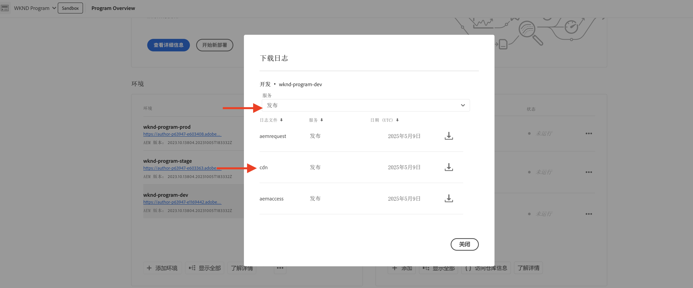
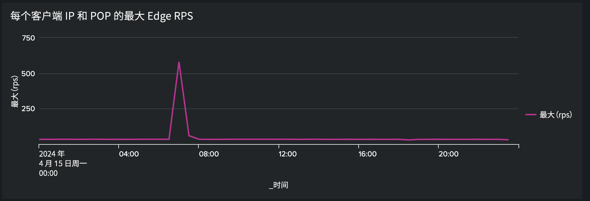
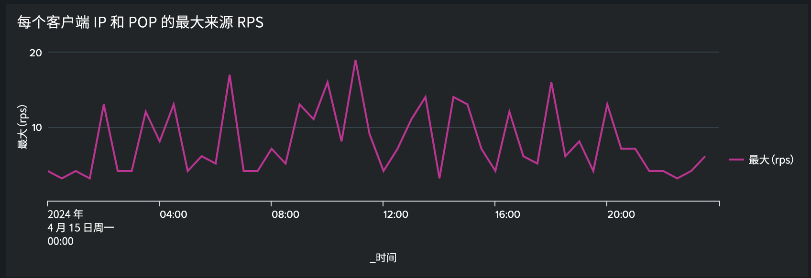

# 使用流量过滤规则阻止 DoS 和 DDoS 攻击

了解如何在AEM as a Cloud Service (AEMCS)托管的CDN中使用&#x200B;**速率限制流量过滤器**&#x200B;规则和其他策略来阻止拒绝服务(DoS)和分布式拒绝服务(DDoS)攻击。 这些攻击会导致CDN和潜在的AEM Publish服务（也称为来源）出现流量尖峰，并可能影响站点响应性和可用性。

本教程将指导您如何分析&#x200B;_流量模式并配置速率限制[流量过滤器规则](https://experienceleague.adobe.com/en/docs/experience-manager-cloud-service/content/security/traffic-filter-rules-including-waf)_&#x200B;以缓解这些攻击。 本教程还介绍如何[配置警报](https://experienceleague.adobe.com/en/docs/experience-manager-cloud-service/content/security/traffic-filter-rules-including-waf#traffic-filter-rules-alerts)，以便在可疑攻击时通知您。

## 了解保护

让我们了解一下AEM网站的默认DDoS保护：

- **缓存：**&#x200B;使用良好的缓存策略，DDoS攻击的影响会更加有限，因为CDN会阻止大多数请求访问源并导致性能下降。
- **自动缩放：** AEM创作和发布服务可自动缩放以处理流量尖峰，但它们仍可能会受到流量突然大量增加的影响。
- **阻止：**&#x200B;如果AdobeCDN从特定IP地址到每个CDN PoP(Point of Presence)的流量超过Adobe定义的速率，则CDN将阻止到源的流量。
- **警报：**&#x200B;当流量超过特定速率时，操作中心会在源位置发送流量尖峰警报通知。 当流向任何给定CDN Po的流量超过每个IP地址的&#x200B;_Adobe定义的_&#x200B;请求速率时，将触发此警报。 有关更多详细信息，请参阅[流量过滤器规则警报](https://experienceleague.adobe.com/en/docs/experience-manager-cloud-service/content/security/traffic-filter-rules-including-waf#traffic-filter-rules-alerts)。

这些内置的保护应被视为组织将DDoS攻击的性能影响降至最低的能力的基准。 由于每个网站都有不同的性能特征，并且在达到Adobe定义的速率限制之前可能会看到性能下降，因此建议通过&#x200B;_客户配置_&#x200B;来扩展默认保护。

我们来看看客户可以采取哪些其他建议措施来保护其网站免受DDoS攻击：

- 声明&#x200B;**速率限制流量过滤器规则**&#x200B;以阻止来自每个PoP的单个IP地址超过特定速率的流量。 这些阈值通常比Adobe定义的速率限制低。
- 通过“警报操作”在速率限制流量过滤器规则上配置&#x200B;**警报**，以便在触发规则时发送操作中心通知。
- 声明&#x200B;**请求转换**&#x200B;以忽略查询参数，以增加缓存覆盖率。

### 速率限制流量规则变化 {#rate-limit-variations}

速率限制流量规则有两种变体：

1. Edge — 基于给定IP每个Po的所有流量（包括可从CDN缓存提供的流量）的速率来阻止请求。
1. 来源 — 根据指定IP的每个PoP发往来源的数据流的速率来阻止请求。

## 客户历程

以下步骤反映了客户保护其网站的可能过程。

1. 识别是否需要速率限制流量过滤器规则。 这可能是由于收到Adobe的开箱即用流量尖峰原始警报，也可能是主动决定采取预防措施以降低DDo成功的风险。
1. 使用功能板（如果您的网站已上线）分析流量模式，以确定速率限制流量过滤器规则的最佳阈值。 如果您的网站尚未上线，请根据流量预期选择值。
1. 使用上一步的值，配置速率限制流量过滤器规则。 确保启用相应的警报，以便在达到阈值时通知您。
1. 每当发生流量尖峰时，接收流量过滤器规则警报，这为您提供了关于您的组织是否可能被恶意行为者定位的宝贵见解。
1. 根据需要对警报执行操作。 分析流量以确定尖峰是否反映合法请求而非攻击。 如果流量是合法的，则增加阈值；否则降低阈值。

本教程的其余部分将指导您完成此过程。

## 认识到需要配置规则 {#recognize-the-need}

如前所述，默认情况下，Adobe会阻止CDN上超过特定速率的流量，但是，某些网站可能会遇到低于该阈值的性能下降问题。 因此，应配置速率限制流量过滤器规则。

理想情况下，您最好在投入生产之前配置规则。 在实践中，许多组织只会在收到流量尖峰警报（表示可能发生攻击）后反应性地声明规则。

当超过给定PoP的来自单个IP地址的流量默认阈值时，Adobe在源位置发送流量尖峰警报作为[操作中心通知](https://experienceleague.adobe.com/en/docs/experience-manager-cloud-service/content/operations/actions-center)。 如果收到此类警报，建议配置速率限制流量过滤器规则。 此默认警报不同于客户在定义流量过滤器规则时必须明确启用的警报，您将在以后的部分中了解这些警报。

## 分析流量模式 {#analyze-traffic}

如果您的网站已上线，则可以使用CDN日志和Adobe提供的功能板分析流量模式。

- **CDN流量仪表板**：通过CDN和原始请求率、4xx和5xx错误率以及非缓存请求提供流量分析。 此外，还提供了每个客户端IP地址每秒的最大CND和源请求数，以及更多用于优化CDN配置的见解。

- **CDN缓存命中率**：按HIT、PASS和MISS状态提供对缓存命中率和请求总数的见解。 还提供了热门点击、通过和缺失URL。

使用以下选项之一&#x200B;_配置仪表板工具_：

### ELK — 配置仪表板工具

Adobe提供的&#x200B;**Elasticsearch、Logstash和Kibana (ELK)**&#x200B;仪表板工具可用于分析CDN日志。 此工具包括可可视化流量模式的功能板，使得更容易确定速率限制流量过滤器规则的最佳阈值。

- 克隆[AEMCS-CDN-Log-Analysis-Tooling](https://github.com/adobe/AEMCS-CDN-Log-Analysis-Tooling) GitHub存储库。
- 按照[如何设置ELK Docker容器](https://github.com/adobe/AEMCS-CDN-Log-Analysis-Tooling/blob/main/ELK/README.md#how-to-set-up-the-elk-docker-containerhow-to-setup-the-elk-docker-container)步骤设置工具。
- 在设置过程中，导入`traffic-filter-rules-analysis-dashboard.ndjson`文件以可视化数据。 _CDN流量_&#x200B;仪表板包括可视化图表，这些可视化图表显示CDN Edge和源中每个IP/POP的最大请求数。
- 从[Cloud Manager](https://my.cloudmanager.adobe.com/)的&#x200B;_环境_&#x200B;卡中，下载AEMCS Publish服务的CDN日志。

  

  >[!TIP]
  >
  > 新请求可能最多需要5分钟才能显示在CDN日志中。

### Splunk — 配置功能板工具

启用了[Splunk日志转发](https://experienceleague.adobe.com/en/docs/experience-manager-cloud-service/content/implementing/developing/logging#splunk-logs)的客户可以创建新的仪表板来分析流量模式。

要在Splunk中创建仪表板，请执行[用于AEMCS CDN日志分析的Splunk仪表板](https://github.com/adobe/AEMCS-CDN-Log-Analysis-Tooling/blob/main/Splunk/README.md#splunk-dashboards-for-aemcs-cdn-log-analysis)步骤。

### 查看数据

ELK和Splunk功能板中提供了以下可视化图表：

- **每个客户端IP和POP的Edge RPS**：此可视化图表显示在CDN Edge **处每个IP/POP的最大请求数**。 可视化图表中的峰值表示最大请求数。

  **ELK仪表板**：
  

  **Splunk仪表板**：
  

- **每个客户端IP和POP的原始RPS**：此可视化显示在原点&#x200B;**每个IP/POP的最大请求数**。 可视化图表中的峰值表示最大请求数。

  **ELK仪表板**：
  

  **Splunk仪表板**：
  

## 选择阈值

速率限制流量过滤器规则的阈值应基于以上分析，并确保合法流量不被阻止。 有关如何选择阈值的指导，请参阅下表：

| 变体 | 价值 |
| :--------- | :------- |
| 来源 | 获取&#x200B;**正常**&#x200B;流量条件下（即，不是DDoS时的速率）的每个IP/POP的最大源请求数最大值，并将其增加倍数 |
| Edge | 获取&#x200B;**正常**&#x200B;流量条件下（即，不是DDoS时的速率）的每个IP/POP的最大Edge请求数最大值，然后将其提高倍数 |

要使用的倍数取决于您对因自然流量、营销活动和其他活动而出现正常流量尖峰的期望。 5到10的倍数可能是合理的。

如果您的网站尚未上线，则没有要分析的数据，您应该根据情况推定要为速率限制流量过滤器规则设置的相应值。 例如：

| 变体 | 价值 |
|------------------------------ |:-----------:|
| Edge | 500 |
| 来源 | 100 |

## 配置规则 {#configure-rules}

在AEM项目的`/config/cdn.yaml`文件中，使用基于上述讨论的值配置&#x200B;**速率限制流量过滤器**&#x200B;规则。 如果需要，请咨询Web安全团队，确保速率限制值正确且不会阻止合法流量。

有关更多详细信息，请参阅[在AEM项目中创建规则](https://experienceleague.adobe.com/en/docs/experience-manager-learn/cloud-service/security/traffic-filter-and-waf-rules/how-to-setup#create-rules-in-your-aem-project)。

```yaml
kind: CDN
version: '1'
metadata:
  envTypes:
    - dev
    - stage
    - prod
data:
  trafficFilters:
    rules:
    ...
    #  Prevent attack at edge by blocking client for 5 minutes if they make more than 500 requests per second on average
      - name: prevent-dos-attacks-edge
        when:
          reqProperty: tier
          in: ["author","publish"]
        rateLimit:
          limit: 500 # replace with the appropriate value
          window: 10 # compute the average over 10s
          penalty: 300 # block IP for 5 minutes
          count: all # count all requests
          groupBy:
            - reqProperty: clientIp
        action:
          type: log
          alert: true
    #  Prevent attack at origin by blocking client for 5 minutes if they make more than 100 requests per second on average
      - name: prevent-dos-attacks-origin
        when:
          reqProperty: tier
          in: ["author","publish"]
        rateLimit:
          limit: 100 # replace with the appropriate value
          window: 10 # compute the average over 10s
          penalty: 300 # block IP for 5 minutes
          count: fetches # count only fetches
          groupBy:
            - reqProperty: clientIp
        action:
          type: log
          alert: true
```

请注意，原始和边缘规则都已声明，并且警报属性设置为`true`，因此只要达到阈值就可以接收警报，这很可能表示发生了攻击。

建议将操作类型最初设置为记录，以便您可以在几小时或几天内监控流量，确保合法流量不超过这些速率。 几天后，更改为阻止模式。

按照以下步骤将更改部署到AEMCS环境：

- 提交上述更改并将其推送到Cloud Manager Git存储库。
- 使用Cloud Manager的配置管道将更改部署到AEMCS环境。 有关详细信息，请参阅[通过Cloud Manager部署规则](https://experienceleague.adobe.com/en/docs/experience-manager-learn/cloud-service/security/traffic-filter-and-waf-rules/how-to-setup#deploy-rules-through-cloud-manager)。
- 要验证&#x200B;**速率限制流量过滤器规则**&#x200B;是否按预期工作，您可以按照[攻击模拟](#attack-simulation)部分中的说明来模拟攻击。 将请求数限制为高于规则中设置的速率限制值的值。

### 配置请求转换规则 {#configure-request-transform-rules}

除了速率限制流量过滤规则之外，建议使用[请求转换](https://experienceleague.adobe.com/en/docs/experience-manager-cloud-service/content/implementing/content-delivery/cdn-configuring-traffic#request-transformations)来取消设置应用程序不需要的查询参数，以最大限度地减少通过缓存失效技术绕过缓存的方式。 例如，如果只想允许`search`和`campaignId`查询参数，则可以声明以下规则：

```yaml
kind: "CDN"
version: "1"
metadata:
  envTypes:
    - dev
    - stage
    - prod
data:
  requestTransformations:
    rules:
      - name: unset-all-query-params-except-those-needed
        when:
          reqProperty: tier
          in: ["publish"]
        actions:
          - type: unset
            queryParamMatch: ^(?!search$|campaignId$).*$
```

## 接收流量过滤器规则警报 {#receiving-alerts}

如上所述，如果流量过滤器规则包含&#x200B;*警报： true*，则当规则匹配时会收到警报。

## 对警报执行操作 {#acting-on-alerts}

有时，警报是信息性的，让您能够了解攻击的频率。 值得使用上述仪表板分析您的CDN数据，以验证流量尖峰是否由攻击引起，而不仅仅是合法流量增加所致。 如果是后者，请考虑提高阈值。

## 攻击模拟{#attack-simulation}

本节介绍模拟DoS攻击的方法，这些方法可用于为本教程中使用的仪表板生成数据，并验证任何配置的规则是否成功阻止攻击。

>[!CAUTION]
>
> 请勿在生产环境中执行这些步骤。 以下步骤仅用于模拟。
>
>如果您收到指示流量尖峰的警报，请转到[分析流量模式](#analyzing-traffic-patterns)部分。

要模拟攻击，可以使用[Apache Benchmark](https://httpd.apache.org/docs/2.4/programs/ab.html)、[Apache JMeter](https://jmeter.apache.org/)、[Vegeta](https://github.com/tsenart/vegeta)等工具。

### Edge请求

使用以下[Vegeta](https://github.com/tsenart/vegeta)命令，您可以向您的网站发出许多请求：

```shell
$ echo "GET https://<YOUR-WEBSITE-DOMAIN>" | vegeta attack -rate=120 -duration=5s | vegeta report
```

上述命令在5秒内发出120个请求并输出报告。 假设网站访问速率不受限制，这可能会导致流量激增。

### 源请求

要绕过CDN缓存并向源(AEM Publish服务)发出请求，您可以向URL添加唯一的查询参数。 请参阅[使用JMeter脚本模拟DoS攻击](https://experienceleague.adobe.com/en/docs/experience-manager-learn/foundation/security/modsecurity-crs-dos-attack-protection#simulate-dos-attack-using-jmeter-script)中的Apache JMeter脚本示例

