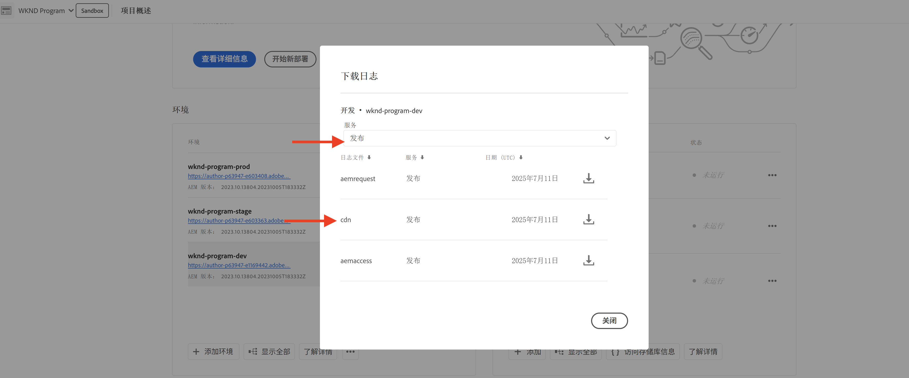
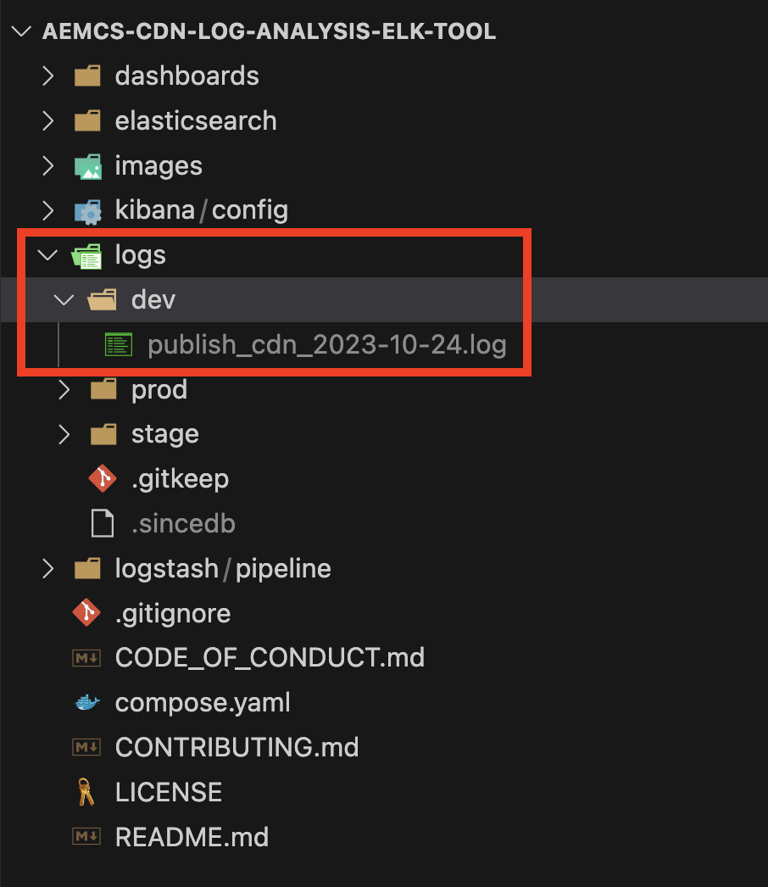
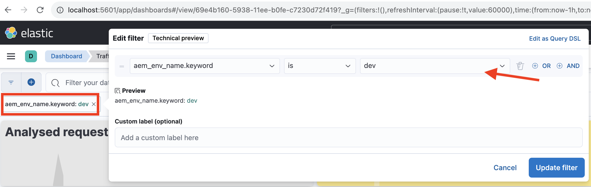

# 监控敏感请求

了解如何通过在 AEM as a Cloud Service 中使用流量过滤规则来记录敏感请求，以对敏感请求进行监控。

记录请求可帮助您在不影响最终用户或服务的情况下观察流量模式，是执行阻止规则之前的重要第一步。

本教程说明了如何&#x200B;**记录针对 AEM Publish 服务的 WKND 登录与登出路径的请求**。

## 为何以及何时记录请求

记录特定的请求是一种低风险、高价值的做法，有助于深入了解用户（以及潜在的恶意行为者）如何与您的 AEM 应用程序进行交互。在执行阻止规则之前进行记录尤为重要，它可帮助您在不干扰合法流量的前提下，安心优化安全策略。

常见的记录场景包括：

- 在将规则升级为 `block` 模式之前，验证其影响与覆盖情况。
- 监控登录/登出路径及身份验证端点，以识别异常模式或蛮力攻击尝试。
- 追踪对 API 端点的高频访问，以识别潜在的滥用或拒绝服务攻击（DoS）。
- 在实施更严格的控制措施之前，建立机器人行为的基准。
- 在发生安全事件时提供取证数据，以了解攻击性质及受影响的资源。

## 先决条件

在继续操作之前，请先确保您已完成[如何设置流量过滤器与 WAF 规则](../setup.md)教程中所述的必要配置。此外，请确保您已克隆 [AEM WKND Sites 项目](https://github.com/adobe/aem-guides-wknd)并已将其部署至您的 AEM 环境。

## 示例：记录 WKND 登录与登出请求

在此例中，您将创建一条流量过滤规则，用于记录在 AEM Publish 服务中进行 WKND 登录与登出路径的请求。这有助于您监控身份验证尝试，并识别潜在的安全问题。

- 将以下规则添加到 WKND 项目的 `/config/cdn.yaml` 文件中。

```yaml
kind: "CDN"
version: "1"
metadata:
  envTypes: ["dev", "stage", "prod"]
data:
  trafficFilters:
    rules:
    # On AEM Publish service log WKND Login and Logout requests
    - name: publish-auth-requests
      when:
        allOf:
          - reqProperty: tier
            matches: publish
          - reqProperty: path
            in:
              - /system/sling/login/j_security_check
              - /system/sling/logout
      action: log   
```

- 将更改内容提交并推送到 Cloud Manager Git 存储库。

- 使用[先前创建的](../setup.md#deploy-rules-using-adobe-cloud-manager) Cloud Manager 配置管道，将更改内容部署至 AEM 环境。

- 然后，通过登录和登出您项目中的 WKND 站点（例如：`https://publish-pXXXX-eYYYY.adobeaemcloud.com/us/en.html`）来测试该规则。您可以使用 `asmith/asmith` 作为用户名和密码。

  

## 分析

接下来，我们将通过从 Cloud Manager 下载 AEMCS CDN 日志，并使用 [AEMCS CDN 日志分析工具](../setup.md#setup-the-elastic-dashboard-tool)来分析 `publish-auth-requests` 规则的结果。

- 从[ Cloud Manager](https://my.cloudmanager.adobe.com/) 的&#x200B;**环境**&#x200B;卡片中，下载 AEMCS **Publish** 服务的 CDN 日志。

  

  >[!TIP]
  >
  > 新请求可能需要长达 5 分钟才能出现在 CDN 日志中。

- 将下载的日志文件（例如下方截图中的 `publish_cdn_2023-10-24.log`）复制到 Elastic 仪表板工具项目的 `logs/dev` 文件夹中。

  

- 刷新 Elastic 仪表板工具页面。
   - 在顶部&#x200B;**全局过滤器**&#x200B;部分，编辑 `aem_env_name.keyword` 过滤器，并选择 `dev` 开发环境值。

     

   - 若要更改时间间隔，请点击右上角的日历图标，并选择所需的时间间隔。

     

- 查看更新后的仪表板中的&#x200B;**已分析请求**、**已标记请求**&#x200B;以及&#x200B;**已标记请求详情**&#x200B;面板。对于匹配的 CDN 日志条目，它应显示每个条目的客户端 IP (cli_ip)、主机、URL、操作 (waf_action) 和规则名称 (waf_match) 的值。

  
