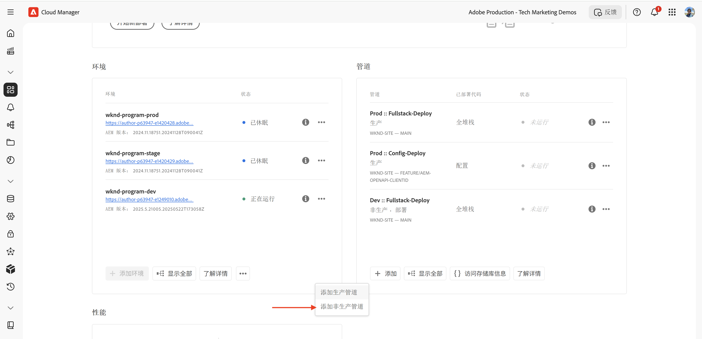

# 如何设置流量过滤器规则，包括WAF规则

了解&#x200B;**如何设置**&#x200B;流量过滤器规则，包括Web应用程序防火墙(WAF)规则。 在本教程中，我们将为后续教程奠定基础，您将在其中配置和部署规则，然后测试和分析结果。

为了演示设置过程，本教程使用了[AEM WKND Sites项目](https://github.com/adobe/aem-guides-wknd)。

## 设置概述

后续教程的基础工作涉及以下步骤：

- _在_&#x200B;文件夹的AEM项目中创建规则`config`
- _使用Adobe Cloud Manager配置管道部署规则_。
- _使用Curl、Vegeta和Nikto等工具测试规则_
- _正在分析结果_&#x200B;使用AEMCS CDN日志分析工具

## 在 AEM 项目中创建规则

要在AEM项目中定义&#x200B;**标准**&#x200B;和&#x200B;**WAF**&#x200B;流量过滤器规则，请执行以下步骤：

1. 在AEM项目的顶层，创建一个名为`config`的文件夹。

2. 在`config`文件夹内，创建名为`cdn.yaml`的文件。

3. 在`cdn.yaml`中使用以下元数据结构：

```yaml
kind: "CDN"
version: "1"
metadata:
  envTypes: ["dev", "stage", "prod"]
data:
  trafficFilters:
    rules:
```


在[下一个教程](#next-steps)中，您将了解如何将Adobe的&#x200B;**推荐的标准流量过滤器和WAF规则**&#x200B;添加到上述文件中，作为您实施的坚实基础。

## 使用Adobe Cloud Manager部署规则

在准备部署规则时，请执行以下步骤：

1. 登录到[my.cloudmanager.adobe.com](https://my.cloudmanager.adobe.com/)并选择您的项目。

2. 从&#x200B;**项目概述**&#x200B;页面，转到&#x200B;**管道**&#x200B;卡并单击&#x200B;**+添加**&#x200B;以创建新管道。

   

3. 在管道向导中：

   - **类型**：部署管道
   - **管道名称**：Dev-Config

   

4. Source代码配置：

   - **要部署的代码**：有针对性的部署
   - **包括**：配置
   - **部署环境**：例如，`wknd-program-dev`
   - **存储库**： Git存储库（例如，`wknd-site`）
   - **Git分支**：您的工作分支
   - **代码位置**： `/config`

   

5. 查看管道配置并单击&#x200B;**保存**。

在[下一个教程](#next-steps)中，您将了解如何将管道部署到AEM环境。

## 使用工具测试规则

要测试标准流量过滤器和WAF规则的有效性，您可以使用各种工具来模拟请求并分析规则的响应方式。

验证本地计算机上是否安装了以下工具，或按照说明安装它们：

- [Curl](https://curl.se/)：测试请求/响应流。
- [Vegeta](https://github.com/tsenart/vegeta)：模拟高请求负载（DoS测试）。
- [Nikto](https://github.com/sullo/nikto/wiki)：扫描漏洞。

可以使用以下命令验证安装：

```shell
# Curl version check
$ curl --version

# Vegeta version check
$ vegeta -version

# Nikto version check
$ cd <PATH-OF-CLONED-REPO>/program
$ ./nikto.pl -Version
```

在[下一个教程](#next-steps)中，您将学习如何使用这些工具来模拟高请求负载和恶意请求，以测试流量过滤器和WAF规则的有效性。

## 分析结果

要准备分析结果，请执行以下步骤：

1. 安装&#x200B;**AEMCS CDN日志分析工具**&#x200B;以使用预建仪表板可视化和分析模式。

2. 通过从Cloud Manager UI下载日志，执行&#x200B;**CDN日志摄取**。 或者，您可以将日志直接转发到支持的托管日志记录目标，如Splunk或Elasticsearch。

### AEMCS CDN日志分析工具

若要分析流量筛选器和WAF规则的结果，您可以使用&#x200B;**AEMCS CDN日志分析工具**。 此工具提供了预建的仪表板，用于利用从AEMCS CDN收集的日志可视化CDN流量和WAF活动。

AEMCS CDN日志分析工具支持两个可观察性平台，**ELK** (Elasticsearch、Logstash、Kibana)和&#x200B;**Splunk**。

可以使用日志转发功能将日志流式传输到托管的ELK或Splunk日志记录服务，您可以在其中安装功能板，以可视化并分析标准流量过滤器和WAF流量过滤器规则。 但是，在本教程中，您将在计算机上安装的本地ELK实例上设置仪表板。

1. 克隆[AEMCS-CDN-Log-Analysis-Tooling](https://github.com/adobe/AEMCS-CDN-Log-Analysis-Tooling)存储库。

2. 按照[ELK Docker容器安装指南](https://github.com/adobe/AEMCS-CDN-Log-Analysis-Tooling/blob/main/ELK/README.md)在本地安装和配置ELK栈栈。

3. 使用ELK功能板，您可以浏览IP请求、阻止的流量、URI模式和安全警报等量度。

   

>[!NOTE]
> 
> 如果尚未从AEMCS CDN引入日志，则功能板显示为空。

### CDN日志摄取

要将CDN日志摄取到ELK栈栈，请执行以下步骤：

- 从[ Cloud Manager](https://my.cloudmanager.adobe.com/) 的&#x200B;**环境**&#x200B;卡片中，下载 AEMCS **Publish** 服务的 CDN 日志。

  

  >[!TIP]
  >
  > 新请求可能需要长达 5 分钟才能出现在 CDN 日志中。

- 将下载的日志文件（例如下方截图中的 `publish_cdn_2025-06-06.log`）复制到 Elastic 仪表板工具项目的 `logs/dev` 文件夹中。

  {width="800" zoomable="yes"}

- 刷新 Elastic 仪表板工具页面。
   - 在顶部&#x200B;**全局过滤器**&#x200B;部分，编辑 `aem_env_name.keyword` 过滤器，并选择 `dev` 开发环境值。

     

   - 若要更改时间间隔，请点击右上角的日历图标，并选择所需的时间间隔。

- 在[下一个教程](#next-steps)中，您将学习如何使用ELK栈栈中的预建仪表板来分析标准流量过滤器和WAF流量过滤器规则的结果。

  

## 摘要

您已成功为在AEM as a Cloud Service中实施流量过滤器规则(包括WAF规则)奠定了基础。 您创建了配置文件结构、用于部署的管道以及用于测试和分析结果的准备工具。

## 后续步骤

通过以下教程了解如何实施Adobe推荐的规则：

<!-- CARDS
{target = _self}

* ./use-cases/using-traffic-filter-rules.md
  {title = Protecting AEM websites using standard traffic filter rules}
  {description = Learn how to protect AEM websites from DoS, DDoS and bot abuse using Adobe-recommended standard traffic filter rules in AEM as a Cloud Service.}
  {image = ./assets/use-cases/using-traffic-filter-rules.png}
  {cta = Apply Rules}

* ./use-cases/using-waf-rules.md
  {title = Protecting AEM websites using WAF traffic filter rules}
  {description = Learn how to protect AEM websites from sophisticated threats including DoS, DDoS, and bot abuse using Adobe-recommended Web Application Firewall (WAF) traffic filter rules in AEM as a Cloud Service.}
  {image = ./assets/use-cases/using-waf-rules.png}
  {cta = Activate WAF}
-->
<!-- START CARDS HTML - DO NOT MODIFY BY HAND -->
<div class="columns">
    <div class="column is-half-tablet is-half-desktop is-one-third-widescreen" aria-label="Protecting AEM websites using standard traffic filter rules">
        <div class="card" style="height: 100%; display: flex; flex-direction: column; height: 100%;">
            <div class="card-image">
                <figure class="image x-is-16by9">
                    <a href="./use-cases/using-traffic-filter-rules.md" title="使用标准流量过滤器规则保护AEM网站" target="_self" rel="referrer">
                        
                    </a>
                </figure>
            </div>
            <div class="card-content is-padded-small" style="display: flex; flex-direction: column; flex-grow: 1; justify-content: space-between;">
                <div class="top-card-content">
                    <p class="headline is-size-6 has-text-weight-bold">
                        <a href="./use-cases/using-traffic-filter-rules.md" target="_self" rel="referrer" title="使用标准流量过滤器规则保护AEM网站">使用标准流量过滤器规则保护AEM网站</a>
                    </p>
                    <p class="is-size-6">了解如何使用AEM推荐的标准流量过滤器规则在AEM as a Cloud Service中保护Adobe网站免受DoS、DDoS和机器人滥用。</p>
                </div>
                <a href="./use-cases/using-traffic-filter-rules.md" target="_self" rel="referrer" class="spectrum-Button spectrum-Button--outline spectrum-Button--primary spectrum-Button--sizeM" style="align-self: flex-start; margin-top: 1rem;">
                    <span class="spectrum-Button-label has-no-wrap has-text-weight-bold">应用规则</span>
                </a>
            </div>
        </div>
    </div>
    <div class="column is-half-tablet is-half-desktop is-one-third-widescreen" aria-label="Protecting AEM websites using WAF traffic filter rules">
        <div class="card" style="height: 100%; display: flex; flex-direction: column; height: 100%;">
            <div class="card-image">
                <figure class="image x-is-16by9">
                    <a href="./use-cases/using-waf-rules.md" title="使用WAF流量过滤器规则保护AEM网站" target="_self" rel="referrer">
                        
                    </a>
                </figure>
            </div>
            <div class="card-content is-padded-small" style="display: flex; flex-direction: column; flex-grow: 1; justify-content: space-between;">
                <div class="top-card-content">
                    <p class="headline is-size-6 has-text-weight-bold">
                        <a href="./use-cases/using-waf-rules.md" target="_self" rel="referrer" title="使用WAF流量过滤器规则保护AEM网站">使用AEM流量过滤器规则保护WAF网站</a>
                    </p>
                    <p class="is-size-6">了解如何使用AEM推荐的Adobe Web应用程序防火墙(WAF)流量过滤器规则在AEM as a Cloud Service中保护网站免受复杂威胁，包括DoS、DDoS和机器人滥用。</p>
                </div>
                <a href="./use-cases/using-waf-rules.md" target="_self" rel="referrer" class="spectrum-Button spectrum-Button--outline spectrum-Button--primary spectrum-Button--sizeM" style="align-self: flex-start; margin-top: 1rem;">
                    <span class="spectrum-Button-label has-no-wrap has-text-weight-bold">激活WAF</span>
                </a>
            </div>
        </div>
    </div>
</div>
<!-- END CARDS HTML - DO NOT MODIFY BY HAND -->

## 高级用例

除了Adobe推荐的标准流量过滤器和WAF规则之外，您还可以实施高级方案以满足特定业务要求。 这些情况包括：

<!-- CARDS
{target = _self}

* ./how-to/request-logging.md

* ./how-to/request-blocking.md

* ./how-to/request-transformation.md
-->
<!-- START CARDS HTML - DO NOT MODIFY BY HAND -->
<div class="columns">
    <div class="column is-half-tablet is-half-desktop is-one-third-widescreen" aria-label="Monitoring sensitive requests">
        <div class="card" style="height: 100%; display: flex; flex-direction: column; height: 100%;">
            <div class="card-image">
                <figure class="image x-is-16by9">
                    <a href="./how-to/request-logging.md" title="监控敏感请求" target="_self" rel="referrer">
                        
                    </a>
                </figure>
            </div>
            <div class="card-content is-padded-small" style="display: flex; flex-direction: column; flex-grow: 1; justify-content: space-between;">
                <div class="top-card-content">
                    <p class="headline is-size-6 has-text-weight-bold">
                        <a href="./how-to/request-logging.md" target="_self" rel="referrer" title="监控敏感请求">正在监视敏感请求</a>
                    </p>
                    <p class="is-size-6">了解如何使用AEM as a Cloud Service中的流量过滤器规则记录敏感请求，从而监控这些请求。</p>
                </div>
                <a href="./how-to/request-logging.md" target="_self" rel="referrer" class="spectrum-Button spectrum-Button--outline spectrum-Button--primary spectrum-Button--sizeM" style="align-self: flex-start; margin-top: 1rem;">
                    <span class="spectrum-Button-label has-no-wrap has-text-weight-bold">了解详情</span>
                </a>
            </div>
        </div>
    </div>
    <div class="column is-half-tablet is-half-desktop is-one-third-widescreen" aria-label="Restricting access">
        <div class="card" style="height: 100%; display: flex; flex-direction: column; height: 100%;">
            <div class="card-image">
                <figure class="image x-is-16by9">
                    <a href="./how-to/request-blocking.md" title="限制访问" target="_self" rel="referrer">
                        
                    </a>
                </figure>
            </div>
            <div class="card-content is-padded-small" style="display: flex; flex-direction: column; flex-grow: 1; justify-content: space-between;">
                <div class="top-card-content">
                    <p class="headline is-size-6 has-text-weight-bold">
                        <a href="./how-to/request-blocking.md" target="_self" rel="referrer" title="限制访问">限制访问</a>
                    </p>
                    <p class="is-size-6">了解如何使用AEM as a Cloud Service中的流量过滤规则阻止特定请求来限制访问。</p>
                </div>
                <a href="./how-to/request-blocking.md" target="_self" rel="referrer" class="spectrum-Button spectrum-Button--outline spectrum-Button--primary spectrum-Button--sizeM" style="align-self: flex-start; margin-top: 1rem;">
                    <span class="spectrum-Button-label has-no-wrap has-text-weight-bold">了解详情</span>
                </a>
            </div>
        </div>
    </div>
    <div class="column is-half-tablet is-half-desktop is-one-third-widescreen" aria-label="Normalizing requests">
        <div class="card" style="height: 100%; display: flex; flex-direction: column; height: 100%;">
            <div class="card-image">
                <figure class="image x-is-16by9">
                    <a href="./how-to/request-transformation.md" title="标准化请求" target="_self" rel="referrer">
                        
                    </a>
                </figure>
            </div>
            <div class="card-content is-padded-small" style="display: flex; flex-direction: column; flex-grow: 1; justify-content: space-between;">
                <div class="top-card-content">
                    <p class="headline is-size-6 has-text-weight-bold">
                        <a href="./how-to/request-transformation.md" target="_self" rel="referrer" title="标准化请求">标准化请求</a>
                    </p>
                    <p class="is-size-6">了解如何使用AEM as a Cloud Service中的流量过滤器规则转换请求，从而标准化请求。</p>
                </div>
                <a href="./how-to/request-transformation.md" target="_self" rel="referrer" class="spectrum-Button spectrum-Button--outline spectrum-Button--primary spectrum-Button--sizeM" style="align-self: flex-start; margin-top: 1rem;">
                    <span class="spectrum-Button-label has-no-wrap has-text-weight-bold">了解详情</span>
                </a>
            </div>
        </div>
    </div>
</div>
<!-- END CARDS HTML - DO NOT MODIFY BY HAND -->

## 其他资源

- [流量过滤器规则，包括WAF规则](https://experienceleague.adobe.com/zh-hans/docs/experience-manager-cloud-service/content/security/traffic-filter-rules-including-waf)