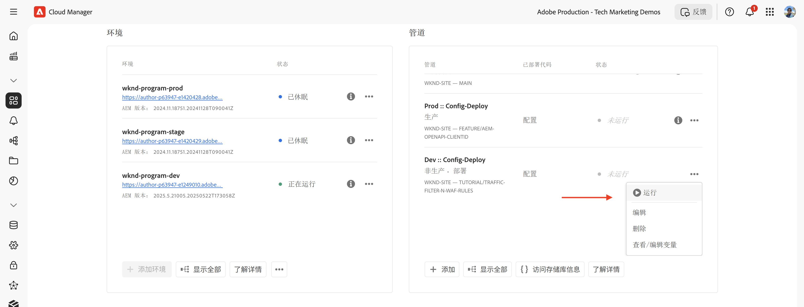
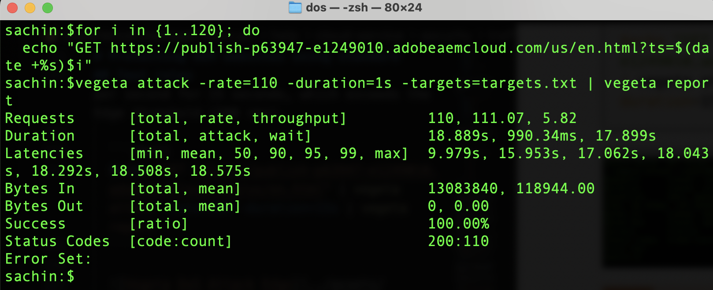

# 使用标准流量过滤规则保护 AEM 网站

了解如何在 AEM as a Cloud Service 中使用 _Adobe 推荐的_**标准流量过滤规则**&#x200B;防范拒绝服务攻击（DoS）、分布式拒绝服务攻击（DDoS）以及机器人滥用行为，从而保护 AEM 网站的安全。


>[!VIDEO](https://video.tv.adobe.com/v/3469396/?quality=12&learn=on)

## 学习目标

- 查看 Adobe 推荐的标准流量过滤规则。
- 定义、部署、测试并分析这些规则的结果。
- 了解在什么情况下以及如何根据流量模式优化规则。
- 了解如何使用 AEM 行动中心查看规则生成的警报。

### 实施概述

实施步骤包括：

- 将标准流量过滤规则添加到 AEM WKND 项目的 `/config/cdn.yaml` 文件中。
- 将更改内容提交并推送至 Cloud Manager Git 存储库。
- 使用 Cloud Manager 配置管道将更改内容部署到 AEM 环境。
- 使用 [Vegeta](https://github.com/tsenart/vegeta) 模拟 DoS 攻击，以测试这些规则
- 使用 AEMCS CDN 日志和 ELK 仪表板工具分析测试结果。

## 先决条件

在继续操作之前，请先确保您已完成[如何设置流量过滤器和 WAF 规则](../setup.md)教程中所述的前期准备工作。此外，请确保您已克隆 [AEM WKND Sites 项目](https://github.com/adobe/aem-guides-wknd)并已将其部署至您的 AEM 环境。

## 规则的关键操作

在深入了解标准流量过滤规则的具体内容之前，我们先来了解这些规则所执行的关键操作。每条规则中的 `action` 属性定义了在条件满足的情况下流量过滤器应如何响应。包括以下操作：

- **记录**：规则会记录相关事件，便于后续监控与分析，使您能够根据流量模式调整阈值。该操作通过 `type: log` 属性指定。

- **警报**：当条件满足时，规则会触发警报，帮助您及时识别潜在问题。该操作通过 `alert: true` 属性指定。

- **阻止**：当条件满足时，规则会阻止相关流量，阻止对您的 AEM 网站的访问。该操作通过 `action: block` 属性指定。

## 查看并定义规则

Adobe 推荐的标准流量过滤规则可作为基础防护层，用于识别潜在的恶意流量模式，例如记录超出基于 IP 的速率限制的事件，或阻止来自特定国家/地区的流量。这些日志可帮助团队验证阈值，在了解相关信息的情况下做出合理决定，最终就可以在不干扰正常流量的情况下&#x200B;**过渡到阻止模式**&#x200B;规则。

接下来，我们将查看应添加至 AEM WKND 项目 `/config/cdn.yaml` 文件中的三条标准流量过滤规则：

- **防止边缘区域 DoS 攻击**：此规则通过监控客户端 IP 的每秒请求数（RPS），在 CDN 边缘区域检测潜在的拒绝服务攻击（DoS）。
- **防止源端 DoS 攻击**：此规则通过监控客户端 IP 发起的获取请求（fetch requests），检测源端潜在的拒绝服务攻击（DoS）。
- **阻止 OFAC 国家/地区**：此规则阻止来自美国财政部外国资产控制办公室（OFAC）规定限制的国家/地区的访问请求。

### &#x200B;1. 防止边缘区域 DoS 攻击

此规则在检测到 CDN 上发生潜在拒绝服务（DoS）攻击时&#x200B;**发送警报**。触发此规则的条件是：某个客户端在边缘区域每个入网点（CDN POP）上的请求数在 10 秒内的平均值超过&#x200B;**每秒 500 次**。

它会统计&#x200B;**所有**&#x200B;请求，并按客户端 IP 将其分组。

```yaml
kind: "CDN"
version: "1"
metadata:
  envTypes: ["dev", "stage", "prod"]
data:
  trafficFilters:
    rules:
    - name: prevent-dos-attacks-edge
      when:
        reqProperty: tier
        equals: 'publish'
      rateLimit:
        limit: 500
        window: 10
        penalty: 300
        count: all
        groupBy:
          - reqProperty: clientIp
      action:
        type: log
        alert: true
```

`action` 属性指定了规则应在条件满足时记录事件并触发警报。这样，该规则可帮助您在不中断合法流量的前提下监控潜在的 DoS 攻击。但您的最终目标是：在完成流量模式验证并调整阈值后，将该规则过渡到阻止模式。

### &#x200B;2. 防止源端 DoS 攻击

该规则在检测到源端存在潜在的拒绝服务（DoS）攻击时会&#x200B;**发送警报**。触发此规则的条件是：某个客户端在源端的每个客户端 IP 在 10 秒内的平均请求数超过&#x200B;**每秒 100 次请求**。

它会统计 **fetch** 请求（即绕过缓存的请求），并按客户端 IP 将其分组。

```yaml
...
    - name: prevent-dos-attacks-origin
      when:
        reqProperty: tier
        equals: 'publish'
      rateLimit:
        limit: 100
        window: 10
        penalty: 300
        count: fetches
        groupBy:
          - reqProperty: clientIp
      action:
        type: log
        alert: true
```

`action` 属性指定了规则应在条件满足时记录事件并触发警报。这样，该规则可帮助您在不中断合法流量的前提下监控潜在的 DoS 攻击。但您的最终目标是：在完成流量模式验证并调整阈值后，将该规则过渡到阻止模式。

### &#x200B;3. 阻止 OFAC 国家/地区访问

此规则会阻止来自受 [OFAC](https://ofac.treasury.gov/sanctions-programs-and-country-information) 限制的特定国家或地区的访问。
您可以根据需要查看并更改国家/地区列表。

```yaml
...
    - name: block-ofac-countries
      when:
        allOf:
          - { reqProperty: tier, in: ["author", "publish"] }
          - reqProperty: clientCountry
            in:
              - SY
              - BY
              - MM
              - KP
              - IQ
              - CD
              - SD
              - IR
              - LR
              - ZW
              - CU
              - CI
      action: block
```

`action` 属性指定了该规则应阻止来自这些国家/地区的访问。这有助于防止来自可能存在安全风险地区的用户访问您的 AEM 站点。

以下是包含上述规则的完整 `cdn.yaml` 文件示例：


## 部署规则

要部署上述规则，请按以下步骤操作：

- 将更改内容提交并推送到 Cloud Manager Git 存储库。

- 使用[先前创建的](../setup.md#deploy-rules-using-adobe-cloud-manager) Cloud Manager 配置管道，将更改内容部署至 AEM 环境。

  

## 测试规则

为了验证标准流量过滤规则在 **CDN 边缘区域**&#x200B;和&#x200B;**源端**&#x200B;的有效性，可使用灵活的 HTTP 压力测试工具 [Vegeta](https://github.com/tsenart/vegeta) 模拟高请求流量。

- 在边缘测试 DoS 规则（500 rps 限制）。以下命令模拟每秒 200 次请求，持续 15 秒，这超过了边缘层阈值（500 rps）：

  ```shell
  $echo "GET https://publish-p63947-e1249010.adobeaemcloud.com/us/en.html" | vegeta attack -rate=200 -duration=15s | vegeta report
  ```

  

  >[!IMPORTANT]
  >
  >  请注意上面报告中的 *100%* 成功率和 _200_ 状态码。由于规则设置为 `log` 和 `alert`，因此请求&#x200B;_未被阻止_，但已记录用于监控、分析和预警。

- 在源端测试 DoS 规则（100 rps 限制）。以下命令模拟每秒 110 次 fetch 请求，持续 1 秒，这超过了源端阈值（100 rps）。为模拟绕过缓存的请求，`targets.txt` 文件包含唯一查询参数，确保每个请求都被视为 fetch 请求。

  ```shell
  # Create targets.txt with unique query parameters
  $for i in {1..110}; do
    echo "GET https://publish-p63947-e1249010.adobeaemcloud.com/us/en.html?ts=$(date +%s)$i"
  done > targets.txt
  
  # Use the targets.txt file to simulate fetch requests
  $vegeta attack -rate=110 -duration=1s -targets=targets.txt | vegeta report
  ```

  

  >[!IMPORTANT]
  >
  >  请注意上面报告中的 *100%* 成功率和 _200_ 状态码。由于规则设置为 `log` 和 `alert`，因此请求&#x200B;_未被阻止_，但已记录用于监控、分析和预警。

- 为简化起见，此处未测试 OFAC 规则。

## 查看警报

当触发流量过滤规则时，会生成警报。您可在 [AEM 行动中心](https://experience.adobe.com/aem/actions-center)中查看这些警报。


## 分析结果

您可以通过 AEMCS CDN 日志和 ELK 仪表板工具分析流量过滤器规则的结果。请参见 [CDN 日志摄取](../setup.md#ingest-cdn-logs)设置部分的说明，了解如何将 CDN 日志摄入 ELK 堆栈。

在下面的截图中，您可以看到 AEM 开发环境的 CDN 日志已被摄入 ELK 堆栈中。


在 ELK 应用程序中，**CDN 流量仪表板**&#x200B;应显示模拟 DoS 攻击期间在&#x200B;**边缘**&#x200B;和&#x200B;**源端**&#x200B;的请求峰值。

两个面板 —— _每个客户端 IP 和 POP 在边缘的请求速率（RPS）_&#x200B;以及&#x200B;_每个客户端 IP 和 POP 在源端的请求速率（RPS）_ —— 分别显示了边缘和源端的每秒请求数（RPS），并按客户端 IP 和入网点 (POP) 将其分组。


您还可以使用 CDN 流量仪表板中的其他面板来分析流量模式，例如 _Top Client IPs_（最活跃客户端 IP）、_Top Countries_（最活跃访问来源国家） 和 _Top User Agents_（最活跃用户代理）。这些面板可帮助您识别潜在威胁，并据此调整流量过滤规则。

### Splunk 集成

[已启用 Splunk 日志转发功能](https://experienceleague.adobe.com/zh-hans/docs/experience-manager-cloud-service/content/implementing/developing/logging#splunk-logs)的客户可以创建新的仪表板来分析流量模式。

要在 Splunk 中创建仪表板，请按照[将 Splunk 仪表板用于 AEMCS CDN 日志分析](https://github.com/adobe/AEMCS-CDN-Log-Analysis-Tooling/blob/main/Splunk/README.md#splunk-dashboards-for-aemcs-cdn-log-analysis)的步骤进行操作。

下面的截图展示了一个 Splunk 仪表板示例，其中显示了每个 IP 在源端和边缘的最大请求数，有助于您识别潜在的 DoS 攻击。


## 何时以及如何优化规则

您的目标是在保护 AEM 站点免受潜在威胁的同时，尽量避免误拦合法流量。标准流量过滤规则的设计原则是通过记录请求和触发警报（并在模式切换时最终拦截）来识别威胁，同时避免拦截合法流量。

要优化这些规则，可参考以下步骤：

- **监控流量模式**：使用 CDN 日志和 ELK 仪表板监控流量模式，识别异常或流量激增。
- **调整阈值**：根据流量模式，适当调整规则中的阈值（提升或降低请求速率限制），以更贴合您的具体要求。例如，如果您发现合法流量触发了警报，可以适当提高速率限制或调整分组方式。
下表提供了选择阈值的指导建议：

  | 变体 | 值 |
  | :--------- | :------- |
  | 源站 | 取&#x200B;**正常**&#x200B;流量条件下每个 IP/POP 的最大源站请求数的最大值（即，不是 DDoS 攻击时的速率），并将其增加几倍 |
  | 边缘 | 取&#x200B;**正常**&#x200B;流量条件下每个 IP/POP 的最大边缘层请求数的最大值（即，不是 DDoS 攻击时的速率），并将其增加几倍 |

  更多详细信息，请参阅[选择阈值](../../blocking-dos-attack-using-traffic-filter-rules.md#choosing-threshold-values)部分。

- **切换为阻止规则**：验证了流量模式并调整了阈值后，建议将规则改变为阻止模式。

## 摘要

在本教程中，您学习了如何在 AEM as a Cloud Service 中使用 Adobe 推荐的标准流量过滤规则来保护 AEM 网站免受拒绝服务攻击（DoS）、分布式拒绝服务攻击（DDoS）及机器人滥用的威胁。

## 推荐的 WAF 规则

了解如何实施 Adobe 推荐的 WAF 规则，以防御采用高级技术绕过传统安全机制的复杂威胁，全面保护您的 AEM 网站。

<!-- CARDS
{target = _self}

* ./using-waf-rules.md
  {title = Protecting AEM websites using WAF traffic filter rules}
  {description = Learn how to protect AEM websites from sophisticated threats including DoS, DDoS, and bot abuse using Adobe-recommended Web Application Firewall (WAF) traffic filter rules in AEM as a Cloud Service.}
  {image = ../assets/use-cases/using-waf-rules.png}
  {cta = Activate WAF}
-->
<!-- START CARDS HTML - DO NOT MODIFY BY HAND -->
<div class="columns">
    <div class="column is-half-tablet is-half-desktop is-one-third-widescreen" aria-label="Protecting AEM websites using WAF traffic filter rules">
        <div class="card" style="height: 100%; display: flex; flex-direction: column; height: 100%;">
            <div class="card-image">
                <figure class="image x-is-16by9">
                    <a href="./using-waf-rules.md" title="使用 WAF 流量过滤规则保护 AEM 网站" target="_self" rel="referrer">
                        
                    </a>
                </figure>
            </div>
            <div class="card-content is-padded-small" style="display: flex; flex-direction: column; flex-grow: 1; justify-content: space-between;">
                <div class="top-card-content">
                    <p class="headline is-size-6 has-text-weight-bold">
                        <a href="./using-waf-rules.md" target="_self" rel="referrer" title="使用 WAF 流量过滤规则保护 AEM 网站">使用 WAF 流量过滤规则保护 AEM 网站</a>
                    </p>
                    <p class="is-size-6">了解如何在 AEM as a Cloud Service 中使用 Adobe 推荐的 Web 应用程序防火墙（WAF）流量过滤规则，防御包括 DoS、DDoS 和机器人滥用在内的复杂安全威胁。</p>
                </div>
                <a href="./using-waf-rules.md" target="_self" rel="referrer" class="spectrum-Button spectrum-Button--outline spectrum-Button--primary spectrum-Button--sizeM" style="align-self: flex-start; margin-top: 1rem;">
                    <span class="spectrum-Button-label has-no-wrap has-text-weight-bold">启用 WAF</span>
                </a>
            </div>
        </div>
    </div>
</div>
<!-- END CARDS HTML - DO NOT MODIFY BY HAND -->


## 用例——超越标准规则

对于更复杂的场景，您可以参考以下用例，了解如何根据具体业务需求实施自定义流量过滤规则：

<!-- CARDS
{target = _self}

* ../how-to/request-logging.md

* ../how-to/request-blocking.md

* ../how-to/request-transformation.md
-->
<!-- START CARDS HTML - DO NOT MODIFY BY HAND -->
<div class="columns">
    <div class="column is-half-tablet is-half-desktop is-one-third-widescreen" aria-label="Monitoring sensitive requests">
        <div class="card" style="height: 100%; display: flex; flex-direction: column; height: 100%;">
            <div class="card-image">
                <figure class="image x-is-16by9">
                    <a href="../how-to/request-logging.md" title="监控敏感请求" target="_self" rel="referrer">
                        
                    </a>
                </figure>
            </div>
            <div class="card-content is-padded-small" style="display: flex; flex-direction: column; flex-grow: 1; justify-content: space-between;">
                <div class="top-card-content">
                    <p class="headline is-size-6 has-text-weight-bold">
                        <a href="../how-to/request-logging.md" target="_self" rel="referrer" title="监控敏感请求">监控敏感请求</a>
                    </p>
                    <p class="is-size-6">了解如何在 AEM as a Cloud Service 中使用流量过滤规则记录敏感请求以对其进行监控。</p>
                </div>
                <a href="../how-to/request-logging.md" target="_self" rel="referrer" class="spectrum-Button spectrum-Button--outline spectrum-Button--primary spectrum-Button--sizeM" style="align-self: flex-start; margin-top: 1rem;">
                    <span class="spectrum-Button-label has-no-wrap has-text-weight-bold">了解详情</span>
                </a>
            </div>
        </div>
    </div>
    <div class="column is-half-tablet is-half-desktop is-one-third-widescreen" aria-label="Restricting access">
        <div class="card" style="height: 100%; display: flex; flex-direction: column; height: 100%;">
            <div class="card-image">
                <figure class="image x-is-16by9">
                    <a href="../how-to/request-blocking.md" title="限制访问" target="_self" rel="referrer">
                        
                    </a>
                </figure>
            </div>
            <div class="card-content is-padded-small" style="display: flex; flex-direction: column; flex-grow: 1; justify-content: space-between;">
                <div class="top-card-content">
                    <p class="headline is-size-6 has-text-weight-bold">
                        <a href="../how-to/request-blocking.md" target="_self" rel="referrer" title="限制访问">限制访问</a>
                    </p>
                    <p class="is-size-6">了解如何在 AEM as a Cloud Service 中通过流量过滤规则阻止特定请求以限制访问。</p>
                </div>
                <a href="../how-to/request-blocking.md" target="_self" rel="referrer" class="spectrum-Button spectrum-Button--outline spectrum-Button--primary spectrum-Button--sizeM" style="align-self: flex-start; margin-top: 1rem;">
                    <span class="spectrum-Button-label has-no-wrap has-text-weight-bold">了解详情</span>
                </a>
            </div>
        </div>
    </div>
    <div class="column is-half-tablet is-half-desktop is-one-third-widescreen" aria-label="Normalizing requests">
        <div class="card" style="height: 100%; display: flex; flex-direction: column; height: 100%;">
            <div class="card-image">
                <figure class="image x-is-16by9">
                    <a href="../how-to/request-transformation.md" title="将请求标准化" target="_self" rel="referrer">
                        
                    </a>
                </figure>
            </div>
            <div class="card-content is-padded-small" style="display: flex; flex-direction: column; flex-grow: 1; justify-content: space-between;">
                <div class="top-card-content">
                    <p class="headline is-size-6 has-text-weight-bold">
                        <a href="../how-to/request-transformation.md" target="_self" rel="referrer" title="将请求标准化">将请求标准化</a>
                    </p>
                    <p class="is-size-6">了解如何在 AEM as a Cloud Service 中通过流量过滤规则将请求转换为标准化请求。</p>
                </div>
                <a href="../how-to/request-transformation.md" target="_self" rel="referrer" class="spectrum-Button spectrum-Button--outline spectrum-Button--primary spectrum-Button--sizeM" style="align-self: flex-start; margin-top: 1rem;">
                    <span class="spectrum-Button-label has-no-wrap has-text-weight-bold">了解详情</span>
                </a>
            </div>
        </div>
    </div>
</div>
<!-- END CARDS HTML - DO NOT MODIFY BY HAND -->


## 其他资源

- [推荐的入门规则](https://experienceleague.adobe.com/zh-hans/docs/experience-manager-cloud-service/content/security/traffic-filter-rules-including-waf#recommended-starter-rules)
