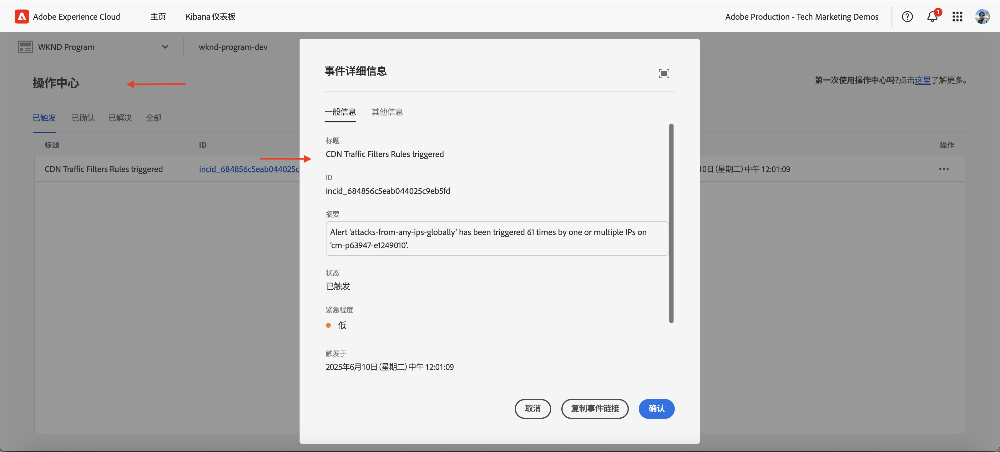

# 使用标准流量过滤器规则保护AEM网站

了解如何在AEM as a Cloud Service中使用&#x200B;_Adobe推荐的_ **标准流量过滤器规则**&#x200B;来保护AEM网站免受拒绝服务(DoS)、分布式拒绝服务(DDoS)和机器人滥用。


>[!VIDEO](https://video.tv.adobe.com/v/3469396/?quality=12&learn=on)

## 学习目标

- 查看Adobe推荐的标准流量过滤器规则。
- 定义、部署、测试和分析规则的结果。
- 了解何时以及如何根据流量模式优化规则。
- 了解如何使用AEM操作中心查看由规则生成的警报。

### 实施概述

实施步骤包括：

- 将标准流量过滤器规则添加到AEM WKND项目的`/config/cdn.yaml`文件。
- 提交更改并将其推送到Cloud Manager Git存储库。
- 使用Cloud Manager配置管道将更改部署到AEM环境。
- 通过使用[Vegeta](https://github.com/tsenart/vegeta)模拟DoS攻击来测试规则
- 使用AEMCS CDN日志和ELK仪表板工具对结果进行分析。

## 先决条件

在继续之前，请确保您已完成[如何设置流量过滤器和WAF规则](../setup.md)教程中所述的所需基础工作。 此外，您已克隆[AEM WKND Sites项目](https://github.com/adobe/aem-guides-wknd)并将其部署到您的AEM环境。

## 规则的关键操作

在我们深入了解标准流量过滤器规则的详细信息之前，我们先了解一下这些规则所执行的关键操作。 每个规则中的`action`属性定义在满足条件时流量过滤器应如何响应。 这些操作包括：

- **日志**：规则记录用于监视和分析的事件，允许您查看流量模式并根据需要调整阈值。 它由`type: log`属性指定。

- **警报**：当满足条件时，规则将触发警报，帮助您识别潜在问题。 它由`alert: true`属性指定。

- **阻止**：当满足条件时，规则将阻止流量，从而阻止对AEM网站的访问。 它由`action: block`属性指定。

## 查看和定义规则

Adobe推荐的标准流量过滤器规则用作基础层，通过记录超出基于IP的速率限制等事件来识别潜在的恶意流量模式，并阻止来自特定国家/地区的流量。 这些日志可帮助团队验证阈值并做出明智的决策，以最终&#x200B;**过渡到块模式**&#x200B;规则，而不会中断合法的流量。

让我们查看一下您应添加到AEM WKND项目的`/config/cdn.yaml`文件中的三个标准流量过滤器规则：

- **在Edge上阻止DoS**：此规则通过监视来自客户端IP的每秒请求(RPS)，在CDN边缘检测潜在的拒绝服务(DoS)攻击。
- **阻止源位置的DoS**：此规则通过监视来自客户端IP的获取请求来检测源位置潜在的拒绝服务(DoS)攻击。
- **阻止OFAC国家/地区**：此规则阻止来自受OFAC(外国Assets控制局)限制的特定国家/地区的访问。

### 1.防止Edge的DoS

此规则&#x200B;**在CDN上检测到潜在的拒绝服务(DoS)攻击时发送警报**。 触发此规则的条件是：客户端在边缘超过每个CDN POP (Point of Presence)的每秒&#x200B;**500个请求**（平均超过10秒）。

它会计算&#x200B;**所有**&#x200B;请求，并按客户端IP对它们进行分组。

```yaml
kind: "CDN"
version: "1"
metadata:
  envTypes: ["dev", "stage", "prod"]
data:
  trafficFilters:
    rules:
    - name: prevent-dos-attacks-edge
      when:
        reqProperty: tier
        equals: 'publish'
      rateLimit:
        limit: 500
        window: 10
        penalty: 300
        count: all
        groupBy:
          - reqProperty: clientIp
      action:
        type: log
        alert: true
```

`action`属性指定规则应记录事件并在满足条件时触发警报。 因此，它可以帮助您监控潜在的DoS攻击，而不会阻塞合法流量。 但是，您的目标是在验证流量模式并调整阈值后，最终将此规则转换为块模式。

### 2.防止原始的DoS

此规则&#x200B;**在检测到源位置的潜在拒绝服务(DoS)攻击时发送警报**。 触发此规则的条件是，当客户端超过源中每个客户端IP每秒&#x200B;**100个请求时** （平均超过10秒）。

它会计算&#x200B;**个获取**（绕过缓存的请求），并按客户端IP对它们进行分组。

```yaml
...
    - name: prevent-dos-attacks-origin
      when:
        reqProperty: tier
        equals: 'publish'
      rateLimit:
        limit: 100
        window: 10
        penalty: 300
        count: fetches
        groupBy:
          - reqProperty: clientIp
      action:
        type: log
        alert: true
```

`action`属性指定规则应记录事件并在满足条件时触发警报。 因此，它可以帮助您监控潜在的DoS攻击，而不会阻塞合法流量。 但是，您的目标是在验证流量模式并调整阈值后，最终将此规则转换为块模式。

### 3.外国资产管制处国家组

此规则阻止来自[OFAC](https://ofac.treasury.gov/sanctions-programs-and-country-information)限制下的特定国家/地区的访问。
您可以根据需要查看和修改国家/地区列表。

```yaml
...
    - name: block-ofac-countries
      when:
        allOf:
          - { reqProperty: tier, in: ["author", "publish"] }
          - reqProperty: clientCountry
            in:
              - SY
              - BY
              - MM
              - KP
              - IQ
              - CD
              - SD
              - IR
              - LR
              - ZW
              - CU
              - CI
      action: block
```

`action`属性指定规则应阻止来自指定国家/地区的访问。 这有助于防止从可能带来安全风险的区域访问您的AEM网站。

具有上述规则的完整`cdn.yaml`文件如下所示：


## 部署规则

要部署上述规则，请执行以下步骤：

- 将更改提交并推送到 Cloud Manager Git 存储库。

- 使用之前创建的AEM配置管道[将更改部署到Cloud Manager环境](../setup.md#deploy-rules-using-adobe-cloud-manager)。

  

## 测试规则

为了验证标准流量过滤器规则的有效性，在&#x200B;**CDN Edge**&#x200B;和&#x200B;**Origin**&#x200B;上，使用[Vegeta](https://github.com/tsenart/vegeta)（一种通用的HTTP负载测试工具）模拟高请求流量。

- 在Edge下测试DoS规则（500 rps限制）。 以下命令模拟15秒内每秒200个请求，这超过了Edge阈值(500 rps)。

  ```shell
  $echo "GET https://publish-p63947-e1249010.adobeaemcloud.com/us/en.html" | vegeta attack -rate=200 -duration=15s | vegeta report
  ```

  

  >[!IMPORTANT]
  >
  >  请注意上述报告中的&#x200B;*100%*&#x200B;成功和&#x200B;_200_&#x200B;状态代码。 由于规则设置为`log`和`alert`，因此请求&#x200B;_未被阻止_，但已记录它们以用于监视、分析和发出警报。

- 在源位置测试DoS规则（100 rps限制）。 以下命令模拟1秒内每秒110个获取请求，超过原始阈值(100 rps)。 为了模拟绕过缓存的请求，将使用唯一的查询参数创建`targets.txt`文件，以确保每个请求都被视为提取请求。

  ```shell
  # Create targets.txt with unique query parameters
  $for i in {1..110}; do
    echo "GET https://publish-p63947-e1249010.adobeaemcloud.com/us/en.html?ts=$(date +%s)$i"
  done > targets.txt
  
  # Use the targets.txt file to simulate fetch requests
  $vegeta attack -rate=110 -duration=1s -targets=targets.txt | vegeta report
  ```

  

  >[!IMPORTANT]
  >
  >  请注意上述报告中的&#x200B;*100%*&#x200B;成功和&#x200B;_200_&#x200B;状态代码。 由于规则设置为`log`和`alert`，因此请求&#x200B;_未被阻止_，但已记录它们以用于监视、分析和发出警报。

- 为简化起见，此处不测试OFAC规则。

## 查看警报

触发流量过滤器规则时会生成警报。 您可以在[AEM操作中心](https://experience.adobe.com/aem/actions-center)中查看这些警报。



## 分析结果

要分析流量过滤规则的结果，您可以使用AEMCS CDN日志和ELK仪表板工具。 按照[CDN日志摄取](../setup.md#ingest-cdn-logs)设置部分中的说明将CDN日志摄取到ELK栈栈中。

在以下屏幕截图中，您可以看到AEM开发环境的CDN日志被摄取到ELK栈栈中。


在模拟DoS攻击期间，**CDN流量仪表板**&#x200B;应在&#x200B;**Edge**&#x200B;和&#x200B;**Origin**&#x200B;处显示尖峰。

两个面板(_每个客户端IP的Edge RPS和POP_&#x200B;以及每个客户端IP和POP的&#x200B;_源RPS_)分别按客户端IP和存在点(POP)分组在边缘和源位置显示每秒请求(RPS)。


您还可以使用CDN流量仪表板中的其他面板来分析流量模式，如&#x200B;_顶级客户端IP_、_顶级国家/地区_&#x200B;和&#x200B;_顶级用户代理_。 这些面板可帮助您识别潜在威胁并相应地调整流量过滤器规则。

### Splunk集成

[已启用 Splunk 日志转发功能](https://experienceleague.adobe.com/zh-hans/docs/experience-manager-cloud-service/content/implementing/developing/logging#splunk-logs)的客户可以创建新的仪表板来分析流量模式。

要在 Splunk 中创建仪表板，请按照[将 Splunk 仪表板用于 AEMCS CDN 日志分析](https://github.com/adobe/AEMCS-CDN-Log-Analysis-Tooling/blob/main/Splunk/README.md#splunk-dashboards-for-aemcs-cdn-log-analysis)的步骤进行操作。

以下屏幕截图显示了Splunk功能板的示例，该功能板显示每个IP的最大原始请求和边缘请求，可帮助您识别潜在的DoS攻击。


## 何时以及如何优化规则

您的目标是避免阻止合法流量，同时仍可保护AEM站点免受潜在威胁。 标准流量过滤器规则旨在警报并记录（并最终在模式切换时阻止）威胁，而不会阻止合法流量。

要优化规则，请考虑以下步骤：

- **监测流量模式**：使用CDN日志和ELK仪表板监测流量模式，并识别任何异常或流量激增。
- **调整阈值**：根据流量模式，调整规则中的阈值（增加或减少速率限制），以更好地满足您的特定要求。 例如，如果您注意到合法流量触发了警报，则可以增加速率限制或调整分组。
下表提供了有关如何选择阈值的指导：

  | 变体 | 值 |
  | :--------- | :------- |
  | 源站 | 取&#x200B;**正常**&#x200B;流量条件下每个 IP/POP 的最大源站请求数的最大值（即，不是 DDoS 攻击时的速率），并将其增加几倍 |
  | Edge | 取&#x200B;**正常**&#x200B;流量条件下每个 IP/POP 的最大 Edge 请求数的最大值（即，不是 DDoS 攻击时的速率），并将其增加几倍 |

  有关更多详细信息，另请参阅[选择阈值](../../blocking-dos-attack-using-traffic-filter-rules.md#choosing-threshold-values)部分。

- **移至阻止规则**：验证流量模式并调整阈值后，应将规则转换为阻止模式。

## 摘要

在本教程中，您已了解如何使用Adobe推荐的AEM as a Cloud Service标准流量过滤器规则来保护AEM网站免受拒绝服务(DoS)、分布式拒绝服务(DDoS)和机器人滥用的攻击。

## 推荐的 WAF 规则

了解如何实施Adobe推荐的WAF规则，以保护AEM网站免受使用高级技术绕过传统安全措施的复杂威胁。

<!-- CARDS
{target = _self}

* ./using-waf-rules.md
  {title = Protecting AEM websites using WAF traffic filter rules}
  {description = Learn how to protect AEM websites from sophisticated threats including DoS, DDoS, and bot abuse using Adobe-recommended Web Application Firewall (WAF) traffic filter rules in AEM as a Cloud Service.}
  {image = ../assets/use-cases/using-waf-rules.png}
  {cta = Activate WAF}
-->
<!-- START CARDS HTML - DO NOT MODIFY BY HAND -->
<div class="columns">
    <div class="column is-half-tablet is-half-desktop is-one-third-widescreen" aria-label="Protecting AEM websites using WAF traffic filter rules">
        <div class="card" style="height: 100%; display: flex; flex-direction: column; height: 100%;">
            <div class="card-image">
                <figure class="image x-is-16by9">
                    <a href="./using-waf-rules.md" title="使用WAF流量过滤器规则保护AEM网站" target="_self" rel="referrer">
                        
                    </a>
                </figure>
            </div>
            <div class="card-content is-padded-small" style="display: flex; flex-direction: column; flex-grow: 1; justify-content: space-between;">
                <div class="top-card-content">
                    <p class="headline is-size-6 has-text-weight-bold">
                        <a href="./using-waf-rules.md" target="_self" rel="referrer" title="使用WAF流量过滤器规则保护AEM网站">使用AEM流量过滤器规则保护WAF网站</a>
                    </p>
                    <p class="is-size-6">了解如何使用AEM推荐的Adobe Web应用程序防火墙(WAF)流量过滤器规则在AEM as a Cloud Service中保护网站免受复杂威胁，包括DoS、DDoS和机器人滥用。</p>
                </div>
                <a href="./using-waf-rules.md" target="_self" rel="referrer" class="spectrum-Button spectrum-Button--outline spectrum-Button--primary spectrum-Button--sizeM" style="align-self: flex-start; margin-top: 1rem;">
                    <span class="spectrum-Button-label has-no-wrap has-text-weight-bold">激活WAF</span>
                </a>
            </div>
        </div>
    </div>
</div>
<!-- END CARDS HTML - DO NOT MODIFY BY HAND -->


## 用例 — 超出标准规则

对于更高级的场景，您可以探索以下用例，演示如何根据特定业务需求实施自定义流量过滤器规则：

<!-- CARDS
{target = _self}

* ../how-to/request-logging.md

* ../how-to/request-blocking.md

* ../how-to/request-transformation.md
-->
<!-- START CARDS HTML - DO NOT MODIFY BY HAND -->
<div class="columns">
    <div class="column is-half-tablet is-half-desktop is-one-third-widescreen" aria-label="Monitoring sensitive requests">
        <div class="card" style="height: 100%; display: flex; flex-direction: column; height: 100%;">
            <div class="card-image">
                <figure class="image x-is-16by9">
                    <a href="../how-to/request-logging.md" title="监控敏感请求" target="_self" rel="referrer">
                        
                    </a>
                </figure>
            </div>
            <div class="card-content is-padded-small" style="display: flex; flex-direction: column; flex-grow: 1; justify-content: space-between;">
                <div class="top-card-content">
                    <p class="headline is-size-6 has-text-weight-bold">
                        <a href="../how-to/request-logging.md" target="_self" rel="referrer" title="监控敏感请求">正在监视敏感请求</a>
                    </p>
                    <p class="is-size-6">了解如何使用AEM as a Cloud Service中的流量过滤器规则记录敏感请求，从而监控这些请求。</p>
                </div>
                <a href="../how-to/request-logging.md" target="_self" rel="referrer" class="spectrum-Button spectrum-Button--outline spectrum-Button--primary spectrum-Button--sizeM" style="align-self: flex-start; margin-top: 1rem;">
                    <span class="spectrum-Button-label has-no-wrap has-text-weight-bold">了解详情</span>
                </a>
            </div>
        </div>
    </div>
    <div class="column is-half-tablet is-half-desktop is-one-third-widescreen" aria-label="Restricting access">
        <div class="card" style="height: 100%; display: flex; flex-direction: column; height: 100%;">
            <div class="card-image">
                <figure class="image x-is-16by9">
                    <a href="../how-to/request-blocking.md" title="限制访问" target="_self" rel="referrer">
                        
                    </a>
                </figure>
            </div>
            <div class="card-content is-padded-small" style="display: flex; flex-direction: column; flex-grow: 1; justify-content: space-between;">
                <div class="top-card-content">
                    <p class="headline is-size-6 has-text-weight-bold">
                        <a href="../how-to/request-blocking.md" target="_self" rel="referrer" title="限制访问">限制访问</a>
                    </p>
                    <p class="is-size-6">了解如何使用AEM as a Cloud Service中的流量过滤规则阻止特定请求来限制访问。</p>
                </div>
                <a href="../how-to/request-blocking.md" target="_self" rel="referrer" class="spectrum-Button spectrum-Button--outline spectrum-Button--primary spectrum-Button--sizeM" style="align-self: flex-start; margin-top: 1rem;">
                    <span class="spectrum-Button-label has-no-wrap has-text-weight-bold">了解详情</span>
                </a>
            </div>
        </div>
    </div>
    <div class="column is-half-tablet is-half-desktop is-one-third-widescreen" aria-label="Normalizing requests">
        <div class="card" style="height: 100%; display: flex; flex-direction: column; height: 100%;">
            <div class="card-image">
                <figure class="image x-is-16by9">
                    <a href="../how-to/request-transformation.md" title="标准化请求" target="_self" rel="referrer">
                        
                    </a>
                </figure>
            </div>
            <div class="card-content is-padded-small" style="display: flex; flex-direction: column; flex-grow: 1; justify-content: space-between;">
                <div class="top-card-content">
                    <p class="headline is-size-6 has-text-weight-bold">
                        <a href="../how-to/request-transformation.md" target="_self" rel="referrer" title="标准化请求">标准化请求</a>
                    </p>
                    <p class="is-size-6">了解如何使用AEM as a Cloud Service中的流量过滤器规则转换请求，从而标准化请求。</p>
                </div>
                <a href="../how-to/request-transformation.md" target="_self" rel="referrer" class="spectrum-Button spectrum-Button--outline spectrum-Button--primary spectrum-Button--sizeM" style="align-self: flex-start; margin-top: 1rem;">
                    <span class="spectrum-Button-label has-no-wrap has-text-weight-bold">了解详情</span>
                </a>
            </div>
        </div>
    </div>
</div>
<!-- END CARDS HTML - DO NOT MODIFY BY HAND -->


## 其他资源

- [推荐的入门规则](https://experienceleague.adobe.com/en/docs/experience-manager-cloud-service/content/security/traffic-filter-rules-including-waf#recommended-starter-rules)
