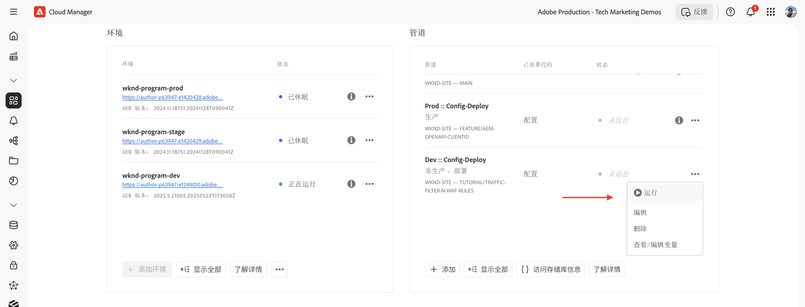
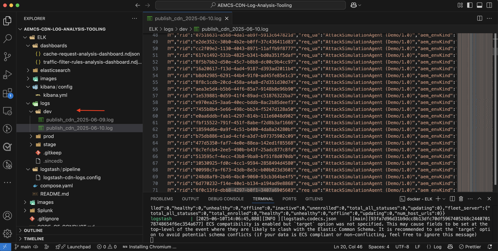

# 使用 WAF 规则保护 AEM 网站

了解如何在 AEM as a Cloud Service 中使用 _Adobe 推荐的_**Web 应用程序防火墙（WAF）规则**&#x200B;防御包括 DoS、DDoS 和机器人滥用在内的复杂安全威胁。

复杂攻击的特点包括高请求速率、复杂的攻击模式，以及利用高级技术绕过传统安全防护机制。

>[!IMPORTANT]
>
> 使用 WAF 流量过滤规则需要额外的 **WAF-DDoS 防护**&#x200B;或&#x200B;**增强安全性（Enhanced Security）**&#x200B;许可证。Sites 和 Forms 客户可默认使用标准流量过滤规则。


>[!VIDEO](https://video.tv.adobe.com/v/3469397/?quality=12&learn=on)

## 学习目标

- 审查 Adobe 推荐的 WAF 规则。
- 定义、部署、测试并分析这些规则的结果。
- 了解何时以及如何根据规则执行结果优化规则。
- 了解如何使用 AEM 行动中心查看规则生成的警报。

### 实施概述

实施步骤包括：

- 将 WAF 规则添加至 AEM WKND 项目的 `/config/cdn.yaml` 文件中。
- 将更改内容提交并推送至 Cloud Manager Git 存储库。
- 使用 Cloud Manager 配置管道将更改内容部署到 AEM 环境。
- 使用 [Nikto](https://github.com/sullo/nikto/wiki) 模拟 DDoS 攻击以测试规则效果。
- 使用 AEMCS CDN 日志和 ELK 仪表板工具分析测试结果。

## 先决条件

在继续操作之前，请先确保您已完成[如何设置流量过滤器与 WAF 规则](../setup.md)教程中所述的必要配置。此外，请确保您已克隆 [AEM WKND Sites 项目](https://github.com/adobe/aem-guides-wknd)并已将其部署至您的 AEM 环境。

## 查看并定义规则

Adobe 推荐的 Web 应用程序防火墙（WAF）规则对于保护 AEM 网站免受 DoS、DDoS 攻击、机器人滥用及复杂威胁至关重要。此类复杂攻击通常具有以下特征：请求频率高、攻击模式复杂，并利用高级技术（基于协议或基于负载的攻击）绕过传统安全防护机制。

接下来我们将查看应添加到 AEM WKND 项目 `cdn.yaml` 文件中的三条推荐 WAF 规则：

### &#x200B;1. 拦截来自已知恶意 IP 的攻击

此规则会&#x200B;**拦截**&#x200B;那些既具有可疑特征、*又*&#x200B;来自已被标记为恶意的 IP 地址的请求。由于同时满足这两个条件，因此可以确信误报（拦截合法流量）的风险极低。已知恶意 IP 的识别依据是威胁情报源及其他来源。

`ATTACK-FROM-BAD-IP` WAF 标志用于标识此类请求。它汇总了[此处](https://experienceleague.adobe.com/zh-hans/docs/experience-manager-cloud-service/content/security/traffic-filter-rules-including-waf#waf-flags-list)列出的多个 WAF 标志。

```yaml
kind: "CDN"
version: "1"
metadata:
  envTypes: ["dev", "stage", "prod"]
data:
  trafficFilters:
    rules:
    - name: attacks-from-bad-ips-globally
      when:
        reqProperty: tier
        in: ["author", "publish"]
      action:
        type: block
        wafFlags:
          - ATTACK-FROM-BAD-IP
```

### &#x200B;2. 记录（并后续拦截）来自全球任意 IP 的攻击行为

此规则会&#x200B;**记录**&#x200B;被识别为潜在攻击的请求，即使其 IP 地址未出现在威胁情报源中。

`ATTACK` WAF 标志用于标识此类请求。与 `ATTACK-FROM-BAD-IP` 类似，它也汇总了多个 WAF 标志。

这些很可能是恶意请求，但由于其 IP 地址未被威胁情报源识别，因此建议初始采用 `log` 模式，而非直接阻止。请分析日志以排查误报，一旦验证无误，**务必将该规则切换为 `block` 模式**。

```yaml
...
    - name: attacks-from-any-ips-globally
      when:
        reqProperty: tier
        in: ["author", "publish"]
      action:
        type: log
        alert: true
        wafFlags:
          - ATTACK
```

或者，如果您的业务需求不容许任何恶意流量通过，也可以选择直接启用 `block` 模式。

这些推荐的 WAF 规则可为已知威胁和新出现的威胁提供额外的安全防护层。


## 迁移至最新的 Adobe 推荐 WAF 规则

在 2025 年 7 月引入 `ATTACK-FROM-BAD-IP` 和 `ATTACK` 标志之前，Adobe 推荐的 WAF 规则如下：这些规则包含一系列特定的 WAF 标志，用于拦截符合特定条件的请求，例如 `SANS`、`TORNODE`、`NOUA` 等。

```yaml
...
data:
  trafficFilters:
    rules:
    ...
    # Enable WAF protections (only works if WAF is enabled for your environment)
      - name: block-waf-flags
        when:
          reqProperty: tier
          matches: "author|publish"
        action:
          type: block
          wafFlags:
            - SANS
            - TORNODE
            - NOUA
            - SCANNER
            - USERAGENT
            - PRIVATEFILE
            - ABNORMALPATH
            - TRAVERSAL
            - NULLBYTE
            - BACKDOOR
            - LOG4J-JNDI
            - SQLI
            - XSS
            - CODEINJECTION
            - CMDEXE
            - NO-CONTENT-TYPE
            - UTF8
...
```

上述规则仍然有效，但建议迁移至使用 `ATTACK-FROM-BAD-IP` 和 `ATTACK` WAF 标志的新规则，_前提是您尚未根据业务需求自定义 `wafFlags` 配置_。

若希望遵循最佳实践，您可通过以下步骤迁移至新规则：

- 请先查看您 `cdn.yaml` 文件中的现有 WAF 规则，这些规则可能与上述示例类似。确认没有针对您的业务需求自定义过 `wafFlags`。

- 将当前的 WAF 规则替换为使用 `ATTACK-FROM-BAD-IP` 和 `ATTACK` 标志的 Adobe 推荐新规则。确保所有规则均设置为阻止模式。

如果您此前已自定义过 `wafFlags`，仍可迁移至这些新规则，但需谨慎操作，确保所有自定义项都被正确迁移至更新后的规则中。

迁移有助于简化您的 WAF 规则配置，同时仍能提供针对复杂威胁的强大防护能力。新规则在设计上更具成效，也更易于管理。


## 部署规则

要部署上述规则，请按以下步骤操作：

- 将更改内容提交并推送到 Cloud Manager Git 存储库。

- 使用[先前创建的](../setup.md#deploy-rules-using-adobe-cloud-manager) Cloud Manager 配置管道，将更改内容部署至 AEM 环境。

  

## 测试规则

为验证 WAF 规则的有效性，可使用 [Nikto](https://github.com/sullo/nikto) 工具模拟一次攻击。Nikto 是一款用于检测 Web 服务器漏洞和配置错误的扫描器。以下命令会对已部署 WAF 规则的 AEM WKND 网站发起 SQL 注入攻击。

```shell
$./nikto.pl -useragent "AttackSimulationAgent (Demo/1.0)" -D V -Tuning 9 -ssl -h https://publish-pXXXX-eYYYY.adobeaemcloud.com/us/en.html
```


要了解攻击模拟，请查阅 [Nikto - 扫描调整](https://github.com/sullo/nikto/wiki/Scan-Tuning)文档，其中介绍了如何指定要包含或排除的测试攻击类型。

## 查看警报

当触发流量过滤规则时，会生成警报。您可在 [AEM 行动中心](https://experience.adobe.com/aem/actions-center)中查看这些警报。


## 分析结果

您可以通过 AEMCS CDN 日志和 ELK 仪表板工具分析流量过滤器规则的结果。请参见 [CDN 日志摄取](../setup.md#ingest-cdn-logs)设置部分的说明，了解如何将 CDN 日志摄入 ELK 堆栈。

在下面的截图中，您可以看到 AEM 开发环境的 CDN 日志已被摄入 ELK 堆栈中。



在 ELK 应用程序中，**WAF 仪表板**&#x200B;应显示已标记请求及其对应的字段值，包括客户端 IP（cli_ip）、主机（host）、请求 URL（url）、执行动作（waf_action）以及规则名称（waf_match）等列。


此外，**WAF 标志分布**&#x200B;和&#x200B;**热门攻击**&#x200B;面板还展示了更多详细信息。


### Splunk 集成

[已启用 Splunk 日志转发功能](https://experienceleague.adobe.com/zh-hans/docs/experience-manager-cloud-service/content/implementing/developing/logging#splunk-logs)的客户可以创建新的仪表板来分析流量模式。

要在 Splunk 中创建仪表板，请按照[将 Splunk 仪表板用于 AEMCS CDN 日志分析](https://github.com/adobe/AEMCS-CDN-Log-Analysis-Tooling/blob/main/Splunk/README.md#splunk-dashboards-for-aemcs-cdn-log-analysis)的步骤进行操作。

## 何时以及如何优化规则

您的目标是在保护 AEM 网站免受复杂威胁的同时，避免误拦合法流量。推荐的 WAF 规则旨在作为您安全策略的起点。

要优化这些规则，可参考以下步骤：

- **监控流量模式**：利用 CDN 日志和 ELK 仪表板监控流量模式，识别异常或流量激增。请留意 ELK 仪表板中的 _WAF 标志分布_&#x200B;和&#x200B;_最常见攻击_&#x200B;面板，以了解当前被检测到的攻击类型。
- **调整 wafFlags**：如果 `ATTACK` 标志触发频率过高，或您需要更精细地控制攻击向量，可创建包含特定 WAF 标志的自定义规则。请在文档中查看完整的 [WAF 标志](https://experienceleague.adobe.com/zh-hans/docs/experience-manager-cloud-service/content/security/traffic-filter-rules-including-waf#waf-flags-list)列表。建议优先以 `log` 模式测试新的自定义规则。
- **切换为阻止规则**：在验证流量模式并调整 WAF 标志后，您可考虑将规则切换为阻止模式。

## 摘要

在本教程中，您已了解如何通过 Adobe 推荐的 Web 应用程序防火墙（WAF）规则保护 AEM 网站免受包括 DoS、DDoS 以及恶意机器人滥用在内的复杂威胁。

## 用例——超越标准规则

对于更复杂的场景，您可以参考以下用例，了解如何根据具体业务需求实施自定义流量过滤规则：

<!-- CARDS
{target = _self}

* ../how-to/request-logging.md

* ../how-to/request-blocking.md

* ../how-to/request-transformation.md
-->
<!-- START CARDS HTML - DO NOT MODIFY BY HAND -->
<div class="columns">
    <div class="column is-half-tablet is-half-desktop is-one-third-widescreen" aria-label="Monitoring sensitive requests">
        <div class="card" style="height: 100%; display: flex; flex-direction: column; height: 100%;">
            <div class="card-image">
                <figure class="image x-is-16by9">
                    <a href="../how-to/request-logging.md" title="监控敏感请求" target="_self" rel="referrer">
                        
                    </a>
                </figure>
            </div>
            <div class="card-content is-padded-small" style="display: flex; flex-direction: column; flex-grow: 1; justify-content: space-between;">
                <div class="top-card-content">
                    <p class="headline is-size-6 has-text-weight-bold">
                        <a href="../how-to/request-logging.md" target="_self" rel="referrer" title="监控敏感请求">监控敏感请求</a>
                    </p>
                    <p class="is-size-6">了解如何在 AEM as a Cloud Service 中使用流量过滤规则记录敏感请求以对其进行监控。</p>
                </div>
                <a href="../how-to/request-logging.md" target="_self" rel="referrer" class="spectrum-Button spectrum-Button--outline spectrum-Button--primary spectrum-Button--sizeM" style="align-self: flex-start; margin-top: 1rem;">
                    <span class="spectrum-Button-label has-no-wrap has-text-weight-bold">了解详情</span>
                </a>
            </div>
        </div>
    </div>
    <div class="column is-half-tablet is-half-desktop is-one-third-widescreen" aria-label="Restricting access">
        <div class="card" style="height: 100%; display: flex; flex-direction: column; height: 100%;">
            <div class="card-image">
                <figure class="image x-is-16by9">
                    <a href="../how-to/request-blocking.md" title="限制访问" target="_self" rel="referrer">
                        
                    </a>
                </figure>
            </div>
            <div class="card-content is-padded-small" style="display: flex; flex-direction: column; flex-grow: 1; justify-content: space-between;">
                <div class="top-card-content">
                    <p class="headline is-size-6 has-text-weight-bold">
                        <a href="../how-to/request-blocking.md" target="_self" rel="referrer" title="限制访问">限制访问</a>
                    </p>
                    <p class="is-size-6">了解如何在 AEM as a Cloud Service 中通过流量过滤规则阻止特定请求以限制访问。</p>
                </div>
                <a href="../how-to/request-blocking.md" target="_self" rel="referrer" class="spectrum-Button spectrum-Button--outline spectrum-Button--primary spectrum-Button--sizeM" style="align-self: flex-start; margin-top: 1rem;">
                    <span class="spectrum-Button-label has-no-wrap has-text-weight-bold">了解详情</span>
                </a>
            </div>
        </div>
    </div>
    <div class="column is-half-tablet is-half-desktop is-one-third-widescreen" aria-label="Normalizing requests">
        <div class="card" style="height: 100%; display: flex; flex-direction: column; height: 100%;">
            <div class="card-image">
                <figure class="image x-is-16by9">
                    <a href="../how-to/request-transformation.md" title="将请求标准化" target="_self" rel="referrer">
                        
                    </a>
                </figure>
            </div>
            <div class="card-content is-padded-small" style="display: flex; flex-direction: column; flex-grow: 1; justify-content: space-between;">
                <div class="top-card-content">
                    <p class="headline is-size-6 has-text-weight-bold">
                        <a href="../how-to/request-transformation.md" target="_self" rel="referrer" title="将请求标准化">将请求标准化</a>
                    </p>
                    <p class="is-size-6">了解如何在 AEM as a Cloud Service 中通过流量过滤规则将请求转换为标准化请求。</p>
                </div>
                <a href="../how-to/request-transformation.md" target="_self" rel="referrer" class="spectrum-Button spectrum-Button--outline spectrum-Button--primary spectrum-Button--sizeM" style="align-self: flex-start; margin-top: 1rem;">
                    <span class="spectrum-Button-label has-no-wrap has-text-weight-bold">了解详情</span>
                </a>
            </div>
        </div>
    </div>
</div>
<!-- END CARDS HTML - DO NOT MODIFY BY HAND -->

## 其他资源

- [推荐的入门规则](https://experienceleague.adobe.com/zh-hans/docs/experience-manager-cloud-service/content/security/traffic-filter-rules-including-waf#recommended-nonwaf-starter-rules)
- [WAF 标志列表](https://experienceleague.adobe.com/zh-hans/docs/experience-manager-cloud-service/content/security/traffic-filter-rules-including-waf#waf-flags-list)
